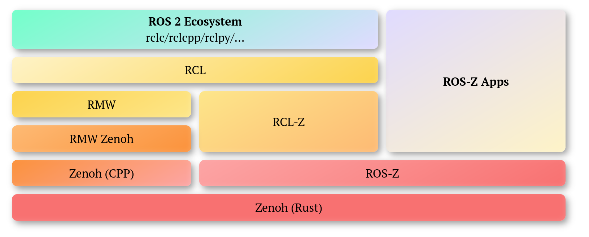

<div align="center">
    <h1>ROS-Z</h1>
    <p><strong>Making ROS 2 Zenoh-Native</strong></p>
    <sub>Built by the <a href="https://zenoh.io">Zenoh</a> team at <a href="https://www.zettascale.tech">ZettaScale</a></sub>
</div>

## Overview

**ROS-Z** is a Zenoh-native ROS 2 stack that:

- Provides a pure-Rust ROS 2 implementation built directly on Zenoh
- Preserves portability for RCL-C/CPP/Py-based applications
- Delivers optimized performance for Rust users
- Interoperates seamlessly with Zenoh RMW-based ROS 2



## Status

**ROS-Z** is experimental software. It is tested with ROS 2 Jazzy and should be interoperable with ROS 2 Rolling, but we make no guarantees with respect to official distributions.

## Quick Start

```bash
# Build the core library (no ROS dependencies required)
cargo build

# Run tests
cargo test

# Try an example
cargo run --example z_pubsub
```

See the [Quick Start Guide](https://zettascalelabs.github.io/ros-z/chapters/quick_start.html) for more details.

## Documentation

📚 **[Read the Book](https://zettascalelabs.github.io/ros-z/)** for comprehensive documentation including:

- Installation and build instructions
- Examples and tutorials
- API reference
- Feature flags and configuration
- Contributing guidelines

**Local Development:** `mdbook serve book`

## License

[View license](LICENSE)

## Contributing

Contributions are welcome! Please see [CONTRIBUTING.md](CONTRIBUTING.md) for details.
