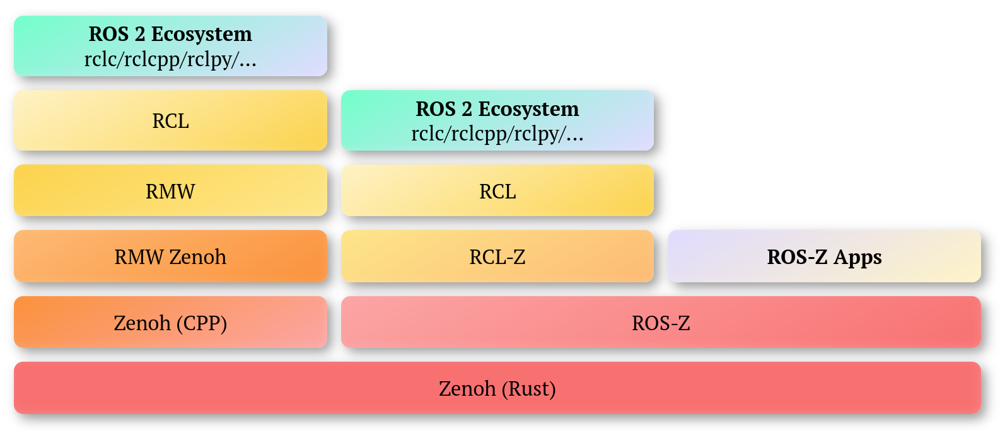

    <h1>ROS-Z</h1>
    
<strong>Making ROS 2 Zenoh-Native</strong>

    Built by the <a href="https://zenoh.io">Zenoh</a> team at <a href="https://www.zettascale.tech">ZettaScale</a>

ROS 2 was designed to be independent from the underlying communication middleware. This is a nice architectural property,
yet it does not come for free.  What if we were to streamline ROS 2 and implement it natively on Zenoh? ROS-Z, a Zenoh-native ROS 2 stack,
answers this question. ROS-Z preserves portability for RCL-C/CPP/Py-based  applications and provides an extremely optimised stack for Rust
users that interoperates with any Zenoh RMW-based ROS 2.

## Architecture

## Goals
**ROS-Z** was started as an experiment to understand what we could gain from verticalisation while at the same time
providing (1) a pure-Rust stack to ROS2 users, and (2) zenoh-native implementation of RCL-C.

## Status
At this stage **ROS-Z** is experimental software
