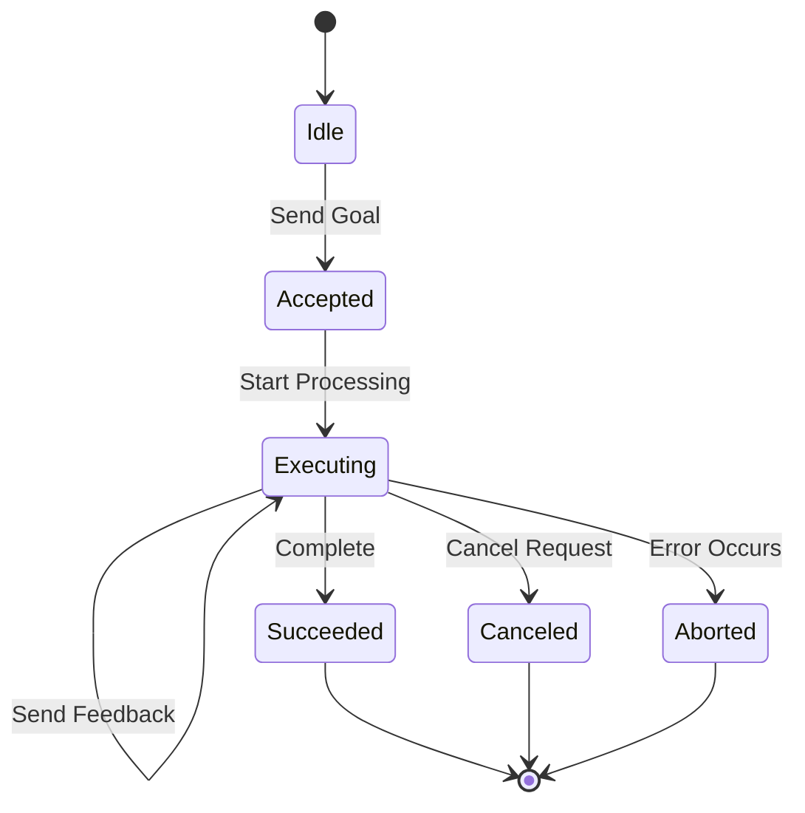
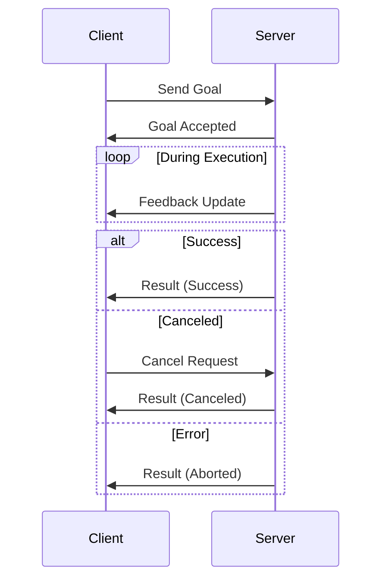

# Actions

**Actions enable long-running tasks with progress feedback and cancellation support, perfect for operations that take seconds or minutes to complete.** Unlike services that return immediately, actions provide streaming feedback while executing complex workflows.

```admonish tip
Use actions for robot navigation, trajectory execution, or any operation where you need progress updates and the ability to cancel mid-execution. Use services for quick request-response operations.
```

## Action Lifecycle



## Components

| Component | Type | Purpose |
|-----------|------|---------|
| **Goal** | Input | Defines the desired outcome |
| **Feedback** | Stream | Progress updates during execution |
| **Result** | Output | Final outcome when complete |
| **Status** | State | Current execution state |

## Communication Pattern



## Use Cases

**Robot Navigation:**

- Goal: Target position and orientation
- Feedback: Current position, distance remaining, obstacles detected
- Result: Final position, success/failure reason

**Gripper Control:**

- Goal: Desired grip force and position
- Feedback: Current force, contact detection
- Result: Grip achieved, object secured

**Long Computations:**

- Goal: Computation parameters
- Feedback: Progress percentage, intermediate results
- Result: Final computed value, execution time

```admonish info
Actions excel when operations take more than a few seconds and users need visibility into progress. For sub-second operations, prefer services for simplicity.
```

## Action Server Example

This example demonstrates an action server that computes Fibonacci sequences. The server accepts goals, publishes periodic feedback with partial results, and supports cancellation.

```rust,ignore
{{#include ../../../crates/ros-z/examples/demo_nodes/fibonacci_action_server.rs:full_example}}
```

**Key points:**

- **Handler Pattern**: Uses `.with_handler()` to define asynchronous goal execution
- **Feedback Publishing**: Sends partial results periodically via `publish_feedback()`
- **Cancellation Support**: Checks `is_cancel_requested()` and handles graceful cancellation
- **Completion**: Uses `.succeed()` or `.canceled()` to send final result

**Running the server:**

```bash
# Start Zenoh router first
cargo run --example zenoh_router

# Run the server (runs until Ctrl+C)
cargo run --example demo_nodes_fibonacci_action_server
```

## Action Client Example

This example demonstrates an action client that sends goals and monitors execution progress with feedback updates.

```rust,ignore
{{#include ../../../crates/ros-z/examples/demo_nodes/fibonacci_action_client.rs:full_example}}
```

**Key points:**

- **Goal Sending**: Uses `send_goal()` to submit goals and get a handle
- **Feedback Monitoring**: Spawns async task to receive and display feedback
- **Result Handling**: Waits for completion with timeout and error handling
- **Type Safety**: Strongly-typed goal, feedback, and result messages

**Running the client:**

```bash
# Basic usage - compute Fibonacci(10)
cargo run --example demo_nodes_fibonacci_action_client

# Compute Fibonacci(15)
cargo run --example demo_nodes_fibonacci_action_client -- --order 15

# Connect to specific router
cargo run --example demo_nodes_fibonacci_action_client -- --endpoint tcp/localhost:7447
```

## Complete Action Workflow

**Terminal 1 - Start Zenoh Router:**

```bash
cargo run --example zenoh_router
```

**Terminal 2 - Start Action Server:**

```bash
cargo run --example demo_nodes_fibonacci_action_server
```

**Terminal 3 - Send Goals from Client:**

```bash
cargo run --example demo_nodes_fibonacci_action_client -- --order 10
```

You'll see:

- **Client**: Goal sent, feedback updates with partial sequences, final result
- **Server**: Goal received, executing with feedback, completion status

```admonish warning
Always implement timeout mechanisms for action clients. Long-running actions can fail or hang, and clients need graceful degradation strategies.
```

## Comparison with Other Patterns

| Pattern | Duration | Feedback | Cancellation | Use Case |
|---------|----------|----------|--------------|----------|
| **Pub-Sub** | Continuous | No | N/A | Sensor data streaming |
| **Service** | < 1 second | No | No | Quick queries |
| **Action** | Seconds to minutes | Yes | Yes | Long-running tasks |

## Resources

- **[ROS 2 Actions Documentation](https://docs.ros.org/en/rolling/Tutorials/Intermediate/Writing-an-Action-Server-Client/Py.html)** - Official ROS 2 action guide
- **[ros-z Examples](https://github.com/ZettaScaleLabs/ros-z/tree/main/ros-z/examples)** - Working action implementations
- **[Services](./services.md)** - Simpler request-response pattern

**Action implementation is evolving. Check the ros-z repository for the latest examples and API updates.**
