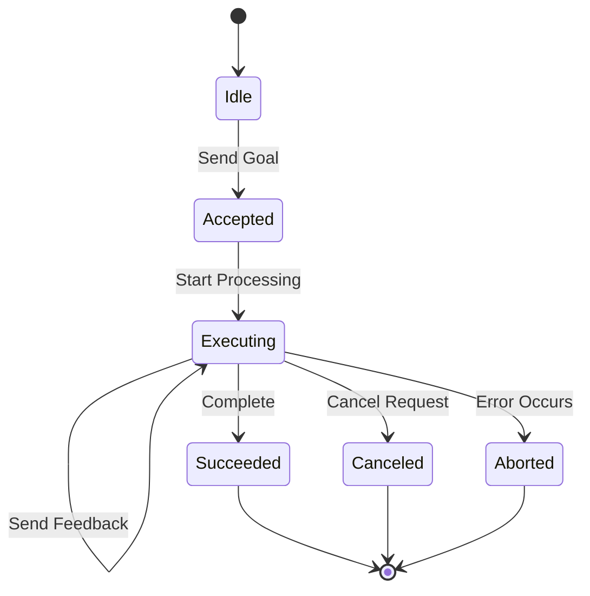
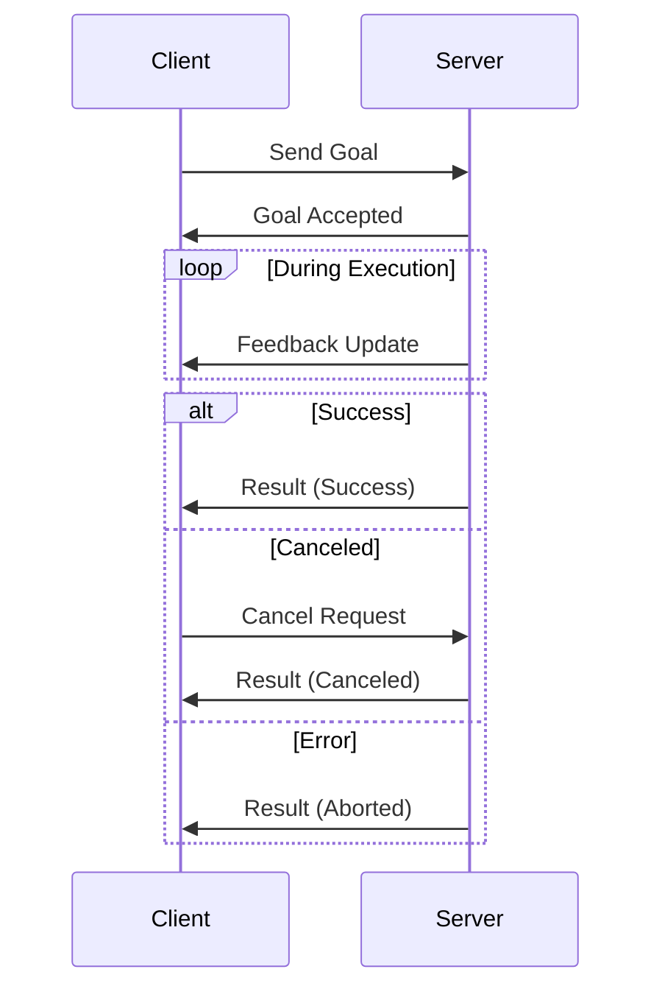

# Actions

**Actions enable long-running tasks with progress feedback and cancellation support, perfect for operations that take seconds or minutes to complete.** Unlike services that return immediately, actions provide streaming feedback while executing complex workflows.

```admonish tip
Use actions for robot navigation, trajectory execution, or any operation where you need progress updates and the ability to cancel mid-execution. Use services for quick request-response operations.
```

## Action Lifecycle



## Components

| Component | Type | Purpose |
|-----------|------|---------|
| **Goal** | Input | Defines the desired outcome |
| **Feedback** | Stream | Progress updates during execution |
| **Result** | Output | Final outcome when complete |
| **Status** | State | Current execution state |

## Communication Pattern



## Use Cases

**Robot Navigation:**

- Goal: Target position and orientation
- Feedback: Current position, distance remaining, obstacles detected
- Result: Final position, success/failure reason

**Gripper Control:**

- Goal: Desired grip force and position
- Feedback: Current force, contact detection
- Result: Grip achieved, object secured

**Long Computations:**

- Goal: Computation parameters
- Feedback: Progress percentage, intermediate results
- Result: Final computed value, execution time

```admonish info
Actions excel when operations take more than a few seconds and users need visibility into progress. For sub-second operations, prefer services for simplicity.
```

## Minimal Pattern

Before reading the full examples, here is the skeleton every action client and server follows:

**Client:**

```rust,ignore
// 1. Send a goal — returns a GoalHandle
let mut goal_handle = client.send_goal(MyAction::Goal { target: 10 }).await?;

// 2. Stream feedback while the action runs
if let Some(mut feedback_rx) = goal_handle.feedback() {
    tokio::spawn(async move {
        while let Some(fb) = feedback_rx.recv().await {
            println!("Progress: {:?}", fb);
        }
    });
}

// 3. Wait for the final result (blocks until terminal state)
let result = goal_handle.result().await?;
println!("Done: {:?}", result);
```

**Server:**

```rust,ignore
use ros_z::action::server::ExecutingGoal;

server.with_handler(|executing: ExecutingGoal<MyAction>| async move {
    // Report progress (synchronous — no .await)
    executing.publish_feedback(MyAction::Feedback { progress: 50 }).expect("feedback failed");

    // Check for cancellation
    if executing.is_cancel_requested() {
        executing.canceled(MyAction::Result { value: 0 }).unwrap();
        return;
    }

    executing.succeed(MyAction::Result { value: 42 }).unwrap();
});
```

The key constraint: **one `GoalHandle` per goal**. `feedback()` and `status_watch()` each return `Some` only the first time they are called — after that, the receiver has been moved out.

## Action Server Example

This example demonstrates an action server that computes Fibonacci sequences. The server accepts goals, publishes periodic feedback with partial results, and supports cancellation.

```rust,ignore
{{#include ../../../crates/ros-z/examples/demo_nodes/fibonacci_action_server.rs:full_example}}
```

**Key points:**

- **Handler Pattern**: Uses `.with_handler()` to define asynchronous goal execution
- **Feedback Publishing**: Sends partial results periodically via `publish_feedback()`
- **Cancellation Support**: Checks `is_cancel_requested()` and handles graceful cancellation
- **Completion**: Uses `.succeed()` or `.canceled()` to send final result

**Running the server:**

```bash
# Start Zenoh router first
cargo run --example zenoh_router

# Run the server (runs until Ctrl+C)
cargo run --example demo_nodes_fibonacci_action_server
```

## Action Client Example

This example demonstrates an action client that sends goals and monitors execution progress with feedback updates.

```rust,ignore
{{#include ../../../crates/ros-z/examples/demo_nodes/fibonacci_action_client.rs:full_example}}
```

**Key points:**

- **Goal Sending**: Uses `send_goal()` to submit goals and get a handle
- **Feedback Monitoring**: Spawns async task to receive and display feedback
- **Result Handling**: Waits for completion with timeout and error handling
- **Type Safety**: Strongly-typed goal, feedback, and result messages

**Running the client:**

```bash
# Basic usage - compute Fibonacci(10)
cargo run --example demo_nodes_fibonacci_action_client

# Compute Fibonacci(15)
cargo run --example demo_nodes_fibonacci_action_client -- --order 15

# Connect to specific router
cargo run --example demo_nodes_fibonacci_action_client -- --endpoint tcp/localhost:7447
```

## Complete Action Workflow

**Terminal 1 - Start Zenoh Router:**

```bash
cargo run --example zenoh_router
```

**Terminal 2 - Start Action Server:**

```bash
cargo run --example demo_nodes_fibonacci_action_server
```

**Terminal 3 - Send Goals from Client:**

```bash
cargo run --example demo_nodes_fibonacci_action_client -- --order 10
```

You'll see:

- **Client**: Goal sent, feedback updates with partial sequences, final result
- **Server**: Goal received, executing with feedback, completion status

```admonish warning
Always implement timeout mechanisms for action clients. Long-running actions can fail or hang, and clients need graceful degradation strategies.
```

## Canceling an Action from the Client

The `GoalHandle` returned by `send_goal()` has a `cancel()` method for requesting cancellation:

```rust,ignore
let goal_handle = client.send_goal(goal).await?;

// ... later, if you need to stop the action:
let cancel_response = goal_handle.cancel().await?;
println!("Cancel accepted: {}", cancel_response.goals_canceling.len() > 0);
```

To cancel a specific goal by ID without a handle:

```rust,ignore
client.cancel_goal(goal_id).await?;
```

To cancel every in-progress goal at once:

```rust,ignore
client.cancel_all_goals().await?;
```

The server checks cancellation with `is_cancel_requested()` and calls `.canceled()` to complete the handshake (see Server section above). There is no guarantee the server will honor the cancellation — it may complete the goal before processing the cancel request.

## GoalHandle API Reference

`send_goal()` returns a `GoalHandle<A>`. All interaction with an in-flight goal goes through this handle:

| Method | Returns | Notes |
|--------|---------|-------|
| `goal_handle.id()` | `GoalId` | Unique identifier for this goal |
| `goal_handle.feedback()` | `Option<UnboundedReceiver<A::Feedback>>` | First call only — receiver is moved out |
| `goal_handle.status_watch()` | `Option<watch::Receiver<GoalStatus>>` | First call only — watcher is moved out |
| `goal_handle.cancel()` | `Result<CancelGoalServiceResponse>` | Requests server cancellation |
| `goal_handle.result()` | `Result<A::Result>` | Waits for terminal state, then fetches result |

**Receiving feedback:**

```rust,ignore
// Take the feedback receiver — this works exactly once per GoalHandle
if let Some(mut rx) = goal_handle.feedback() {
    while let Some(fb) = rx.recv().await {
        println!("Feedback: {:?}", fb);
    }
    // Loop ends when the server drops its feedback sender (goal completes)
}
```

**Watching status transitions:**

```rust,ignore
if let Some(mut status_rx) = goal_handle.status_watch() {
    while status_rx.changed().await.is_ok() {
        println!("Status: {:?}", *status_rx.borrow());
    }
}
```

**Waiting for the result:**

```rust,ignore
// Blocks until the goal reaches a terminal state (Succeeded, Canceled, or Aborted)
// then fetches and returns the final result
let result = goal_handle.result().await?;
```

```admonish tip
Spawn `feedback()` in a separate task while awaiting `result()` in the main task. Both can run concurrently — `result()` does not consume feedback messages.
```

## Defining a Custom Action Type

The examples above use the pre-built `Fibonacci` action from `ros-z-msgs`. To define your own action type, implement the `ZAction` trait:

```rust,ignore
use serde::{Deserialize, Serialize};
use ros_z::action::ZAction;

// Define the three message structs
#[derive(Debug, Clone, Serialize, Deserialize)]
pub struct CountGoal {
    pub target: u32,
}

#[derive(Debug, Clone, Serialize, Deserialize)]
pub struct CountFeedback {
    pub current: u32,
}

#[derive(Debug, Clone, Serialize, Deserialize)]
pub struct CountResult {
    pub message: String,
}

// Tie them together with ZAction
pub struct CountAction;

impl ZAction for CountAction {
    type Goal = CountGoal;
    type Feedback = CountFeedback;
    type Result = CountResult;

    fn name() -> &'static str {
        "my_robot/count_to_n"
    }
}
```

**Key points:**

- `Goal`, `Feedback`, and `Result` can be any struct that implements `Serialize + Deserialize + Clone + Send + Sync + 'static` (blanket implementation via `ZMessage`)
- `name()` sets the Zenoh key prefix for the action's internal services and topics
- The default `send_goal_type_info()`, `get_result_type_info()`, etc. all return `TypeHash::zero()`, which is correct for ros-z-to-ros-z communication. For ROS 2 interop, override these with the correct RIHS01 hashes.

```admonish tip
For ros-z-to-ros-z-only actions, the defaults work without any additional configuration. For ROS 2 interop, use schema-generated types from a `.action` file via `ros-z-codegen` — see [Custom Messages](./custom_messages.md).
```

## Comparison with Other Patterns

| Pattern | Duration | Feedback | Cancellation | Use Case |
|---------|----------|----------|--------------|----------|
| **Pub-Sub** | Continuous | No | N/A | Sensor data streaming |
| **Service** | < 1 second | No | No | Quick queries |
| **Action** | Seconds to minutes | Yes | Yes | Long-running tasks |

## Resources

- **[ROS 2 Actions Documentation](https://docs.ros.org/en/rolling/Tutorials/Intermediate/Writing-an-Action-Server-Client/Py.html)** - Official ROS 2 action guide
- **[ros-z Examples](https://github.com/ZettaScaleLabs/ros-z/tree/main/crates/ros-z/examples)** - Working action implementations
- **[Services](./services.md)** - Simpler request-response pattern

**Action implementation is evolving. Check the ros-z repository for the latest examples and API updates.**
