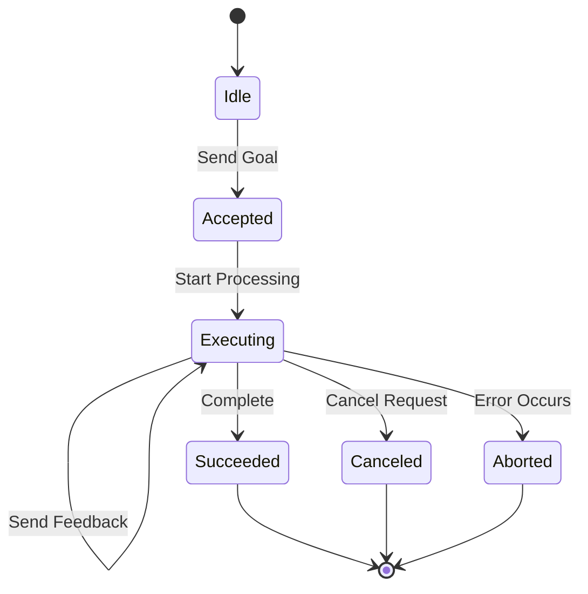
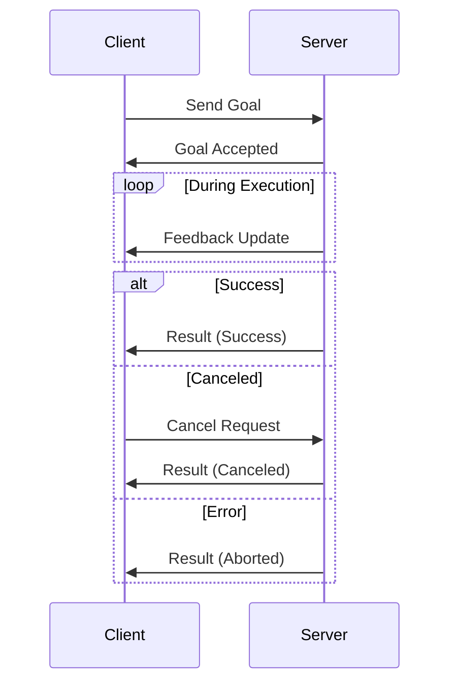

# Actions

**Actions enable long-running tasks with progress feedback and cancellation support, perfect for operations that take seconds or minutes to complete.** Unlike services that return immediately, actions provide streaming feedback while executing complex workflows.

```admonish tip
Use actions for robot navigation, trajectory execution, or any operation where you need progress updates and the ability to cancel mid-execution. Use services for quick request-response operations.
```

## Action Lifecycle



## Components

| Component | Type | Purpose |
|-----------|------|---------|
| **Goal** | Input | Defines the desired outcome |
| **Feedback** | Stream | Progress updates during execution |
| **Result** | Output | Final outcome when complete |
| **Status** | State | Current execution state |

## Communication Pattern



## Use Cases

**Robot Navigation:**

- Goal: Target position and orientation
- Feedback: Current position, distance remaining, obstacles detected
- Result: Final position, success/failure reason

**Gripper Control:**

- Goal: Desired grip force and position
- Feedback: Current force, contact detection
- Result: Grip achieved, object secured

**Long Computations:**

- Goal: Computation parameters
- Feedback: Progress percentage, intermediate results
- Result: Final computed value, execution time

```admonish info
Actions excel when operations take more than a few seconds and users need visibility into progress. For sub-second operations, prefer services for simplicity.
```

## Implementation Status

```admonish note
Action support in ros-z is under active development. The core infrastructure is in place, and examples are available in the repository. Check the latest API documentation for implementation details.
```

## Example Patterns

**Action Server:**

```rust,ignore
let action_server = node
    .create_action_server::<Fibonacci>("/fibonacci")
    .build()?;

loop {
    let goal = action_server.accept_goal()?;

    // Send periodic feedback
    for i in 0..goal.order {
        action_server.send_feedback(FeedbackMsg {
            current: i,
            sequence: compute_partial(i)
        })?;
    }

    // Send final result
    action_server.send_result(ResultMsg {
        sequence: compute_final(goal.order)
    })?;
}
```

**Action Client:**

```rust,ignore
let action_client = node
    .create_action_client::<Fibonacci>("/fibonacci")
    .build()?;

let goal_handle = action_client.send_goal(GoalMsg {
    order: 10
}).await?;

while let Some(feedback) = goal_handle.feedback().await {
    println!("Progress: {}", feedback.current);
}

let result = goal_handle.get_result().await?;
println!("Final: {:?}", result.sequence);
```

```admonish warning
Always implement timeout mechanisms for action clients. Long-running actions can fail or hang, and clients need graceful degradation strategies.
```

## Comparison with Other Patterns

| Pattern | Duration | Feedback | Cancellation | Use Case |
|---------|----------|----------|--------------|----------|
| **Pub-Sub** | Continuous | No | N/A | Sensor data streaming |
| **Service** | < 1 second | No | No | Quick queries |
| **Action** | Seconds to minutes | Yes | Yes | Long-running tasks |

## Resources

- **[ROS 2 Actions Documentation](https://docs.ros.org/en/rolling/Tutorials/Intermediate/Writing-an-Action-Server-Client/Py.html)** - Official ROS 2 action guide
- **[ros-z Examples](https://github.com/ZettaScaleLabs/ros-z/tree/main/ros-z/examples)** - Working action implementations
- **[Services](./services.md)** - Simpler request-response pattern

**Action implementation is evolving. Check the ros-z repository for the latest examples and API updates.**
