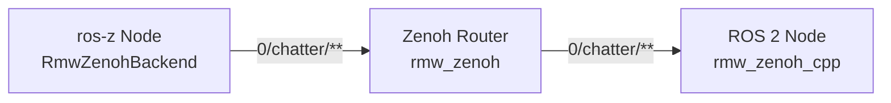
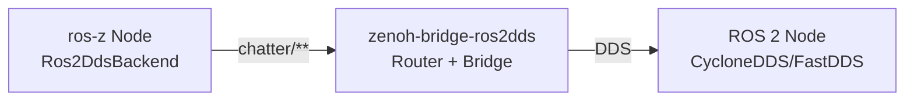

# Backend Selection

**ros-z supports multiple backend protocols for Zenoh key expression generation, enabling interoperability with different ROS 2-to-Zenoh bridges.** The backend determines how topic names are mapped to Zenoh key expressions, allowing seamless communication across different deployment architectures.

```admonish note
Backend selection is a compile-time or runtime choice that affects how ros-z maps ROS 2 topics to Zenoh key expressions. Choose the backend that matches your bridge infrastructure for proper message routing.
```

## Available Backends

ros-z provides two backend implementations:

| Backend | Key Expression Format | Use Case | Bridge Compatibility |
|---------|----------------------|----------|---------------------|
| **RmwZenoh** | `<domain_id>/<topic>/**` | Standard ROS 2 integration | `rmw_zenoh_cpp` middleware |
| **Ros2Dds** | `<topic>/**` | DDS bridge compatibility | `zenoh-bridge-ros2dds` |

### RmwZenoh Backend (Default)

The RmwZenoh backend is designed for compatibility with ROS 2's official Zenoh middleware implementation.

**Key Expression Format:**

```text
<domain_id>/<topic>/**
```

**Example:**

```text
0/chatter/**         # Domain 0, topic /chatter
5/robot/status/**    # Domain 5, topic /robot/status
```

**Use this backend when:**

- Using `rmw_zenoh_cpp` as your ROS 2 middleware
- Running pure ros-z deployments
- Requiring domain isolation via Zenoh

### Ros2Dds Backend

The Ros2Dds backend is designed for compatibility with `zenoh-bridge-ros2dds`, which bridges standard DDS-based ROS 2 nodes to Zenoh.

**Key Expression Format:**

```text
<topic>/**
```

**Example:**

```text
chatter/**           # Topic /chatter (no domain prefix)
robot/status/**      # Topic /robot/status
```

**Use this backend when:**

- Bridging existing DDS-based ROS 2 systems to Zenoh
- Using `zenoh-bridge-ros2dds`
- Integrating with CycloneDDS or FastDDS nodes via Zenoh

## Specifying Backend in Code

### Type-Based Selection (Compile-Time)

Use the builder pattern with generic type parameters for compile-time backend selection:

```rust,ignore
use ros_z::{Builder, backend::{RmwZenohBackend, Ros2DdsBackend}};
use ros_z::qos::{QosProfile, QosHistory};
use ros_z_msgs::std_msgs::String as RosString;
use ros_z_msgs::example_interfaces::srv::AddTwoInts;
use ros_z_msgs::action_tutorials_interfaces::action::Fibonacci;

// Create context and node
let ctx = ZContextBuilder::default().build()?;
let node = ctx.create_node("my_node").build()?;

// Publisher with RmwZenoh backend (default)
let pub_rmw = node
    .create_pub::<RosString>("chatter")
    .with_backend::<RmwZenohBackend>()  // Explicit backend
    .build()?;

// Subscriber with Ros2Dds backend
let sub_dds = node
    .create_sub::<RosString>("chatter")
    .with_backend::<Ros2DdsBackend>()   // DDS bridge compatibility
    .build()?;

// Service client with RmwZenoh backend
let client = node
    .create_client::<AddTwoInts>("add_two_ints")
    .with_backend::<RmwZenohBackend>()
    .build()?;

// Service server with Ros2Dds backend
let mut server = node
    .create_service::<AddTwoInts>("add_two_ints")
    .with_backend::<Ros2DdsBackend>()
    .build()?;

// Action client with RmwZenoh backend
let action_client = node
    .create_action_client::<Fibonacci>("fibonacci")
    .with_backend::<RmwZenohBackend>()
    .build()?;

// Action server with Ros2Dds backend
let mut action_server = node
    .create_action_server::<Fibonacci>("fibonacci")
    .with_backend::<Ros2DdsBackend>()
    .build()?;
```

**Key points:**

- Backend is specified via generic type parameter
- Default backend is `RmwZenohBackend` if not specified
- Type-safe selection ensures correct key expression format
- No runtime overhead - resolved at compile time

### Default Backend Behavior

If no backend is specified, ros-z uses `RmwZenohBackend`:

```rust,ignore
// These are equivalent:
let pub1 = node.create_pub::<RosString>("topic").build()?;
let pub2 = node.create_pub::<RosString>("topic")
    .with_backend::<RmwZenohBackend>()
    .build()?;
```

### Multiple Backend Features

When both `rmw-zenoh` and `ros2dds` feature flags are enabled in `Cargo.toml`:

```toml
[dependencies]
ros-z = { version = "0.1", features = ["rmw-zenoh", "ros2dds"] }
```

**Default behavior**: `RmwZenohBackend` is used by default (more established, backwards compatible).

To use the ros2dds backend, explicitly specify it:

```rust,ignore
let publisher = node
    .create_pub::<RosString>("chatter")
    .with_backend::<Ros2DdsBackend>()  // Explicit opt-in
    .build()?;
```

**Rationale**: The `rmw-zenoh` backend is more established and maintains backwards compatibility with existing ros-z deployments. The `ros2dds` backend requires explicit opt-in to ensure users are aware they're using bridge-compatible key expressions.

## Architecture Diagrams

### RmwZenoh Backend Architecture



**Use case:** Native Zenoh-based ROS 2 deployment

- All nodes use rmw_zenoh or ros-z
- Direct Zenoh communication
- Domain isolation via key expression prefix

### Ros2Dds Backend Architecture



**Use case:** Bridge existing DDS systems to Zenoh

- ROS 2 nodes use standard DDS middleware
- `zenoh-bridge-ros2dds` translates DDS ↔ Zenoh
- ros-z communicates via Zenoh side of bridge

## Complete Example: Backend Selection

The `z_pubsub` example demonstrates backend selection for pub/sub communication. The example supports both `RmwZenoh` and `Ros2Dds` backends via command-line arguments:

```rust,ignore
{{#include ../../../ros-z/examples/z_pubsub.rs}}
```

Key features of this example:

- **Generic backend support**: Uses `KeyExprBackend` trait for compile-time backend selection
- **CLI arguments**: Select backend with `--backend rmw-zenoh` or `--backend ros2-dds`
- **Conditional compilation**: Ros2Dds backend only available with `--features ros2dds`
- **Same high-level API**: Publisher and subscriber code identical except for backend type parameter

**Usage Examples:**

### Direct ros-z Communication (RmwZenoh backend - default)

```bash
# Terminal 1: Run listener with default RmwZenoh backend
cargo run --example z_pubsub -- --role listener

# Terminal 2: Run talker with default RmwZenoh backend
cargo run --example z_pubsub -- --role talker
```

### Interop with ROS 2 via zenoh-bridge-ros2dds (Ros2Dds backend)

1. **Terminal 1 - Start zenoh-bridge-ros2dds:**

   ```bash
   zenoh-bridge-ros2dds
   ```

2. **Terminal 2 - Start ROS 2 DDS talker:**

   ```bash
   ros2 run demo_nodes_cpp talker
   ```

3. **Terminal 3 - Run ros-z listener with Ros2Dds backend:**

   ```bash
   cargo run --example z_pubsub --features ros2dds -- --role listener --backend ros2-dds
   ```

Or run ros-z talker and ROS 2 listener:

```bash
# Terminal 2: Run ros-z talker with Ros2Dds backend
cargo run --example z_pubsub --features ros2dds -- --role talker --backend ros2-dds --topic chatter

# Terminal 3: Run ROS 2 listener
ros2 run demo_nodes_cpp listener
```

## ros-z-console Backend Support

The `ros-z-console` monitoring tool supports backend selection via CLI:

```bash
# Monitor rmw_zenoh-based systems (default)
ros-z-console tcp/127.0.0.1:7447 0

# Monitor zenoh-bridge-ros2dds systems
ros-z-console tcp/127.0.0.1:7447 0 --backend ros2dds

# Show help
ros-z-console --help
```

**Backend parameter:**

- `--backend rmw-zenoh` - Monitor rmw_zenoh systems (default)
- `--backend ros2dds` - Monitor zenoh-bridge-ros2dds systems

The backend choice affects:

- Topic discovery key expressions
- Rate measurement subscriptions
- Multi-topic monitoring

```admonish tip
Always match the backend in `ros-z-console` to your deployment architecture. Use `rmw-zenoh` for native Zenoh systems and `ros2dds` when monitoring systems bridged via `zenoh-bridge-ros2dds`.
```

## Backend Comparison

### When to Use RmwZenoh Backend

✅ **Use RmwZenoh when:**

- Building pure Zenoh-based ROS 2 systems
- Using `rmw_zenoh_cpp` middleware
- Requiring domain isolation
- Deploying new systems with native Zenoh support
- Maximizing Zenoh performance benefits

### When to Use Ros2Dds Backend

✅ **Use Ros2Dds when:**

- Bridging existing DDS-based ROS 2 systems
- Using `zenoh-bridge-ros2dds`
- Integrating with legacy ROS 2 infrastructure
- Gradual migration from DDS to Zenoh
- Heterogeneous deployments (DDS + Zenoh)
