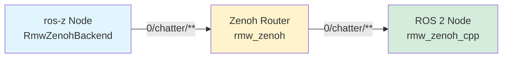
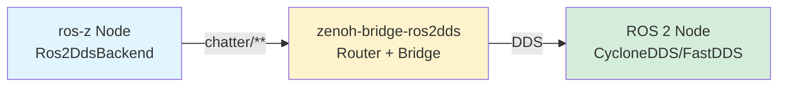

# Backend Selection

**ros-z supports multiple backend protocols for Zenoh key expression generation, enabling interoperability with different ROS 2-to-Zenoh bridges.** The backend determines how topic names are mapped to Zenoh key expressions, allowing seamless communication across different deployment architectures.

```admonish note
Backend selection is a compile-time or runtime choice that affects how ros-z maps ROS 2 topics to Zenoh key expressions. Choose the backend that matches your bridge infrastructure for proper message routing.
```

## Available Backends

ros-z provides two backend implementations:

| Backend | Key Expression Format | Use Case | Bridge Compatibility |
|---------|----------------------|----------|---------------------|
| **RmwZenoh** | `<domain_id>/<topic>/**` | Standard ROS 2 integration | `rmw_zenoh_cpp` middleware |
| **Ros2Dds** | `<topic>/**` | DDS bridge compatibility | `zenoh-bridge-ros2dds` |

### RmwZenoh Backend (Default)

The RmwZenoh backend is designed for compatibility with ROS 2's official Zenoh middleware implementation.

**Key Expression Format:**
```
<domain_id>/<topic>/**
```

**Example:**
```
0/chatter/**         # Domain 0, topic /chatter
5/robot/status/**    # Domain 5, topic /robot/status
```

**Use this backend when:**
- Using `rmw_zenoh_cpp` as your ROS 2 middleware
- Running pure ros-z deployments
- Requiring domain isolation via Zenoh

### Ros2Dds Backend

The Ros2Dds backend is designed for compatibility with `zenoh-bridge-ros2dds`, which bridges standard DDS-based ROS 2 nodes to Zenoh.

**Key Expression Format:**
```
<topic>/**
```

**Example:**
```
chatter/**           # Topic /chatter (no domain prefix)
robot/status/**      # Topic /robot/status
```

**Use this backend when:**
- Bridging existing DDS-based ROS 2 systems to Zenoh
- Using `zenoh-bridge-ros2dds`
- Integrating with CycloneDDS or FastDDS nodes via Zenoh

## Specifying Backend in Code

### Type-Based Selection (Compile-Time)

Use the builder pattern with generic type parameters for compile-time backend selection:

```rust,ignore
use ros_z::{Builder, backend::{RmwZenohBackend, Ros2DdsBackend}};
use ros_z::qos::{QosProfile, QosHistory};
use ros_z_msgs::std_msgs::String as RosString;

// Create context and node
let ctx = ZContextBuilder::default().build()?;
let node = ctx.create_node("my_node").build()?;

// Publisher with RmwZenoh backend (default)
let pub_rmw = node
    .create_pub::<RosString>("chatter")
    .with_backend::<RmwZenohBackend>()  // Explicit backend
    .build()?;

// Subscriber with Ros2Dds backend
let sub_dds = node
    .create_sub::<RosString>("chatter")
    .with_backend::<Ros2DdsBackend>()   // DDS bridge compatibility
    .build()?;
```

**Key points:**

- Backend is specified via generic type parameter
- Default backend is `RmwZenohBackend` if not specified
- Type-safe selection ensures correct key expression format
- No runtime overhead - resolved at compile time

### Default Backend Behavior

If no backend is specified, ros-z uses `RmwZenohBackend`:

```rust,ignore
// These are equivalent:
let pub1 = node.create_pub::<RosString>("topic").build()?;
let pub2 = node.create_pub::<RosString>("topic")
    .with_backend::<RmwZenohBackend>()
    .build()?;
```

## Architecture Diagrams

### RmwZenoh Backend Architecture


```mermaid
graph LR
    A[ros-z Node<br/>RmwZenohBackend] -->|"0/chatter/**"| B[Zenoh Router<br/>rmw_zenoh]
    B -->|"0/chatter/**"| C[ROS 2 Node<br/>rmw_zenoh_cpp]

    style A fill:#e1f5ff
    style B fill:#fff3cd
    style C fill:#d4edda
```

**Use case:** Native Zenoh-based ROS 2 deployment

- All nodes use rmw_zenoh or ros-z
- Direct Zenoh communication
- Domain isolation via key expression prefix

### Ros2Dds Backend Architecture


```mermaid
graph LR
    A[ros-z Node<br/>Ros2DdsBackend] -->|"chatter/**"| B[zenoh-bridge-ros2dds<br/>Router + Bridge]
    B -->|DDS| C[ROS 2 Node<br/>CycloneDDS/FastDDS]

    style A fill:#e1f5ff
    style B fill:#fff3cd
    style C fill:#d4edda
```

**Use case:** Bridge existing DDS systems to Zenoh

- ROS 2 nodes use standard DDS middleware
- `zenoh-bridge-ros2dds` translates DDS ↔ Zenoh
- ros-z communicates via Zenoh side of bridge

## Complete Example: DDS Interoperability

This example demonstrates a ros-z subscriber receiving messages from a standard ROS 2 DDS publisher via `zenoh-bridge-ros2dds`:

```rust,ignore
use ros_z::{Builder, ZContextBuilder, backend::Ros2DdsBackend};
use ros_z::qos::{QosProfile, QosHistory};
use ros_z_msgs::std_msgs::String as RosString;
use std::time::Duration;

#[tokio::main]
async fn main() -> Result<(), Box<dyn std::error::Error>> {
    // Create context pointing to zenoh-bridge-ros2dds
    let ctx = ZContextBuilder::default()
        .router("tcp/127.0.0.1:7447")
        .build()?;

    // Create node and subscriber with Ros2Dds backend
    let node = ctx.create_node("dds_listener").build()?;

    let qos = QosProfile {
        history: QosHistory::KeepLast(10),
        ..Default::default()
    };

    let subscriber = node
        .create_sub::<RosString>("chatter")
        .with_qos(qos)
        .with_backend::<Ros2DdsBackend>()  // DDS bridge compatibility
        .build()?;

    // Receive messages from DDS publishers
    loop {
        match subscriber.recv_timeout(Duration::from_secs(1)) {
            Ok(msg) => println!("Received from DDS: {}", msg.data),
            Err(_) => continue,
        }
    }
}
```

**Running this example:**

1. **Terminal 1 - Start zenoh-bridge-ros2dds:**
   ```bash
   zenoh-bridge-ros2dds
   ```

2. **Terminal 2 - Start ROS 2 DDS talker:**
   ```bash
   ros2 run demo_nodes_cpp talker
   ```

3. **Terminal 3 - Run ros-z listener:**
   ```bash
   cargo run --example dds_listener
   ```

## ros-z-console Backend Support

The `ros-z-console` monitoring tool supports backend selection via CLI:

```bash
# Monitor rmw_zenoh-based systems (default)
ros-z-console tcp/127.0.0.1:7447 0

# Monitor zenoh-bridge-ros2dds systems
ros-z-console tcp/127.0.0.1:7447 0 --backend ros2dds

# Show help
ros-z-console --help
```

**Backend parameter:**
- `--backend rmw-zenoh` - Monitor rmw_zenoh systems (default)
- `--backend ros2dds` - Monitor zenoh-bridge-ros2dds systems

The backend choice affects:
- Topic discovery key expressions
- Rate measurement subscriptions
- Multi-topic monitoring

```admonish tip
Always match the backend in `ros-z-console` to your deployment architecture. Use `rmw-zenoh` for native Zenoh systems and `ros2dds` when monitoring systems bridged via `zenoh-bridge-ros2dds`.
```

## Backend Comparison

### When to Use RmwZenoh Backend

✅ **Use RmwZenoh when:**

- Building pure Zenoh-based ROS 2 systems
- Using `rmw_zenoh_cpp` middleware
- Requiring domain isolation
- Deploying new systems with native Zenoh support
- Maximizing Zenoh performance benefits

### When to Use Ros2Dds Backend

✅ **Use Ros2Dds when:**

- Bridging existing DDS-based ROS 2 systems
- Using `zenoh-bridge-ros2dds`
- Integrating with legacy ROS 2 infrastructure
- Gradual migration from DDS to Zenoh
- Heterogeneous deployments (DDS + Zenoh)

## Testing Backend Compatibility

ros-z includes integration tests verifying backend interoperability:

```bash
# Test Ros2Dds backend with zenoh-bridge-ros2dds
cargo test -p ros-z-tests --features ros2dds-interop

# Test specific interop scenario
cargo test -p ros-z-tests --test dds_interop
```

**Test coverage:**

- ✅ ROS 2 DDS publisher → ros-z subscriber (via bridge)
- ✅ ros-z publisher → ROS 2 DDS subscriber (via bridge)
- ✅ Bidirectional communication
- ✅ QoS compatibility

## Troubleshooting

### Messages Not Received

**Symptom:** ros-z publisher/subscriber doesn't communicate with expected nodes

**Solution:** Verify backend matches your infrastructure:

```bash
# Check Zenoh key expressions
zenoh-cli query "**" --session tcp/127.0.0.1:7447

# For rmw_zenoh systems, you should see:
# 0/chatter/**

# For ros2dds systems, you should see:
# chatter/**
```

If key expressions don't match, adjust your backend selection:

```rust,ignore
// For rmw_zenoh systems
.with_backend::<RmwZenohBackend>()

// For zenoh-bridge-ros2dds systems
.with_backend::<Ros2DdsBackend>()
```

### Domain Mismatch

**Symptom:** Messages published but not received (RmwZenoh backend only)

**Solution:** Ensure domain IDs match across all nodes:

```rust,ignore
// All nodes in same deployment should use same domain
let ctx = ZContextBuilder::default()
    .domain_id(0)  // Must match across nodes
    .build()?;
```

## API Reference

### Backend Traits

Both backends implement the `KeyExprBackend` trait:

```rust,ignore
pub trait KeyExprBackend {
    fn topic_key_expr(domain_id: usize, topic: &str) -> String;
}
```

**Implementations:**

```rust,ignore
// RmwZenohBackend: includes domain prefix
RmwZenohBackend::topic_key_expr(0, "chatter")  // "0/chatter/**"

// Ros2DdsBackend: no domain prefix
Ros2DdsBackend::topic_key_expr(0, "chatter")   // "chatter/**"
```

### Builder Methods

```rust,ignore
// Specify backend for publisher
pub fn with_backend<B: KeyExprBackend>(self) -> Self

// Specify backend for subscriber
pub fn with_backend<B: KeyExprBackend>(self) -> Self

// Specify backend for service client
pub fn with_backend<B: KeyExprBackend>(self) -> Self

// Specify backend for service server
pub fn with_backend<B: KeyExprBackend>(self) -> Self
```

## Resources

- **[Networking](./config.md)** - Zenoh router configuration
- **[Pub/Sub](./pubsub.md)** - Publisher/Subscriber examples
- **[Services](./services.md)** - Service client/server examples
- **[Quick Start](./quick_start.md)** - Getting started guide

**Understand your deployment architecture first, then select the appropriate backend for seamless interoperability.**
