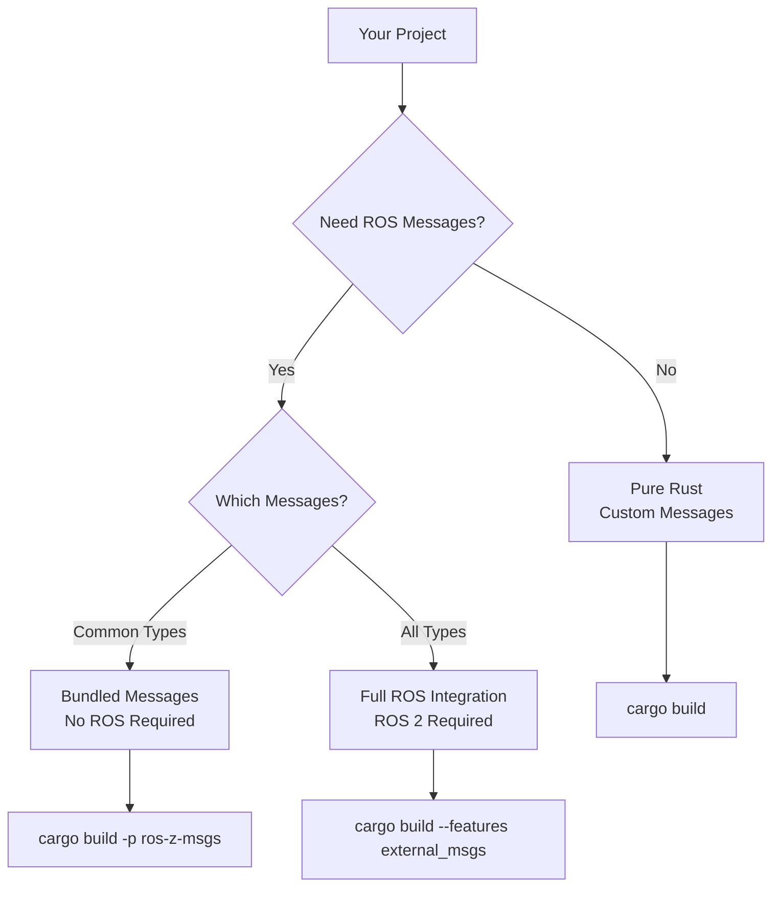
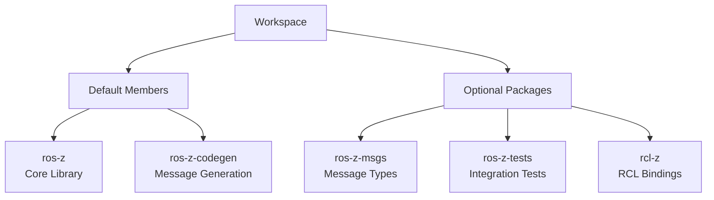
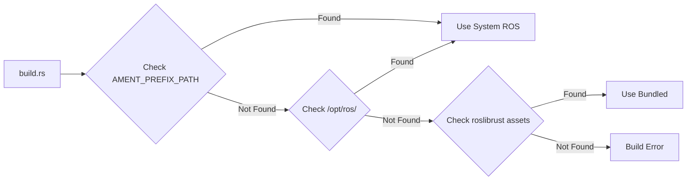

# Building ros-z

**ros-z is designed to work without ROS 2 dependencies by default, enabling pure Rust development while optionally integrating with existing ROS 2 installations.** This flexible approach lets you choose your dependency level based on project requirements.

```admonish success
Start with zero dependencies and add ROS 2 integration only when you need it. This gradual approach reduces complexity and speeds up initial development.
```

## Philosophy

ros-z follows a **dependency-optional** design:

- Build pure Rust applications without ROS 2 installed
- Use bundled message definitions for common types
- Opt-in to ROS 2 integration when needed
- Pay only for what you use

## Quick Start

Get running in 30 seconds:

```bash
# Build core library
cargo build

# Run tests
cargo test

# Try an example
cargo run --example z_pubsub
```

```admonish tip
The default build requires only Rust and Cargo. No ROS 2, no external dependencies, no configuration files.
```

## Build Scenarios



### Scenario 1: Pure Rust Development

**Use when:** Prototyping, standalone apps, custom messages only

**Requirements:** Rust + Cargo

```bash
# Build workspace (ros-z + ros-z-codegen)
cargo build

# Run tests
cargo test

# Build example with custom messages
cargo build -p ros-z --example z_custom_message
cargo run --example z_custom_message -- --mode status-pub
```

**What you get:**

- Full ros-z functionality
- Custom message support
- Zero external dependencies
- Fast build times

```admonish info
Perfect for initial development and MVP builds. Add message packages incrementally as needs grow.
```

### Scenario 2: Using Bundled Messages

**Use when:** Need standard ROS types, no ROS 2 installation available

**Requirements:** Rust + Cargo (still no ROS 2!)

```bash
# Build with bundled messages
cargo build -p ros-z-msgs

# Build examples using standard types
cargo build -p ros-z --example z_pubsub        # std_msgs
cargo build -p ros-z --example twist_pub       # geometry_msgs
cargo build -p ros-z --example laser_scan      # sensor_msgs
```

**Bundled packages** (via roslibrust):

- `std_msgs` - Strings, integers, arrays
- `geometry_msgs` - Points, poses, transforms
- `sensor_msgs` - LaserScan, Image, Imu
- `nav_msgs` - Path, occupancy grids

```admonish success
Bundled messages provide ROS 2 compatibility without requiring ROS 2 installation. Perfect for development machines.
```

### Scenario 3: Full ROS 2 Integration

**Use when:** Need all message types, ROS 2 interoperability required

**Requirements:** Rust + Cargo + ROS 2 installation

```bash
# Ensure ROS 2 is sourced
source /opt/ros/jazzy/setup.bash

# Build with external messages
cargo build -p ros-z-msgs --features external_msgs

# Build RCL bindings
cargo build -p rcl-z

# Build service examples
cargo build --example z_srvcli --features external_msgs
```

**Additional packages:**

- `example_interfaces` - Tutorial services
- `action_msgs` - Action types
- Custom packages from your workspace

## Workspace Structure



| Package | Default Build | Purpose | Dependencies |
|---------|---------------|---------|--------------|
| **ros-z** | Yes | Core Zenoh-native ROS 2 library | None |
| **ros-z-codegen** | Yes | Message generation utilities | None |
| **ros-z-msgs** | No | Pre-generated message types | Optional ROS 2 |
| **ros-z-tests** | No | Integration tests | ros-z-msgs |
| **rcl-z** | No | RCL C bindings | ROS 2 required |

```admonish note
Only `ros-z` and `ros-z-codegen` build by default. Add other packages as needed for your use case.
```

## Message Package Resolution

The build system automatically locates ROS message definitions:



**Search order:**

1. System ROS installation (`AMENT_PREFIX_PATH`, `CMAKE_PREFIX_PATH`)
2. Common ROS paths (`/opt/ros/{rolling,jazzy,iron,humble}`)
3. Roslibrust git checkout (`~/.cargo/git/checkouts/roslibrust-*/assets/`)

This fallback mechanism enables builds without ROS 2 installed.

## Using Nix (Optional)

Pre-configured development environments with all dependencies:

```bash
# Default: ROS 2 Jazzy with full tooling
nix develop

# Specific ROS distros
nix develop .#ros-jazzy      # ROS 2 Jazzy
nix develop .#ros-rolling    # ROS 2 Rolling

# Pure Rust (no ROS)
nix develop .#pureRust

# CI environments (minimal)
nix develop .#ros-jazzy-ci
nix develop .#pureRust-ci
```

**Nix shells provide:**

- Correct environment variables
- All build dependencies
- Development tools (rust-analyzer, clippy)
- Reproducible builds

```admonish tip
Use Nix for consistent development environments across team members and CI/CD pipelines.
```

## Examples by Dependency Level

### Level 1: Zero Dependencies

```bash
# Custom messages only
cargo run --example z_custom_message -- --mode status-pub
```

### Level 2: Bundled Messages

```bash
# Standard message types (no ROS required)
cargo run --example z_pubsub          # std_msgs
cargo run --example twist_pub         # geometry_msgs
cargo run --example battery_state_sub # sensor_msgs
cargo run --example z_pingpong        # Performance test
```

### Level 3: External Messages

```bash
# Requires ROS 2 installation
cargo run --example z_srvcli --features external_msgs
```

### Level 4: Advanced Features

```bash
# Protobuf serialization
cargo build -p protobuf_demo
```

## Build Options

| Command | Purpose | Dependencies |
|---------|---------|--------------|
| `cargo build` | Core library only | Rust + Cargo |
| `cargo build -p ros-z-msgs` | + Bundled messages | Rust + Cargo |
| `cargo build --features external_msgs` | + External messages | + ROS 2 |
| `cargo build -p rcl-z` | + RCL bindings | + ROS 2 |
| `cargo build --all` | Everything | + ROS 2 |

## Common Build Commands

**Development:**

```bash
# Fast iterative development
cargo check                # Quick compile check
cargo build                # Debug build
cargo build --release      # Optimized build
cargo test                 # Run tests
cargo clippy              # Lint checks
```

**Examples:**

```bash
# Build all examples
cargo build --examples

# Build specific example
cargo build --example demo_nodes_talker

# Run example directly
cargo run --example demo_nodes_talker
```

**Clean builds:**

```bash
# Remove all build artifacts
cargo clean

# Clean specific package
cargo clean -p ros-z-msgs
```

```admonish warning
After changing feature flags or updating ROS 2, run `cargo clean -p ros-z-msgs` to force message regeneration.
```

## Troubleshooting Builds

**Build too slow?**

```bash
# Use parallel builds (automatic on most systems)
cargo build -j $(nproc)

# Build only what you need
cargo build -p ros-z-msgs --features std_msgs,geometry_msgs
```

**Can't find ROS packages?**

```bash
# Ensure ROS 2 is sourced
source /opt/ros/jazzy/setup.bash

# Verify environment
echo $AMENT_PREFIX_PATH

# Check package exists
ros2 pkg prefix example_interfaces
```

**Linker errors?**

```bash
# Clear cache and rebuild
cargo clean
source /opt/ros/jazzy/setup.bash
cargo build -p rcl-z
```

For comprehensive troubleshooting, see the [Troubleshooting Guide](./troubleshooting.md).

## Resources

- **[Feature Flags](./feature_flags.md)** - Detailed feature documentation
- **[Troubleshooting](./troubleshooting.md)** - Common build issues
- **[Examples Overview](./examples_overview.md)** - What you can build
- **[Message Generation](./message_generation.md)** - How messages work

**Start with the simplest build and add dependencies incrementally as your project grows.**
