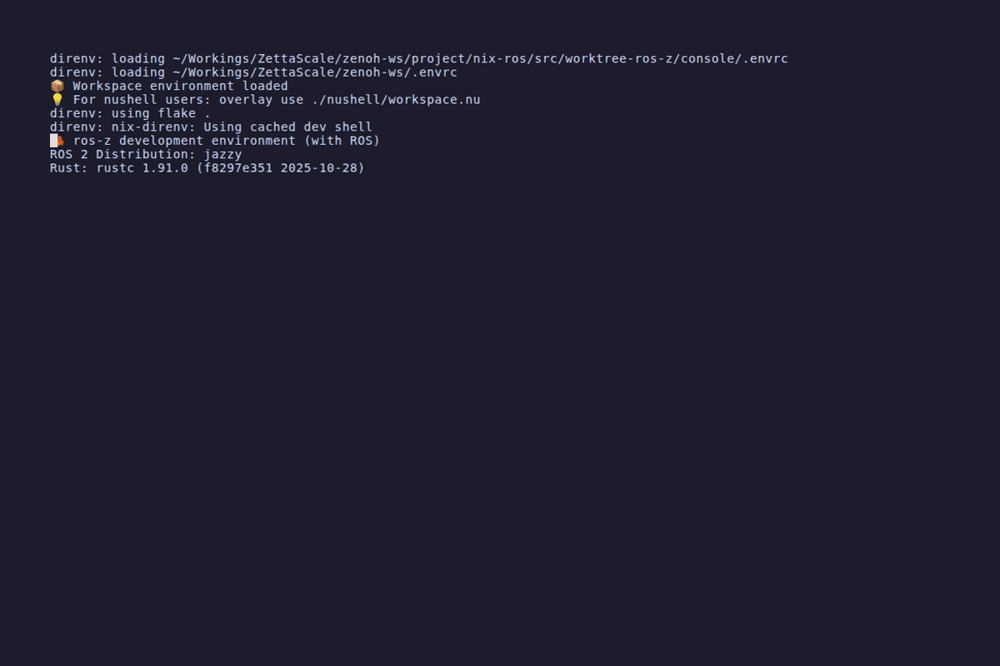
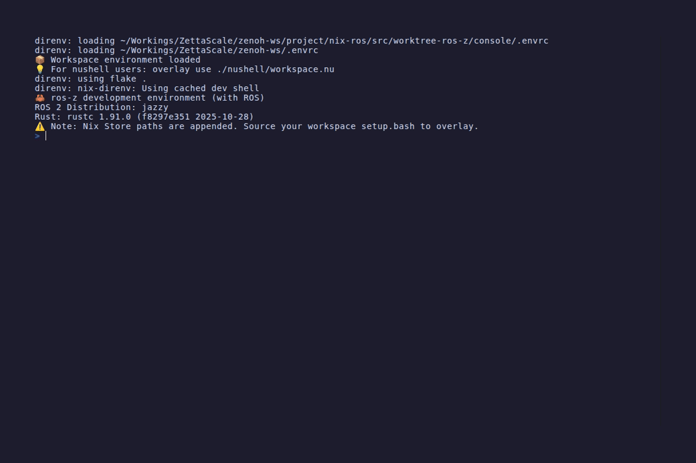
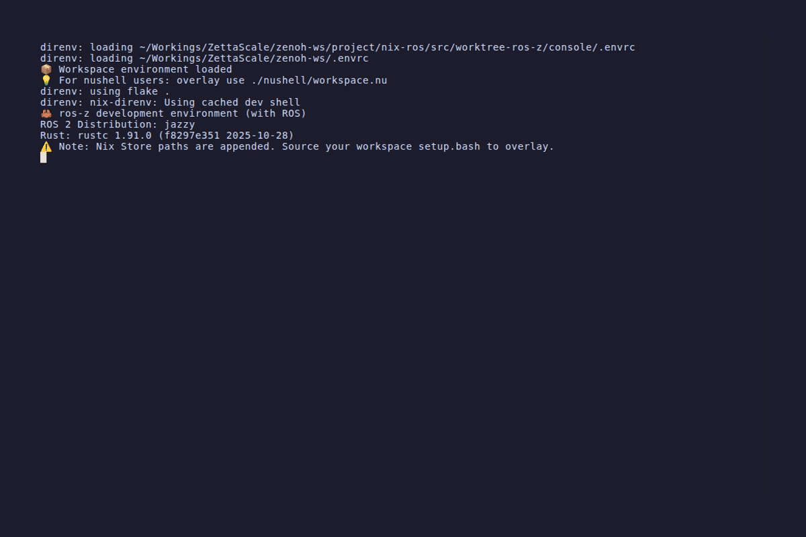

# ros-z-console TUI Demos

These demos use the classic `z_pubsub` (talker/listener) and `z_srvcli` (AddTwoInts server)
examples as a live ROS 2 system.

**Setup:**

```bash
# Terminal 1
zenohd

# Terminal 2
ros-z-console tcp/127.0.0.1:7447 0
```

---

## Startup

ros-z-console connects to the Zenoh router and discovers all live entities in the graph.


---

## Topics Panel

The Topics panel (default) lists all active ROS 2 topics with their type and publisher/subscriber counts.
Navigate with `j` / `k` (or arrow keys). Press `l` or `Enter` to open the detail pane.


---

## Topic Detail

Select a topic and press `l` or `Enter` to view publishers, subscribers, type hash, and QoS profiles.



---

## Services Panel

Press `2` (or `Tab`) to switch to the Services panel. Lists all active ROS 2 services with their type.


---

## Nodes Panel

Press `3` to switch to the Nodes panel. Lists all active nodes. Select a node and press `l` or `Enter`
to see its publishers, subscribers, and services.



---

## Rate Measurement

Press `r` on a selected topic for a quick rate check (cached 30s). Switch to the Measure panel
(`4` or `m`) for a continuous measurement with a 60-second time-series chart.



---

## Filter Mode

Press `/` to enter filter mode and start typing. The list narrows to matching items in real time.
Press `Ctrl+U` to clear, `Escape` to exit filter mode.


---

## Help Overlay

Press `?` to toggle the help overlay showing all keybindings.


