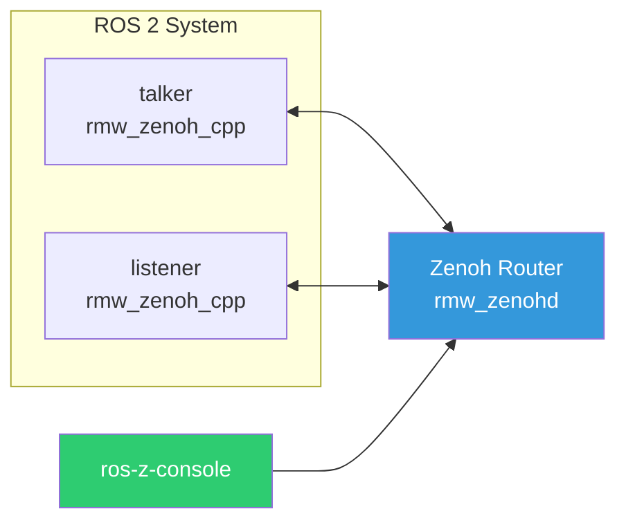
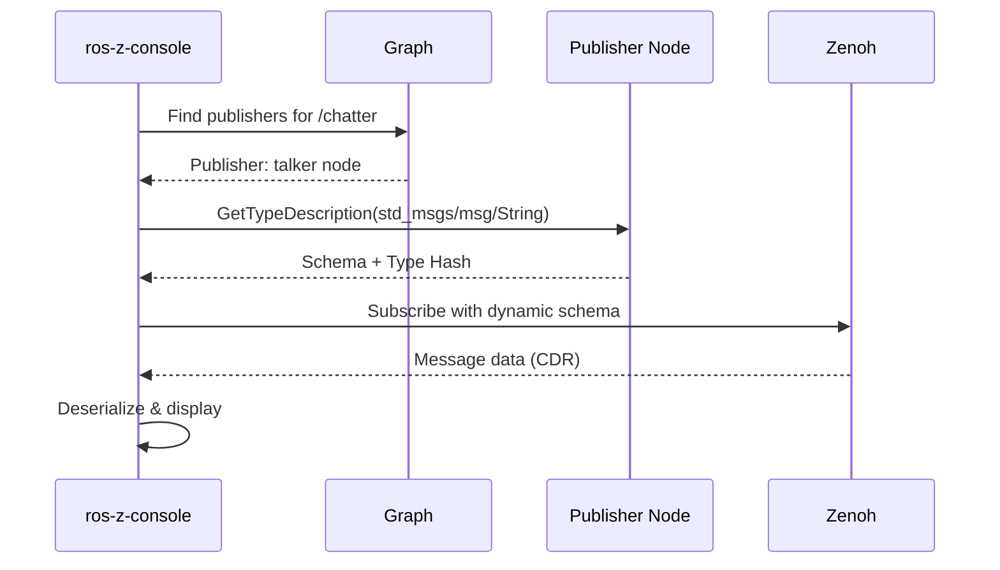

# ros-z-console

**ros-z-console** is a monitoring tool for ROS 2 systems built on Zenoh.
It provides real-time graph inspection, dataflow monitoring, and metrics
collection through two interfaces: an interactive TUI (Terminal User Interface)
and a headless JSON streaming mode.

```admonish tip
ros-z-console uses zero-interference monitoring via pure Zenoh subscribers -
it never pollutes the ROS graph with its own presence.
```

## Network Topology

ros-z-console connects to the ROS 2 graph via a Zenoh router. All ROS 2 nodes
using `rmw_zenoh_cpp` communicate through the same router, enabling
ros-z-console to observe the entire system.



## Quick Start: Monitoring demo_nodes_cpp

This example shows ros-z-console monitoring the classic talker/listener demo from `demo_nodes_cpp`.

**Terminal 1 - Start the Zenoh router:**

```bash
ros2 run rmw_zenoh_cpp rmw_zenohd
```

**Terminal 2 - Start the talker:**

```bash
export RMW_IMPLEMENTATION=rmw_zenoh_cpp
ros2 run demo_nodes_cpp talker
```

**Terminal 3 - Start the listener:**

```bash
export RMW_IMPLEMENTATION=rmw_zenoh_cpp
ros2 run demo_nodes_cpp listener
```

**Terminal 4 - Monitor with ros-z-console:**

```bash
./target/release/ros-z-console tcp/127.0.0.1:7447 0
```

```admonish success
You should see the `/chatter` topic, the `talker` and `listener` nodes, and
their services appear in ros-z-console. Use the TUI to browse topics, check
message rates, and inspect QoS settings.
```

## Building and Running

```bash
# Build the console (release build)
cargo build -p ros-z-console --release

# Run directly from build output
./target/release/ros-z-console tcp/127.0.0.1:7447 0

# Or install to ~/.cargo/bin so `ros-z-console` works from anywhere
cargo install --path crates/ros-z-console

# Or use cargo run during development (debug build)
cargo run -p ros-z-console -- tcp/127.0.0.1:7447 0

# Headless JSON streaming
./target/release/ros-z-console --headless --json tcp/127.0.0.1:7447 0

# Echo messages from a topic
./target/release/ros-z-console --headless --echo /chatter tcp/127.0.0.1:7447 0

# Echo multiple topics with JSON output
./target/release/ros-z-console --headless --json --echo /chatter --echo /cmd_vel tcp/127.0.0.1:7447 0

# Export graph snapshot and exit
./target/release/ros-z-console --export graph.json tcp/127.0.0.1:7447 0
```

## Command Line Interface

```bash
ros-z-console [OPTIONS] [ROUTER] [DOMAIN]
```

### Arguments

| Argument | Default | Description |
|----------|---------|-------------|
| `ROUTER` | `tcp/127.0.0.1:7447` | Zenoh router address |
| `DOMAIN` | `0` | ROS domain ID |

### Options

| Flag | Description |
|------|-------------|
| `--tui` | Enable TUI interface (default if no other mode specified) |
| `--headless` | Headless mode: stream events to stdout (human-readable unless `--json` is also set) |
| `--json` | Output structured JSON logs (use with `--headless`) |
| `--debug` | Enable debug logging |
| `--echo <TOPIC>` | Subscribe to and display messages from topic (can be used multiple times) |
| `--export <PATH>` | Export current state and exit (supports .json, .dot, .csv) |
| `--backend <BACKEND>` | Backend protocol: `rmw-zenoh` (default) or `ros2dds` |

### Backend Selection

ros-z-console supports two discovery backends:

| Backend | Use when... |
|---------|-------------|
| `rmw-zenoh` (default) | Nodes use `rmw_zenoh_cpp` directly |
| `ros2dds` | Nodes are bridged via `zenoh-bridge-ros2dds` |

```bash
# Monitor nodes using rmw_zenoh_cpp (default)
ros-z-console tcp/127.0.0.1:7447 0

# Monitor nodes bridged via zenoh-bridge-ros2dds
ros-z-console --backend ros2dds tcp/127.0.0.1:7447 0
```

## Modes

### TUI Mode (Default)

The interactive terminal interface provides:

- **Panel Navigation** - Browse Topics, Services, Nodes, and Measurements
- **Filter Mode** - Press `/` to activate type-ahead search with highlighting
- **Rate Monitoring** - Quick rate check with `r` key (cached for 30s)
- **Measurement Tracking** - Press `m` on a topic in the Topics tab to toggle it into the Measure panel tracking list
- **Measurement Panel** - Navigate to the Measure tab to see real-time metrics (msg/s, KB/s, average payload) and a 60-second time-series chart
- **SQLite Recording** - Press `w` to start/stop recording metrics to `ros-z-metrics.db`
- **Detail Drilling** - Press `Enter` to expand sections with QoS profiles
- **Export** - Press `e` to export the current rate cache to a timestamped CSV file
- **Screenshot** - Press `S` to capture the current TUI state
- **Help Overlay** - Press `?` to toggle help

```admonish note
TUI mode requires a terminal that supports ANSI escape codes. Most modern terminals work out of the box.
```

### Headless Mode

Headless mode streams events to stdout, making it ideal for:

- CI/CD pipelines
- Log aggregation systems
- AI-powered analysis
- Scripted monitoring

**Human-readable output:**

```bash
ros-z-console --headless tcp/127.0.0.1:7447 0
```

```console
Discovered Topics:
  📡 /chatter (std_msgs/msg/String)
  📡 /cmd_vel (geometry_msgs/msg/Twist)
Discovered Services:
  🔌 /talker/describe_parameters (rcl_interfaces/srv/DescribeParameters)
Discovered Nodes:
  🤖 //talker
  🤖 //listener
[2026-01-21 10:30:00] Topic discovered: /rosout (rcl_interfaces/msg/Log)
```

**JSON streaming output:**

```bash
ros-z-console --headless --json tcp/127.0.0.1:7447 0
```

```json
{"event":"initial_state","domain_id":0,"topics":[...],"nodes":[...],"services":[...]}
{"TopicDiscovered":{"topic":"/chatter","type_name":"std_msgs/msg/String","timestamp":{"secs_since_epoch":1737449400,"nanos_since_epoch":0}}}
{"NodeDiscovered":{"namespace":"/","name":"talker","timestamp":{"secs_since_epoch":1737449400,"nanos_since_epoch":0}}}
```

## Dynamic Topic Echo

ros-z-console can subscribe to and display messages from **any ROS 2 topic**
without compile-time knowledge of message types. This is powered by dynamic
schema discovery using the ROS 2 Type Description service (REP-2016).

```admonish success title="Universal Message Support"
Echo works with all ROS 2 message types: primitives, nested messages, arrays, and custom types. No recompilation needed!
```

### How It Works

When you echo a topic, ros-z-console:

1. **Discovers publishers** on the topic using graph monitoring
2. **Queries the Type Description service** from the publisher's node
3. **Retrieves the message schema** (field names, types, and layout)
4. **Creates a dynamic subscriber** using the discovered schema
5. **Deserializes and displays messages** in real-time



### Basic Usage

**Echo a single topic:**

```bash
ros-z-console --headless --echo /chatter
```

**Output:**

```text
=== Subscribed to /chatter ===
Type: std_msgs/msg/String
Hash: RIHS01_df668c740482bbd48fb39d76a70dfd4bd59db1288021743503259e948f6b1a18
Fields: ["data"]

=== /chatter ===
data: "Hello World: 0"

=== /chatter ===
data: "Hello World: 1"
```

**JSON output mode:**

```bash
ros-z-console --headless --json --echo /chatter
```

```json
{"event":"topic_subscribed","topic":"/chatter","type_name":"std_msgs/msg/String","type_hash":"RIHS01_df668...","fields":["data"]}
{"event":"message_received","topic":"/chatter","type":"std_msgs/msg/String","data":{"data":"Hello World: 0"}}
{"event":"message_received","topic":"/chatter","type":"std_msgs/msg/String","data":{"data":"Hello World: 1"}}
```

### Multiple Topics

Echo multiple topics simultaneously:

```bash
ros-z-console --headless --echo /chatter --echo /cmd_vel --echo /odom
```

Each topic is independently discovered and subscribed with its own dynamic schema.

### Supported Message Types

#### Primitives

```bash
# String messages
ros-z-console --headless --echo /chatter

# Numeric types
ros-z-console --headless --echo /count      # Int32
ros-z-console --headless --echo /sensor     # Float64
```

#### Nested Messages

```bash
# Twist (linear + angular vectors)
ros-z-console --headless --echo /cmd_vel
```

**Output:**

```text
=== /cmd_vel ===
linear:
  x: 1.0
  y: 0.0
  z: 0.0
angular:
  x: 0.0
  y: 0.0
  z: 0.5
```

#### Arrays and Sequences

```bash
# Point cloud or array messages
ros-z-console --headless --echo /scan
```

### Use Cases

#### Debugging Message Content

Quickly inspect what's actually being published:

```bash
ros-z-console --headless --echo /diagnostics
```

#### Data Analysis

Pipe JSON output to analysis tools:

```bash
ros-z-console --headless --json --echo /pose | \
  jq -r 'select(.event=="message_received") | .data.position.x'
```

#### Recording Specific Fields

Extract and log specific data:

```bash
ros-z-console --headless --json --echo /sensor_data | \
  jq '.data.temperature' >> temps.log
```

#### Message Validation

Verify message structure and content during development:

```bash
# Check if messages match expected schema
ros-z-console --headless --json --echo /my_custom_topic | \
  jq '.data | keys'
```

### Example: Monitoring Robot Telemetry

Monitor multiple robot topics simultaneously:

```bash
#!/bin/bash
# Monitor robot state
ros-z-console --headless \
  --echo /cmd_vel \
  --echo /odom \
  --echo /battery_state \
  --echo /diagnostics \
  > robot_state.log
```

### Integration with Standard ROS 2

ros-z-console echo works seamlessly with standard ROS 2 nodes:

```bash
# Terminal 1: Standard ROS 2 publisher
ros2 run demo_nodes_cpp talker

# Terminal 2: ros-z-console subscriber
ros-z-console --headless --echo /chatter
```

```admonish info title="Type Hash Matching"
ros-z-console uses RIHS01 type hashes to ensure message compatibility. If type hashes don't match, the subscription will fail with a clear error message.
```

### Advanced Options

#### With Debug Logging

Enable detailed logging to troubleshoot discovery issues:

```bash
RUST_LOG=ros_z=debug ros-z-console --headless --echo /chatter
```

**Debug output shows:**

- Publisher discovery attempts
- Type description service queries
- Schema parsing details
- Type hash validation

#### Custom Timeout

If schema discovery is slow, you can adjust timeouts in the code (default: 5 seconds).

### Troubleshooting

**No publishers found:**

```text
Failed to subscribe to /my_topic: Schema discovery failed: No publishers found for topic: /my_topic
```

**Solutions:**

- Verify the topic exists: `ros2 topic list`
- Check the topic is being published: `ros2 topic hz /my_topic`
- Ensure rmw_zenohd is running
- Wait for publisher to fully start (may take a few seconds)

**Type hash mismatch:**

```text
Failed to subscribe to /chatter: Type hash mismatch
```

This occurs when the publisher and subscriber have different message definitions. Ensure both are using the same ROS 2 distribution and package versions.

### Comparison with ros2 topic echo

| Feature | ros-z-console | ros2 topic echo |
|---------|---------------|-----------------|
| **Compilation** | No recompilation needed | Requires message packages installed |
| **Custom types** | Automatic discovery | Must have .msg files available |
| **Multiple topics** | Single command | Need multiple processes |
| **JSON output** | Built-in structured format | Requires additional parsing |
| **Performance** | Zenoh pub/sub (very fast) | DDS overhead |
| **Filtering** | Easy with jq on JSON | Manual parsing needed |

### Performance Notes

- **Latency:** Sub-millisecond after initial discovery (~5 seconds)
- **Throughput:** Handles 1000+ messages/second per topic
- **Memory:** ~1KB per unique message schema (cached globally)
- **CPU:** Minimal - only active when messages arrive

```admonish tip title="Schema Caching"
Message schemas are cached in a global registry. Once a type is discovered, subsequent subscriptions to topics with the same type are instant.
```

## Export Formats

Export the current graph state with the `--export` flag:

### JSON Export

```bash
ros-z-console --export graph.json tcp/127.0.0.1:7447 0
```

Produces a structured JSON file with topics, nodes, services, and their relationships:

```json
{
  "timestamp": "2026-01-21T10:30:00Z",
  "domain_id": 0,
  "topics": [
    {"name": "/chatter", "type": "std_msgs/msg/String", "publishers": 1, "subscribers": 1}
  ],
  "nodes": [
    {"name": "talker", "namespace": "/"}
  ],
  "services": []
}
```

### GraphViz DOT Export

```bash
ros-z-console --export graph.dot tcp/127.0.0.1:7447 0
dot -Tpng graph.dot -o graph.png
```

Generates a visual graph representation with:

- Nodes as blue boxes
- Topics as green ellipses
- Publisher edges in blue
- Subscriber edges in green

### CSV Export

```bash
ros-z-console --export metrics.csv tcp/127.0.0.1:7447 0
```

Exports metrics recorded during the current TUI session. Use `w` in the TUI to start recording before exporting:

```csv
timestamp,topic,rate_hz,bandwidth_kbps,avg_payload_bytes
2026-01-21T10:30:00Z,/chatter,10.5,2.3,220
```

```admonish note
The CSV file will be empty if you have not started recording with `w` in the TUI before exporting.
```

## Event Types

ros-z-console tracks these system events:

| Event | Description |
|-------|-------------|
| `TopicDiscovered` | New topic detected in the graph |
| `TopicRemoved` | Topic no longer present |
| `NodeDiscovered` | New node joined the graph |
| `NodeRemoved` | Node left the graph |
| `ServiceDiscovered` | New service available |
| `RateMeasured` | Rate measurement completed |
| `MetricsSnapshot` | Periodic summary of graph state |

## Configuration

Create a `ros-z-console.json` or `.ros-z-console.json` file:

```json
{
  "cache_ttl_seconds": 30,
  "rate_cache_ttl_seconds": 30,
  "graph_cache_update_ms": 100
}
```

| Option | Default | Description |
|--------|---------|-------------|
| `cache_ttl_seconds` | 30 | General cache time-to-live |
| `rate_cache_ttl_seconds` | 30 | How long rate measurements are cached |
| `graph_cache_update_ms` | 100 | Graph refresh interval in milliseconds |

## Integration Examples

### Pipe to jq for filtering

```bash
# Filter for topic discovery events
ros-z-console --headless --json | jq 'select(.TopicDiscovered != null)'

# Extract specific message fields
ros-z-console --headless --json --echo /pose | \
  jq -r 'select(.event=="message_received") | .data.position'
```

### Monitor specific topics

```bash
# Watch for messages on specific topic
ros-z-console --headless --json | grep -E '"topic":"/cmd_vel"'

# Echo and filter by field value
ros-z-console --headless --json --echo /sensor | \
  jq 'select(.data.temperature > 50)'
```

### Continuous logging

```bash
# Log all graph events
ros-z-console --headless --json >> ros-events.jsonl &

# Log all messages from a topic
ros-z-console --headless --json --echo /diagnostics >> diagnostics.jsonl &
```

### Real-time data extraction

```bash
# Extract velocity commands
ros-z-console --headless --json --echo /cmd_vel | \
  jq -r '.data.linear.x' | \
  tee -a velocity.log

# Monitor temperature sensor
ros-z-console --headless --json --echo /temperature | \
  jq -r '[.timestamp, .data.value] | @csv' >> temp.csv
```

### Database analysis

```bash
# After running TUI mode with measurements
sqlite3 ros-z-metrics.db "SELECT topic, AVG(msgs_sec) FROM metrics GROUP BY topic"
```

```admonish tip title="Interoperability"
Both ros-z and rmw_zenoh_cpp use the same Zenoh-based discovery protocol. ros-z-console subscribes to the graph liveliness tokens that rmw_zenoh_cpp nodes publish, enabling seamless interoperability without any configuration changes.
```
