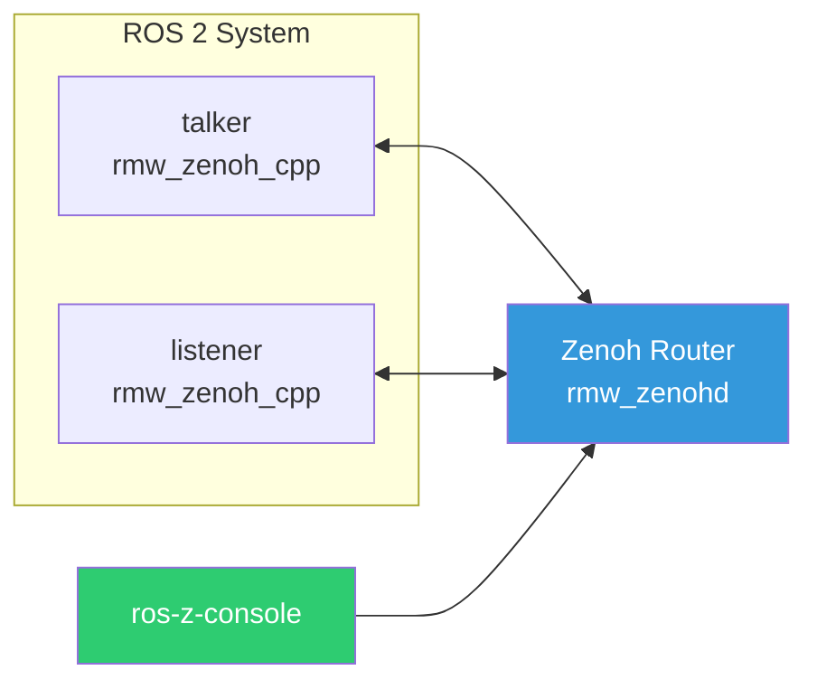

# ros-z-console

**ros-z-console** is a monitoring tool for ROS 2 systems built on Zenoh. It provides real-time graph inspection, dataflow monitoring, and metrics collection through two interfaces: an interactive TUI (Terminal User Interface) and a headless JSON streaming mode.

```admonish tip
ros-z-console uses zero-interference monitoring via pure Zenoh subscribers - it never pollutes the ROS graph with its own presence.
```

## Network Topology

ros-z-console connects to the ROS 2 graph via a Zenoh router. All ROS 2 nodes using `rmw_zenoh_cpp` communicate through the same router, enabling ros-z-console to observe the entire system.



## Quick Start: Monitoring demo_nodes_cpp

This example shows ros-z-console monitoring the classic talker/listener demo from `demo_nodes_cpp`.

**Terminal 1 - Start the Zenoh router:**

```bash
ros2 run rmw_zenoh_cpp rmw_zenohd
```

**Terminal 2 - Start the talker:**

```bash
export RMW_IMPLEMENTATION=rmw_zenoh_cpp
ros2 run demo_nodes_cpp talker
```

**Terminal 3 - Start the listener:**

```bash
export RMW_IMPLEMENTATION=rmw_zenoh_cpp
ros2 run demo_nodes_cpp listener
```

**Terminal 4 - Monitor with ros-z-console:**

```bash
ros-z-console tcp/127.0.0.1:7447 0
```

```admonish success
You should see the `/chatter` topic, the `talker` and `listener` nodes, and their services appear in ros-z-console. Use the TUI to browse topics, check message rates, and inspect QoS settings.
```

## Building and Running

```bash
# Build the console
cargo build -p ros-z-console --release

# Run with default settings (TUI mode)
ros-z-console tcp/127.0.0.1:7447 0

# Headless JSON streaming
ros-z-console --headless --json tcp/127.0.0.1:7447 0

# Export graph snapshot and exit
ros-z-console --export graph.json tcp/127.0.0.1:7447 0
```

## Command Line Interface

```bash
ros-z-console [OPTIONS] [ROUTER] [DOMAIN]
```

### Arguments

| Argument | Default              | Description          |
| -------- | -------------------- | -------------------- |
| `ROUTER` | `tcp/127.0.0.1:7447` | Zenoh router address |
| `DOMAIN` | `0`                  | ROS domain ID        |

### Options

| Flag | Description |
| --- | --- |
| `--tui` | Enable TUI interface (default if no other mode specified) |
| `--headless` | Headless mode: stream events to stdout |
| `--json` | Output structured JSON logs |
| `--debug` | Enable debug logging |
| `--export <PATH>` | Export current state and exit (supports .json, .dot, .csv) |

## Modes

### TUI Mode (Default)

The interactive terminal interface provides:

- **Panel Navigation** - Browse Topics, Services, Nodes, and Measurements
- **Filter Mode** - Press `/` to activate type-ahead search with highlighting
- **Rate Monitoring** - Quick rate check with `r` key (cached for 30s)
- **Measurement Panel** - Press `m` for detailed measurements with:
  - Real-time metrics (msg/s, KB/s, average payload)
  - 60-second time-series chart
  - SQLite storage (`ros-z-metrics.db`)
- **Detail Drilling** - Press `Enter` to expand sections with QoS profiles
- **Export** - Press `e` to export metrics to CSV
- **Help Overlay** - Press `?` to toggle help

```admonish note
TUI mode requires a terminal that supports ANSI escape codes. Most modern terminals work out of the box.
```

### Headless Mode

Headless mode streams events to stdout, making it ideal for:

- CI/CD pipelines
- Log aggregation systems
- AI-powered analysis
- Scripted monitoring

**Human-readable output:**

```bash
ros-z-console --headless tcp/127.0.0.1:7447 0
```

```console
Discovered Topics:
  /chatter (std_msgs/msg/String)
  /cmd_vel (geometry_msgs/msg/Twist)
Discovered Nodes:
  /talker
  /listener
[2026-01-21 10:30:00] Topic discovered: /rosout (rcl_interfaces/msg/Log)
```

**JSON streaming output:**

```bash
ros-z-console --headless --json tcp/127.0.0.1:7447 0
```

```json
{"timestamp":"...","event":"initial_state","domain_id":0,"topics":[...],"nodes":[...],"services":[...]}
{"TopicDiscovered":{"topic":"/chatter","type_name":"std_msgs/msg/String","timestamp":"..."}}
{"NodeDiscovered":{"namespace":"/","name":"talker","timestamp":"..."}}
```

## Export Formats

Export the current graph state with the `--export` flag:

### JSON Export

```bash
ros-z-console --export graph.json tcp/127.0.0.1:7447 0
```

Produces a structured JSON file with topics, nodes, services, and their relationships:

```json
{
  "timestamp": "2026-01-21T10:30:00Z",
  "domain_id": 0,
  "topics": [
    {
      "name": "/chatter",
      "type": "std_msgs/msg/String",
      "publishers": 1,
      "subscribers": 1
    }
  ],
  "nodes": [{ "name": "talker", "namespace": "/" }],
  "services": []
}
```

### GraphViz DOT Export

```bash
ros-z-console --export graph.dot tcp/127.0.0.1:7447 0
dot -Tpng graph.dot -o graph.png
```

Generates a visual graph representation with:

- Nodes as blue boxes
- Topics as green ellipses
- Publisher edges in blue
- Subscriber edges in green

### CSV Export

```bash
ros-z-console --export metrics.csv tcp/127.0.0.1:7447 0
```

Exports collected metrics history:

```csv
timestamp,topic,rate_hz,bandwidth_kbps,avg_payload_bytes
2026-01-21T10:30:00Z,/chatter,10.5,2.3,220
```

## Event Types

ros-z-console tracks these system events:

| Event               | Description                     |
| ------------------- | ------------------------------- |
| `TopicDiscovered`   | New topic detected in the graph |
| `TopicRemoved`      | Topic no longer present         |
| `NodeDiscovered`    | New node joined the graph       |
| `NodeRemoved`       | Node left the graph             |
| `ServiceDiscovered` | New service available           |
| `RateMeasured`      | Rate measurement completed      |
| `MetricsSnapshot`   | Periodic summary of graph state |

## Configuration

Create a `ros-z-console.json` or `.ros-z-console.json` file:

```json
{
  "cache_ttl_seconds": 30,
  "rate_cache_ttl_seconds": 30,
  "graph_cache_update_ms": 100
}
```

| Option                   | Default | Description                            |
| ------------------------ | ------- | -------------------------------------- |
| `cache_ttl_seconds`      | 30      | General cache time-to-live             |
| `rate_cache_ttl_seconds` | 30      | How long rate measurements are cached  |
| `graph_cache_update_ms`  | 100     | Graph refresh interval in milliseconds |

## Integration Examples

### Pipe to jq for filtering

```bash
ros-z-console --headless --json | jq 'select(.TopicDiscovered != null)'
```

### Monitor specific topics

```bash
ros-z-console --headless --json | grep -E '"topic":"/cmd_vel"'
```

### Continuous logging

```bash
ros-z-console --headless --json >> ros-events.jsonl &
```

### Database analysis

```bash
# After running TUI mode with measurements
sqlite3 ros-z-metrics.db "SELECT topic, AVG(msgs_sec) FROM metrics GROUP BY topic"
```

```admonish tip title="Interoperability"
Both ros-z and rmw_zenoh_cpp use the same Zenoh-based discovery protocol. ros-z-console subscribes to the graph liveliness tokens that rmw_zenoh_cpp nodes publish, enabling seamless interoperability without any configuration changes.
```
