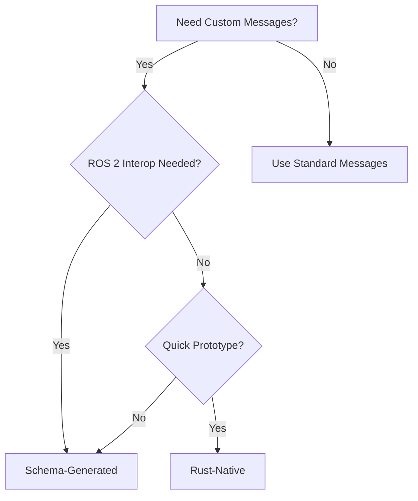
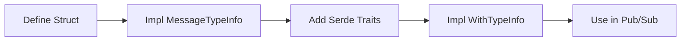
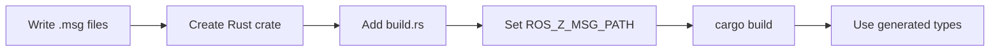

# Custom Messages

ros-z supports two approaches for defining custom message types:

| Approach | Definition | Best For |
|----------|------------|----------|
| **Rust-Native** | Write Rust structs directly | Prototyping, ros-z-only systems |
| **Schema-Generated** | Write `.msg`/`.srv` files, generate Rust | Production, ROS 2 interop |



---

## Rust-Native Messages

**Define messages directly in Rust by implementing required traits.** This approach is fast for prototyping but only works between ros-z nodes.

```admonish warning
Rust-Native messages use `TypeHash::zero()` and won't interoperate with ROS 2 C++/Python nodes.
```

### Workflow of Rust-Native Messages



### Required Traits

| Trait | Purpose | Key Method |
|-------|---------|------------|
| **MessageTypeInfo** | Type identification | `type_name()`, `type_hash()` |
| **WithTypeInfo** | ros-z integration | `type_info()` |
| **Serialize/Deserialize** | Data encoding | From `serde` |

### Message Example

```rust,ignore
use ros_z::{MessageTypeInfo, entity::TypeHash};
use ros_z::ros_msg::WithTypeInfo;
use serde::{Serialize, Deserialize};

#[derive(Debug, Clone, Serialize, Deserialize)]
struct RobotStatus {
    battery_level: f32,
    position_x: f32,
    position_y: f32,
    is_moving: bool,
}

impl MessageTypeInfo for RobotStatus {
    fn type_name() -> &'static str {
        "my_msgs::msg::dds_::RobotStatus_"
    }

    fn type_hash() -> TypeHash {
        TypeHash::zero()  // ros-z-to-ros-z only
    }
}

impl WithTypeInfo for RobotStatus {}
```

### Service Example

```rust,ignore
use ros_z::{ServiceTypeInfo, TypeInfo, TypeHash, msg::ZService};

#[derive(Debug, Clone, Serialize, Deserialize)]
struct NavigateToRequest {
    target_x: f32,
    target_y: f32,
}

#[derive(Debug, Clone, Serialize, Deserialize)]
struct NavigateToResponse {
    success: bool,
}

struct NavigateTo;

impl ServiceTypeInfo for NavigateTo {
    fn service_type_info() -> TypeInfo {
        TypeInfo::new("my_msgs::srv::dds_::NavigateTo_", TypeHash::zero())
    }
}

impl ZService for NavigateTo {
    type Request = NavigateToRequest;
    type Response = NavigateToResponse;
}
```

See the `z_custom_message` example:

```bash
# Terminal 1: Router
cargo run --example zenoh_router

# Terminal 2: Subscriber
cargo run --example z_custom_message -- --mode status-sub

# Terminal 3: Publisher
cargo run --example z_custom_message -- --mode status-pub
```

---

## Schema-Generated Messages

**Define messages in `.msg`/`.srv` files and generate Rust code using `ros-z-codegen`.** This approach provides proper type hashes and can reference standard ROS 2 types.

```admonish tip
Schema-Generated messages get proper RIHS01 type hashes and can reference types from `ros_z_msgs` like `geometry_msgs/Point`.
```

### Workflow of Schema-Generated Messages



### Step 1: Create Message Package

Create a ROS 2 style directory structure:

```text
my_robot_msgs/
├── msg/
│   ├── RobotStatus.msg
│   └── SensorReading.msg
└── srv/
    └── NavigateTo.srv
```

### Step 2: Define Messages

Messages can reference standard ROS 2 types:

```text
# RobotStatus.msg
string robot_id
geometry_msgs/Point position
bool is_moving
```

```text
# SensorReading.msg
builtin_interfaces/Time timestamp
float64[] values
string sensor_id
```

```text
# NavigateTo.srv
geometry_msgs/Point target
float64 max_speed
---
bool success
string message
```

### Step 3: Create Rust Crate

**Cargo.toml:**

```toml
[package]
name = "my-robot-msgs"
version = "0.1.0"
edition = "2021"

# Standalone package (not part of parent workspace)
[workspace]

[dependencies]
ros-z-msgs = { git = "https://github.com/ZettaScaleLabs/ros-z.git" }
ros-z = { git = "https://github.com/ZettaScaleLabs/ros-z.git", default-features = false }
serde = { version = "1", features = ["derive"] }
smart-default = "0.7"
zenoh-buffers = "1"

[build-dependencies]
ros-z-codegen = { git = "https://github.com/ZettaScaleLabs/ros-z.git" }
anyhow = "1"
```

**build.rs:**

```rust,ignore
use std::path::PathBuf;
use std::env;

fn main() -> anyhow::Result<()> {
    let out_dir = PathBuf::from(env::var("OUT_DIR")?);
    ros_z_codegen::generate_user_messages(&out_dir, false)?;
    println!("cargo:rerun-if-env-changed=ROS_Z_MSG_PATH");
    Ok(())
}
```

**src/lib.rs:**

```rust,ignore
// Re-export standard types from ros-z-msgs
pub use ros_z_msgs::*;

// Include generated user messages
include!(concat!(env!("OUT_DIR"), "/generated.rs"));
```

### Step 4: Build

Set `ROS_Z_MSG_PATH` and build:

```bash
ROS_Z_MSG_PATH="./my_robot_msgs" cargo build
```

For multiple packages, use colon-separated paths:

```bash
ROS_Z_MSG_PATH="./my_msgs:./other_msgs" cargo build
```

### Step 5: Use Generated Types

```rust,ignore
use my_robot_msgs::ros::my_robot_msgs::{RobotStatus, SensorReading};
use my_robot_msgs::ros::my_robot_msgs::srv::NavigateTo;
use ros_z_msgs::ros::geometry_msgs::Point;
use ros_z_msgs::ros::builtin_interfaces::Time;

let status = RobotStatus {
    robot_id: "robot_1".to_string(),
    position: Point { x: 1.0, y: 2.0, z: 0.0 },
    is_moving: true,
};

let reading = SensorReading {
    timestamp: Time { sec: 1234, nanosec: 0 },
    values: vec![1.0, 2.0, 3.0],
    sensor_id: "lidar_1".to_string(),
};
```

See `crates/ros-z/examples/custom_msgs_demo/` for a working example:

```bash
cd crates/ros-z/examples/custom_msgs_demo
ROS_Z_MSG_PATH="./my_robot_msgs" cargo build
```

---

## Comparison

| Feature | Rust-Native | Schema-Generated |
|---------|-------------|------------------|
| **Definition** | Rust structs | `.msg`/`.srv` files |
| **Type Hashes** | `TypeHash::zero()` | Proper RIHS01 hashes |
| **Standard Type Refs** | Manual | Automatic (`geometry_msgs`, etc.) |
| **ROS 2 Interop** | No | Partial (messages yes, services limited) |
| **Setup Complexity** | Low | Medium (build.rs required) |
| **Best For** | Prototyping | Production |

---

## Type Naming Convention

Both approaches should follow ROS 2 DDS naming:

```text
# Messages
package::msg::dds_::MessageName_

# Services
package::srv::dds_::ServiceName_
```

The trailing underscore and `dds_` infix match ROS 2's internal naming scheme.

---

## Resources

- **[Message Generation](./message_generation.md)** - How ros-z-msgs generates standard types
- **[Protobuf Serialization](./protobuf.md)** - Alternative serialization format
- **[Publishers & Subscribers](./pubsub.md)** - Using messages in pub-sub
- **[Services](./services.md)** - Using messages in services
