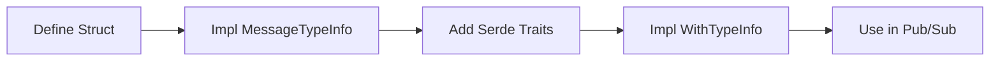
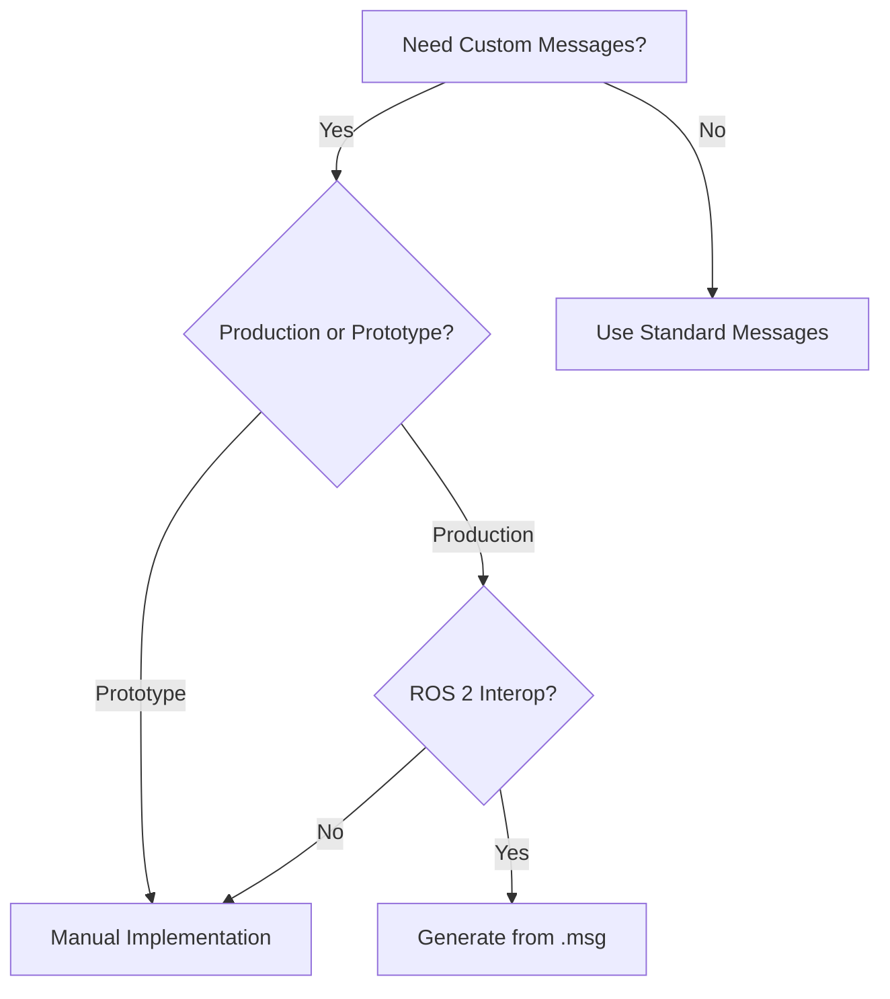

# Custom Messages

**Define domain-specific message types by implementing required traits on Rust structs.** Custom messages give you full control over data structures while maintaining ROS 2 compatibility for ros-z-to-ros-z communication.

```admonish tip
Use custom messages for rapid prototyping and standalone applications. For production systems requiring ROS 2 interoperability, use auto-generated messages from `.msg` definitions.
```

## Implementation Workflow



## Complete Example

The `z_custom_message` example demonstrates both custom messages and services:

```rust,ignore
{{#include ../../../ros-z/examples/z_custom_message.rs}}
```

## Required Traits

| Trait | Purpose | Key Method |
|-------|---------|------------|
| **MessageTypeInfo** | Type identification | `type_name()`, `type_hash()` |
| **WithTypeInfo** | ros-z integration | Automatic with `#[derive]` |
| **Serialize/Deserialize** | Data encoding | From `serde` |

## Message Implementation

**Step 1 - Define the Struct:**

```rust,ignore
#[derive(Debug, Clone, Serialize, Deserialize)]
struct RobotStatus {
    battery_level: f32,
    position_x: f32,
    position_y: f32,
    is_moving: bool,
}
```

**Step 2 - Implement MessageTypeInfo:**

```rust,ignore
impl MessageTypeInfo for RobotStatus {
    fn type_name() -> &'static str {
        "custom_msgs::msg::dds_::RobotStatus_"
    }

    fn type_hash() -> TypeHash {
        TypeHash::zero()  // For ros-z-to-ros-z only
    }
}
```

**Step 3 - Add WithTypeInfo:**

```rust,ignore
impl WithTypeInfo for RobotStatus {
    fn type_info() -> TypeInfo {
        TypeInfo::new(Self::type_name(), Self::type_hash())
    }
}
```

```admonish note
`TypeHash::zero()` works for ros-z-to-ros-z communication. For full ROS 2 compatibility, generate proper type hashes from message definitions.
```

## Service Implementation

**Define Request and Response:**

```rust,ignore
#[derive(Debug, Clone, Serialize, Deserialize)]
struct NavigateToRequest {
    target_x: f32,
    target_y: f32,
    max_speed: f32,
}

#[derive(Debug, Clone, Serialize, Deserialize)]
struct NavigateToResponse {
    success: bool,
    distance_traveled: f32,
}
```

**Implement Service Traits:**

```rust,ignore
struct NavigateTo;

impl ServiceTypeInfo for NavigateTo {
    fn service_type_info() -> TypeInfo {
        TypeInfo::new(
            "custom_msgs::srv::dds_::NavigateTo_",
            TypeHash::zero()
        )
    }
}

impl ZService for NavigateTo {
    type Request = NavigateToRequest;
    type Response = NavigateToResponse;
}
```

## Running the Example

```admonish note
All examples require a Zenoh router to be running first. Start it with:
`cargo run --example zenoh_router`
```

**Publisher/Subscriber Mode:**

Terminal 1 - Start Zenoh Router:

```bash
cargo run --example zenoh_router
```

Terminal 2 - Start Subscriber:

```bash
cargo run --example z_custom_message -- --mode status-sub
```

Terminal 3 - Start Publisher:

```bash
cargo run --example z_custom_message -- --mode status-pub
```

**Service Client/Server Mode:**

Terminal 1 - Start Zenoh Router:

```bash
cargo run --example zenoh_router
```

Terminal 2 - Start Server:

```bash
cargo run --example z_custom_message -- --mode nav-server
```

Terminal 3 - Send Requests:

```bash
cargo run --example z_custom_message -- --mode nav-client \
  --target_x 10.0 --target_y 20.0 --max_speed 1.5
```

```admonish success
You should see the server processing navigation requests and returning results with calculated distances.
```

## Decision Guide



| Approach | Use When | Benefits | Limitations |
|----------|----------|----------|-------------|
| **Manual Custom** | Prototyping, standalone apps | Fast iteration, full control | No ROS 2 interop |
| **Generated** | Production, ROS 2 systems | Proper type hashing, interop | Build complexity |
| **Standard** | Common data types | Zero setup, universal | Limited to ROS 2 standard types |

```admonish warning
Manual custom messages work only between ros-z nodes. They won't interoperate with ROS 2 C++/Python nodes due to missing type hashes and metadata.
```

## Type Naming Convention

Follow ROS 2 DDS naming conventions for consistency:

```rust,ignore
// Pattern: package::msg::dds_::MessageName_
"custom_msgs::msg::dds_::RobotStatus_"

// Pattern: package::srv::dds_::ServiceName_
"custom_msgs::srv::dds_::NavigateTo_"
```

The trailing underscore and `dds_` infix match ROS 2's internal naming scheme used by DDS middleware.

## Resources

- **[Message Generation](./message_generation.md)** - Understanding message architecture
- **[Publishers & Subscribers](./pubsub.md)** - Using messages in pub-sub
- **[Services](./services.md)** - Using messages in services
- **[Feature Flags](./feature_flags.md)** - Pre-generated message packages

**Start experimenting with custom messages, then transition to generated messages when you need ROS 2 interoperability.**
