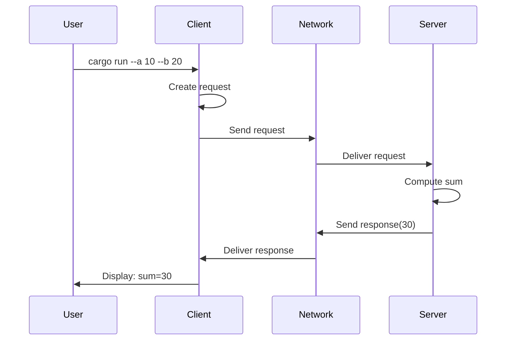
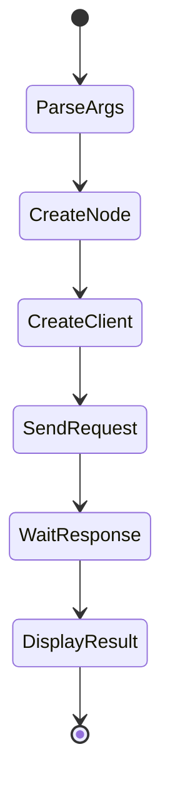

# Add Two Ints Client

**A service client that sends addition requests and displays results, demonstrating how to consume ROS 2 services.** This example shows client creation, request sending, and response handling with clear error reporting.

```admonish tip
Service clients send one-time requests and wait for responses. Pair this with the [server demo](./demo_add_two_ints_server.md) to see complete service interaction.
```

## Complete Example

```rust,ignore
{{#include ../../../ros-z/examples/demo_nodes/add_two_ints_client.rs}}
```

## Client Flow



## Key Implementation Details

| Component | Configuration | Purpose |
|-----------|---------------|---------|
| **Node Name** | `add_two_ints_client` | Client identity |
| **Service Name** | `/add_two_ints` | Target service endpoint |
| **Service Type** | `AddTwoInts` | Request/response contract |
| **Input** | Command-line args | `--a` and `--b` integers |
| **Output** | Console | Computed sum |

## Message Types

The client uses standard ROS 2 service types:

```rust,ignore
use ros_z_msgs::example_interfaces::{
    AddTwoInts,           // Service definition
    AddTwoIntsRequest,    // { a: i64, b: i64 }
    AddTwoIntsResponse,   // { sum: i64 }
};
```

```admonish note
Both client and server must use matching service types for successful communication. The type system ensures compile-time compatibility.
```

## Execution Pattern



## Running the Client

**Important:** Start the server first!

```bash
# Terminal 1 - Server must be running
cargo run --example demo_nodes_add_two_ints_server
```

**Basic usage:**

```bash
# Terminal 2 - Send request
cargo run --example demo_nodes_add_two_ints_client -- --a 10 --b 20
```

**Multiple requests:**

```bash
# Small numbers
cargo run --example demo_nodes_add_two_ints_client -- --a 5 --b 3
# Output: Received response: sum=8

# Large numbers
cargo run --example demo_nodes_add_two_ints_client -- --a 1000 --b 2000
# Output: Received response: sum=3000

# Negative numbers
cargo run --example demo_nodes_add_two_ints_client -- --a -10 --b 25
# Output: Received response: sum=15
```

```admonish success
Each client invocation sends one request and exits after receiving the response. This is the typical service client pattern.
```

## Advanced Options

```bash
# Connect to custom service
cargo run --example demo_nodes_add_two_ints_client -- \
  --a 10 --b 20 --service /custom_adder

# Connect to specific Zenoh router
cargo run --example demo_nodes_add_two_ints_client -- \
  --a 10 --b 20 --endpoint tcp/192.168.1.100:7447
```

## ROS 2 Interoperability

The client works with any ROS 2 AddTwoInts server:

```bash
# Start ros-z client, call ROS 2 C++ server
ros2 run demo_nodes_cpp add_two_ints_server &
cargo run --example demo_nodes_add_two_ints_client -- --a 10 --b 20

# Start ros-z server, call from ROS 2 CLI
cargo run --example demo_nodes_add_two_ints_server &
ros2 service call /add_two_ints example_interfaces/srv/AddTwoInts "{a: 10, b: 20}"
```

```admonish success
ros-z clients seamlessly interoperate with ROS 2 C++/Python servers via Zenoh bridge, demonstrating true cross-language compatibility.
```

## Code Highlights

**Client Creation:**

```rust,ignore
let client = node
    .create_client::<AddTwoInts>("/add_two_ints")
    .build()?;
```

**Request Preparation:**

```rust,ignore
let request = AddTwoIntsRequest {
    a: args.a,
    b: args.b,
};
println!("Sending request: a={}, b={}", request.a, request.b);
```

**Sending and Receiving:**

```rust,ignore
client.send_request(&request)?;
let response = client.take_response()?;
println!("Received response: sum={}", response.sum);
```

## Error Handling

The client handles several failure scenarios:

| Error | Cause | Solution |
|-------|-------|----------|
| **Server not found** | Server not running | Start server first |
| **Timeout** | Server too slow or crashed | Check server logs, increase timeout |
| **Network error** | Connection lost | Verify Zenoh router availability |
| **Invalid args** | Missing --a or --b | Provide both arguments |

**Robust error handling pattern:**

```rust,ignore
match client.take_response_timeout(Duration::from_secs(5)) {
    Ok(response) => {
        println!("Success: sum={}", response.sum);
    }
    Err(e) => {
        eprintln!("Service call failed: {}", e);
        eprintln!("Is the server running?");
        std::process::exit(1);
    }
}
```

```admonish warning
Always implement timeouts when calling services. Without timeouts, clients may hang indefinitely if the server is unavailable.
```

## Command-Line Options

| Flag | Type | Required | Description |
|------|------|----------|-------------|
| `--a` | Integer | Yes | First integer to add |
| `--b` | Integer | Yes | Second integer to add |
| `--service` | String | No | Service name (default: `/add_two_ints`) |
| `--endpoint` | String | No | Zenoh router address |
| `--help` | - | No | Show all options |

## Usage Patterns

**Quick Testing:**

```bash
# Single shot testing
cargo run --example demo_nodes_add_two_ints_client -- --a 1 --b 1
```

**Scripted Testing:**

```bash
# Test multiple values
for i in {1..5}; do
  cargo run --example demo_nodes_add_two_ints_client -- --a $i --b $((i * 2))
done
```

**Integration Testing:**

```rust,ignore
#[tokio::test]
async fn test_service_call() {
    // Start server in background
    let _server = spawn_server();

    // Call service
    let result = call_service(10, 20).await.unwrap();
    assert_eq!(result.sum, 30);
}
```

## Best Practices Demonstrated

**Request Validation:**

- Parse and validate arguments before creating request
- Provide clear error messages for invalid input
- Fail fast on configuration errors

**Resource Efficiency:**

- Client exits immediately after receiving response
- No unnecessary connection persistence
- Clean shutdown on completion

**User Feedback:**

- Clear logging of request being sent
- Immediate display of response
- Helpful error messages on failure

```admonish tip
For high-frequency service calls, create the client once and reuse it rather than creating a new client for each request.
```

## Reusable Client Pattern

For applications that call services repeatedly:

```rust,ignore
let client = node.create_client::<AddTwoInts>("/add_two_ints").build()?;

// Reuse client for multiple calls
for (a, b) in requests {
    let request = AddTwoIntsRequest { a, b };
    client.send_request(&request)?;
    let response = client.take_response()?;
    println!("Result: {}", response.sum);
}
```

## Resources

- **[Add Two Ints Server](./demo_add_two_ints_server.md)** - Companion server implementation
- **[Services Overview](./services.md)** - Complete service guide
- **[Service Server](./service_server.md)** - Generic server patterns
- **[Examples Overview](./examples_overview.md)** - All available examples

**Master service clients by experimenting with this example, then build clients for your application's custom services.**
