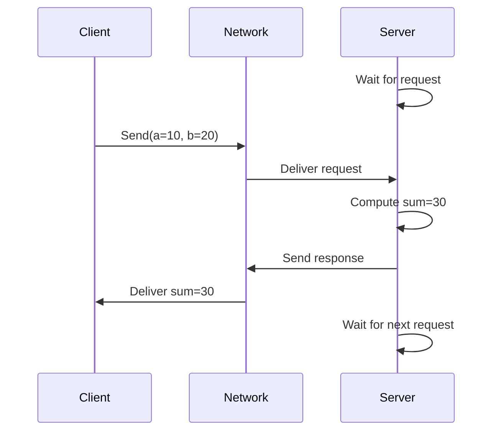
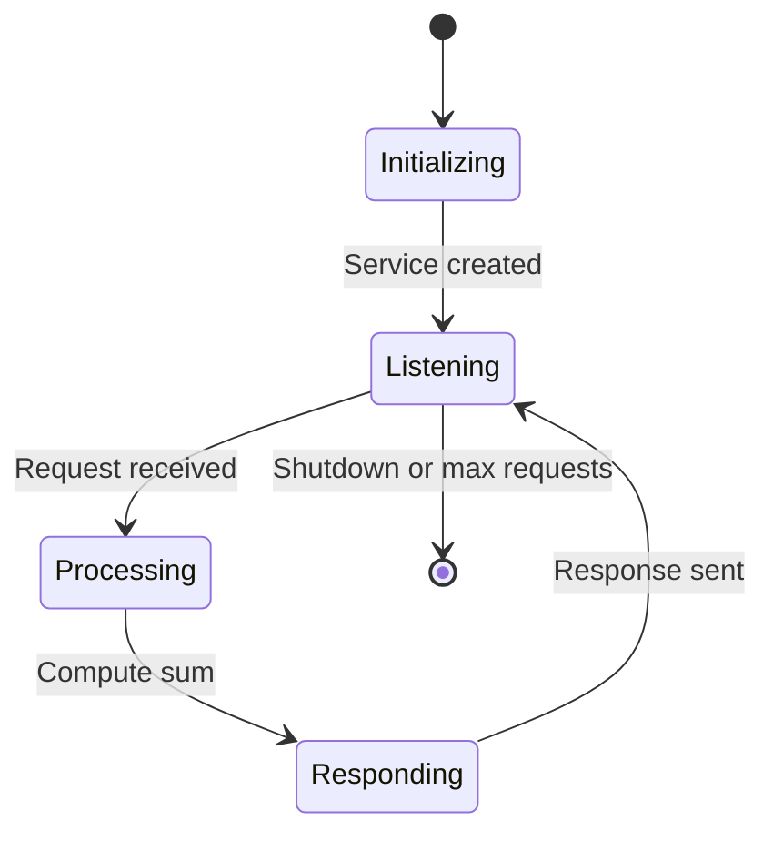

# Add Two Ints Server

**A service server that adds two integers and returns the sum, demonstrating synchronous request-response communication.** This example shows service creation, request handling, and response delivery with proper error handling.

```admonish tip
Service servers run continuously, waiting for requests. Pair this with the [client demo](./demo_add_two_ints_client.md) to see complete service communication.
```

## Complete Example

```rust,ignore
{{#include ../../../ros-z/examples/demo_nodes/add_two_ints_server.rs}}
```

## Service Flow



## Key Implementation Details

| Component | Configuration | Purpose |
|-----------|---------------|---------|
| **Node Name** | `add_two_ints_server` | Service provider identity |
| **Service Name** | `/add_two_ints` | Service endpoint |
| **Service Type** | `AddTwoInts` | Request/response schema |
| **Request Fields** | `a: i64, b: i64` | Input integers |
| **Response Field** | `sum: i64` | Computed result |

## Message Types

The server uses standard ROS 2 service types from `example_interfaces`:

```rust,ignore
use ros_z_msgs::example_interfaces::{
    AddTwoInts,           // Service definition
    AddTwoIntsRequest,    // { a: i64, b: i64 }
    AddTwoIntsResponse,   // { sum: i64 }
};
```

```admonish note
`example_interfaces` is a standard ROS 2 package providing common message and service types for tutorials and testing.
```

## Server Lifecycle



## Running the Server

**Basic usage:**

```bash
cargo run --example demo_nodes_add_two_ints_server
```

**With options:**

```bash
# Handle 5 requests then exit
cargo run --example demo_nodes_add_two_ints_server -- --count 5

# Use custom service name
cargo run --example demo_nodes_add_two_ints_server -- --service /my_adder

# Connect to specific Zenoh router
cargo run --example demo_nodes_add_two_ints_server -- --endpoint tcp/localhost:7447
```

```admonish info
The server runs indefinitely by default, processing requests as they arrive. Use `--count` for bounded operation or press Ctrl+C to stop.
```

## Testing with Client

**Complete service workflow:**

Terminal 1 - Start Server:

```bash
cargo run --example demo_nodes_add_two_ints_server
```

Terminal 2 - Send Multiple Requests:

```bash
# Request 1
cargo run --example demo_nodes_add_two_ints_client -- --a 10 --b 20

# Request 2
cargo run --example demo_nodes_add_two_ints_client -- --a 100 --b 200

# Request 3
cargo run --example demo_nodes_add_two_ints_client -- --a -5 --b 15
```

**Expected output in server terminal:**

```text
Incoming request
a: 10 b: 20
Sending response: 30

Incoming request
a: 100 b: 200
Sending response: 300

Incoming request
a: -5 b: 15
Sending response: 10
```

```admonish success
Each client request is processed immediately, demonstrating synchronous request-response communication.
```

## ROS 2 Interoperability

Test with standard ROS 2 tools:

```bash
# List available services
ros2 service list
# Output: /add_two_ints

# Call service from ROS 2 CLI
ros2 service call /add_two_ints example_interfaces/srv/AddTwoInts "{a: 42, b: 58}"
# Output: sum: 100

# Show service type
ros2 service type /add_two_ints
# Output: example_interfaces/srv/AddTwoInts
```

```admonish success
The ros-z service server is fully compatible with ROS 2 C++ and Python clients via Zenoh bridge.
```

## Code Highlights

**Service Creation:**

```rust,ignore
let service = node
    .create_service::<AddTwoInts>("/add_two_ints")
    .build()?;
```

**Request Handling:**

```rust,ignore
let (key, request) = service.take_request()?;
println!("Incoming request\na: {} b: {}", request.a, request.b);
```

**Response Generation:**

```rust,ignore
let sum = request.a + request.b;
let response = AddTwoIntsResponse { sum };
service.send_response(&response, &key)?;
```

## Request Limiting

The server supports bounded operation for testing:

```rust,ignore
let mut request_count = 0;
loop {
    let (key, request) = service.take_request()?;
    // Process request...

    request_count += 1;
    if let Some(max) = max_requests {
        if request_count >= max {
            break;
        }
    }
}
```

```admonish tip
Use `--count` during integration tests to ensure the server exits after processing expected requests.
```

## Command-Line Options

| Flag | Type | Default | Description |
|------|------|---------|-------------|
| `--service` | String | `/add_two_ints` | Service endpoint name |
| `--count` | Integer | None | Exit after N requests |
| `--endpoint` | String | Auto | Zenoh router address |
| `--help` | - | - | Show all options |

## Best Practices Demonstrated

**Synchronous Processing:**

- Server blocks on `take_request()` until a request arrives
- Each request is processed to completion before accepting the next
- Clean, predictable execution flow

**Error Handling:**

- Proper Result propagation for network errors
- Graceful shutdown on errors or completion
- Automatic resource cleanup

**Testability:**

- Bounded operation with `--count` flag
- Deterministic behavior for integration tests
- Clear logging for debugging

```admonish warning
Service servers should process requests quickly. For long-running operations, consider using [Actions](./actions.md) instead to provide feedback and cancellation.
```

## Performance Considerations

**Request Processing Time:**

- Keep computation lightweight for low latency
- Offload heavy work to background threads if needed
- Consider timeout implications for clients

**Concurrent Requests:**

- This example processes requests sequentially
- For parallel processing, spawn tasks per request
- Balance throughput with resource usage

## Resources

- **[Add Two Ints Client](./demo_add_two_ints_client.md)** - Companion client implementation
- **[Services Overview](./services.md)** - Complete service guide
- **[Service Client](./service_client.md)** - Generic client patterns
- **[Examples Overview](./examples_overview.md)** - All available examples

**Master service servers by running this example, then build domain-specific services for your robotics application.**
