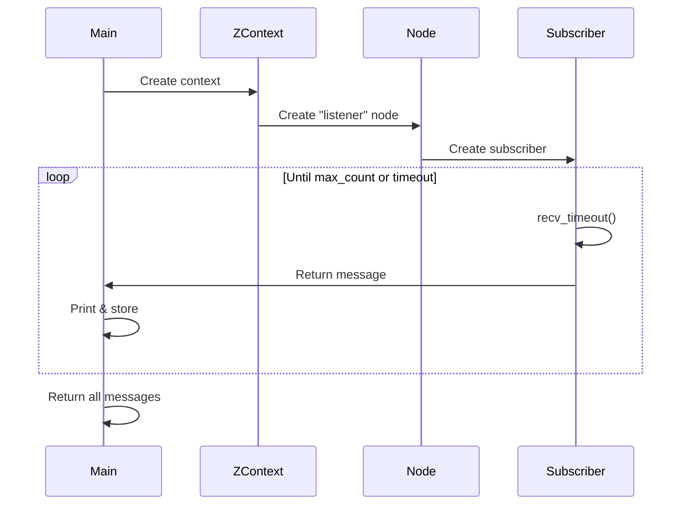

# Demo Listener

**A simple subscriber that receives and displays messages from a topic, demonstrating the fundamental ROS 2 subscriber pattern.** This example shows subscriber creation, message reception with timeouts, and testable code structure.

```admonish tip
The listener demo is the companion to the [talker demo](./demo_talker.md). Run both together to see complete bidirectional ROS 2 communication in action.
```

## Complete Example

```rust,ignore
{{#include ../../../ros-z/examples/demo_nodes/listener.rs}}
```

## Architecture

```mermaid
graph LR
    A[Publishers] -->|Messages| B[/chatter Topic]
    B -->|Zenoh| C[Subscriber]
    C --> D[Receive Loop]
    D --> E[Print Message]
    D --> F[Store in Vector]
```

## Key Implementation Details

| Component | Configuration | Purpose |
|-----------|---------------|---------|
| **Node Name** | `listener` | Identifies this subscriber |
| **Topic** | `/chatter` | Communication channel |
| **QoS History** | `KeepLast(10)` | Buffer last 10 messages |
| **Message Type** | `RosString` | Standard string message |
| **Timeout** | Configurable | Bounded wait for messages |

## Execution Flow



## Running the Demo

**Basic usage:**

```bash
cargo run --example demo_nodes_listener
```

**With custom options:**

```bash
# Listen to different topic
cargo run --example demo_nodes_listener -- --topic /my_topic

# Connect to specific Zenoh router
cargo run --example demo_nodes_listener -- --endpoint tcp/localhost:7447

# Stop after receiving 5 messages
cargo run --example demo_nodes_listener -- --max-count 5
```

```admonish info
The listener runs indefinitely by default, printing each received message. Press Ctrl+C to stop it manually.
```

## Testing Communication

**Complete pub-sub workflow:**

Terminal 1 - Start Listener First:

```bash
cargo run --example demo_nodes_listener
```

Terminal 2 - Start Talker:

```bash
cargo run --example demo_nodes_talker
```

Expected output in terminal 1:

```text
[listener] Received: "Hello World: 0"
[listener] Received: "Hello World: 1"
[listener] Received: "Hello World: 2"
[listener] Received: "Hello World: 3"
...
```

```admonish success
Messages appear in real-time as the talker publishes them. This demonstrates ros-z's efficient message delivery with minimal latency.
```

## Reception Modes

The listener supports both blocking and timeout-based reception:

**With Timeout:**

```rust,ignore
if let Some(timeout) = timeout {
    match subscriber.recv_timeout(timeout) {
        Ok(msg) => process_message(msg),
        Err(_) => break,  // Timeout occurred
    }
}
```

**Async Reception:**

```rust,ignore
match subscriber.async_recv().await {
    Ok(msg) => process_message(msg),
    Err(e) => eprintln!("Error: {}", e),
}
```

```admonish note
Timeout mode is useful for testing and bounded operations. Async mode works well for long-running subscribers that need to handle other tasks concurrently.
```

## ROS 2 Interoperability

Verify with standard ROS 2 tools:

```bash
# Publish to listener from ROS 2 CLI
ros2 topic pub /chatter std_msgs/msg/String "data: 'Hello from ROS 2'"

# Check subscriber status
ros2 topic info /chatter

# List all active topics
ros2 topic list
```

The listener will receive and display messages from any ROS 2 publisher using the same topic.

```admonish success
ros-z subscribers work seamlessly with ROS 2 C++ and Python publishers when connected via Zenoh bridge or rmw_zenoh.
```

## Code Highlights

**Subscriber Creation:**

```rust,ignore
let subscriber = node
    .create_sub::<RosString>(&topic_name)
    .with_qos(qos_profile)
    .build()?;
```

**Message Reception:**

```rust,ignore
let msg = subscriber.recv_timeout(Duration::from_secs(1))?;
println!("[listener] Received: {:?}", msg.data);
```

**Testable Design:**

```rust,ignore
fn run_listener(...) -> Result<Vec<RosString>> {
    // Function returns all received messages
    // Perfect for integration tests
}
```

## Command-Line Options

| Flag | Type | Default | Description |
|------|------|---------|-------------|
| `--topic` | String | `/chatter` | Topic name to subscribe to |
| `--max-count` | Integer | None | Stop after N messages |
| `--endpoint` | String | Auto | Zenoh router address |
| `--help` | - | - | Show all options |

## Best Practices Demonstrated

**Testability:**

- Returns received messages for verification
- Configurable timeout and max count
- Clean separation of concerns

**Flexible Reception:**

- Supports both bounded and unbounded operation
- Handles timeouts gracefully
- Error handling for network issues

**Resource Management:**

- Automatic cleanup on exit
- Efficient message buffering
- No memory leaks

```admonish warning
When using timeout-based reception, ensure the timeout is longer than the publisher's period to avoid missing messages.
```

## Testing Integration

The listener's design makes it ideal for integration tests:

```rust,ignore
#[tokio::test]
async fn test_pub_sub() {
    // Start listener with timeout
    let received = run_listener(
        topic,
        Some(Duration::from_secs(5)),
        Some(3)  // Expect 3 messages
    ).unwrap();

    assert_eq!(received.len(), 3);
}
```

## Resources

- **[Demo Talker](./demo_talker.md)** - Companion publisher example
- **[Publishers & Subscribers](./pubsub.md)** - Deep dive into pub-sub patterns
- **[Quick Start](./quick_start.md)** - Combined talker/listener tutorial
- **[Examples Overview](./examples_overview.md)** - All available examples

**Master the listener pattern, then explore [QoS profiles](./pubsub.md#quality-of-service-qos) to fine-tune message delivery for your use case.**
