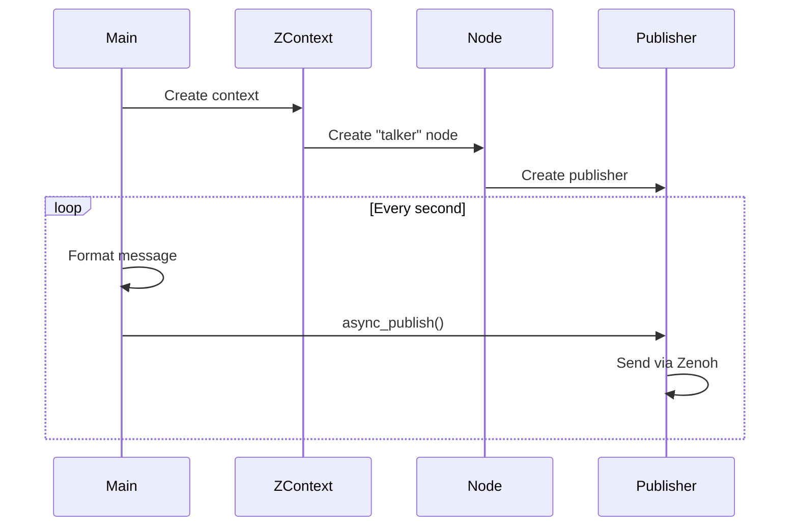

# Demo Talker

**A simple publisher that broadcasts "Hello World" messages, demonstrating the fundamental ROS 2 publisher pattern.** This example showcases node creation, QoS configuration, and periodic message publishing with clean async Rust code.

```admonish tip
The talker demo is the perfect starting point for understanding publishers. Pair it with the [listener demo](./demo_listener.md) to see complete end-to-end communication.
```

## Complete Example

```rust,ignore
{{#include ../../../ros-z/examples/demo_nodes/talker.rs}}
```

## Architecture

```mermaid
graph LR
    A[Main Loop] -->|Every 1s| B[Create Message]
    B --> C[Publisher]
    C -->|Zenoh| D[/chatter Topic]
    D -->|Deliver| E[Subscribers]
```

## Key Implementation Details

| Component | Configuration | Purpose |
|-----------|---------------|---------|
| **Node Name** | `talker` | Identifies this publisher |
| **Topic** | `/chatter` | Communication channel |
| **QoS History** | `KeepLast(7)` | Buffer last 7 messages |
| **Message Type** | `RosString` | Standard string message |
| **Publish Rate** | 1 Hz (1 second) | Configurable via `--period` |

## Execution Flow



## Running the Demo

**Basic usage:**

```bash
cargo run --example demo_nodes_talker
```

**With custom options:**

```bash
# Custom topic name
cargo run --example demo_nodes_talker -- --topic /my_topic

# Faster publishing rate (0.5 seconds)
cargo run --example demo_nodes_talker -- --period 0.5

# Connect to specific Zenoh router
cargo run --example demo_nodes_talker -- --endpoint tcp/localhost:7447

# Limit message count
cargo run --example demo_nodes_talker -- --max-count 10
```

```admonish info
The talker will publish indefinitely unless you specify `--max-count`. Press Ctrl+C to stop it manually.
```

## Testing Communication

**Complete pub-sub workflow:**

Terminal 1 - Start Listener:

```bash
cargo run --example demo_nodes_listener
```

Terminal 2 - Start Talker:

```bash
cargo run --example demo_nodes_talker
```

Expected output in listener terminal:

```text
[listener] Received: "Hello World: 0"
[listener] Received: "Hello World: 1"
[listener] Received: "Hello World: 2"
...
```

```admonish success
The listener receives messages in real-time as the talker publishes them. This demonstrates ros-z's efficient pub-sub implementation.
```

## ROS 2 Interoperability

Verify with standard ROS 2 tools:

```bash
# List active topics
ros2 topic list
# Output: /chatter

# Echo messages from talker
ros2 topic echo /chatter
# Output: data: Hello World: 0
#         ---
#         data: Hello World: 1
#         ---

# Check topic info
ros2 topic info /chatter
```

```admonish note
The talker works seamlessly with ROS 2 C++ and Python subscribers when connected via Zenoh bridge or rmw_zenoh.
```

## Code Highlights

**Publisher Creation:**

```rust,ignore
let publisher = node
    .create_pub::<RosString>(&topic_name)
    .with_qos(qos_profile)
    .build()?;
```

**Async Publishing:**

```rust,ignore
publisher.async_publish(RosString {
    data: format!("Hello World: {}", count).into()
}).await?;
```

**Rate Control:**

```rust,ignore
tokio::time::sleep(Duration::from_secs_f64(period)).await;
```

## Command-Line Options

| Flag | Type | Default | Description |
|------|------|---------|-------------|
| `--topic` | String | `/chatter` | Topic name to publish on |
| `--period` | Float | `1.0` | Seconds between publishes |
| `--max-count` | Integer | None | Stop after N messages |
| `--endpoint` | String | Auto | Zenoh router address |
| `--help` | - | - | Show all options |

## Best Practices Demonstrated

**QoS Configuration:**

- Uses `KeepLast(7)` for reasonable message buffering
- Configurable for different reliability requirements

**Async Pattern:**

- Leverages Tokio for efficient async I/O
- Non-blocking message publishing

**Clean Shutdown:**

- Graceful termination on Ctrl+C
- Resource cleanup handled automatically

```admonish warning
When using custom QoS profiles, ensure subscribers use compatible settings. Mismatched QoS can prevent message delivery.
```

## Resources

- **[Demo Listener](./demo_listener.md)** - Companion subscriber example
- **[Publishers & Subscribers](./pubsub.md)** - Deep dive into pub-sub patterns
- **[Quick Start](./quick_start.md)** - Combined talker/listener tutorial
- **[Examples Overview](./examples_overview.md)** - All available examples

**Master the talker pattern, then explore [custom QoS configurations](./pubsub.md#quality-of-service-qos) for production systems.**
