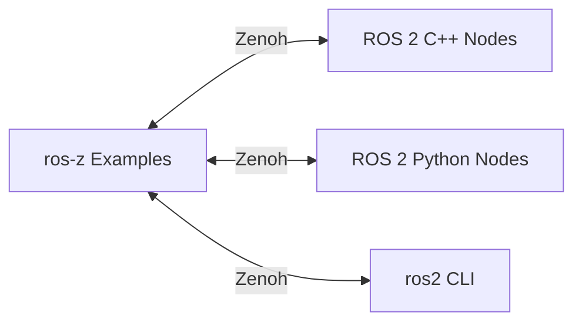

# Examples Overview

**ros-z provides production-ready examples demonstrating every ROS 2 communication pattern.** Each example is fully runnable via Cargo and showcases real-world robotics functionality with clear, idiomatic Rust code.

```admonish success
All examples work seamlessly with standard ROS 2 tools. Run them alongside C++ or Python nodes for hybrid system testing.
```

## Quick Start

Run any example using the standard Cargo pattern:

```bash
cargo run --example <example_name> -- [OPTIONS]
```

**Common patterns:**

```bash
# Basic execution
cargo run --example demo_nodes_talker

# With custom options
cargo run --example demo_nodes_talker -- --topic /my_topic --period 0.5

# Service with arguments
cargo run --example demo_nodes_add_two_ints_client -- --a 10 --b 20

# Show all options
cargo run --example demo_nodes_talker -- --help
```

## Demo Nodes

Classic ROS 2 demonstrations with dedicated node implementations:

| Example | Type | Description |
|---------|------|-------------|
| **[Talker](./demo_talker.md)** | Publisher | String messages with configurable QoS |
| **[Listener](./demo_listener.md)** | Subscriber | String reception with timeouts |
| **[AddTwoInts Server](./demo_add_two_ints_server.md)** | Service | Integer addition service |
| **[AddTwoInts Client](./demo_add_two_ints_client.md)** | Service | Service request client |

**Full workflow example:**

```bash
# Terminal 1 - Start listener
cargo run --example demo_nodes_listener

# Terminal 2 - Start talker
cargo run --example demo_nodes_talker

# Terminal 3 - Verify with ROS 2 CLI
ros2 topic echo /chatter
```

```admonish tip
Demo nodes are ideal for understanding the fundamentals. Start here if you're new to ros-z or ROS 2.
```

## Integrated Examples

Self-contained examples combining multiple components:

| Example | Demonstrates | Key Features |
|---------|--------------|--------------|
| **z_pubsub.rs** | Pub/Sub in one app | Talker + Listener combined |
| **z_srvcli.rs** | Services in one app | Server + Client combined |
| **z_custom_message.rs** | Custom types | Manual message implementation |

These examples show complete workflows without needing multiple terminals, perfect for testing and prototyping.

## Advanced Examples

Production-ready patterns using real ROS 2 message types:

| Example | Message Type | Use Case |
|---------|-------------|----------|
| **[Twist Publisher](./twist_pub.md)** | `geometry_msgs/Twist` | Robot velocity commands |
| **[Battery State](./battery_state_sub.md)** | `sensor_msgs/BatteryState` | Power monitoring |
| **[Laser Scan](./laser_scan.md)** | `sensor_msgs/LaserScan` | Lidar data handling |
| **[Zenoh PingPong](./z_pingpong.md)** | Performance | Latency measurement |

```admonish info
Advanced examples demonstrate how to work with complex, real-world message types containing arrays, nested structures, and sensor data.
```

## Common Command-Line Options

Most examples support these flags:

| Option | Purpose | Example |
|--------|---------|---------|
| `--endpoint` | Zenoh router address | `tcp/localhost:7447` |
| `--topic` | Custom topic name | `/my_custom_topic` |
| `--mode` | Operation mode | `server`, `client`, `talker` |
| `--help` | Show all options | N/A |

**Examples:**

```bash
# Connect to specific router
cargo run --example demo_nodes_talker -- --endpoint tcp/192.168.1.100:7447

# Use custom topic
cargo run --example demo_nodes_listener -- --topic /robot/status

# Show available options
cargo run --example z_pubsub -- --help
```

## ROS 2 Interoperability



Verify interoperability with standard ROS 2 tools:

```bash
# List topics from ros-z nodes
ros2 topic list

# Echo ros-z talker messages
ros2 topic echo /chatter

# Call ros-z service
ros2 service call /add_two_ints example_interfaces/srv/AddTwoInts "{a: 5, b: 3}"

# Publish to ros-z listener
ros2 topic pub /chatter std_msgs/msg/String "data: 'Hello from ROS 2'"
```

```admonish success
All ros-z examples communicate seamlessly with traditional ROS 2 nodes when connected to the same Zenoh network.
```

## Testing and Building

**Build all examples:**

```bash
cargo build --examples
```

**Run tests including examples:**

```bash
cargo test --all
```

**Check example compilation:**

```bash
cargo check --examples
```

## Learning Path


**Recommended progression:**

1. Start with [Demo Talker](./demo_talker.md) and [Listener](./demo_listener.md)
2. Explore [z_pubsub](../../../ros-z/examples/z_pubsub.rs) for integrated pub-sub
3. Try [Service Examples](./service_server.md) for request-response
4. Create [Custom Messages](./custom_messages.md) for domain-specific data
5. Experiment with [Advanced Examples](./twist_pub.md) for real sensors
6. Measure performance with [z_pingpong](./z_pingpong.md)

## Resources

- **[Quick Start](./quick_start.md)** - Get your first example running
- **[Publishers & Subscribers](./pubsub.md)** - Understand pub-sub patterns
- **[Services](./services.md)** - Learn request-response
- **[Custom Messages](./custom_messages.md)** - Define your own types

**Pick an example that matches your use case and start experimenting. All examples include detailed comments and demonstrate best practices.**
