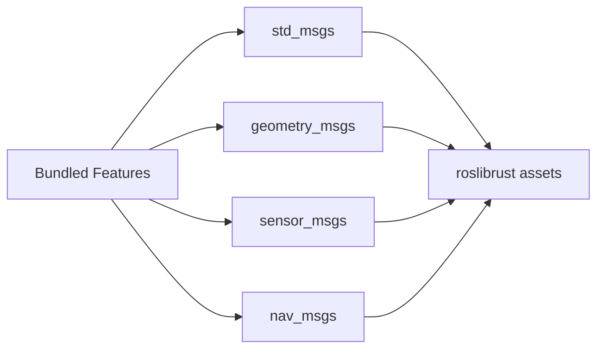
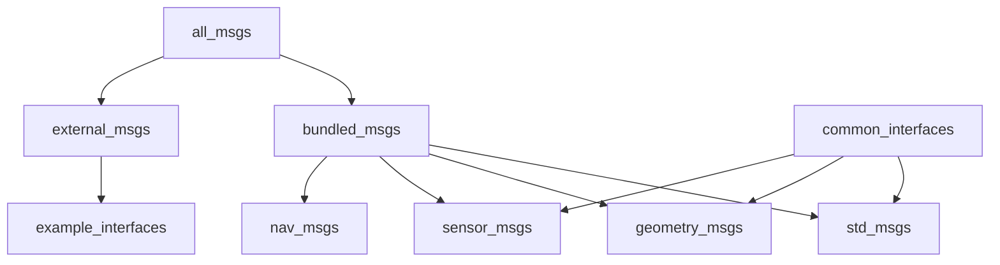
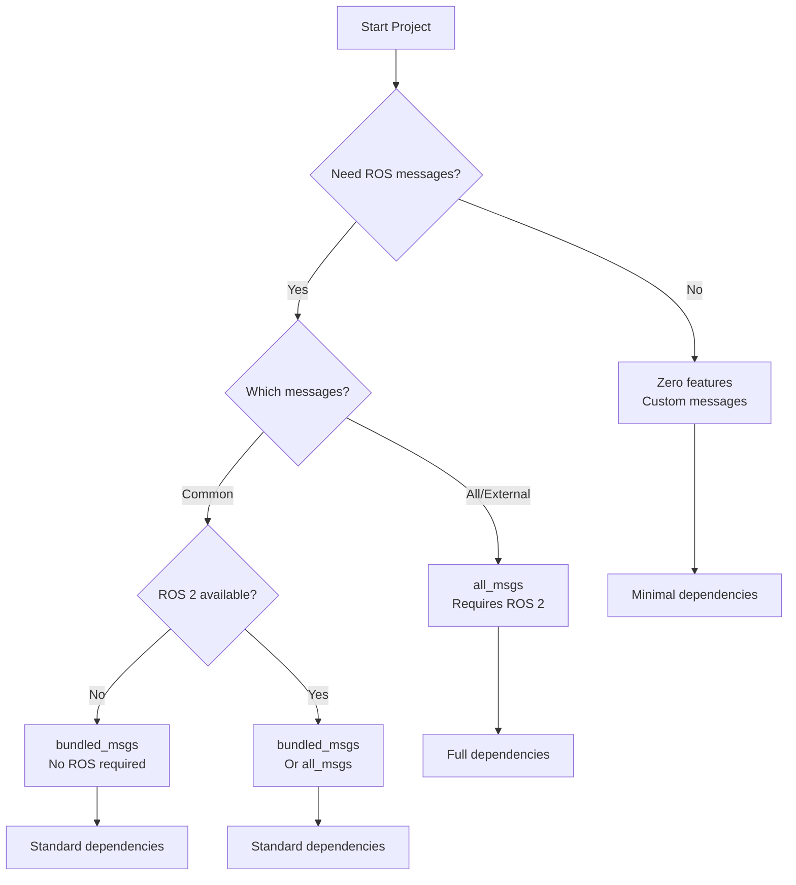

# Feature Flags

**Fine-grained control over dependencies and functionality through Cargo feature flags.** Build exactly what you need, from zero-dependency core to full ROS 2 integration, without carrying unused code.

```admonish success
Feature flags enable pay-per-use dependencies. Start minimal and enable features incrementally as requirements grow.
```

## Feature Categories

| Category | Purpose | Example Features |
|----------|---------|------------------|
| **Message Packages** | Enable ROS 2 message types | `std_msgs`, `geometry_msgs` |
| **Serialization** | Additional encoding formats | `protobuf` |
| **Integration** | External system bindings | `rcl-z`, `external_msgs` |

## ros-z Core Features

### `protobuf`

Enables Protocol Buffers serialization using `prost`.

```bash
cargo build -p ros-z --features protobuf
```

**Use cases:**

- Schema evolution support
- Language-agnostic data exchange
- Efficient binary encoding
- Familiar protobuf ecosystem

**Dependencies:** `prost`, `prost-types`

```admonish info
Protobuf is optional. CDR serialization (default) provides full ROS 2 compatibility without additional dependencies.
```

### `rcl-z`

Enables RCL (ROS Client Library) integration for C/C++ interoperability.

```bash
cargo build -p ros-z --features rcl-z
```

**Use cases:**

- Integrating with existing RCL-based code
- Leveraging C/C++ ROS 2 libraries
- Hybrid Rust/C++ applications

**Requirements:** ROS 2 installation with RCL libraries

```admonish warning
This feature requires ROS 2 to be sourced before building. See [Building Guide](./building.md) for setup instructions.
```

### `external_msgs`

Propagates to `ros-z-msgs/external_msgs` for examples using external message packages.

```bash
cargo build -p ros-z --features external_msgs
cargo run --example z_srvcli --features external_msgs
```

**Enables:** Examples requiring `example_interfaces` and other external packages

## ros-z-msgs Features

### Default Features

The default build includes commonly used message types:

```bash
cargo build -p ros-z-msgs
```

**Includes:**

- `common_interfaces` meta-feature
  - `std_msgs` - Basic types (String, Int32, etc.)
  - `geometry_msgs` - Spatial types (Point, Pose, Transform)
  - `sensor_msgs` - Sensor data (LaserScan, Image, Imu)

```admonish tip
Default features require no ROS 2 installation. Message definitions come bundled via roslibrust.
```

### Bundled Message Features

Work without ROS 2 installation:



**Individual packages:**

| Feature | Package | Use Case |
|---------|---------|----------|
| `std_msgs` | Standard messages | Strings, numbers, arrays |
| `geometry_msgs` | Geometric primitives | Points, poses, transforms |
| `sensor_msgs` | Sensor data | Cameras, lidars, IMUs |
| `nav_msgs` | Navigation | Paths, maps, odometry |

**Usage:**

```bash
# Single package
cargo build -p ros-z-msgs --features std_msgs

# Multiple packages
cargo build -p ros-z-msgs --features "std_msgs,geometry_msgs"

# All bundled
cargo build -p ros-z-msgs --features bundled_msgs
```

### External Message Features

Require ROS 2 installation:


**Available packages:**

| Feature | Package | Use Case |
|---------|---------|----------|
| `example_interfaces` | Tutorial services | AddTwoInts, Fibonacci |
| `action_msgs` | Action types | GoalStatus, ActionFeedback |
| *(custom)* | Your packages | Domain-specific types |

**Usage:**

```bash
# Ensure ROS 2 is sourced
source /opt/ros/jazzy/setup.bash

# Build with external messages
cargo build -p ros-z-msgs --features external_msgs

# Or specific package
cargo build -p ros-z-msgs --features example_interfaces
```

```admonish warning
External message features fail without ROS 2. Source your ROS 2 installation before building.
```

### Meta Features

Convenience features that enable multiple packages:

**`common_interfaces` (default):**

```bash
cargo build -p ros-z-msgs --features common_interfaces
```

Enables: `std_msgs`, `geometry_msgs`, `sensor_msgs`

**`bundled_msgs`:**

```bash
cargo build -p ros-z-msgs --features bundled_msgs
```

Enables: `std_msgs`, `geometry_msgs`, `sensor_msgs`, `nav_msgs`

**`all_msgs`:**

```bash
cargo build -p ros-z-msgs --features all_msgs
```

Enables: All bundled + all external messages

### Protobuf Types

Generate protobuf types alongside ROS messages:

```bash
cargo build -p ros-z-msgs --features protobuf
```

**Note:** Requires `ros-z/protobuf` feature enabled as well.

## ros-z-codegen Features

### Protobuf Code Generation

Enable protobuf code generation support:

```bash
cargo build -p ros-z-codegen --features protobuf
```

**Use case:** Building tools that generate protobuf code from ROS messages

## Feature Dependency Graph



## Common Feature Combinations

### Minimal Development

Core library only, no messages:

```bash
cargo build -p ros-z
```

**Dependencies:** Rust, Cargo
**Use case:** Custom messages only

### Standard Development

Core with common message types:

```bash
cargo build -p ros-z-msgs  # Uses default common_interfaces
cargo build -p ros-z
```

**Dependencies:** Rust, Cargo
**Use case:** Most applications

### Full ROS 2 Integration

Everything including external messages:

```bash
source /opt/ros/jazzy/setup.bash
cargo build -p ros-z-msgs --features all_msgs
cargo build -p ros-z --features external_msgs
cargo build -p rcl-z
```

**Dependencies:** Rust, Cargo, ROS 2
**Use case:** Complete ROS 2 ecosystem integration

### Protobuf Development

Core with protobuf serialization:

```bash
cargo build -p ros-z-codegen --features protobuf
cargo build -p ros-z-msgs --features protobuf
cargo build -p ros-z --features protobuf
```

**Dependencies:** Rust, Cargo, Protobuf compiler
**Use case:** Cross-language data exchange

## Feature Matrix

| Package | Feature | Requires ROS 2 | Adds Dependencies |
|---------|---------|----------------|-------------------|
| ros-z | (none) | No | None |
| ros-z | protobuf | No | prost, prost-types |
| ros-z | rcl-z | Yes | RCL libraries |
| ros-z | external_msgs | Yes (propagated) | None |
| ros-z-msgs | common_interfaces | No | None (bundled) |
| ros-z-msgs | bundled_msgs | No | None (bundled) |
| ros-z-msgs | external_msgs | Yes | None (uses system) |
| ros-z-msgs | protobuf | No | prost, prost-types |
| ros-z-codegen | protobuf | No | prost-build |

## Checking Active Features

View enabled features for a package:

```bash
# Show features for ros-z-msgs
cargo tree -p ros-z-msgs -e features

# Show all workspace features
cargo tree -e features

# Build with specific features and verify
cargo build -p ros-z-msgs --features std_msgs,geometry_msgs -v
```

```admonish tip
Use `cargo tree` to debug feature resolution issues. It shows exactly which features are active and why.
```

## Feature Selection Strategy



**Decision guide:**

1. **Prototyping?** → Use bundled_msgs (no ROS 2 required)
2. **Need external packages?** → Use all_msgs (requires ROS 2)
3. **Custom messages only?** → No message features
4. **Cross-language data?** → Add protobuf feature
5. **C++ integration?** → Add rcl-z feature

```admonish info
First build with message generation is slow. Incremental builds are fast. Choose the minimal feature set that meets your needs.
```

## Examples by Feature

### Bundled Messages Only

```bash
cargo run --example z_pubsub          # std_msgs
cargo run --example twist_pub         # geometry_msgs
cargo run --example battery_state_sub # sensor_msgs
cargo run --example z_pingpong        # std_msgs
```

### External Messages Required

```bash
cargo run --example z_srvcli --features external_msgs  # example_interfaces
```

### Custom Messages

```bash
cargo run --example z_custom_message  # No features needed
```

## Resources

- **[Building Guide](./building.md)** - Build procedures for each scenario
- **[Message Generation](./message_generation.md)** - How messages are generated

**Start with default features and add more as your project evolves. Feature flags provide flexibility without forcing early architectural decisions.**
