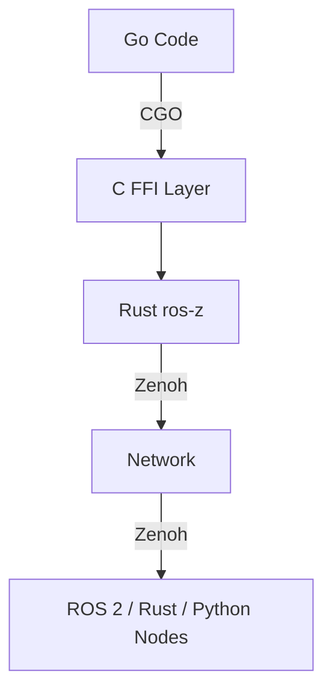

# Go Bindings

`ros-z-go` lets Go applications communicate with ROS 2 and Rust nodes over the same Zenoh transport. It uses CGO to call the Rust FFI layer and exposes an idiomatic builder-pattern API.

```admonish tip
New here? Start with **[Quick Start](./go_quick_start.md)** to get a publisher and subscriber running in five minutes.
```

---

## Architecture



Three layers:

| Layer | Location | Role |
|-------|----------|------|
| **Go** | `rosz/` package | Idiomatic API, builder pattern |
| **C FFI** | `ros_z_ffi.h` | Auto-generated by cbindgen |
| **Rust** | `ffi/` module | Bridges to ros-z core via Zenoh |

Callbacks flow in reverse: Rust invokes C function pointers → dispatched to Go via `//export` functions.

---

## Project Setup

Add to your `go.mod`:

```text
require github.com/ZettaScaleLabs/ros-z/crates/ros-z-go v0.0.0
replace github.com/ZettaScaleLabs/ros-z/crates/ros-z-go => /path/to/ros-z/crates/ros-z-go
```

The `#cgo LDFLAGS` in `rosz/context.go` resolves the library via `${SRCDIR}` — no extra `CGO_LDFLAGS` needed with a `replace` directive.

**Generate message types** (no ROS 2 install needed for bundled types):

```bash
just -f crates/ros-z-go/justfile codegen-bundled   # std_msgs, geometry_msgs
just -f crates/ros-z-go/justfile codegen            # full set from a ROS 2 installation
```

---

## Context

```go
ctx, err := rosz.NewContext().WithDomainID(0).Build()
defer ctx.Close()
```

For cloud, Docker, or multi-machine deployments:

```go
ctx, err := rosz.NewContext().
    WithMode(rosz.ModeClient).
    WithConnectEndpoints("tcp/192.168.1.100:7447").
    DisableMulticastScouting().
    Build()
```

| Option | Description |
|--------|-------------|
| `WithDomainID(n)` | ROS domain ID (0–232) |
| `WithMode(mode)` | `ModePeer` (default) · `ModeClient` · `ModeRouter` |
| `WithConnectEndpoints(ep...)` | Explicit router addresses |
| `DisableMulticastScouting()` | Required in Docker / cloud |
| `ConnectToLocalZenohd()` | Shorthand for `tcp/127.0.0.1:7447` |
| `WithConfigFile(path)` | Zenoh JSON5 config file |
| `WithJSON(str)` | Inline Zenoh config as dotted-key JSON |
| `WithRemapRules(rules...)` | Topic/service remapping (`from:=to`) |
| `WithLogging()` | Initialise Zenoh tracing |

---

## Node

```go
node, err := ctx.CreateNode("talker").Build()
defer node.Close()

// Namespaced — all topics/services are prefixed
node, err := ctx.CreateNode("talker").WithNamespace("/robot").Build()

// Enable type description service (makes `ros2 topic info --verbose` work)
node, err := ctx.CreateNode("talker").WithTypeDescriptionService().Build()
```

---

## Pub / Sub

```go
// Publisher
pub, err := node.CreatePublisher("chatter").Build(&std_msgs.String{})
pub.Publish(&std_msgs.String{Data: "hello"})

// Subscriber — callback on Rust thread (keep it short)
sub, err := node.CreateSubscriber("chatter").
    BuildWithCallback(&std_msgs.String{}, func(data []byte) {
        msg := &std_msgs.String{}
        msg.DeserializeCDR(data)
        log.Println(msg.Data)
    })
```

Apply QoS with `.WithQoS(rosz.QosSensorData())` on either builder.

---

## Services

> **Coming in v0.2.** Service client and server support will be added in the next release.

---

## Actions

> **Coming in v0.2.** Action client and server support, including cooperative cancellation and feedback streaming, will be added in the next release.

---

## Typed API

The typed helpers eliminate manual `SerializeCDR` / `DeserializeCDR` calls.

### Subscriber

```go
// Typed callback
sub, err := rosz.BuildWithTypedCallback(
    node.CreateSubscriber("chatter"),
    func(msg *std_msgs.String) { log.Println(msg.Data) },
)

// Channel — range over messages
sub, ch, cleanup, err := rosz.SubscriberWithChannel[*std_msgs.String](
    node.CreateSubscriber("chatter"), 10 /* buffer */)
defer cleanup(); defer sub.Close()
for msg := range ch { log.Println(msg.Data) }
```

Use `rosz.NewRingChannel` (drops oldest on full) or `rosz.NewFifoChannel` (blocks on full) with `SubscriberWithHandler` for explicit buffering control.

### Service

> **Coming in v0.2.**

### Action

> **Coming in v0.2.**

---

## QoS

```go
rosz.QosDefault()          // Reliable, Volatile, KeepLast(10)
rosz.QosSensorData()       // BestEffort, Volatile, KeepLast(5) — high-rate streams
rosz.QosTransientLocal()   // Reliable, TransientLocal, KeepLast(1) — /tf_static, /robot_description
rosz.QosKeepAll()          // Reliable, Volatile, KeepAll
```

Apply with `.WithQoS(profile)` on the publisher or subscriber builder.

```admonish tip
Match QoS profiles on both sides. BestEffort publisher + Reliable subscriber will not exchange messages.
```

---

## Graph Introspection

```go
topics, _ := node.GetTopicNamesAndTypes()    // []TopicInfo
names, _  := node.GetNodeNames()             // []NodeInfo
exists, _ := node.NodeExists("talker", "/")
```

Requires a Zenoh router and a brief settling time after nodes come online.

---

## Error Handling

All `Build()` calls and operations return `error`. Use `errors.Is()` with sentinel values:

| Sentinel | When raised |
|----------|-------------|
| `rosz.ErrBuildFailed` | `Build()` failed — FFI returned nil |

```go
if errors.Is(err, rosz.ErrBuildFailed) { /* construction failed */ }
```

Inspect the error code directly when you need fine-grained handling:

```go
var e rosz.RoszError
if errors.As(err, &e) {
    log.Fatalf("FFI error %d: %s", e.Code(), e.Message())
}
```

```admonish warning
Callbacks are invoked on C/Rust threads. Do **not** call `log.Fatal` or block inside them — send to a channel or set an atomic flag instead.
```

---

## Logging & Debugging

Set `ROSZ_LOG` to control the rosz package log level:

```bash
ROSZ_LOG=debug go run main.go   # all callbacks, CDR lengths, FFI calls
ROSZ_LOG=info  go run main.go   # lifecycle events
ROSZ_LOG=warn  go run main.go   # default — silent in production
ROSZ_LOG=error go run main.go   # errors only
```

Logs go to stderr via Go's `log/slog` structured text format. For Zenoh-level tracing add `WithLogging()` to the context builder and set `RUST_LOG=zenoh=debug`.

---

## Examples

| Example | Demonstrates |
|---------|-------------|
| `publisher/` | Basic publish loop |
| `subscriber/` | Typed callback subscriber |
| `subscriber_channel/` | Channel-based, `range`-friendly |

```bash
just -f crates/ros-z-go/justfile run-example <name>
```

---

## Further Reading

- **[Pub/Sub](./pubsub.md)** — QoS theory, ROS 2 interop requirements
- **[Message Generation](./message_generation.md)** — Generating types from IDL
