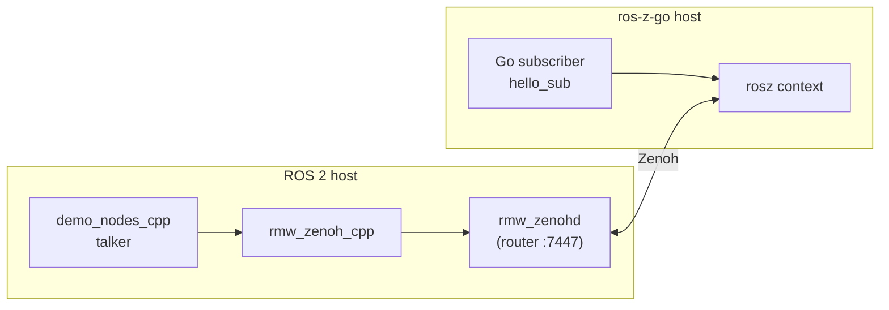
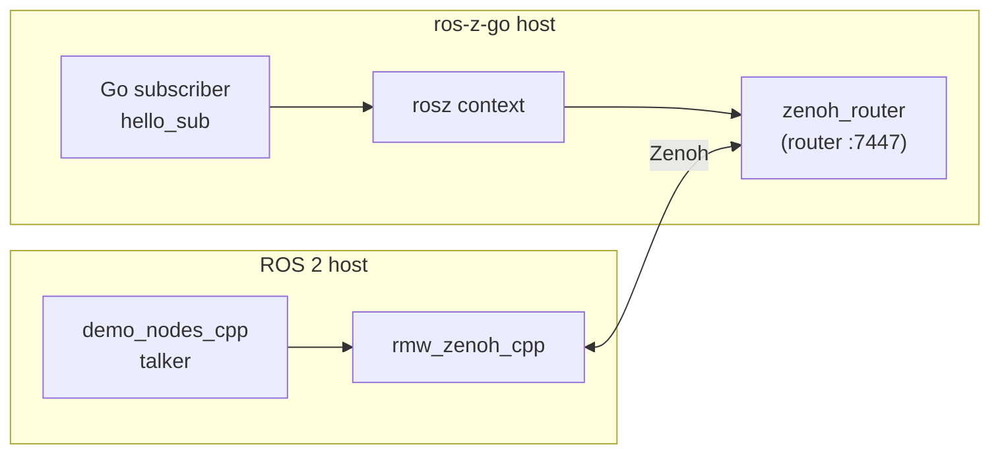

# Go Quick Start

Get a Go publisher and subscriber running in five minutes.

## Prerequisites

- Go 1.23+
- Rust toolchain (`rustup`)
- `cbindgen` — `cargo install cbindgen`
- `just` — `cargo install just`
- A Zenoh router — see [Networking](./networking.md)

## 1. Set up

Generate bundled message types, build the Rust FFI library, and verify the installation in one command:

```bash
just -f crates/ros-z-go/justfile quickstart
```

This runs `codegen-bundled` (generates `std_msgs`, `geometry_msgs` — no ROS 2 needed), compiles
`libros_z.a` into `target/release/`, and confirms both are present.

## 2. Write a publisher

Create `hello_pub/main.go`:

```go
package main

import (
    "fmt"
    "log"
    "time"

    "github.com/ZettaScaleLabs/ros-z/crates/ros-z-go/rosz"
    "github.com/ZettaScaleLabs/ros-z/crates/ros-z-go/generated/std_msgs"
)

func main() {
    ctx, err := rosz.NewContext().WithDomainID(0).Build()
    if err != nil {
        log.Fatal(err)
    }
    defer ctx.Close()

    node, err := ctx.CreateNode("go_talker").Build()
    if err != nil {
        log.Fatal(err)
    }
    defer node.Close()

    pub, err := node.CreatePublisher("chatter").Build(&std_msgs.String{})
    if err != nil {
        log.Fatal(err)
    }
    defer pub.Close()

    for i := 0; ; i++ {
        msg := &std_msgs.String{Data: fmt.Sprintf("Hello #%d", i)}
        if err := pub.Publish(msg); err != nil {
            log.Printf("publish error: %v", err)
        }
        fmt.Printf("Published: %s\n", msg.Data)
        time.Sleep(500 * time.Millisecond)
    }
}
```

Create `hello_pub/go.mod`:

```text
module hello_pub

go 1.23

require github.com/ZettaScaleLabs/ros-z/crates/ros-z-go v0.0.0

replace github.com/ZettaScaleLabs/ros-z/crates/ros-z-go => /path/to/ros-z/crates/ros-z-go
```

## 3. Write a subscriber

Create `hello_sub/main.go`:

```go
package main

import (
    "log"

    "github.com/ZettaScaleLabs/ros-z/crates/ros-z-go/rosz"
    "github.com/ZettaScaleLabs/ros-z/crates/ros-z-go/generated/std_msgs"
)

func main() {
    ctx, err := rosz.NewContext().WithDomainID(0).Build()
    if err != nil {
        log.Fatal(err)
    }
    defer ctx.Close()

    node, err := ctx.CreateNode("go_listener").Build()
    if err != nil {
        log.Fatal(err)
    }
    defer node.Close()

    _, err = node.CreateSubscriber("chatter").
        BuildWithCallback(&std_msgs.String{}, func(data []byte) {
            msg := &std_msgs.String{}
            if err := msg.DeserializeCDR(data); err != nil {
                log.Printf("deserialize error: %v", err)
                return
            }
            log.Printf("Received: %s", msg.Data)
        })
    if err != nil {
        log.Fatal(err)
    }

    select {} // block forever
}
```

Create `hello_sub/go.mod`:

```text
module hello_sub

go 1.23

require github.com/ZettaScaleLabs/ros-z/crates/ros-z-go v0.0.0

replace github.com/ZettaScaleLabs/ros-z/crates/ros-z-go => /path/to/ros-z/crates/ros-z-go
```

## 4. Run

You need a Zenoh router running first — publishers and subscribers only discover each other through a router:

```bash
# Terminal 1: router
cargo run --example zenoh_router

# Terminal 2: subscriber
cd hello_sub
CGO_LDFLAGS="-L/path/to/ros-z/target/release" go run main.go

# Terminal 3: publisher
cd hello_pub
CGO_LDFLAGS="-L/path/to/ros-z/target/release" go run main.go
```

You should see the subscriber printing messages published by the publisher.

## 5. Interop with ROS 2

`hello_sub` can receive messages from a native ROS 2 node. Only one Zenoh router is needed — you can use either `rmw_zenohd` (from the ROS 2 side) or ros-z's `zenoh_router` (from the Go side) as the single meeting point.

```admonish note
The two options below are equivalent. Pick whichever fits your setup.
```

### Option A — use `rmw_zenohd` as the router



```bash
# ROS 2 host
ros2 run rmw_zenoh_cpp rmw_zenohd &        # router
ros2 run demo_nodes_cpp talker             # publisher

# ros-z-go host (two terminals)
cd hello_sub
ZENOH_CONNECT=tcp/<ROS2_HOST_IP>:7447 \
  CGO_LDFLAGS="-L/path/to/ros-z/target/release" go run main.go
```

### Option B — use `zenoh_router` as the router



```bash
# ros-z-go host — start the router (terminal 1)
cargo run --example zenoh_router

# ROS 2 host — configure rmw_zenoh_cpp to connect to the ros-z router
export ZENOH_CONFIG_OVERRIDE="connect/endpoints=[\"tcp/<GO_HOST_IP>:7447\"]"
ros2 run demo_nodes_cpp talker

# ros-z-go host — run the subscriber (terminal 2)
cd hello_sub
CGO_LDFLAGS="-L/path/to/ros-z/target/release" go run main.go
```

The Go subscriber will receive `std_msgs/String` messages published by the ROS 2 talker.

## 6. Try the built-in examples

The repo ships ready-to-run examples. Start a router first, then:

```bash
# Terminal 1: router
cargo run --example zenoh_router

# Publisher + subscriber in parallel (Ctrl+C to stop)
just -f crates/ros-z-go/justfile demo

# Or run each individually
just -f crates/ros-z-go/justfile run-example publisher
just -f crates/ros-z-go/justfile run-example subscriber
just -f crates/ros-z-go/justfile run-example subscriber_channel   # channel-based / range loop
```

## What's next

- **[Go Bindings](./go_bindings.md)** — full API reference: typed helpers, graph introspection, QoS, error handling
- **[Message Generation](./message_generation.md)** — generate types from a full ROS 2 install
