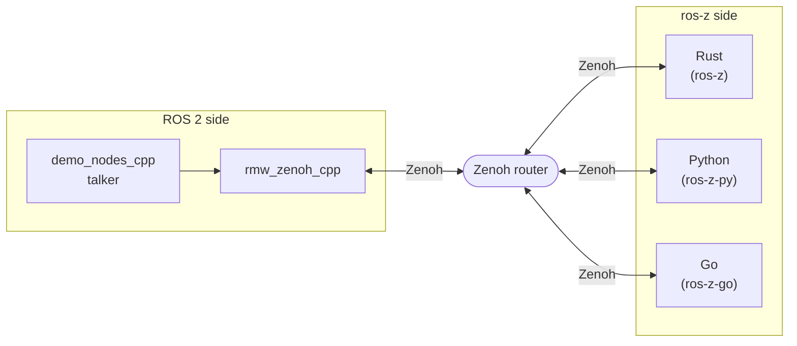

# ROS 2 Interoperability

ros-z nodes — whether written in Rust, Python, or Go — speak the same Zenoh wire protocol as `rmw_zenoh_cpp`, the official ROS 2 middleware plugin for Zenoh. This means they interoperate transparently: a Go subscriber can receive messages from a ROS 2 C++ talker, a Python publisher can send to a Rust listener, and so on.

## Prerequisites

- A ROS 2 installation with `rmw_zenoh_cpp` and `demo_nodes_cpp`
- One Zenoh router visible to all participants (see [Networking](./networking.md))

## How It Works



All participants connect to the same Zenoh router. The router can be started on either side — see [Choosing a router](#choosing-a-router) below.

**Requirements for successful message exchange:**

- Both sides must use the same message type with matching RIHS01 type hashes
- All nodes must reach the same Zenoh router
- ROS 2 nodes must use `rmw_zenoh_cpp` (`export RMW_IMPLEMENTATION=rmw_zenoh_cpp`)

```admonish warning
If type hashes differ (e.g. mismatched message definitions), nodes silently drop messages.
Enable `RUST_LOG=ros_z=debug` to inspect the hash in the key expression and compare with the ROS 2 side.
See [Troubleshooting](./troubleshooting.md) for diagnosis steps.
```

## Choosing a Router

You need exactly one router connecting both sides. Pick whichever is more convenient:

**Option A — use `rmw_zenohd` (ROS 2 side hosts the router)**

```bash
# ROS 2 host (terminal 1)
ros2 run rmw_zenoh_cpp rmw_zenohd
```

ros-z nodes connect to it via the `ZENOH_CONNECT` environment variable:

```bash
ZENOH_CONNECT=tcp/<ROS2_HOST_IP>:7447 <ros-z command>
```

**Option B — use `zenoh_router` (ros-z side hosts the router)**

```bash
# ros-z host (terminal 1)
cargo run --example zenoh_router
```

ROS 2 nodes connect to it via `ZENOH_CONFIG_OVERRIDE`:

```bash
export ZENOH_CONFIG_OVERRIDE="connect/endpoints=[\"tcp/<ROSZ_HOST_IP>:7447\"]"
ros2 run demo_nodes_cpp talker
```

---

## Rust

**Terminal 1 — router** (either option above)

**Terminal 2 — ROS 2 talker:**

```bash
export RMW_IMPLEMENTATION=rmw_zenoh_cpp
ros2 run demo_nodes_cpp talker
```

**Terminal 3 — ros-z listener:**

```bash
cargo run --example demo_nodes_listener
```

You should see the Rust listener printing messages published by the ROS 2 talker.

For more detail on publisher/subscriber patterns see [Pub/Sub](./pubsub.md).

---

## Python

**Terminal 1 — router** (either option above)

**Terminal 2 — ROS 2 talker:**

```bash
export RMW_IMPLEMENTATION=rmw_zenoh_cpp
ros2 run demo_nodes_cpp talker
```

**Terminal 3 — ros-z-py listener:**

```bash
cd crates/ros-z-py
source .venv/bin/activate
python examples/topic_demo.py -r listener
```

Or go the other way — Python publishes, ROS 2 listens:

```bash
# Terminal 2 — Python publisher
python examples/topic_demo.py -r talker

# Terminal 3 — ROS 2 subscriber
ros2 topic echo /chatter std_msgs/msg/String
```

For more detail see [Python Bindings](./python.md).

---

## Go

**Terminal 1 — router** (either option above)

**Terminal 2 — ROS 2 talker:**

```bash
export RMW_IMPLEMENTATION=rmw_zenoh_cpp
ros2 run demo_nodes_cpp talker
```

**Terminal 3 — ros-z-go listener:**

```bash
cd hello_sub
CGO_LDFLAGS="-L/path/to/ros-z/target/release" go run main.go
```

For more detail see [Go Quick Start](./go_quick_start.md).
