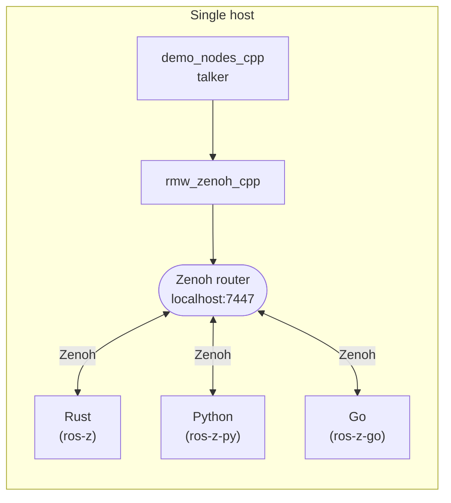
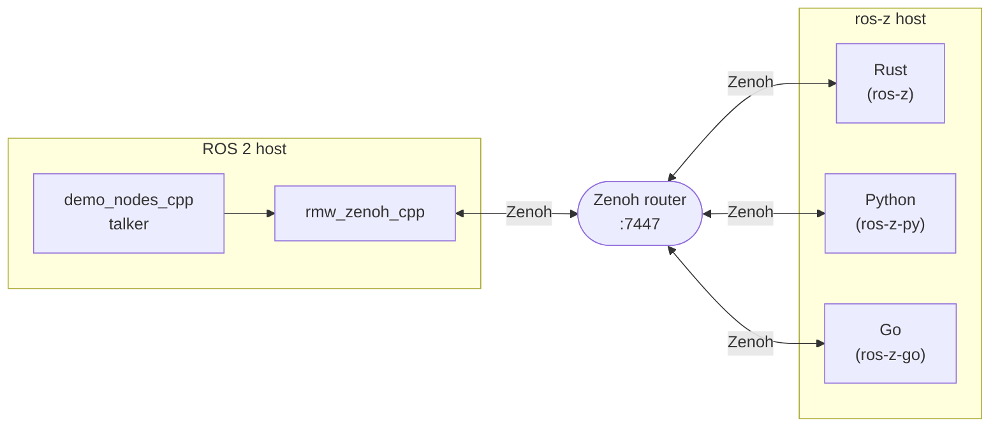
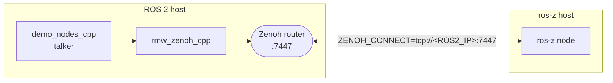
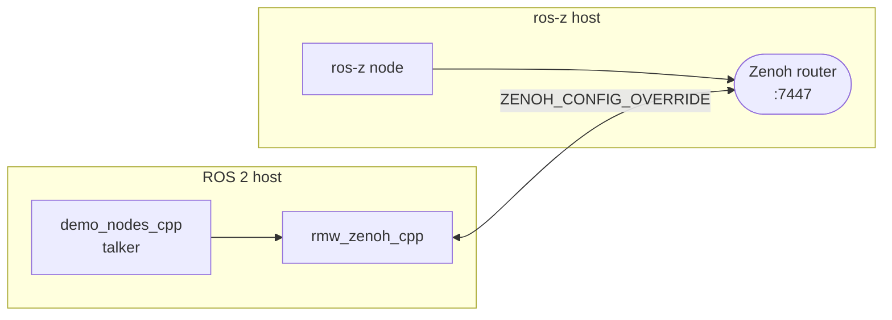

# ROS 2 Interoperability

ros-z nodes — whether written in Rust, Python, or Go — speak the same Zenoh wire protocol as `rmw_zenoh_cpp`, the official ROS 2 middleware plugin for Zenoh. This means they interoperate transparently: a Go subscriber can receive messages from a ROS 2 C++ talker, a Python publisher can send to a Rust listener, and so on.

## Prerequisites

- A ROS 2 installation with `rmw_zenoh_cpp` and `demo_nodes_cpp`
- One Zenoh router visible to all participants (see [Networking](./networking.md))

## How It Works

All participants connect to the same Zenoh router. Both sides can run on the same machine or on separate hosts.

```admonish note
The Zenoh router can be any of: `rmw_zenohd` (ROS 2), `cargo run --example zenoh_router`, a pre-built binary, or Docker.
See [Networking](./networking.md) for all options.
```

**Single host** — everything on one machine, one router:



**Two hosts** — one router bridges both machines:



The router can live on either host — see [Two Hosts](#two-hosts) below.

**Requirements for successful message exchange:**

- Both sides must use the same message type with matching RIHS01 type hashes
- All nodes must reach the same Zenoh router
- ROS 2 nodes must use `rmw_zenoh_cpp` (`export RMW_IMPLEMENTATION=rmw_zenoh_cpp`)

```admonish warning
If type hashes differ (e.g. mismatched message definitions), nodes silently drop messages.
Enable `RUST_LOG=ros_z=debug` to inspect the hash in the key expression and compare with the ROS 2 side.
See [Troubleshooting](./troubleshooting.md) for diagnosis steps.
```

## Single Host

When ROS 2 and ros-z run on the same machine, one Zenoh router on `localhost:7447` is enough — ros-z nodes connect to it by default with no extra configuration.

```bash
# Terminal 1 — router (any method, e.g. rmw_zenohd or zenohd)
ros2 run rmw_zenoh_cpp rmw_zenohd

# Terminal 2 — ROS 2 talker
export RMW_IMPLEMENTATION=rmw_zenoh_cpp
ros2 run demo_nodes_cpp talker

# Terminal 3 — ros-z listener (any binding, see below)
```

## Two Hosts

When ROS 2 and ros-z run on separate machines, you need one router reachable by both. Pick whichever side is more convenient to host it:

### Option A — router on the ROS 2 host



```bash
# ROS 2 host — start router, then talker
ros2 run rmw_zenoh_cpp rmw_zenohd   # or any other router method
export RMW_IMPLEMENTATION=rmw_zenoh_cpp
ros2 run demo_nodes_cpp talker

# ros-z host — connect to ROS 2 router
ZENOH_CONNECT=tcp/<ROS2_IP>:7447 <ros-z command>
```

### Option B — router on the ros-z host



```bash
# ros-z host — start router, then listener
cargo run --example zenoh_router    # or any other router method
<ros-z command>

# ROS 2 host — connect to ros-z router
export ZENOH_CONFIG_OVERRIDE="connect/endpoints=[\"tcp/<ROSZ_IP>:7447\"]"
export RMW_IMPLEMENTATION=rmw_zenoh_cpp
ros2 run demo_nodes_cpp talker
```

---

## Rust

**Single host** — after starting `rmw_zenohd` and the ROS 2 talker:

```bash
cargo run --example demo_nodes_listener
```

**Two hosts** — prepend `ZENOH_CONNECT=tcp/<ROS2_IP>:7447` (Option A) or use Option B.

For more detail on publisher/subscriber patterns see [Pub/Sub](./pubsub.md).

---

## Python

**Single host** — after starting `rmw_zenohd` and the ROS 2 talker:

```bash
cd crates/ros-z-py
source .venv/bin/activate
python examples/topic_demo.py -r listener
```

Or go the other way — Python publishes, ROS 2 listens:

```bash
python examples/topic_demo.py -r talker
# On ROS 2 side:
ros2 topic echo /chatter std_msgs/msg/String
```

**Two hosts** — prepend `ZENOH_CONNECT=tcp/<ROS2_IP>:7447` (Option A) or use Option B.

For more detail see [Python Bindings](./python.md).

---

## Go

**Single host** — after starting `rmw_zenohd` and the ROS 2 talker:

```bash
just -f crates/ros-z-go/justfile run-example subscriber
```

**Two hosts** — prepend `ZENOH_CONNECT=tcp/<ROS2_IP>:7447` (Option A) or use Option B.

For more detail see [Go Quick Start](./go_quick_start.md).
