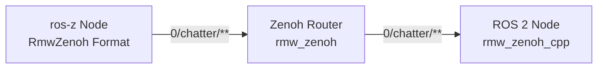
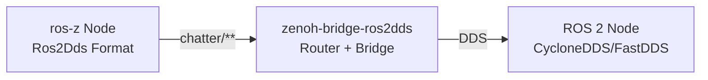

# Key Expression Formats

**ros-z uses key expression formats to map ROS 2 entities (topics, services, actions) to Zenoh key expressions.** The format is provided by the independent `ros-z-keyexpr` crate and determines how ROS 2 names are translated for Zenoh routing and discovery.

```admonish note
Key expression format is a runtime choice that affects how ros-z maps ROS 2 entities to Zenoh key expressions. Choose the format that matches your infrastructure for proper message routing.
```

## Available Formats

ros-z supports multiple key expression formats for interoperability with different Zenoh-ROS bridges:

| Format | Compatibility | Use Case |
|--------|--------------|----------|
| **RmwZenoh** (default) | `rmw_zenoh_cpp` | Standard ROS 2 Zenoh middleware |
| **Ros2Dds** | `zenoh-bridge-ros2dds` | DDS bridge compatibility |

### RmwZenoh Format (Default)

The RmwZenoh format is designed for compatibility with ROS 2's official Zenoh middleware implementation (`rmw_zenoh_cpp`).

**Key Expression Patterns:**

```text
Topic keys:      <domain_id>/<topic>/<type>/<hash>
Liveliness:      @ros2_lv/<domain_id>/<entity_kind>/<namespace>/<name>/...
```

**Example Topic Keys:**

```text
0/chatter/std_msgs::msg::dds_::String_/RIHS01_...
5/robot/sensors/camera/sensor_msgs::msg::dds_::Image_/RIHS01_...
```

**Use this format when:**

- Using `rmw_zenoh_cpp` as your ROS 2 middleware
- Running pure ros-z deployments
- Requiring domain isolation via Zenoh

### Ros2Dds Format

The Ros2Dds format is designed for compatibility with `zenoh-bridge-ros2dds`, which bridges standard DDS-based ROS 2 nodes to Zenoh.

**Key Expression Format:**

```text
<topic>/**
```

**Example:**

```text
chatter/**                    # Topic /chatter (no domain prefix)
robot/sensors/camera/**       # Topic /robot/sensors/camera
```

**Use this format when:**

- Bridging existing DDS-based ROS 2 systems to Zenoh
- Using `zenoh-bridge-ros2dds`
- Integrating with CycloneDDS or FastDDS nodes via Zenoh

## Key Expression Behavior (IMPORTANT)

Understanding how topic names are converted to key expressions is critical for debugging:

### Topic Key Expressions (For Data Routing)

**ALL entity types** (publishers, subscriptions, services, clients, actions) use `strip_slashes()` behavior:

- Removes **leading** and **trailing** slashes only
- **Preserves internal** slashes for hierarchical routing
- Enables multi-segment topic names

**Examples:**

| ROS 2 Topic Name | Topic Key Expression | ✓/✗ |
|------------------|---------------------|-----|
| `/chatter` | `0/chatter/...` | ✅ Correct |
| `/robot/sensors` | `0/robot/sensors/...` | ✅ Correct |
| `/a/b/c` | `0/a/b/c/...` | ✅ Correct |
| `/talker/service` | `0/talker/service/...` | ✅ Correct |

**Why preserve slashes?**

- Zenoh uses `/` for hierarchical routing
- Enables wildcard subscriptions: `0/robot/**`
- Human-readable key expressions

### Liveliness Tokens (For Discovery)

**ALL fields** in liveliness tokens use `mangle_name()` behavior:

- Replaces **all** `/` with `%`
- Ensures unambiguous parsing of entity metadata
- Machine-parsable format for discovery protocol

**Examples:**

| ROS 2 Name | Liveliness Field | ✓/✗ |
|-----------|-----------------|-----|
| `/chatter` | `%chatter` | ✅ Correct |
| `/robot/sensors` | `%robot%sensors` | ✅ Correct |
| `/my_node` | `%my_node` | ✅ Correct |

**Why mangle slashes?**

- Liveliness tokens have fixed structure: `@ros2_lv/<domain>/<kind>/<ns>/<name>/...`
- Prevents ambiguity when parsing fields
- Ensures reliable entity discovery

### Why Two Different Behaviors?

This is **intentional design** in `rmw_zenoh_cpp`, not an inconsistency:

- **Topic keys**: Human-readable, hierarchical (optimized for Zenoh routing)
- **Liveliness**: Machine-parsable, unambiguous (optimized for discovery protocol)

```admonish tip
If multi-segment topics like `/robot/sensors/camera` don't receive messages, check your ros-z version. Versions before 0.1.0 had a bug where publishers incorrectly mangled topic key expressions.
```

## API Usage

### Specifying Format at Context Creation

```rust
use ros_z::Context;
use ros_z_keyexpr::KeyExprFormat;

// Default (RmwZenoh)
let ctx = Context::new().build()?;

// Explicit format selection
let ctx = Context::new()
    .keyexpr_format(KeyExprFormat::RmwZenoh)
    .build()?;

// Ros2Dds format for DDS bridge compatibility
let ctx = Context::new()
    .keyexpr_format(KeyExprFormat::Ros2Dds)
    .build()?;
```

**Key points:**

- Format is set at context creation time
- All nodes and entities created from the context use the same format
- Default format is `KeyExprFormat::RmwZenoh`
- Format choice is type-safe and explicit

### Creating Entities

Once the context is created with a format, all entities inherit it:

```rust
use ros_z_msgs::std_msgs::String as RosString;

// Create context with RmwZenoh format (default)
let ctx = Context::new().build()?;
let node = ctx.create_node("my_node").build()?;

// Publisher uses context's format
let pub_rmw = node
    .create_pub::<RosString>("chatter")
    .build()?;

// Subscriber uses same format
let sub_rmw = node
    .create_sub::<RosString>("chatter")
    .build()?;
```

### Mixing Formats (Advanced)

To communicate with both RmwZenoh and Ros2Dds systems, create separate contexts:

```rust
// Context for rmw_zenoh_cpp nodes
let ctx_rmw = Context::new()
    .keyexpr_format(KeyExprFormat::RmwZenoh)
    .build()?;

// Context for zenoh-bridge-ros2dds nodes
let ctx_dds = Context::new()
    .keyexpr_format(KeyExprFormat::Ros2Dds)
    .build()?;

// Create nodes from each context
let node_rmw = ctx_rmw.create_node("rmw_node").build()?;
let node_dds = ctx_dds.create_node("dds_node").build()?;
```

## Architecture Diagrams

### RmwZenoh Format Architecture



**Use case:** Native Zenoh-based ROS 2 deployment

- All nodes use rmw_zenoh or ros-z
- Direct Zenoh communication
- Domain isolation via key expression prefix

### Ros2Dds Format Architecture



**Use case:** Bridge existing DDS systems to Zenoh

- ROS 2 nodes use standard DDS middleware
- `zenoh-bridge-ros2dds` translates DDS ↔ Zenoh
- ros-z communicates via Zenoh side of bridge

## Key Expression Generation Details

Understanding how `ros-z-keyexpr` generates key expressions helps with debugging and monitoring.

### Topic Key Expression Structure

```text
<domain_id>/<topic_stripped>/<type>/<hash>
```

**Components:**

1. **Domain ID**: ROS 2 domain (e.g., `0`, `5`)
2. **Topic (stripped)**: Topic name with leading/trailing slashes removed, internal slashes preserved
3. **Type**: Mangled message type (e.g., `std_msgs::msg::dds_::String_`)
4. **Hash**: Type hash for compatibility (e.g., `RIHS01_...`)

**Example:**

```text
Topic: /robot/sensors/camera
Type:  sensor_msgs/msg/Image
Hash:  RIHS01_abc123...

Key Expression:
0/robot/sensors/camera/sensor_msgs::msg::dds_::Image_/RIHS01_abc123...
```

### Liveliness Token Structure

```text
@ros2_lv/<domain>/<entity_kind>/<zid>/<id>/<namespace>/<name>/<type>/<hash>/<qos>
```

**All name fields are mangled** (/ → %):

```text
Namespace: /robot/arm  →  %robot%arm
Name:      /gripper    →  %gripper
```

**Example:**

```text
@ros2_lv/0/MP/01234567890abcdef/1/%robot%arm/%gripper/std_msgs::msg::String_/RIHS01_.../qos_string
```

## ros-z-keyexpr Crate

The key expression logic is provided by the independent `ros-z-keyexpr` crate:

**Features:**

- `no_std` compatible (with `alloc`)
- Feature-gated format implementations
- Comprehensive unit tests (33+ tests)
- Type-safe API

**Cargo features:**

```toml
[dependencies]
ros-z-keyexpr = { version = "0.1", features = ["rmw-zenoh", "ros2dds"] }
```

**Using ros-z-keyexpr directly:**

```rust
use ros_z_keyexpr::{KeyExprFormat, entity::*};

let format = KeyExprFormat::default(); // RmwZenoh

// Generate topic key expression
let topic_ke = format.topic_key_expr(&entity)?;

// Generate liveliness token
let lv_ke = format.liveliness_key_expr(&entity, &zid)?;

// Parse liveliness token back to entity
let parsed_entity = format.parse_liveliness(&lv_ke)?;
```

See the [ros-z-keyexpr documentation](https://docs.rs/ros-z-keyexpr) for details.

## Troubleshooting

### Multi-Segment Topics Not Working?

**Symptom:** Publisher publishes to `/robot/sensors/camera` but subscriber never receives messages.

**Cause:** Old versions of ros-z (before 0.1.0) incorrectly mangled slashes in topic key expressions.

**Fix:** Update to ros-z 0.1.0+ which correctly uses `strip_slashes()` for all topic key expressions.

**Verify:** Enable debug logging to check key expressions:

```bash
RUST_LOG=ros_z=debug cargo run --example z_pubsub
```

Look for key expressions like:

```text
✅ Correct:  0/robot/sensors/camera/sensor_msgs::msg::Image_/...
❌ Wrong:    0/robot%sensors%camera/sensor_msgs::msg::Image_/...
```

### No Messages Between ros-z and rmw_zenoh_cpp?

**Check format:** Ensure ros-z uses `KeyExprFormat::RmwZenoh` (the default).

**Check type hash:** Enable debug logging and compare type hashes:

```bash
RUST_LOG=ros_z=debug cargo run
```

Type hashes must match between ros-z and rmw_zenoh_cpp. If they don't, you may have:

- Different message definitions
- Different ROS 2 distros
- Outdated generated messages

### No Messages Through zenoh-bridge-ros2dds?

**Check format:** Ensure ros-z uses `KeyExprFormat::Ros2Dds`:

```rust
let ctx = Context::new()
    .keyexpr_format(KeyExprFormat::Ros2Dds)
    .build()?;
```

**Check bridge configuration:** Verify `zenoh-bridge-ros2dds` is running and connected to the same Zenoh router as ros-z.

## Format Comparison

### When to Use RmwZenoh Format

✅ **Use RmwZenoh when:**

- Building pure Zenoh-based ROS 2 systems
- Using `rmw_zenoh_cpp` middleware
- Requiring domain isolation
- Deploying new systems with native Zenoh support
- Maximizing Zenoh performance benefits

### When to Use Ros2Dds Format

✅ **Use Ros2Dds when:**

- Bridging existing DDS-based ROS 2 systems
- Using `zenoh-bridge-ros2dds`
- Integrating with legacy ROS 2 infrastructure
- Gradual migration from DDS to Zenoh
- Heterogeneous deployments (DDS + Zenoh)
