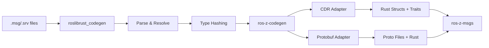
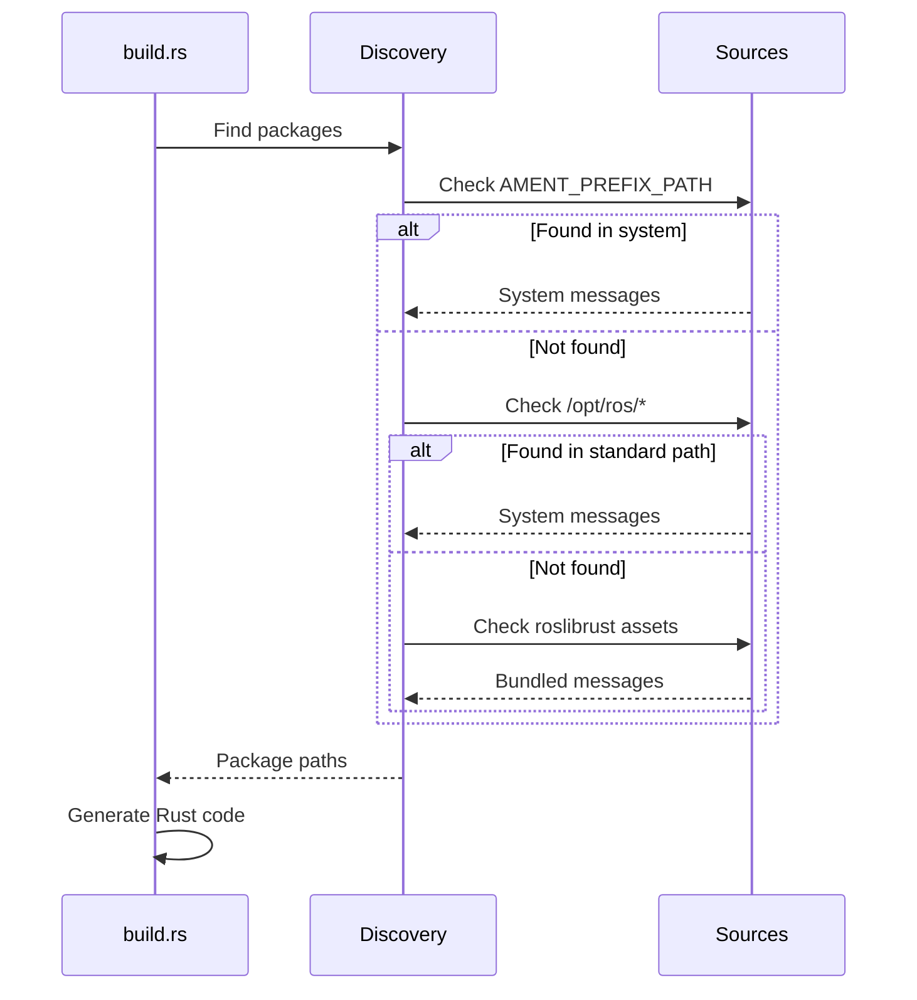
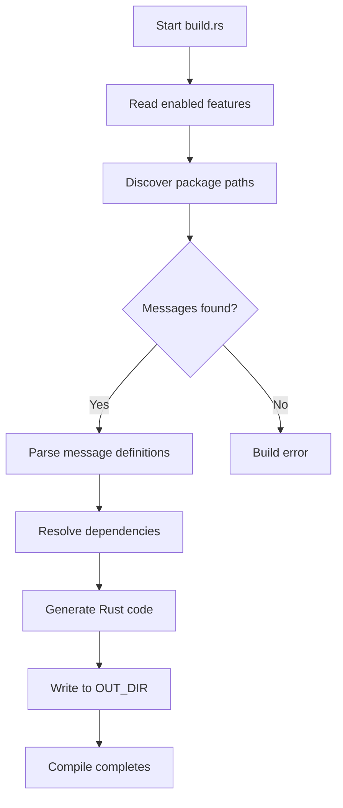
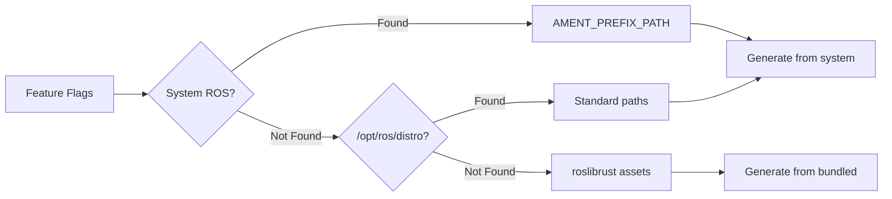
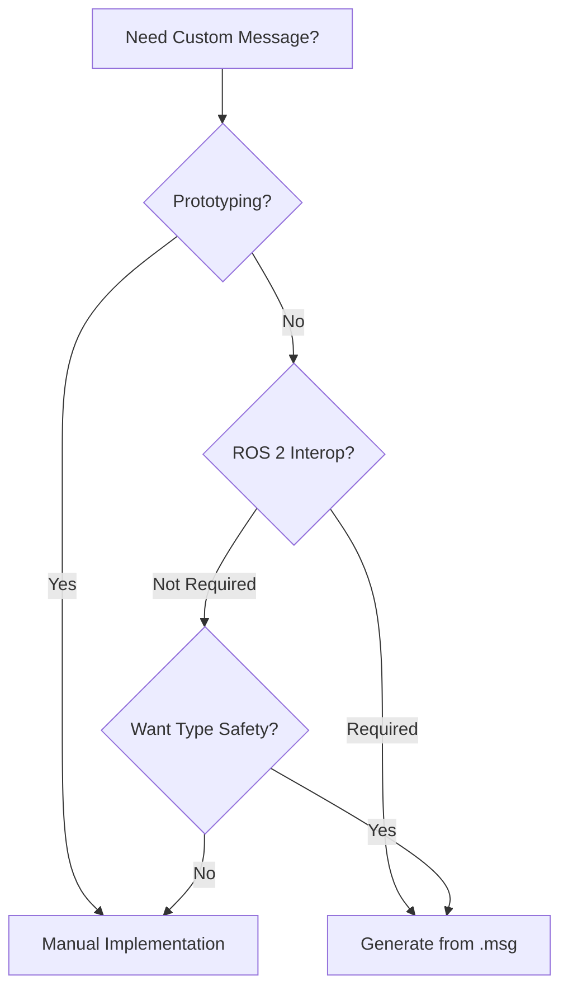
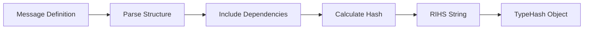

# Message Generation

**Automatic Rust type generation from ROS 2 message definitions at build time.** The code generation system converts `.msg`, `.srv`, and `.action` files into type-safe Rust structs with full serialization support and ROS 2 compatibility.

```admonish success
Message generation happens automatically during builds. You write ROS 2 message definitions, ros-z generates idiomatic Rust code.
```

## System Architecture



## Key Features

| Feature | Description | Benefit |
|---------|-------------|---------|
| **Build-time generation** | Runs during `cargo build` | No manual steps |
| **Bundled definitions** | Includes common ROS types | Works without ROS 2 |
| **Type safety** | Full Rust type system | Compile-time validation |
| **CDR compatible** | ROS 2 DDS serialization | Full interoperability |
| **Optional protobuf** | Additional serialization | Cross-language support |

## Component Stack

### roslibrust_codegen

Third-party foundation for ROS message parsing:

- Parses `.msg` and `.srv` file syntax
- Resolves message dependencies across packages
- Calculates ROS 2 type hashes (RIHS algorithm)
- Generates base Rust structs with serde
- Bundles common message definitions

```admonish info
roslibrust provides bundled messages for `std_msgs`, `geometry_msgs`, `sensor_msgs`, and `nav_msgs`. These work without ROS 2 installation.
```

### ros-z-codegen

ros-z's orchestration layer:

- Coordinates message discovery across sources
- Manages build-time code generation
- Provides serialization adapters
- Generates ros-z-specific traits

**Discovery workflow:**



### Serialization Adapters

**CDR Adapter (default):**

- Generates structs with serde
- CDR-compatible serialization
- Full ROS 2 DDS interoperability
- No additional dependencies

**Protobuf Adapter (optional):**

- Generates `.proto` files
- Protobuf-compatible types
- Cross-language data exchange
- Requires protobuf feature

## Generated Code

For each ROS 2 message, ros-z generates:

### Message Struct

```rust,ignore
#[derive(Debug, Clone, Serialize, Deserialize, Default)]
pub struct String {
    pub data: std::string::String,
}
```

### Type Information Traits

```rust,ignore
impl MessageTypeInfo for std_msgs::String {
    fn type_name() -> &'static str {
        "std_msgs::msg::dds_::String_"
    }

    fn type_hash() -> TypeHash {
        TypeHash::from_rihs_string("RIHS01_abc123...")
            .expect("Invalid hash")
    }
}

impl WithTypeInfo for std_msgs::String {
    fn type_info() -> TypeInfo {
        TypeInfo::new(Self::type_name(), Self::type_hash())
    }
}
```

**These traits enable:**

- Runtime type identification
- ROS 2 compatibility validation
- Proper DDS topic naming
- Type-safe message passing

```admonish note
Type hashes are critical for ROS 2 interoperability. They ensure nodes agree on message structure before exchanging data.
```

## Build Process

### ros-z-msgs Build Script

The generation happens in `build.rs`:



**Configuration:**

```rust,ignore
let config = GeneratorConfig {
    generate_cdr: true,        // CDR-compatible types
    generate_protobuf: false,  // Optional protobuf
    generate_type_info: true,  // Trait implementations
    output_dir: out_dir,
};
```

### Package Discovery Order



1. **System ROS:** `$AMENT_PREFIX_PATH`, `$CMAKE_PREFIX_PATH`
2. **Standard paths:** `/opt/ros/{rolling,jazzy,iron,humble}`
3. **Bundled assets:** `~/.cargo/git/checkouts/roslibrust-*/assets/`

This fallback enables development without ROS 2 installation.

## Using Generated Messages

### Import Pattern

```rust,ignore
use ros_z_msgs::ros::std_msgs::String as RosString;
use ros_z_msgs::ros::geometry_msgs::Twist;
use ros_z_msgs::ros::sensor_msgs::LaserScan;
```

### Namespace Structure

```text
ros_z_msgs::ros::{package}::{MessageName}
```

**Examples:**

- `ros_z_msgs::ros::std_msgs::String`
- `ros_z_msgs::ros::geometry_msgs::Point`
- `ros_z_msgs::ros::sensor_msgs::Image`

### Service Types

Services generate three types:

```rust,ignore
// Service definition
use ros_z_msgs::ros::example_interfaces::AddTwoInts;

// Request type
use ros_z_msgs::ros::example_interfaces::AddTwoIntsRequest;

// Response type
use ros_z_msgs::ros::example_interfaces::AddTwoIntsResponse;
```

```admonish tip
Import the service type for creation, then use the request/response types when handling calls.
```

## Message Packages

### Bundled Packages

Available without ROS 2:

| Package | Messages | Use Cases |
|---------|----------|-----------|
| **std_msgs** | String, Int32, Float64, etc. | Basic data types |
| **geometry_msgs** | Point, Pose, Twist, Transform | Spatial data |
| **sensor_msgs** | LaserScan, Image, Imu, PointCloud2 | Sensor readings |
| **nav_msgs** | Path, Odometry, OccupancyGrid | Navigation |

```bash
# Build with bundled messages
cargo build -p ros-z-msgs --features bundled_msgs
```

### External Packages

Require ROS 2 installation:

| Package | Messages | Use Cases |
|---------|----------|-----------|
| **example_interfaces** | AddTwoInts, Fibonacci | Tutorials |
| **action_msgs** | GoalStatus, GoalInfo | Action support |
| **(custom)** | Your messages | Domain-specific |

```bash
source /opt/ros/jazzy/setup.bash
cargo build -p ros-z-msgs --features external_msgs
```

## Manual Custom Messages

For rapid prototyping without `.msg` files:

### Define the Struct

```rust,ignore
use serde::{Deserialize, Serialize};

#[derive(Debug, Clone, Serialize, Deserialize, Default)]
pub struct RobotStatus {
    pub robot_id: String,
    pub battery_percentage: f64,
    pub position: [f64; 2],
    pub is_moving: bool,
}
```

### Implement Required Traits

```rust,ignore
use ros_z::{MessageTypeInfo, WithTypeInfo, entity::TypeHash};

impl MessageTypeInfo for RobotStatus {
    fn type_name() -> &'static str {
        "custom_msgs::msg::dds_::RobotStatus_"
    }

    fn type_hash() -> TypeHash {
        // For ros-z-to-ros-z only
        TypeHash::zero()
    }
}

impl WithTypeInfo for RobotStatus {}
```

```admonish warning
Manual messages with `TypeHash::zero()` work only between ros-z nodes. For ROS 2 interoperability, use generated messages with proper type hashes.
```

### When to Use Each Approach



| Approach | Pros | Cons | Use When |
|----------|------|------|----------|
| **Manual** | Fast, flexible | No ROS 2 interop | Prototyping, internal only |
| **Generated** | Type hashes, portable | Requires .msg files | Production, ROS 2 systems |

## Serialization Formats

### CDR (Default)

Common Data Representation - ROS 2 standard:

- Full DDS compatibility
- Efficient binary encoding
- Used by all ROS 2 implementations
- Automatic via serde

```rust,ignore
// Generated with CDR support
#[derive(Serialize, Deserialize)]
pub struct String {
    pub data: std::string::String,
}
```

### Protobuf (Optional)

Protocol Buffers alternative:

```bash
cargo build -p ros-z-msgs --features protobuf
cargo build -p ros-z --features protobuf
```

**Benefits:**

- Schema evolution
- Cross-language compatibility
- Familiar ecosystem
- Efficient encoding

**Tradeoffs:**

- Not ROS 2 standard format
- Additional dependencies
- Requires feature flag

```admonish info
Use protobuf when you need schema evolution or cross-language data exchange beyond ROS 2 ecosystem. See [Protobuf Serialization](./protobuf.md) for detailed usage guide.
```

## Extending Message Packages

Add new packages to ros-z-msgs:

### 1. Add Feature Flag

Edit `ros-z-msgs/Cargo.toml`:

```toml
[features]
bundled_msgs = ["std_msgs", "geometry_msgs", "your_package"]
your_package = []
```

### 2. Update Build Script

Edit `ros-z-msgs/build.rs`:

```rust,ignore
fn get_bundled_packages() -> Vec<&'static str> {
    let mut names = vec!["builtin_interfaces"];

    #[cfg(feature = "your_package")]
    names.push("your_package");

    names
}
```

### 3. Rebuild

```bash
cargo build -p ros-z-msgs --features your_package
```

The build system automatically:

- Searches for the package
- Parses all message definitions
- Generates Rust types with traits
- Outputs to generated module

## Advanced Topics

### Message Filtering

The generator automatically filters:

- **Deprecated actionlib messages** - Old ROS 1 format
- **wstring fields** - Poor Rust support
- **Duplicate definitions** - Keeps first occurrence

### Type Hash Calculation

ros-z uses the RIHS (ROS IDL Hash) algorithm:



**Properties:**

- Includes message structure and field types
- Incorporates dependency hashes
- Changes when definition changes
- Ensures type safety across network

**In generated code:**

```rust,ignore
TypeHash::from_rihs_string("RIHS01_1234567890abcdef...")
    .expect("Invalid RIHS hash string")
```

### Custom Code Generation

For custom build scripts:

```rust,ignore
use ros_z_codegen::{MessageGenerator, GeneratorConfig};

let config = GeneratorConfig {
    generate_cdr: true,
    generate_protobuf: false,
    generate_type_info: true,
    output_dir: out_dir.clone(),
};

let generator = MessageGenerator::new(config);
generator.generate_from_msg_files(&package_paths)?;
```

## Troubleshooting

### Package Not Found

```bash
# Check ROS 2 is sourced
echo $AMENT_PREFIX_PATH

# Verify package exists
ros2 pkg list | grep your_package

# Install if missing
sudo apt install ros-jazzy-your-package

# For bundled packages, check roslibrust
ls ~/.cargo/git/checkouts/roslibrust-*/assets/
```

### Build Failures

| Error | Cause | Solution |
|-------|-------|----------|
| "Cannot find package" | Missing dependency | Enable feature or install ROS 2 package |
| "Type conflict" | Duplicate definition | Remove manual implementation |
| "Hash error" | Version mismatch | Update roslibrust dependency |

See [Troubleshooting Guide](./troubleshooting.md) for detailed solutions.

## Resources

- **[Feature Flags](./feature_flags.md)** - Available message packages
- **[Building](./building.md)** - Build configuration
- **[Custom Messages](./custom_messages.md)** - Manual implementation
- **[Protobuf Serialization](./protobuf.md)** - Alternative serialization format

**Message generation is transparent. Focus on writing ROS 2 message definitions and let ros-z handle the Rust code generation.**
