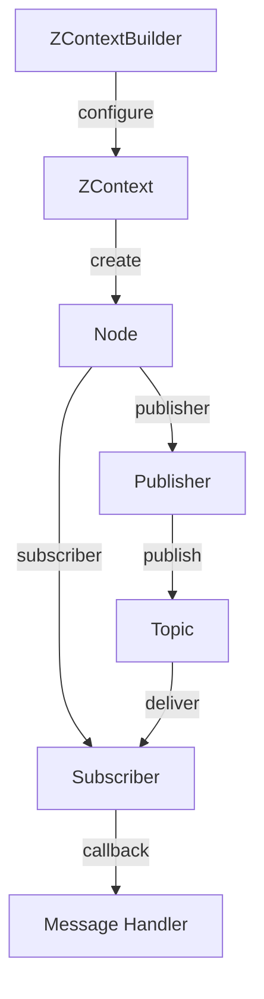

# Publishers and Subscribers

**ros-z implements ROS 2's publish-subscribe pattern with type-safe, zero-copy messaging over Zenoh.** This enables efficient, decoupled communication between nodes with minimal overhead.

```admonish note
The pub-sub pattern forms the foundation of ROS 2 communication, allowing nodes to exchange data without direct coupling. ros-z leverages Zenoh's efficient transport layer for optimal performance.
```

## Visual Flow



## Key Features

| Feature | Description | Benefit |
|---------|-------------|---------|
| **Type Safety** | Strongly-typed messages using Rust structs | Compile-time error detection |
| **Zero-Copy** | Efficient message passing via Zenoh | Reduced latency and CPU usage |
| **QoS Profiles** | Configurable reliability, durability, history | Fine-grained delivery control |
| **Async/Blocking** | Dual API for both paradigms | Flexible integration patterns |

## Publisher Example

This example demonstrates publishing "Hello World" messages to a topic. The publisher sends messages periodically, showcasing the fundamental publishing pattern.

```rust,ignore
{{#include ../../../ros-z/examples/demo_nodes/talker.rs:1:61}}
```

**Key points:**

- **QoS Configuration**: Uses `KeepLast(7)` to buffer the last 7 messages
- **Async Publishing**: Non-blocking `async_publish()` for efficient I/O
- **Rate Control**: Uses `tokio::time::sleep()` to control publishing frequency
- **Bounded Operation**: Optional `max_count` for testing scenarios

**Running the publisher:**

```bash
# Basic usage
cargo run --example demo_nodes_talker

# Custom topic and rate
cargo run --example demo_nodes_talker -- --topic /my_topic --period 0.5

# Publish 10 messages then exit
cargo run --example demo_nodes_talker -- --max-count 10
```

## Subscriber Example

This example demonstrates subscribing to messages from a topic. The subscriber receives and displays messages, showing both timeout-based and async reception patterns.

```rust,ignore
{{#include ../../../ros-z/examples/demo_nodes/listener.rs:1:81}}
```

**Key points:**

- **Flexible Reception**: Supports timeout-based and indefinite blocking
- **Testable Design**: Returns received messages for verification
- **Bounded Operation**: Optional `max_count` and `timeout` parameters
- **QoS Configuration**: Uses `KeepLast(10)` for message buffering

**Running the subscriber:**

```bash
# Basic usage
cargo run --example demo_nodes_listener

# Custom topic
cargo run --example demo_nodes_listener -- --topic /my_topic

# Receive 5 messages then exit
cargo run --example demo_nodes_listener -- --max-count 5
```

## Complete Pub-Sub Workflow

To see publishers and subscribers in action together, you'll need to start a Zenoh router first:

**Terminal 1 - Start Zenoh Router:**

```bash
cargo run --example zenoh_router
```

**Terminal 2 - Start Subscriber:**

```bash
cargo run --example demo_nodes_listener
```

**Terminal 3 - Start Publisher:**

```bash
cargo run --example demo_nodes_talker
```

**Expected output in Terminal 2 (Subscriber):**

```text
I heard: [Hello World: 1]
I heard: [Hello World: 2]
I heard: [Hello World: 3]
...
```

```admonish success
The subscriber receives messages in real-time as the publisher sends them, demonstrating ros-z's efficient pub-sub implementation over Zenoh.
```

## Subscriber Patterns

ros-z provides three patterns for receiving messages, each suited for different use cases:

### Pattern 1: Blocking Receive (Pull Model)

Best for: Simple sequential processing, scripting

```rust,ignore
let subscriber = node
    .create_sub::<RosString>("topic_name")
    .build()?;

while let Ok(msg) = subscriber.recv() {
    println!("Received: {}", msg.data);
}
```

### Pattern 2: Async Receive (Pull Model)

Best for: Integration with async codebases, handling multiple streams

```rust,ignore
let subscriber = node
    .create_sub::<RosString>("topic_name")
    .build()?;

while let Ok(msg) = subscriber.async_recv().await {
    println!("Received: {}", msg.data);
}
```

### Pattern 3: Callback (Push Model)

Best for: Event-driven architectures, low-latency response

```rust,ignore
let subscriber = node
    .create_sub::<RosString>("topic_name")
    .build_with_callback(|msg| {
        println!("Received: {}", msg.data);
    })?;

// No need to call recv() - callback handles messages automatically
// Your code continues while messages are processed in the background
```

```admonish tip
Use callbacks for low-latency event-driven processing. Use blocking/async receive when you need explicit control over when messages are processed.
```

### Pattern Comparison

| Aspect | Blocking Receive | Async Receive | Callback |
|--------|------------------|---------------|----------|
| **Control Flow** | Sequential | Sequential | Event-driven |
| **Latency** | Medium (poll-based) | Medium (poll-based) | Low (immediate) |
| **Memory** | Queue size × message | Queue size × message | No queue |
| **Backpressure** | Built-in (queue full) | Built-in (queue full) | None (drops if slow) |
| **Use Case** | Simple scripts | Async applications | Real-time response |

## Quality of Service (QoS)

QoS profiles control message delivery behavior:

```rust,ignore
use ros_z::qos::{QosProfile, QosHistory, Reliability};

let qos = QosProfile {
    history: QosHistory::KeepLast(10),
    reliability: Reliability::Reliable,
    ..Default::default()
};

let publisher = node
    .create_pub::<RosString>("topic")
    .with_qos(qos)
    .build()?;
```

```admonish tip
Use `QosHistory::KeepLast(1)` for sensor data and `Reliability::Reliable` for critical commands. Match QoS profiles between publishers and subscribers for optimal message delivery.
```

## ROS 2 Interoperability

ros-z publishers and subscribers work seamlessly with ROS 2 C++ and Python nodes:

```bash
# List active topics
ros2 topic list

# Echo messages from ros-z publisher
ros2 topic echo /chatter

# Publish to ros-z subscriber from ROS 2
ros2 topic pub /chatter std_msgs/msg/String "data: 'Hello from ROS 2'"

# Check topic info
ros2 topic info /chatter
```

```admonish success
ros-z provides full ROS 2 compatibility via Zenoh bridge or rmw_zenoh, enabling cross-language communication.
```

## Resources

- **[Custom Messages](./custom_messages.md)** - Defining and using custom message types
- **[Message Generation](./message_generation.md)** - Generating Rust types from ROS 2 messages
- **[Quick Start](./quick_start.md)** - Getting started guide

**Start with the examples above to understand the basic pub-sub workflow, then explore custom messages for domain-specific communication.**
