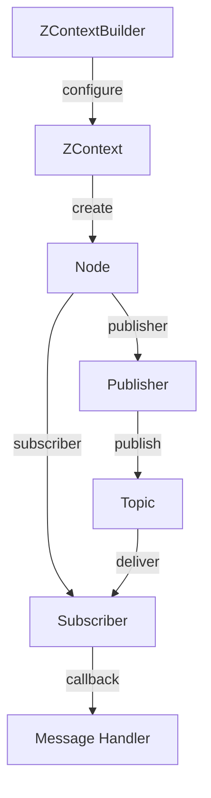

# Publishers and Subscribers

**ros-z implements ROS 2's publish-subscribe pattern with type-safe, zero-copy messaging over Zenoh.** This enables efficient, decoupled communication between nodes with minimal overhead.

```admonish note
The pub-sub pattern forms the foundation of ROS 2 communication, allowing nodes to exchange data without direct coupling. ros-z leverages Zenoh's efficient transport layer for optimal performance.
```

## Visual Flow



## Key Features

| Feature | Description | Benefit |
|---------|-------------|---------|
| **Type Safety** | Strongly-typed messages using Rust structs | Compile-time error detection |
| **Zero-Copy** | Efficient message passing via Zenoh | Reduced latency and CPU usage |
| **QoS Profiles** | Configurable reliability, durability, history | Fine-grained delivery control |
| **Async/Blocking** | Dual API for both paradigms | Flexible integration patterns |

## Code Patterns

**Creating a Publisher:**

```rust,ignore
let publisher = node
    .create_pub::<RosString>("topic_name")
    .build()?;

publisher.publish(RosString {
    data: "Hello".into()
})?;
```

**Creating a Subscriber:**

```rust,ignore
let subscriber = node
    .create_sub::<RosString>("topic_name")
    .build()?;

while let Ok(msg) = subscriber.recv() {
    println!("Received: {}", msg.data);
}
```

**With Custom QoS:**

```rust,ignore
use ros_z::qos::{QosProfile, QosHistory, Reliability};

let qos = QosProfile {
    history: QosHistory::KeepLast(10),
    reliability: Reliability::Reliable,
    ..Default::default()
};

let publisher = node
    .create_pub::<RosString>("topic")
    .with_qos(qos)
    .build()?;
```

```admonish tip
Use `QosHistory::KeepLast(1)` for sensor data and `Reliability::Reliable` for critical commands. Match QoS profiles between publishers and subscribers for optimal message delivery.
```

## API Modes

ros-z provides both asynchronous and blocking APIs to match your application architecture.

**Async Pattern:**

```rust,ignore
publisher.async_publish(msg).await?;
let msg = subscriber.async_recv().await?;
```

**Blocking Pattern:**

```rust,ignore
publisher.publish(msg)?;
let msg = subscriber.recv_timeout(Duration::from_secs(1))?;
```

```admonish info
Async APIs integrate with `tokio` and other async runtimes. Blocking APIs are simpler for single-threaded applications or quick prototypes.
```

## Resources

- **[Simple Publisher/Subscriber](./simple_pub.md)** - Combined talker/listener example
- **[Demo Talker](./demo_talker.md)** - Standalone publisher implementation
- **[Demo Listener](./demo_listener.md)** - Standalone subscriber implementation
- **[Custom Messages](./custom_messages.md)** - Defining and using custom message types

**Start with the simple example to understand the basic pub-sub workflow, then explore custom messages for domain-specific communication.**
