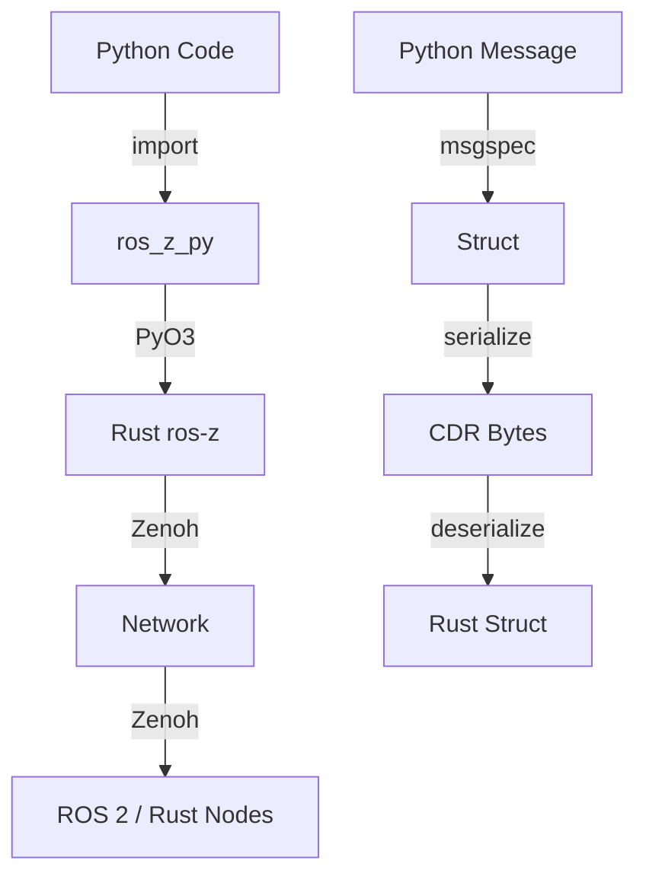

# Python Bindings

**ros-z provides Python bindings via `ros-z-py`, enabling Python applications to communicate with Rust and ROS 2 nodes using the same Zenoh transport.** The bindings use PyO3 for Rust-Python interop and msgspec for efficient message serialization.

```admonish note
Python bindings provide the same pub/sub and service patterns as Rust, with Pythonic APIs. Messages are automatically serialized/deserialized between Python objects and CDR format for ROS 2 compatibility.
```

## Visual Flow



## Installation

### Prerequisites

- Python 3.8+
- Rust toolchain
- maturin (`pip install maturin`)

### Setup

```bash
# Create and activate virtual environment
cd ros-z-py
python -m venv .venv
source .venv/bin/activate

# Install message types
pip install -e ../crates/ros-z-msgs/python/

# Build and install ros-z-py
maturin develop
```

```admonish tip
Use `maturin develop --release` for optimized builds when benchmarking or running in production.
```

## Quick Start

Here's a complete publisher and subscriber example from [`ros-z-py/examples/topic_demo.py`](https://github.com/ZettaScaleLabs/ros-z/blob/main/ros-z-py/examples/topic_demo.py):

### Publisher (Talker)

```python
{{#include ../../../crates/ros-z-py/examples/topic_demo.py:run_talker}}
```

### Subscriber (Listener)

```python
{{#include ../../../crates/ros-z-py/examples/topic_demo.py:run_listener}}
```

## Key Components

| Component | Purpose | Python API |
|-----------|---------|------------|
| **ZContextBuilder** | Configure ros-z environment | `ZContextBuilder().with_domain_id(0).build()` |
| **ZContext** | Manages ROS 2 connections | Entry point for creating nodes |
| **Node** | Logical unit of computation | `ctx.create_node("name").build()` |
| **Publisher** | Sends messages to topics | `node.create_publisher(topic, type)` |
| **Subscriber** | Receives messages from topics | `node.create_subscriber(topic, type)` |
| **Client** | Sends service requests | `node.create_client(service, type)` |
| **Server** | Handles service requests | `node.create_server(service, type)` |


## Service Patterns

Examples from [`ros-z-py/examples/service_demo.py`](https://github.com/ZettaScaleLabs/ros-z/blob/main/ros-z-py/examples/service_demo.py):

### Service Server

```python
{{#include ../../../crates/ros-z-py/examples/service_demo.py:run_server}}
```

### Service Client

```python
{{#include ../../../crates/ros-z-py/examples/service_demo.py:run_client}}
```

```admonish tip
Service servers use a pull model: `take_request()` blocks until a request arrives. This gives you explicit control over when to process requests.
```

## Complex Messages

Python bindings support nested message types like `geometry_msgs/Twist`:

```python
from ros_z_py import geometry_msgs

# Create a Twist message with nested Vector3
twist = geometry_msgs.Twist(
    linear=geometry_msgs.Vector3(x=1.0, y=0.0, z=0.0),
    angular=geometry_msgs.Vector3(x=0.0, y=0.0, z=0.5)
)

pub = node.create_publisher("/cmd_vel", "geometry_msgs/msg/Twist")
pub.publish(twist)
```

## Context Configuration

### Connect to Specific Endpoint

```python
ctx = (
    ros_z_py.ZContextBuilder()
    .with_connect_endpoints(["tcp/192.168.1.100:7447"])
    .build()
)
```

### Disable Multicast Scouting

```python
ctx = (
    ros_z_py.ZContextBuilder()
    .with_domain_id(0)
    .disable_multicast_scouting()
    .build()
)
```

### Custom Namespace

```python
node = ctx.create_node("my_node").with_namespace("/robot1").build()
```

## ROS 2 Interoperability

Python nodes work seamlessly with Rust and ROS 2 nodes:

```bash
# Terminal 1: Start Zenoh router
cargo run --example zenoh_router

# Terminal 2: Run Python publisher (using topic_demo.py)
cd ros-z-py
source .venv/bin/activate
python examples/topic_demo.py -r talker

# Terminal 3: Listen with ROS 2 CLI
ros2 topic echo /chatter std_msgs/msg/String
```

```admonish success
Messages published from Python are received by ROS 2 CLI, Rust nodes, and any other ROS 2-compatible system connected via Zenoh.
```

## Running Tests

```bash
# Python unit tests
cd ros-z-py
source .venv/bin/activate
python -m pytest tests/ -v

# Python-Rust interop tests
cargo test --features python-interop -p ros-z-tests --test python_interop -- --test-threads=1
```

## Troubleshooting

````admonish question collapsible=true title="Import errors when using ros_z_py"
This error occurs when the package hasn't been built or installed correctly.

**Solution:**

Rebuild and install the package:

```bash
cd ros-z-py
source .venv/bin/activate
pip install -e ../crates/ros-z-msgs/python/
maturin develop
```
````

````admonish question collapsible=true title="Message type not found"
This error occurs when trying to use a message type that isn't registered.

**Solution:**

Check which message types are available:

```python
from ros_z_py import ros_z_msgs
print(ros_z_msgs.list_registered_types())
```

Ensure the message package is enabled in `ros-z-msgs/Cargo.toml` features.
````

````admonish question collapsible=true title="recv() always returns None"
This happens when no messages are being received within the timeout period.

**Solution:**

- Check the topic name matches exactly (including leading `/`)
- Verify the publisher is running and connected to the same Zenoh network
- Increase the timeout value
- Use `--nocapture` with pytest to see debug output: `python -m pytest tests/ -v --capture=no`
````

## Resources

- **[Code Generation Internals](./python_codegen.md)** - How Python bindings are generated
- **[Pub/Sub](./pubsub.md)** - Deep dive into pub-sub patterns
- **[Services](./services.md)** - Request-response communication
- **[Message Generation](./message_generation.md)** - How message types work
- **[Networking](./networking.md)** - Zenoh router setup and options

**Start with the pub/sub example to understand the basics, then explore services for request-response patterns.**
