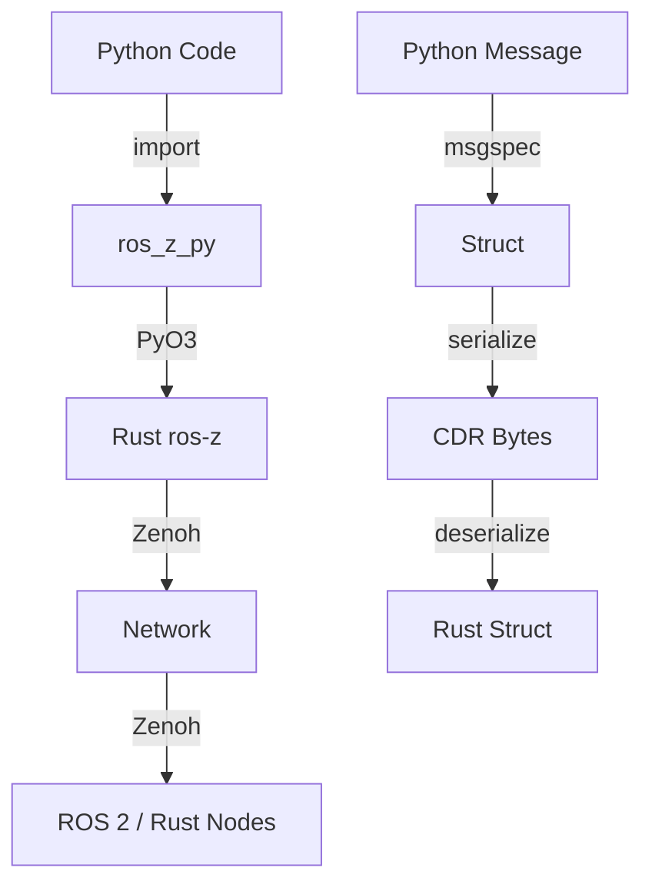

# Python Bindings

**ros-z provides Python bindings via `ros-z-py`, enabling Python applications to communicate with Rust and ROS 2 nodes using the same Zenoh transport.** The bindings use PyO3 for Rust-Python interop and msgspec for efficient message serialization.

```admonish note
Python bindings provide the same pub/sub and service patterns as Rust, with Pythonic APIs. Messages are automatically serialized/deserialized between Python objects and CDR format for ROS 2 compatibility.
```

## Visual Flow


```mermaid
graph TD
    A[Python Code] -->|import| B[ros_z_py]
    B -->|PyO3| C[Rust ros-z]
    C -->|Zenoh| D[Network]
    D -->|Zenoh| E[ROS 2 / Rust Nodes]

    F[Python Message] -->|msgspec| G[Struct]
    G -->|serialize| H[CDR Bytes]
    H -->|deserialize| I[Rust Struct]
```

## Installation

### Prerequisites

- Python 3.8+
- Rust 1.85+ — install via [rustup](https://rustup.rs): `curl --proto '=https' --tlsv1.2 -sSf https://sh.rustup.rs | sh`
- maturin — `pip install maturin`

```admonish tip title="Using Nix"
If you use Nix, run `nix develop` in the repo root. It provides Rust, maturin, and all build tools automatically — skip the manual install steps above.
```

### Setup

```bash
# Create and activate virtual environment
cd crates/ros-z-py
python -m venv .venv
source .venv/bin/activate

# Install message types
pip install -e ../ros-z-msgs/python/

# Build and install ros-z-py
maturin develop
```

```admonish tip
Use `maturin develop --release` for optimized builds when benchmarking or running in production.
```

## Quick Start

Here's a complete publisher and subscriber example from [`crates/ros-z-py/examples/topic_demo.py`](https://github.com/ZettaScaleLabs/ros-z/blob/main/crates/ros-z-py/examples/topic_demo.py):

### Publisher (Talker)

```python
{{#include ../../../crates/ros-z-py/examples/topic_demo.py:run_talker}}
```

### Subscriber (Listener)

```python
{{#include ../../../crates/ros-z-py/examples/topic_demo.py:run_listener}}
```

## Key Components

| Component | Purpose | Python API |
|-----------|---------|------------|
| **ZContextBuilder** | Configure ros-z environment | `ZContextBuilder().with_domain_id(0).build()` |
| **ZContext** | Manages ROS 2 connections | Entry point for creating nodes |
| **Node** | Logical unit of computation | `ctx.create_node("name").build()` |
| **Publisher** | Sends messages to topics | `node.create_publisher(topic, type)` |
| **Subscriber** | Receives messages from topics | `node.create_subscriber(topic, type)` |
| **Client** | Sends service requests | `node.create_client(service, type)` |
| **Server** | Handles service requests | `node.create_server(service, type)` |


## Service Patterns

Examples from [`crates/ros-z-py/examples/service_demo.py`](https://github.com/ZettaScaleLabs/ros-z/blob/main/crates/ros-z-py/examples/service_demo.py):

### Service Server

```python
{{#include ../../../crates/ros-z-py/examples/service_demo.py:run_server}}
```

### Service Client

```python
{{#include ../../../crates/ros-z-py/examples/service_demo.py:run_client}}
```

```admonish tip
Service servers use a pull model: `take_request()` blocks until a request arrives. This gives you explicit control over when to process requests.
```

## Action Patterns

Actions extend services with long-running execution, incremental feedback, and cancellation.
A goal is sent by the client, accepted or rejected by the server, executed with feedback
published at each step, and finally terminated with a result.

Examples from [`crates/ros-z-py/examples/action_demo.py`](https://github.com/ZettaScaleLabs/ros-z/blob/main/crates/ros-z-py/examples/action_demo.py).

### Defining Message Types

Actions require three message structs: Goal, Result, and Feedback.
Each must have a `__msgtype__` class attribute:

```python
{{#include ../../../crates/ros-z-py/examples/action_demo.py:message_types}}
```

```admonish tip
Types from `ros_z_msgs_py` already have `__msgtype__` and a ROS 2 type hash. Inline
`msgspec.Struct` types (as above) use a zero hash and are **Python-to-Python only** —
they are not compatible with `rmw_zenoh_cpp` typed actions.
```

### Action Server

```python
{{#include ../../../crates/ros-z-py/examples/action_demo.py:run_server}}
```

#### Server Lifecycle

1. `recv_goal(timeout)` — blocks until a goal arrives; returns `None` on timeout
2. `request.goal()` — deserialize the goal payload
3. `request.accept_and_execute()` → `ServerGoalHandle` — or `request.reject()`
4. `handle.publish_feedback(fb)` — send incremental progress
5. `handle.is_cancel_requested` — poll for client cancellation
6. `handle.succeed(result)` / `handle.abort(result)` / `handle.canceled(result)` — terminate

### Action Client

```python
{{#include ../../../crates/ros-z-py/examples/action_demo.py:run_client}}
```

#### Client Lifecycle

1. `client.send_goal(goal)` → `ActionGoalHandle` — blocks until accepted (raises on rejection)
2. `handle.recv_feedback(timeout)` — receive next feedback; returns `None` when channel closes
3. `handle.get_result(timeout)` — block until terminal state; returns `None` on timeout
4. `handle.cancel()` — request cancellation (the server decides when to honour it)

### Goal Status

A goal moves through these states during its lifetime:

```text
send_goal()
    │
    ▼
ACCEPTED ──► EXECUTING ──► SUCCEEDED
                │
                ├─ cancel() ──► CANCELING ──► CANCELED
                │
                └─ server abort ──────────── ABORTED
```

`handle.status` returns the current state as an integer.
`GoalStatus` wraps it with helpers:

```python,ignore
status = ros_z_py.GoalStatus(handle.status)
status.is_active()    # True while ACCEPTED / EXECUTING / CANCELING
status.is_terminal()  # True once SUCCEEDED / CANCELED / ABORTED
```

```admonish warning
Python actions use a byte-wrapping wire format that is **not compatible** with
`rmw_zenoh_cpp` typed actions. Use the Rust `ZAction` trait for ROS 2 interop.
```

## Complex Messages

Python bindings support nested message types like `geometry_msgs/Twist`:

```python
from ros_z_py import geometry_msgs

# Create a Twist message with nested Vector3
twist = geometry_msgs.Twist(
    linear=geometry_msgs.Vector3(x=1.0, y=0.0, z=0.0),
    angular=geometry_msgs.Vector3(x=0.0, y=0.0, z=0.5)
)

pub = node.create_publisher("/cmd_vel", geometry_msgs.Twist)
pub.publish(twist)
```

## Context Configuration

### Connect to Specific Endpoint

```python
ctx = (
    ros_z_py.ZContextBuilder()
    .with_connect_endpoints(["tcp/192.168.1.100:7447"])
    .build()
)
```

### Disable Multicast Scouting

```python
ctx = (
    ros_z_py.ZContextBuilder()
    .with_domain_id(0)
    .disable_multicast_scouting()
    .build()
)
```

### Custom Namespace

```python
node = ctx.create_node("my_node").with_namespace("/robot1").build()
```

## Performance: Zero-Copy Large Payloads

When working with large byte arrays (sensor data, images, point clouds), ros-z-py minimizes memory copies using a zero-copy optimization for `uint8[]` and `byte[]` fields.

### ZBufView

When a subscriber receives a message, byte array fields are exposed as a `ZBufView` — a zero-copy view into the received network buffer. `ZBufView` implements Python's buffer protocol:

```python
msg = sub.recv(timeout=1.0)
# msg.data is a ZBufView — no copy has occurred

# Zero-copy access via buffer protocol
mv = memoryview(msg.data)
header = mv[:8]  # Slice without copying the entire payload

# Only copies when explicitly converted
data = bytes(msg.data)
```

### Echo Without Copying

For relay and echo patterns, pass `ZBufView` fields directly to a new message. The derive macro detects `ZBufView` and extracts the inner buffer via reference counting — no data copy occurs:

```python
# Receive and re-publish — zero-copy for byte array fields
msg = sub.recv(timeout=1.0)
echo = std_msgs.ByteMultiArray(data=msg.data)  # No copy!
pub.publish(echo)
```

### ZBufView API

| Method | Description |
|--------|-------------|
| `len(view)` | Number of bytes |
| `bool(view)` | True if not empty |
| `view[i]` | Single byte access |
| `view[start:stop]` | Slice (returns `bytes`) |
| `memoryview(view)` | Zero-copy buffer protocol access |
| `bytes(view)` | Convert to `bytes` (copies) |
| `view.is_zero_copy` | Whether the view avoids internal copying |

```admonish tip
For best performance with large payloads, avoid calling `bytes()` on `ZBufView` fields. Use `memoryview()` for read access, or pass the `ZBufView` directly when re-publishing.
```

### How It Works

The optimization operates at three layers:

1. **Deserialization bypass**: When the Python subscriber receives a message, the raw network buffer (ZBuf) is stored in a thread-local. During CDR deserialization, byte array fields create sub-views into this buffer instead of copying (`ZSlice::subslice()`).

2. **Buffer protocol**: `ZBufView` wraps the ZBuf and exposes its bytes to Python via `__getbuffer__`/`__releasebuffer__`. For contiguous buffers (the common case), this is a direct pointer — no copy at all.

3. **Pass-through re-publish**: The `FromPyMessage` derive macro recognizes `ZBufView` inputs and extracts the inner ZBuf via `clone()`, which only increments a reference count on the underlying memory.

## ROS 2 Interoperability

Python nodes interoperate with ROS 2 C++ nodes via the shared Zenoh transport. See the dedicated **[ROS 2 Interoperability](./interop.md)** chapter for setup instructions.

## Running Tests

```bash
# Python unit tests
cd crates/ros-z-py
source .venv/bin/activate
python -m pytest tests/ -v

# Python-Rust interop tests
cargo test --features python-interop -p ros-z-tests --test python_interop -- --test-threads=1
```

## Troubleshooting

````admonish question collapsible=true title="Import errors when using ros_z_py"
This error occurs when the package hasn't been built or installed correctly.

**Solution:**

Rebuild and install the package:

```bash
cd crates/ros-z-py
source .venv/bin/activate
pip install -e ../ros-z-msgs/python/
maturin develop
```
````

````admonish question collapsible=true title="Message type not found"
This error occurs when trying to use a message type that isn't supported by the Python bindings.

**Solution:**

Check the supported message types by looking at the match arms in `crates/ros-z-py/src/node.rs`.
Currently supported: `std_msgs/String`, `std_msgs/ByteMultiArray`, `geometry_msgs/Vector3`,
`geometry_msgs/Twist`, `sensor_msgs/LaserScan`, and `example_interfaces/AddTwoInts`.

Ensure you are passing a message class object (e.g., `std_msgs.String`), not a string.
````

````admonish question collapsible=true title="recv() always returns None"
This happens when no messages are being received within the timeout period.

**Solution:**

- Check the topic name matches exactly (including leading `/`)
- Verify the publisher is running and connected to the same Zenoh network
- Increase the timeout value
- Use `--nocapture` with pytest to see debug output: `python -m pytest tests/ -v --capture=no`
````

## Resources

- **[Code Generation Internals](./python_codegen.md)** - How Python bindings are generated
- **[Pub/Sub](./pubsub.md)** - Deep dive into pub-sub patterns
- **[Services](./services.md)** - Request-response communication
- **[Message Generation](./message_generation.md)** - How message types work
- **[Networking](./networking.md)** - Zenoh router setup and options

**Start with the pub/sub example to understand the basics, then explore services for request-response patterns.**
