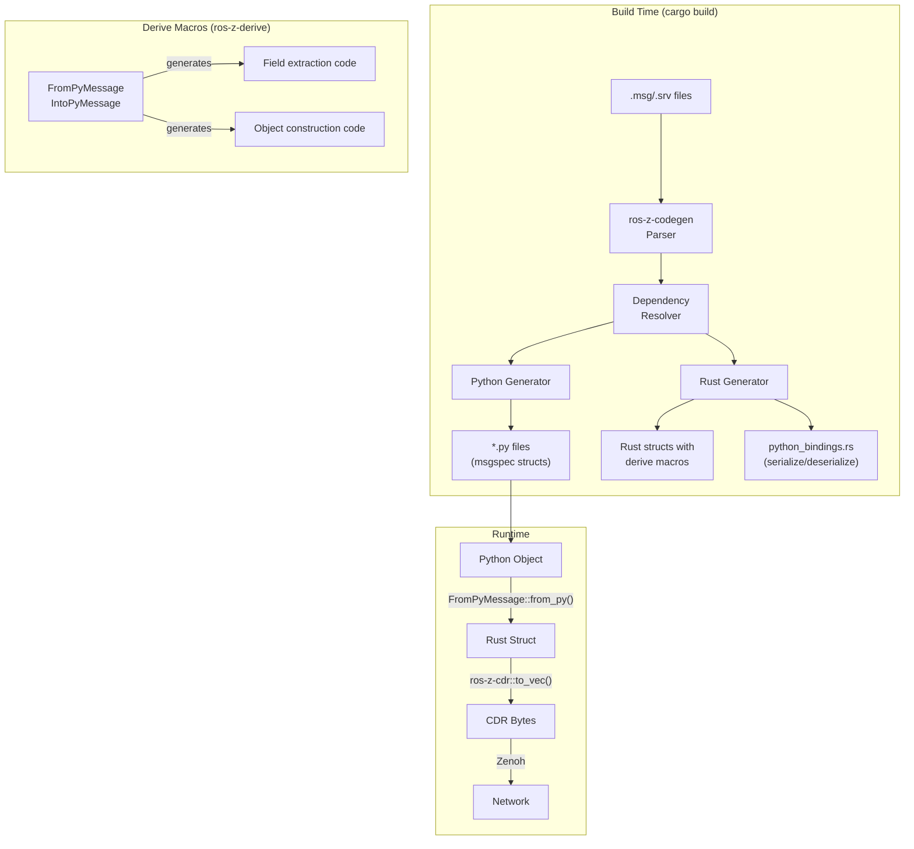
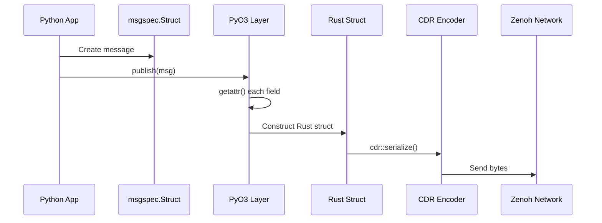
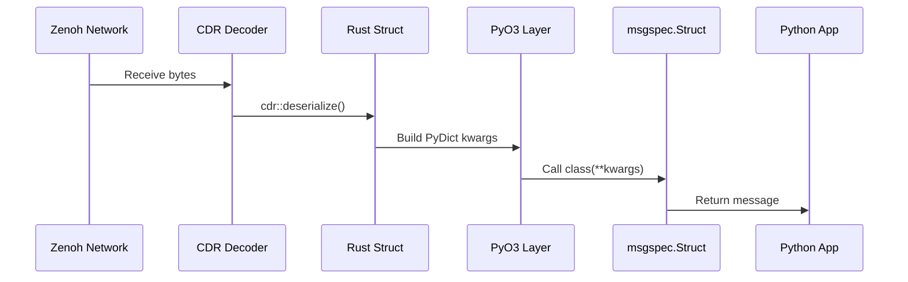
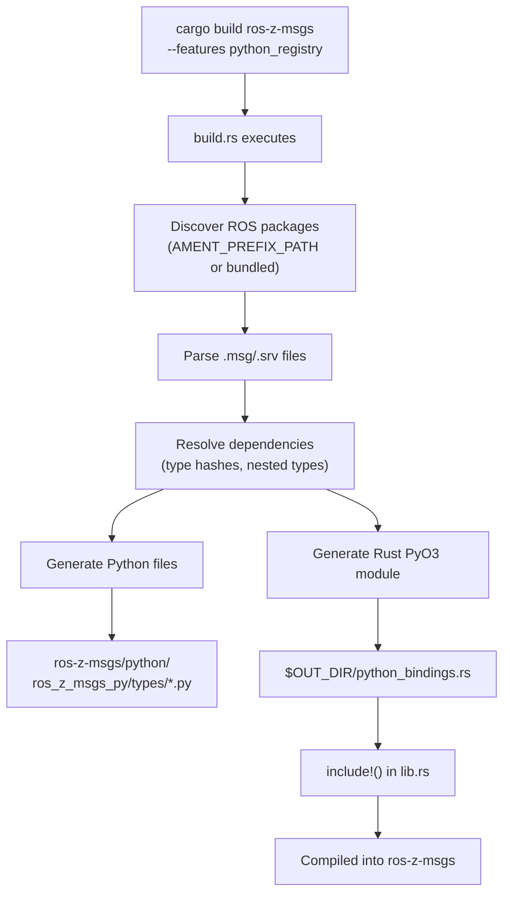

# Python Code Generation Internals

This chapter explains how ros-z generates Python bindings for ROS 2 messages, including the architecture, generated code structure, and design rationale.

## Architecture Overview

ros-z uses a **hybrid approach**: Python classes for ergonomics, Rust for serialization performance. The architecture uses **derive macros** for automatic Python-Rust conversion of arbitrarily nested message types.



### Key Components

| Component | Location | Purpose |
|-----------|----------|---------|
| **Python Generator** | `ros-z-codegen/src/generator/python.rs` | Generates msgspec struct classes |
| **Rust Generator** | `ros-z-codegen/src/generator/rust.rs` | Generates Rust structs with derive attributes |
| **PyO3 Generator** | `ros-z-codegen/src/python_msgspec_generator.rs` | Generates serialize/deserialize wrapper functions |
| **Derive Macros** | `ros-z-derive/src/lib.rs` | `FromPyMessage` and `IntoPyMessage` derive macros |
| **Bridge Traits** | `ros-z/src/python_bridge.rs` | Core traits for Python-Rust conversion |
| **Build Script** | `ros-z-msgs/build.rs` | Orchestrates code generation at build time |
| **Generated Python** | `ros-z-msgs/python/ros_z_msgs_py/types/*.py` | One file per ROS package |
| **Generated Rust** | `$OUT_DIR/python_bindings.rs` | Compiled into `ros-z-msgs` crate |

## Generated Code Examples

### Python: msgspec Structs

For each ROS message, a frozen `msgspec.Struct` is generated:

```python
# Generated from std_msgs/msg/String.msg
class String(msgspec.Struct, frozen=True, kw_only=True):
    data: str = ""

    __msgtype__: ClassVar[str] = 'std_msgs/msg/String'
    __hash__: ClassVar[str] = 'RIHS01_df668c740482bbd48fb39d76a70dfd4bd59db1288021743503259e948f6b1a18'
```

Nested messages use forward references:

```python
# Generated from geometry_msgs/msg/Twist.msg
class Twist(msgspec.Struct, frozen=True, kw_only=True):
    linear: "geometry_msgs.Vector3 | None" = None
    angular: "geometry_msgs.Vector3 | None" = None

    __msgtype__: ClassVar[str] = 'geometry_msgs/msg/Twist'
    __hash__: ClassVar[str] = 'RIHS01_9c45bf16fe0983d80e3cfe750d6835843d265a9a6c46bd2e609fcddde6fb8d2a'
```

Service request/response types use the service type hash in `__hash__`:

```python
# Generated from example_interfaces/srv/AddTwoInts.srv
class AddTwoIntsRequest(msgspec.Struct, frozen=True, kw_only=True):
    a: int = 0
    b: int = 0

    __msgtype__: ClassVar[str] = 'example_interfaces/msg/AddTwoIntsRequest'
    __hash__: ClassVar[str] = 'RIHS01_e118de6bf5eeb66a2491b5bda11202e7b68f198d6f67922cf30364858239c81a'

class AddTwoIntsResponse(msgspec.Struct, frozen=True, kw_only=True):
    sum: int = 0

    __msgtype__: ClassVar[str] = 'example_interfaces/msg/AddTwoIntsResponse'
    __hash__: ClassVar[str] = 'RIHS01_e118de6bf5eeb66a2491b5bda11202e7b68f198d6f67922cf30364858239c81a'
```

For service types, `__hash__` contains the service type hash (computed from the combined request/response definition). Both request and response share the same hash since they belong to the same service. This differs from regular messages where `__hash__` contains the individual message type hash.

### Rust: Generated Structs with Derive Macros

The Rust code generator adds derive attributes to message structs:

```rust,ignore
// Generated from std_msgs/msg/String.msg
#[derive(Debug, Clone, Default, ::serde::Serialize, ::serde::Deserialize)]
#[cfg_attr(feature = "python_registry", derive(::ros_z_derive::FromPyMessage, ::ros_z_derive::IntoPyMessage))]
#[cfg_attr(feature = "python_registry", ros_msg(module = "ros_z_msgs_py.types.std_msgs"))]
pub struct String {
    pub data: std::string::String,
}
```

For nested messages with optional fields:

```rust,ignore
// Generated from geometry_msgs/msg/Twist.msg
#[derive(Debug, Clone, Default, ::serde::Serialize, ::serde::Deserialize)]
#[cfg_attr(feature = "python_registry", derive(::ros_z_derive::FromPyMessage, ::ros_z_derive::IntoPyMessage))]
#[cfg_attr(feature = "python_registry", ros_msg(module = "ros_z_msgs_py.types.geometry_msgs"))]
pub struct Twist {
    pub linear: Vector3,
    pub angular: Vector3,
}
```

### Rust: PyO3 Serialize/Deserialize Functions

The serialize/deserialize functions use the derive macro traits:

```rust,ignore
// Generated serialize function - uses FromPyMessage trait
#[pyfunction]
pub fn serialize_string(py: Python, msg: &Bound<'_, PyAny>) -> PyResult<Vec<u8>> {
    use ::pyo3::types::PyAnyMethods;
    use ::ros_z::python_bridge::FromPyMessage;

    // Derive macro handles all field extraction recursively
    let rust_msg = <ros::std_msgs::String>::from_py(msg)?;

    // CDR serialization with 4-byte encapsulation header
    let mut cdr_data = ros_z_cdr::to_vec::<_, ros_z_cdr::LittleEndian>(&rust_msg, 256)
        .map_err(|e| pyo3::exceptions::PyValueError::new_err(e.to_string()))?;
    let mut result = vec![0x00, 0x01, 0x00, 0x00]; // CDR encapsulation header
    result.append(&mut cdr_data);
    Ok(result)
}

// Generated deserialize function - uses IntoPyMessage trait
#[pyfunction]
pub fn deserialize_string(py: Python, bytes: &[u8]) -> PyResult<PyObject> {
    use ::ros_z::python_bridge::IntoPyMessage;

    // Skip 4-byte CDR encapsulation header
    let cdr_data = &bytes[4..];
    let (rust_msg, _): (ros::std_msgs::String, _) = ros_z_cdr::from_bytes::<_, ros_z_cdr::LittleEndian>(cdr_data)
        .map_err(|e| pyo3::exceptions::PyValueError::new_err(e.to_string()))?;

    // Derive macro handles all field construction recursively
    rust_msg.into_py_message(py)
}
```

## Data Flow

### Publishing (Python to Wire)



### Subscribing (Wire to Python)



## Type Mapping

### ROS to Python Type Mapping

| ROS Type | Python Type | Notes |
|----------|-------------|-------|
| `bool` | `bool` | |
| `byte`, `uint8`, `int8`, `int16`, `uint16`, `int32`, `uint32`, `int64`, `uint64` | `int` | Python has arbitrary precision |
| `float32`, `float64` | `float` | |
| `string` | `str` | |
| `T[]` (unbounded array) | `list[T]` | |
| `T[N]` (fixed array) | `list[T]` | Size not enforced in Python |
| `uint8[]` / `byte[]` | `list[int]` | Could optimize to `bytes` |
| Nested message | `"pkg.MsgName \| None"` | Forward reference string |


## Design: Hybrid Python + Rust with Derive Macros

```text
┌─────────────────────────────────────────────────────────────┐
│                    Current Architecture                      │
├─────────────────────────────────────────────────────────────┤
│  Python Layer          │  Rust Layer (via PyO3)             │
│  ─────────────         │  ──────────────────────            │
│  • msgspec structs     │  • Derive macros                   │
│  • Type annotations    │  • Trait-based conversion          │
│  • IDE support         │  • CDR serialization               │
│  • User-facing API     │  • Zenoh transport                 │
│                        │  • Memory management               │
└─────────────────────────────────────────────────────────────┘
```

**Features:**

- Fast serialization (Rust CDR implementation)
- Type-safe Python classes with IDE support
- Immutable messages (`frozen=True`)
- Automatic type hash validation
- Zero-copy where possible (ZBuf for byte arrays)
- **Derive macros handle arbitrary nesting depth automatically**
- **None handling for optional nested fields**
- **Minimal generated code (traits do the work)**


## Build Process

### Step-by-step Flow



### Output Locations

| Output | Path | Committed? |
|--------|------|------------|
| Python msgspec classes | `ros-z-msgs/python/ros_z_msgs_py/types/*.py` | Yes |
| Rust PyO3 bindings | `target/.../ros-z-msgs-.../out/python_bindings.rs` | No (generated) |

### Feature Flags

The Python codegen is gated behind the `python_registry` feature:


```rust
// lib.rs
#[cfg(feature = "python_registry")]
include!(concat!(env!("OUT_DIR"), "/python_bindings.rs"));
```

The `ros-z-derive` crate provides the derive macros, and `ros-z/python` enables the `FromPyMessage` and `IntoPyMessage` traits.
