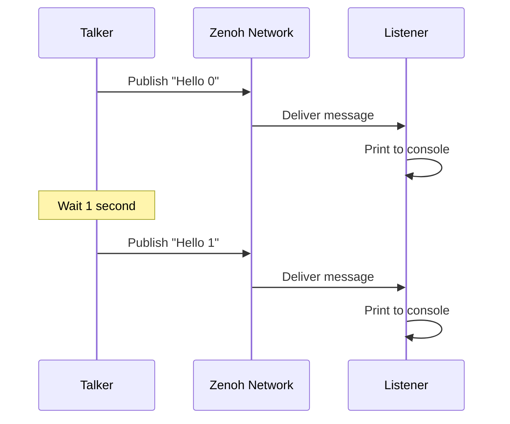

# Quick Start

**Get ros-z running in under 5 minutes with this hands-on tutorial.** Build a complete publisher-subscriber system to understand the core concepts through working code.

```admonish tip
This guide assumes basic Rust knowledge. If you're new to Rust, complete the [Rust Book](https://doc.rust-lang.org/book/) first for the best experience.
```

## Choose Your Path

There are two ways to get started with ros-z:

1. **[Try the Examples](#option-1-try-the-examples)** - Clone the ros-z repository and run pre-built examples (fastest way to see it in action)
2. **[Create Your Own Project](#option-2-create-your-own-project)** - Start a new Rust project with ros-z as a dependency

---

## Option 1: Try the Examples

The quickest way to experience ros-z is to run the included examples from the repository.

### Clone the Repository

```bash
git clone https://github.com/ZettaScaleLabs/ros-z.git
cd ros-z
```

### Start the Zenoh Router

ros-z supports two discovery modes: **peer mode** (multicast, works on a single machine) and **client mode** (router-based, required for multi-machine and ROS 2 interop). The examples default to peer mode, so the router is optional for this local demo — but starting one gets you familiar with the production setup that matches ROS 2's `rmw_zenoh`.

**Terminal 1 - Start the Router:**

```bash
cargo run --example zenoh_router
```

### Run the Pub/Sub Example

Open two more terminals and navigate to the same `ros-z` directory:

**Terminal 2 - Start the Listener:**

```bash
cd ros-z
cargo run --example z_pubsub -- -r listener
```

**Terminal 3 - Start the Talker:**

```bash
cd ros-z
cargo run --example z_pubsub -- -r talker
```

```admonish success
You should see the listener receiving messages published by the talker in real-time. Press Ctrl+C to stop any process.
```

### Understanding the Code

Here's the complete example you just ran:

```rust,ignore
{{#include ../../../crates/ros-z/examples/z_pubsub.rs}}
```

---

## Option 2: Create Your Own Project

Ready to build your own ros-z application? Follow these steps to create a new project from scratch.

### 1. Install the Zenoh Router

Since you won't have access to the `zenoh_router` example outside the ros-z repository, you'll need to install a Zenoh router. Here are the quickest options:

**Option A: Using cargo (if you have Rust):**

```bash
cargo install zenohd
```

**Option B: Using pre-built binary (no Rust needed):**

Download the latest release for your platform from:
**<https://github.com/eclipse-zenoh/zenoh/releases>**

Then extract and run:

```bash
unzip zenoh-*.zip
chmod +x zenohd
./zenohd
```

**Option C: Using Docker:**

```bash
docker run --init --net host eclipse/zenoh:latest
```

**Start the router:**

```bash
zenohd
```

```admonish tip
For more installation options (apt, brew, Windows, etc.), see the comprehensive [Zenoh Router Installation Guide](./networking.md#running-the-zenoh-router).
```

```admonish note
Keep the router running in a separate terminal. All ros-z applications will connect to it.
```

### 2. Create a New Rust Project

```bash
cargo new my_ros_z_project
cd my_ros_z_project
```

### 3. Add Dependencies

Add ros-z to your `Cargo.toml`:

```toml
[dependencies]
ros-z = { git = "https://github.com/ZettaScaleLabs/ros-z.git" }
ros-z-msgs = { git = "https://github.com/ZettaScaleLabs/ros-z.git" }  # Standard ROS 2 message types
tokio = { version = "1", features = ["full"] }  # Async runtime
```

```admonish note
An async runtime is required for ros-z. This example uses Tokio, the most popular choice in the Rust ecosystem.
```

### 4. Write Your First Application

Replace the contents of `src/main.rs` with this simple publisher example:

```rust,ignore
use std::time::Duration;
use ros_z::{Builder, Result, context::ZContextBuilder};
use ros_z_msgs::std_msgs::String as RosString;

#[tokio::main]
async fn main() -> Result<()> {
    // Initialize ros-z context (connects to router on localhost:7447)
    let ctx = ZContextBuilder::default().build()?;

    // Create a ROS 2 node
    let node = ctx.create_node("my_talker").build()?;

    // Create a publisher for the /chatter topic
    let pub_handle = node.create_pub::<RosString>("/chatter").build()?;

    // Publish messages every second
    let mut count = 0;
    loop {
        let msg = RosString {
            data: format!("Hello from ros-z #{}", count),
        };
        println!("Publishing: {}", msg.data);
        pub_handle.async_publish(&msg).await?;

        count += 1;
        tokio::time::sleep(Duration::from_secs(1)).await;
    }
}
```

### 5. Run Your Application

Make sure the Zenoh router (`zenohd`) is running in another terminal, then:

```bash
cargo run
```

```admonish success
You should see messages being published every second. The application will continue until you press Ctrl+C.
```

### 6. Test with Multiple Nodes

Open another terminal and create a simple listener to verify communication:

**Create `src/bin/listener.rs`:**

```rust,ignore
use ros_z::{Builder, Result, context::ZContextBuilder};
use ros_z_msgs::std_msgs::String as RosString;

#[tokio::main]
async fn main() -> Result<()> {
    let ctx = ZContextBuilder::default().build()?;
    let node = ctx.create_node("my_listener").build()?;
    let sub = node.create_sub::<RosString>("/chatter").build()?;

    println!("Listening on /chatter...");
    while let Ok(msg) = sub.async_recv().await {
        println!("Received: {}", msg.data);
    }
    Ok(())
}
```

**Run both:**

```bash
# Terminal 1: Router
zenohd

# Terminal 2: Publisher
cargo run

# Terminal 3: Listener
cargo run --bin listener
```

---

## Key Components

| Component | Purpose | Usage |
|-----------|---------|-------|
| **ZContextBuilder** | Initialize ros-z environment | Entry point, configure settings |
| **ZContext** | Manages ROS 2 connections | Create nodes from this |
| **Node** | Logical unit of computation | Publishers/subscribers attach here |
| **Publisher** | Sends messages to topics | `node.create_pub::<Type>("topic")` |
| **Subscriber** | Receives messages from topics | `node.create_sub::<Type>("topic")` |

```admonish tip title="Why a Zenoh router?"
ros-z uses router-based discovery by default, aligning with ROS 2's official Zenoh middleware (`rmw_zenoh_cpp`). This provides:
- **Better scalability** for large deployments with many nodes
- **Lower network overhead** compared to multicast discovery
- **Production-ready** architecture used in real ROS 2 systems

See the [Networking](./networking.md) chapter for customization options, including how to revert to multicast scouting mode if needed.
```

```admonish info title="Key Terms"
**key expression** — Zenoh's topic addressing scheme. A string like `0/chatter/std_msgs::msg::dds_::String_/RIHS01_<hash>` that identifies where messages flow. ros-z maps ROS 2 topic names to key expressions automatically.

**CDR** — Common Data Representation, the binary serialization format used by all ROS 2 middleware. ros-z serializes message structs to CDR bytes before publishing.

**RIHS01** — ROS Interface Hash Scheme 01, a hash of the message definition that ensures publisher and subscriber agree on the exact message fields. If the hash differs, messages are silently dropped.

**RMW** — ROS MiddleWare interface, the plugin layer that connects ROS 2 nodes to an underlying transport (DDS, Zenoh, etc.). `rmw_zenoh_cpp` is the RMW that lets standard ROS 2 C++/Python nodes speak Zenoh.
```

## What's Happening?



The talker publishes messages every second to the `/chatter` topic. The listener subscribes to the same topic and prints each received message. Zenoh handles the network transport transparently.

```admonish info
Both nodes run independently. You can start/stop them in any order, and multiple listeners can receive from one talker simultaneously.
```

## Next Steps

Now that you understand the basics:

**Core Concepts:**

- **[Pub/Sub](./pubsub.md)** - Deep dive into pub-sub patterns and QoS
- **[Services](./services.md)** - Request-response communication
- **[Actions](./actions.md)** - Long-running tasks with feedback
- **[Message Generation](./message_generation.md)** - How message types work
- **[Custom Messages](./custom_messages.md)** - Define your own message types

**Development:**

- **[Building](./building.md)** - Build configurations and dependencies
- **[Networking](./networking.md)** - Zenoh router setup and options
