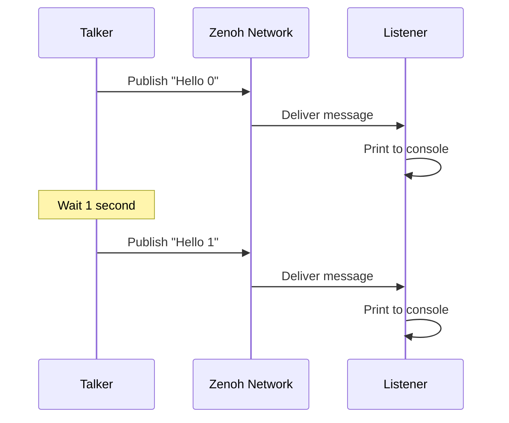

# Quick Start

**Get ros-z running in under 5 minutes with this hands-on tutorial.** Build a complete publisher-subscriber system to understand the core concepts through working code.

```admonish tip
This guide assumes basic Rust knowledge. If you're new to Rust, complete the [Rust Book](https://doc.rust-lang.org/book/) first for the best experience.
```

## Setup

Add ros-z dependencies to your `Cargo.toml`:

```toml
[dependencies]
ros-z = "*"
ros-z-msgs = "*"  # Standard ROS 2 message types
tokio = { version = "1", features = ["full"] }  # Async runtime
```

```admonish note
An async runtime is required for ros-z. This example uses Tokio, the most popular choice in the Rust ecosystem.
```

## Your 1st Example

Here's a complete publisher and subscriber in one application:

```rust,ignore
{{#include ../../../ros-z/examples/z_pubsub.rs}}
```

## Key Components

| Component | Purpose | Usage |
|-----------|---------|-------|
| **ZContextBuilder** | Initialize ros-z environment | Entry point, configure settings |
| **ZContext** | Manages ROS 2 connections | Create nodes from this |
| **Node** | Logical unit of computation | Publishers/subscribers attach here |
| **Publisher** | Sends messages to topics | `node.create_pub::<Type>("topic")` |
| **Subscriber** | Receives messages from topics | `node.create_sub::<Type>("topic")` |

## Running the Application

Open two terminal windows and run:

**Terminal 1 - Start the Listener:**

```bash
cargo run --example z_pubsub -- -r listener
```

**Terminal 2 - Start the Talker:**

```bash
cargo run --example z_pubsub -- -r talker
```

```admonish success
You should see the listener receiving messages published by the talker in real-time. Press Ctrl+C to stop either process.
```

```admonish note title="Why no Zenoh router?"
By default, ros-z uses peer mode with multicast scouting enabled, allowing nodes to discover each other automatically on the same network without requiring a Zenoh router. This makes getting started simple and quick.

However, this default will change to router mode (matching `rmw_zenoh` behavior) once [issue #42](https://github.com/ZettaScaleLabs/ros-z/issues/42) is resolved. For production deployments or distributed setups across different networks, using a Zenoh router is recommended.
```

## What's Happening?



The talker publishes messages every second to the `/chatter` topic. The listener subscribes to the same topic and prints each received message. Zenoh handles the network transport transparently.

```admonish info
Both nodes run independently. You can start/stop them in any order, and multiple listeners can receive from one talker simultaneously.
```

## Next Steps

Now that you understand the basics:

- **[Publishers & Subscribers](./pubsub.md)** - Deep dive into pub-sub patterns and QoS
- **[Services](./services.md)** - Learn request-response communication
- **[Custom Messages](./custom_messages.md)** - Define domain-specific message types

**Experiment by modifying the example: change the topic name, message content, or publishing rate to see how the system responds.**
