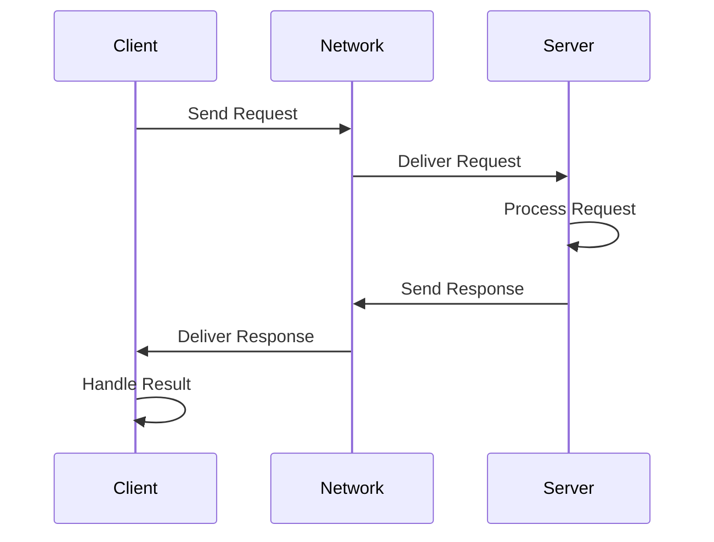

# Services

**Services implement synchronous request-response communication for operations that require immediate feedback.** Unlike pub-sub where messages flow continuously, services provide one-time transactions ideal for commands and queries.

```admonish note
Use services when you need confirmation that an operation completed. Use pub-sub for continuous data streams where individual message delivery doesn't need acknowledgment.
```

## Communication Flow



## Architecture Patterns

| Component | Responsibility | Lifecycle |
|-----------|---------------|-----------|
| **Service Server** | Processes requests, sends responses | Long-lived, always listening |
| **Service Client** | Sends requests, waits for responses | Created per-request or cached |
| **Request Type** | Input data structure | Defined by service definition |
| **Response Type** | Output data structure | Defined by service definition |

## Server Implementation

**Creating a Service Server:**

```rust,ignore
let service = node
    .create_service::<AddTwoInts>("/add_two_ints")
    .build()?;

loop {
    let request = service.take_request()?;

    let response = Response {
        sum: request.a + request.b
    };

    service.send_response(request.request_id, response)?;
}
```

**Key server operations:**

- `take_request()` blocks until a request arrives
- Process the request data
- `send_response()` returns the result to the client

```admonish tip
Run service servers in dedicated threads or async tasks so they don't block your main application logic. Use timeouts on `take_request()` if you need responsive shutdown.
```

## Client Implementation

**Creating a Service Client:**

```rust,ignore
let client = node
    .create_client::<AddTwoInts>("/add_two_ints")
    .build()?;

let request = Request { a: 5, b: 3 };
let request_id = client.send_request(request)?;

let response = client.take_response()?;
println!("Result: {}", response.sum);
```

**Key client operations:**

- `send_request()` sends data and returns a request ID
- `take_response()` blocks until the server responds
- Handle the response or error

```admonish info
Clients can send multiple requests without waiting for responses. Track request IDs to match responses with their corresponding requests in async scenarios.
```

## Complete Example

This example demonstrates both server and client in one application:

```rust,ignore
{{#include ../../../ros-z/examples/z_srvcli.rs}}
```

## Error Handling

Service operations can fail in several ways:

| Error Scenario | Cause | Mitigation |
|----------------|-------|------------|
| **Server not found** | Server not running | Check server status before calling |
| **Timeout** | Server too slow | Increase timeout or optimize server |
| **Network failure** | Connection lost | Implement retry logic with backoff |
| **Serialization error** | Invalid data types | Validate request data before sending |

**Robust error handling:**

```rust,ignore
match client.take_response_timeout(Duration::from_secs(5)) {
    Ok(response) => {
        println!("Success: {}", response.sum);
    }
    Err(e) => {
        eprintln!("Service call failed: {}", e);
        // Implement retry or fallback logic
    }
}
```

```admonish warning
Always handle service errors gracefully. In production systems, implement exponential backoff for retries and circuit breakers to prevent cascade failures.
```

## Running Server and Client

Services require the server to be running before clients can send requests:

**Terminal 1 - Start Server:**

```bash
cargo run --example z_srvcli -- --mode server
```

**Terminal 2 - Send Client Requests:**

```bash
cargo run --example z_srvcli -- --mode client --a 5 --b 3
cargo run --example z_srvcli -- --mode client --a 10 --b 7
```

```admonish success
Each client request will be processed by the server and the result printed in the client terminal. The server continues running to handle multiple requests.
```

## Best Practices

**Server Design:**

- Keep request processing fast to avoid blocking other clients
- Use async processing for long-running operations
- Log all requests for debugging and monitoring

**Client Design:**

- Implement timeouts to prevent indefinite blocking
- Cache client instances for frequently used services
- Validate request data before sending

## Resources

- **[Service Server Example](./service_server.md)** - Detailed AddTwoInts server implementation
- **[Service Client Example](./service_client.md)** - Detailed AddTwoInts client implementation
- **[Demo Nodes](./demo_nodes.md)** - More complex service patterns

**Ready to implement services? Start with the [Service Server Example](./service_server.md) to build your first request handler.**
