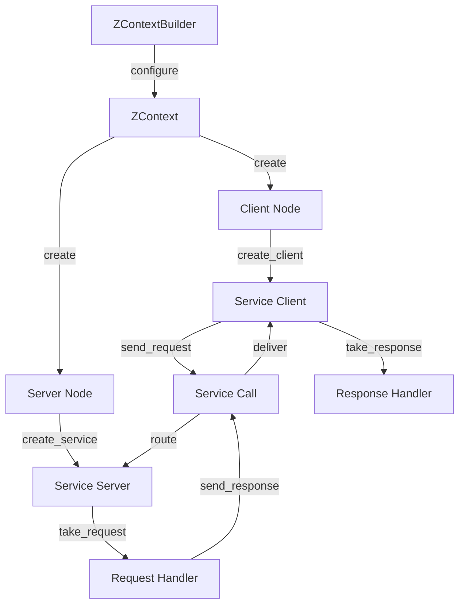

# Services

**ros-z implements ROS 2's service pattern with type-safe request-response communication over Zenoh.** This enables synchronous, point-to-point interactions between nodes using a pull-based model for full control over request processing.

```admonish note
Services provide request-response communication for operations that need immediate feedback. Unlike topics, services are bidirectional and ensure a response for each request. ros-z uses a pull model that gives you explicit control over when to process requests.
```

## Visual Flow



## Key Features

| Feature | Description | Benefit |
|---------|-------------|---------|
| **Type Safety** | Strongly-typed service definitions with Rust structs | Compile-time error detection |
| **Pull Model** | Explicit control over request processing timing | Predictable concurrency and backpressure |
| **Async/Blocking** | Dual API for both paradigms | Flexible integration patterns |
| **Request Tracking** | Key-based request/response matching | Reliable message correlation |

## Service Server Example

This example demonstrates a service server that adds two integers. The server waits for requests, processes them, and sends responses back to clients.

```rust,ignore
{{#include ../../../crates/ros-z/examples/demo_nodes/add_two_ints_server.rs:full_example}}
```

**Key points:**

- **Pull Model**: Uses `take_request()` for explicit control over when to accept requests
- **Request Key**: Each request has a unique key for matching responses
- **Bounded Operation**: Optional `max_requests` parameter for testing
- **Simple Processing**: Demonstrates synchronous request handling

**Running the server:**

```bash
# Basic usage - runs indefinitely
cargo run --example demo_nodes_add_two_ints_server

# Handle 5 requests then exit
cargo run --example demo_nodes_add_two_ints_server -- --count 5

# Connect to specific Zenoh router
cargo run --example demo_nodes_add_two_ints_server -- --endpoint tcp/localhost:7447
```

## Service Client Example

This example demonstrates a service client that sends addition requests to the server and displays the results.

```rust,ignore
{{#include ../../../crates/ros-z/examples/demo_nodes/add_two_ints_client.rs:full_example}}
```

**Key points:**

- **Async Support**: Supports both blocking and async response patterns
- **Timeout Handling**: Uses `take_response_timeout()` for reliable operation
- **Simple API**: Send request, receive response, process result
- **Type Safety**: Request and response types are enforced at compile time

**Running the client:**

```bash
# Basic usage
cargo run --example demo_nodes_add_two_ints_client -- --a 10 --b 20

# Using async mode
cargo run --example demo_nodes_add_two_ints_client -- --a 5 --b 3 --async-mode

# Connect to specific Zenoh router
cargo run --example demo_nodes_add_two_ints_client -- --a 100 --b 200 --endpoint tcp/localhost:7447
```

## Complete Service Workflow

To see services in action, you'll need to start a Zenoh router first:

**Terminal 1 - Start Zenoh Router:**

```bash
cargo run --example zenoh_router
```

**Terminal 2 - Start Server:**

```bash
cargo run --example demo_nodes_add_two_ints_server
```

**Terminal 3 - Send Client Requests:**

```bash
# Request 1
cargo run --example demo_nodes_add_two_ints_client -- --a 10 --b 20

# Request 2
cargo run --example demo_nodes_add_two_ints_client -- --a 100 --b 200
```

<script src="https://asciinema.org/a/yChRkMOyYKoKBPqM.js" id="asciicast-yChRkMOyYKoKBPqM" async="true"></script>

```admonish success
Each client request is processed immediately by the server, demonstrating synchronous request-response communication over Zenoh.
```

## Service Server Patterns

Service servers in ros-z follow a **pull model** pattern, similar to subscribers. You explicitly receive requests when ready to process them, giving you full control over request handling timing and concurrency.

```admonish info
This pull-based approach is consistent with subscriber's `recv()` pattern, allowing you to control when work happens rather than having callbacks interrupt your flow.
```

### Pattern 1: Blocking Request Handling

Best for: Simple synchronous service implementations

```rust,ignore
use ros_z::Builder;

let mut service = node
    .create_service::<ServiceType>("service_name")
    .build()?;

loop {
    let (key, request) = service.take_request()?;
    let response = process_request(&request);
    service.send_response(&response, &key)?;
}
```

Note: `take_request()` blocks until a request arrives. The server variable must be `mut` because `take_request` takes `&mut self`. The `key` returned is a `ros_z::service::QueryKey` — an opaque token that ties the response to the original request.

### Pattern 2: Async Request Handling

Best for: Services that need to await other operations

```rust,ignore
use ros_z::Builder;

let mut service = node
    .create_service::<ServiceType>("service_name")
    .build()?;

loop {
    let (key, request) = service.take_request_async().await?;
    let response = async_process_request(&request).await;
    service.send_response(&response, &key)?;
}
```

### Why Pull Model?

| Aspect | Pull Model (take_request) | Push Model (callback) |
|--------|---------------------------|----------------------|
| **Control** | Explicit control over when to accept requests | Interrupts current work |
| **Concurrency** | Easy to reason about | Requires careful synchronization |
| **Backpressure** | Natural - slow processing slows acceptance | Can overwhelm if processing is slow |
| **Consistency** | Same pattern as subscriber `recv()` | Different pattern |

## Service Client Patterns

Service clients send requests to servers and receive responses. `send_request` is always async and must be `.await`ed. There are two patterns for receiving the response.

```admonish note
`send_request` is an `async fn` — it must be called with `.await` in an async context. Calling it without `.await` will not compile.

`take_response()` returns **immediately** with `Err` if no response has arrived yet. Use `take_response_timeout(duration)` to wait up to a deadline or `take_response_async().await` in fully async code.
```

### Pattern 1: Async Client with Timeout

Best for: Simple request-response where you want to wait up to a fixed deadline

```rust,ignore
use ros_z::Builder;
use std::time::Duration;

let client = node
    .create_client::<ServiceType>("service_name")
    .build()?;

let request = create_request();
client.send_request(&request).await?;
let response = client.take_response_timeout(Duration::from_secs(5))?;
```

### Pattern 2: Fully Async Client

Best for: Integration with async codebases or when using `tokio::select!`

```rust,ignore
use ros_z::Builder;

let client = node
    .create_client::<ServiceType>("service_name")
    .build()?;

let request = create_request();
client.send_request(&request).await?;
let response = client.take_response_async().await?;
```

```admonish tip
`use ros_z::Builder;` must be in scope to call `.build()`. Both patterns require an async runtime such as `tokio`. For logging, call `zenoh::init_log_from_env_or("error")` before building the context.
```

## ROS 2 Interoperability

ros-z services work seamlessly with ROS 2 C++ and Python nodes:

```bash
# List available services
ros2 service list

# Call ros-z service from ROS 2 CLI
ros2 service call /add_two_ints example_interfaces/srv/AddTwoInts "{a: 42, b: 58}"

# Show service type
ros2 service type /add_two_ints

# Get service info
ros2 service info /add_two_ints
```

```admonish success
ros-z service servers and clients are fully compatible with ROS 2 via Zenoh bridge or rmw_zenoh, enabling cross-language service calls.
```

## Error Handling

### When the server is not running

`send_request` dispatches the Zenoh query and resolves immediately — it does not wait for a reply. If no server is registered, the query has no subscribers. `take_response()` will then return `Err("No sample available")`.

Use `take_response_timeout(duration)` to wait for a bounded time:

```rust,ignore
client.send_request(&request).await?;
match client.take_response_timeout(Duration::from_secs(5)) {
    Ok(response) => println!("Got response: {:?}", response),
    Err(e) => eprintln!("Service not available or timed out: {}", e),
}
```

### Response methods compared

| Method | Behavior |
|--------|----------|
| `take_response()` | Returns immediately; `Err` if no response yet |
| `take_response_timeout(duration)` | Waits up to `duration`; `Err` on timeout |
| `take_response_async().await` | Waits indefinitely in async context |

## Resources

- **[Custom Messages](./custom_messages.md)** - Defining and using custom service types
- **[Message Generation](./message_generation.md)** - Generating service definitions
- **[Actions](./actions.md)** - For long-running operations with feedback

**Start with the examples above to understand the basic service workflow, then explore custom service types for domain-specific operations.**
