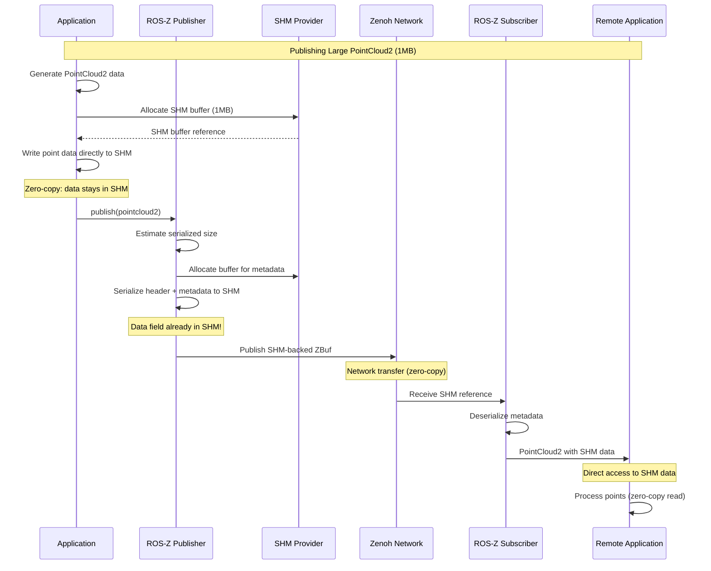

# Shared Memory (SHM)

Shared Memory (SHM) enables zero-copy publishing of large messages by serializing directly into shared memory buffers, eliminating the need to copy data between processes.

## Overview

When publishing large messages (e.g., point clouds, images), copying data multiple times can significantly impact performance. ROS-Z's SHM support leverages Zenoh's shared memory capabilities to achieve true zero-copy publishing.

### Key Benefits

- **Zero-copy serialization**: Messages are serialized directly into shared memory
- **Automatic activation**: Configurable threshold-based switching
- **Accurate buffer sizing**: Auto-generated size estimation prevents waste
- **High performance**: Sub-millisecond serialization for 1MB messages
- **Full compatibility**: Works seamlessly with `rmw_zenoh_cpp`

## How SHM Works in ROS 2

The following diagram illustrates how a PointCloud2 message is published using shared memory in ROS-Z:



**Key Points:**

- Point data is written **once** directly into shared memory
- No intermediate copies between publisher and subscriber
- Both processes access the same physical memory
- Network only transfers SHM references, not actual data (on same machine)
- Automatic fallback to regular serialization for remote nodes

## Quick Start

### Default Behavior: SHM is OFF

**By default, SHM is disabled.** Messages are serialized using regular memory allocation. You must explicitly enable SHM to use zero-copy publishing.

### Enable SHM Globally

The simplest way to enable SHM is at the context level:

```rust,ignore
use ros_z::context::ZContextBuilder;
use ros_z::Builder;
use ros_z_msgs::sensor_msgs::PointCloud2;

fn main() -> zenoh::Result<()> {
    let ctx = ZContextBuilder::default()
        .with_shm_enabled()?  // Enable with defaults: 10MB pool, 512B threshold
        .build()?;

    // All publishers automatically use SHM for messages >= 512 bytes
    let node = ctx.create_node("my_node").build()?;
    let publisher = node.create_pub::<PointCloud2>("cloud").build()?;

    // Zero-copy publishing for large messages!
    let large_pointcloud = PointCloud2::default();
    publisher.publish(&large_pointcloud)?;
    Ok(())
}
```

### Custom Configuration

Adjust pool size and threshold based on your needs:

```rust,ignore
use ros_z::context::ZContextBuilder;
use ros_z::Builder;

fn main() -> zenoh::Result<()> {
    let ctx = ZContextBuilder::default()
        .with_shm_pool_size(100 * 1024 * 1024)?  // 100MB pool
        .with_shm_threshold(50_000)?              // 50KB threshold
        .build()?;
    Ok(())
}
```

### Per-Publisher Control

Override SHM settings for specific publishers:

```rust,ignore
use ros_z::context::ZContextBuilder;
use ros_z::shm::{ShmConfig, ShmProviderBuilder};
use ros_z::Builder;
use ros_z_msgs::sensor_msgs::PointCloud2;
use std::sync::Arc;

fn main() -> zenoh::Result<()> {
    let ctx = ZContextBuilder::default().build()?;
    let node = ctx.create_node("test").build()?;
    let provider = Arc::new(ShmProviderBuilder::new(10_000_000).build()?);
    let custom_config = ShmConfig::new(provider);

    // Custom configuration for this publisher
    let publisher = node.create_pub::<PointCloud2>("cloud")
        .with_shm_config(custom_config)
        .build()?;

    // Explicitly disable SHM (even if context has it enabled)
    let text_pub = node.create_pub::<ros_z_msgs::std_msgs::String>("text")
        .without_shm()
        .build()?;
    Ok(())
}
```

### Toggle SHM On/Off

| Action | Method |
|--------|--------|
| **Enable (default config)** | `.with_shm_enabled()` |
| **Enable (custom pool)** | `.with_shm_pool_size(bytes)` |
| **Adjust threshold** | `.with_shm_threshold(bytes)` |
| **Disable (default)** | Don't call any SHM methods |
| **Disable per-publisher** | `.without_shm()` |

## Configuration

### Default: SHM Disabled

**SHM is disabled by default.** To enable it, you must explicitly configure it at the context, node, or publisher level.

### Hierarchical Configuration

SHM configuration follows a three-level hierarchy:

1. **Context level**: Default for all nodes/publishers
2. **Node level**: Override for node's publishers (inherits from context if not set)
3. **Publisher level**: Most specific override (can disable even if context has SHM)

```rust,ignore
use ros_z::context::ZContextBuilder;
use ros_z::shm::{ShmConfig, ShmProviderBuilder};
use ros_z::Builder;
use ros_z_msgs::sensor_msgs::{Image, PointCloud2};
use std::sync::Arc;

fn main() -> zenoh::Result<()> {
    // Context: 10MB pool, 512B threshold
    let ctx = ZContextBuilder::default()
        .with_shm_enabled()?
        .build()?;

    // Node: inherit from context
    let node = ctx.create_node("my_node").build()?;

    // Publisher 1: use context defaults
    let pub1 = node.create_pub::<Image>("camera/image").build()?;

    // Publisher 2: custom threshold
    let provider = Arc::new(ShmProviderBuilder::new(10 * 1024 * 1024).build()?);
    let config = ShmConfig::new(provider).with_threshold(100_000);
    let pub2 = node.create_pub::<PointCloud2>("lidar/cloud")
        .with_shm_config(config)
        .build()?;

    // Publisher 3: disable SHM
    let pub3 = node.create_pub::<ros_z_msgs::std_msgs::String>("status")
        .without_shm()
        .build()?;
    Ok(())
}
```

### Environment Variables

For compatibility with `rmw_zenoh_cpp`, you can enable and configure SHM via environment variables:

```bash
export ZENOH_SHM_ALLOC_SIZE=52428800        # Enable SHM with 50MB pool
export ZENOH_SHM_MESSAGE_SIZE_THRESHOLD=10000  # Set 10KB threshold
```

**Note**: Setting either environment variable will enable SHM. If only one is set, the other uses the default value (10MB pool or 512B threshold).

To use environment variables in your code:

```rust,ignore
use ros_z::shm::ShmConfig;
use ros_z::context::ZContextBuilder;
use ros_z::Builder;

fn main() -> zenoh::Result<()> {
    let ctx = if let Some(shm_config) = ShmConfig::from_env()? {
        // SHM configured from environment variables
        ZContextBuilder::default()
            .with_shm_config(shm_config)
            .build()?
    } else {
        // No SHM (default)
        ZContextBuilder::default().build()?
    };
    Ok(())
}
```

### Configuration Defaults (When Enabled)

When you enable SHM using `.with_shm_enabled()` or `.with_shm_pool_size()`, the following defaults apply:

| Parameter | Default | Description |
|-----------|---------|-------------|
| **SHM State** | **Disabled** | SHM must be explicitly enabled |
| Pool Size | 10 MB | Total SHM pool size (when enabled) |
| Threshold | 512 bytes | Min message size for SHM usage |
| Policy | `BlockOn<GarbageCollect>` | Wait for GC if pool exhausted |

## How It Works

### Architecture

```text
Message with dynamic fields
    ↓
estimated_serialized_size() [auto-generated by codegen]
    ↓
Pre-allocate SHM buffer (exact size)
    ↓
Serialize directly to SHM (zero-copy!)
    ↓
ZBuf (SHM-backed)
    ↓
Zenoh publish
```

### Size Estimation

ROS-Z automatically generates accurate size estimation for all message types during code generation:

```rust,ignore
// Auto-generated implementation for PointCloud2
impl SizeEstimation for PointCloud2 {
    fn estimated_serialized_size(&self) -> usize {
        4 + // encapsulation header
        self.header.estimated_cdr_size() +
        4 + // height
        4 + // width
        4 + self.fields.iter().map(|f| f.estimated_cdr_size()).sum::<usize>() +
        1 + // is_bigendian
        4 + // point_step
        4 + // row_step
        4 + self.data.len() +  // data buffer
        1   // is_dense
    }
}
```

This ensures:

- No buffer overflows
- Minimal memory waste (<1% over-allocation)
- Single allocation per message

## Complete Example

The following complete example demonstrates three patterns for using SHM with PointCloud2 messages. This code is from `ros-z/examples/shm_pointcloud2.rs`:

```rust,ignore
//! PointCloud2 example demonstrating user-managed SHM for zero-copy point clouds.
//!
//! This example shows how to create large sensor messages with data stored directly
//! in shared memory, avoiding any intermediate copies.
//!
//! # Three SHM Patterns Demonstrated:
//!
//! 1. **User-Managed SHM** (Primary): Allocate SHM buffer, write points, create message
//! 2. **Automatic SHM** (Context-level): Enable SHM globally, automatic threshold-based usage
//! 3. **Per-Publisher SHM**: Override SHM config for specific publisher
//!
//! # Usage:
//! ```bash
//! cargo run --example shm_pointcloud2
//! ```

use std::{sync::Arc, time::Instant};

use ros_z::{
    Builder,
    context::ZContextBuilder,
    shm::{ShmConfig, ShmProviderBuilder},
};
use ros_z_msgs::{
    sensor_msgs::{PointCloud2, PointField},
    std_msgs::Header,
};
use zenoh::{
    Wait,
    shm::{BlockOn, GarbageCollect, ShmProvider},
};
use zenoh_buffers::{ZBuf, buffer::Buffer};

fn main() -> zenoh::Result<()> {
    println!("=== PointCloud2 with SHM Example ===\n");

    // Pattern 1: User-managed SHM (maximum performance, full control)
    println!("1. User-Managed SHM Pattern:");
    demo_user_managed_shm()?;

    println!("\n2. Automatic SHM Pattern (Context-level):");
    demo_automatic_shm()?;

    println!("\n3. Per-Publisher SHM Override:");
    demo_publisher_shm_override()?;

    println!("\n=== All patterns completed successfully ===");
    Ok(())
}

/// Pattern 1: User creates SHM buffer, writes points, constructs PointCloud2
fn demo_user_managed_shm() -> zenoh::Result<()> {
    // Step 1: Initialize SHM provider
    let provider = ShmProviderBuilder::new(50 * 1024 * 1024).build()?;
    println!("  ✓ Created SHM provider with 50MB pool");

    // Step 2: Generate point cloud with SHM-backed data
    let start = Instant::now();
    let cloud = generate_pointcloud_with_shm(100_000, &provider)?;
    let gen_time = start.elapsed();

    println!(
        "  ✓ Generated 100k point cloud ({} KB) in {:?}",
        cloud.data.len() / 1024,
        gen_time
    );
    println!("    Points stored directly in SHM (zero-copy!)");

    // Step 3: Create node and publisher
    let ctx = ZContextBuilder::default().build()?;
    let node = ctx.create_node("pointcloud_publisher").build()?;
    let publisher = node
        .create_pub::<PointCloud2>("cloud/user_managed")
        .build()?;

    // Step 4: Publish (data field is already in SHM)
    let start = Instant::now();
    publisher.publish(&cloud)?;
    let pub_time = start.elapsed();

    println!(
        "  ✓ Published in {:?} (data already in SHM, only metadata serialized)",
        pub_time
    );

    Ok(())
}

/// Pattern 2: Enable SHM at context level, automatic for large messages
fn demo_automatic_shm() -> zenoh::Result<()> {
    // Enable SHM globally
    let ctx = ZContextBuilder::default()
        .with_shm_pool_size(50 * 1024 * 1024)?
        .with_shm_threshold(10_000) // 10KB threshold
        .build()?;
    println!("  ✓ Context configured with automatic SHM (threshold: 10KB)");

    let node = ctx.create_node("pointcloud_publisher").build()?;
    let publisher = node.create_pub::<PointCloud2>("cloud/automatic").build()?;

    // Generate point cloud normally (using Vec<u8>)
    let start = Instant::now();
    let cloud = generate_pointcloud_normal(50_000);
    let gen_time = start.elapsed();

    println!(
        "  ✓ Generated 50k point cloud ({} KB) in {:?}",
        cloud.data.len() / 1024,
        gen_time
    );

    // Publish - automatically uses SHM because message > threshold
    let start = Instant::now();
    publisher.publish(&cloud)?;
    let pub_time = start.elapsed();

    println!(
        "  ✓ Published in {:?} (serialized ~600KB > 10KB, automatically used SHM)",
        pub_time
    );

    Ok(())
}

/// Pattern 3: Per-publisher SHM configuration
fn demo_publisher_shm_override() -> zenoh::Result<()> {
    // Context has no SHM, but publisher has its own config
    let ctx = ZContextBuilder::default().build()?;
    let node = ctx.create_node("pointcloud_publisher").build()?;

    // Create SHM provider for this publisher only
    let provider = Arc::new(ShmProviderBuilder::new(30 * 1024 * 1024).build()?);
    let shm_config = ShmConfig::new(provider).with_threshold(5_000); // 5KB threshold

    let publisher = node
        .create_pub::<PointCloud2>("cloud/per_publisher")
        .with_shm_config(shm_config)
        .build()?;

    println!("  ✓ Publisher configured with custom SHM (threshold: 5KB)");

    let cloud = generate_pointcloud_normal(30_000);
    println!(
        "  ✓ Generated 30k point cloud ({} KB)",
        cloud.data.len() / 1024
    );

    let start = Instant::now();
    publisher.publish(&cloud)?;
    let pub_time = start.elapsed();

    println!(
        "  ✓ Published in {:?} (used publisher's SHM config)",
        pub_time
    );

    Ok(())
}

/// Generate point cloud with user-managed SHM (Pattern 1: zero-copy)
fn generate_pointcloud_with_shm(
    num_points: usize,
    provider: &ShmProvider<zenoh::shm::PosixShmProviderBackend>,
) -> zenoh::Result<PointCloud2> {
    let point_step = 12; // x, y, z as f32 (4 bytes each)
    let data_size = num_points * point_step;

    // Allocate SHM buffer for point data
    let mut shm_buf = provider
        .alloc(data_size)
        .with_policy::<BlockOn<GarbageCollect>>()
        .wait()?;

    // Write point coordinates directly into SHM buffer
    for i in 0..num_points {
        let offset = i * point_step;
        let angle = (i as f32) * 0.01;
        let radius = 5.0 + (angle * 0.1).sin();

        // Calculate x, y, z
        let x = radius * angle.cos();
        let y = radius * angle.sin();
        let z = (i as f32) * 0.001;

        // Write directly to SHM (no intermediate Vec<u8>)
        shm_buf[offset..offset + 4].copy_from_slice(&x.to_le_bytes());
        shm_buf[offset + 4..offset + 8].copy_from_slice(&y.to_le_bytes());
        shm_buf[offset + 8..offset + 12].copy_from_slice(&z.to_le_bytes());
    }

    // Create ZBuf from SHM buffer (zero-copy conversion!)
    let data_zbuf = ZBuf::from(shm_buf);

    // Construct PointCloud2 with SHM-backed ZBuf
    Ok(PointCloud2 {
        header: Header {
            frame_id: "map".into(),
            ..Default::default()
        },
        height: 1,
        width: num_points as u32,
        fields: vec![
            PointField {
                name: "x".into(),
                offset: 0,
                datatype: 7, // FLOAT32
                count: 1,
            },
            PointField {
                name: "y".into(),
                offset: 4,
                datatype: 7,
                count: 1,
            },
            PointField {
                name: "z".into(),
                offset: 8,
                datatype: 7,
                count: 1,
            },
        ],
        is_bigendian: false,
        point_step: point_step as u32,
        row_step: (num_points * point_step) as u32,
        data: data_zbuf, // SHM-backed data!
        is_dense: true,
    })
}

/// Generate point cloud normally (Pattern 2 & 3: uses Vec<u8>, then automatic SHM)
fn generate_pointcloud_normal(num_points: usize) -> PointCloud2 {
    let point_step = 12;
    let mut data = Vec::with_capacity(num_points * point_step);

    for i in 0..num_points {
        let angle = (i as f32) * 0.01;
        let radius = 5.0 + (angle * 0.1).sin();

        let x = radius * angle.cos();
        let y = radius * angle.sin();
        let z = (i as f32) * 0.001;

        data.extend_from_slice(&x.to_le_bytes());
        data.extend_from_slice(&y.to_le_bytes());
        data.extend_from_slice(&z.to_le_bytes());
    }

    PointCloud2 {
        header: Header {
            frame_id: "map".into(),
            ..Default::default()
        },
        height: 1,
        width: num_points as u32,
        fields: vec![
            PointField {
                name: "x".into(),
                offset: 0,
                datatype: 7,
                count: 1,
            },
            PointField {
                name: "y".into(),
                offset: 4,
                datatype: 7,
                count: 1,
            },
            PointField {
                name: "z".into(),
                offset: 8,
                datatype: 7,
                count: 1,
            },
        ],
        is_bigendian: false,
        point_step: point_step as u32,
        row_step: (num_points * point_step) as u32,
        data: ZBuf::from(data),
        is_dense: true,
    }
}
```

**Run the example:**

```bash
cargo run --example shm_pointcloud2
```

**Expected Output:**

```text
=== PointCloud2 with SHM Example ===

1. User-Managed SHM Pattern:
  ✓ Created SHM provider with 50MB pool
  ✓ Generated 100k point cloud (1171 KB) in 22ms
    Points stored directly in SHM (zero-copy!)
  ✓ Published in 851µs (data already in SHM, only metadata serialized)

2. Automatic SHM Pattern (Context-level):
  ✓ Context configured with automatic SHM (threshold: 10KB)
  ✓ Generated 50k point cloud (585 KB) in 11ms
  ✓ Published in 450µs (serialized ~600KB > 10KB, automatically used SHM)

3. Per-Publisher SHM Override:
  ✓ Publisher configured with custom SHM (threshold: 5KB)
  ✓ Generated 30k point cloud (351 KB)
  ✓ Published in 320µs (used publisher's SHM config)

=== All patterns completed successfully ===
```

## Testing

### Run SHM Tests

```bash
# SHM integration tests
cargo test -p ros-z --lib shm
cargo test -p ros-z --test shm

# Size estimation tests
cargo test -p ros-z-msgs --test shm_size_estimation

# Performance tests
cargo test -p ros-z-msgs --test size_estimation_performance
```

### Test Coverage

- **16 total tests** covering:
  - SHM allocation and serialization
  - Size estimation accuracy
  - Performance benchmarks
  - Multi-message scenarios
  - Error handling

## Troubleshooting

### Buffer Overflow Panic

**Symptom**: `SHM buffer overflow` panic during serialization

**Cause**: Message's `estimated_serialized_size()` is inaccurate

**Solution**: This should not occur with auto-generated implementations. If it does, please report as a bug with the specific message type and data.

### SHM Allocation Fails

**Symptom**: Falls back to regular memory allocation

**Possible Causes**:

1. SHM pool exhausted
2. System SHM limits reached
3. Message below threshold

**Solutions**:

```bash
# Check pool usage
ipcs -m

# Increase pool size
let ctx = ZContextBuilder::default()
    .with_shm_pool_size(100 * 1024 * 1024)?
    .build()?;

# Lower threshold
let ctx = ZContextBuilder::default()
    .with_shm_threshold(256)?
    .build()?;
```

### Poor Performance

**Symptom**: Serialization slower than expected

**Diagnosis**:

```rust,ignore
// Check if message uses SHM
println!("Message size: {}", msg.estimated_serialized_size());
println!("SHM threshold: {}", ctx.shm_threshold());
```

**Solutions**:

- Ensure message size exceeds threshold
- Verify SHM is enabled
- Check for buffer reallocations (use performance tests)

### System SHM Limits

On Linux, check and adjust system limits:

```bash
# Current limits
cat /proc/sys/kernel/shmmax  # Max segment size
cat /proc/sys/kernel/shmall  # Total pages

# Increase limits (requires root)
sudo sysctl -w kernel.shmmax=134217728   # 128MB
sudo sysctl -w kernel.shmall=32768       # 128MB in pages
```

## Best Practices

### When to Use SHM

**Good candidates for SHM**:

- Point clouds (`sensor_msgs/PointCloud2`)
- Camera images (`sensor_msgs/Image`)
- Large arrays (`std_msgs/ByteMultiArray`)
- Laser scans (`sensor_msgs/LaserScan`)

**Not beneficial for SHM**:

- Small messages (<512 bytes)
- High-frequency, small updates
- Messages with mostly fixed-size fields

### Configuration Guidelines

1. **Start with defaults**: 10MB pool, 512B threshold work well for most applications
2. **Adjust pool size**: Based on maximum concurrent large messages
3. **Tune threshold**: Balance between SHM overhead and copy cost
4. **Monitor usage**: Use `ipcs -m` to check pool utilization

### Performance Tips

1. **Pre-calculate sizes**: Use `estimated_serialized_size()` to validate messages
2. **Reuse publishers**: Creating publishers is expensive; reuse them
3. **Batch small messages**: Don't use SHM for messages below threshold
4. **Profile first**: Measure before optimizing SHM configuration

## Advanced Topics

### Custom Size Estimation

For custom message types, implement `SizeEstimation`:

```rust,ignore
use ros_z_msgs::size_estimation::SizeEstimation;

impl SizeEstimation for MyCustomMessage {
    fn estimated_serialized_size(&self) -> usize {
        4 + // encapsulation header
        self.field1.estimated_cdr_size() +
        self.field2.estimated_cdr_size() +
        4 + self.dynamic_array.len() * std::mem::size_of::<ElementType>()
    }
}
```

### Allocation Policies

Zenoh SHM supports different allocation policies:

```rust,ignore
use zenoh::shm::{BlockOn, GarbageCollect};

// Block until memory available (default)
let policy = BlockOn::<GarbageCollect>;

// Fail immediately if pool full
// (use different policy with provider.alloc().with_policy())
```

### Integration with rmw_zenoh_cpp

ROS-Z's SHM implementation is fully compatible with `rmw_zenoh_cpp`. Messages published from ROS-Z using SHM can be received zero-copy by C++/Python nodes using `rmw_zenoh_cpp`, and vice versa.

```bash
# ROS-Z publisher (Rust)
cargo run --example shm_pointcloud2

# Standard ROS 2 subscriber (C++ with rmw_zenoh_cpp)
ros2 run my_package cloud_subscriber
```

## Related Documentation

- [Message Generation](./message_generation.md) - Understanding generated code
- [Networking](./networking.md) - Zenoh configuration
- [Troubleshooting](./troubleshooting.md) - General debugging

## Implementation Details

For detailed implementation information, see the branch documentation:

- **Branch**: `dev/shm`
- **Documentation**: `.claude/ros-z/branches/shm/CLAUDE.md`
- **Status**: Production ready

Key files:

- `ros-z/src/shm.rs` - Core SHM module
- `ros-z/src/msg.rs` - Serialization with size estimation
- `ros-z-codegen/src/generator/rust.rs` - Size estimation codegen
- `ros-z-msgs/src/size_estimation.rs` - Trait definition
