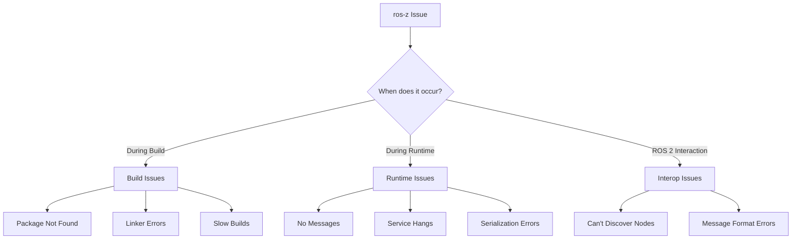
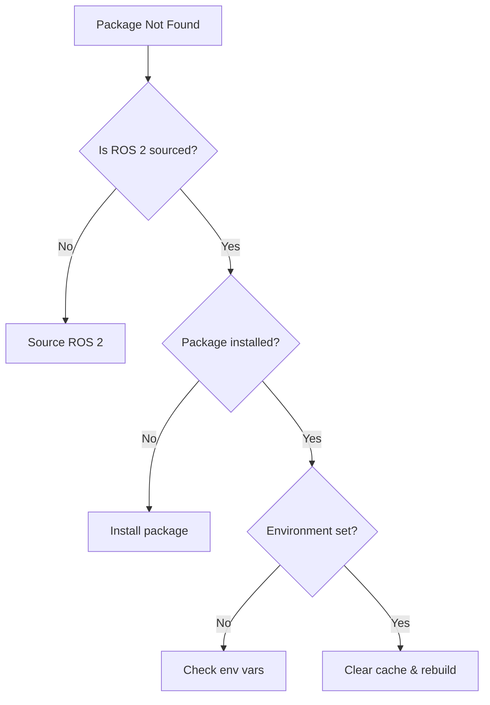
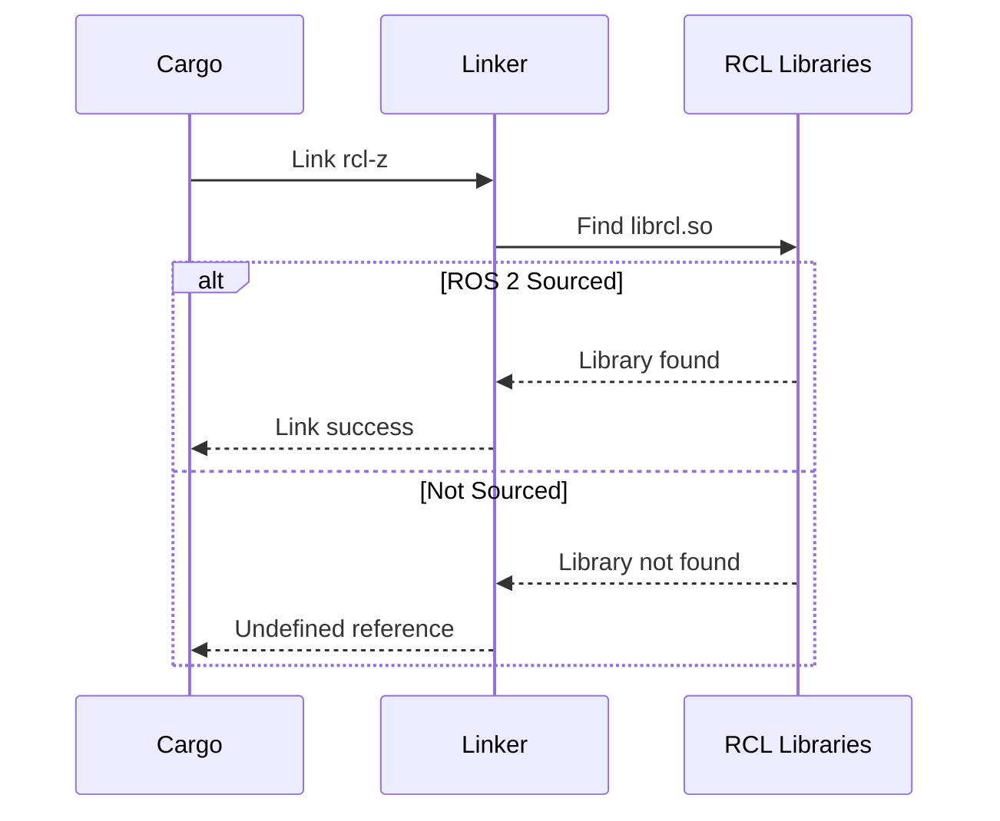
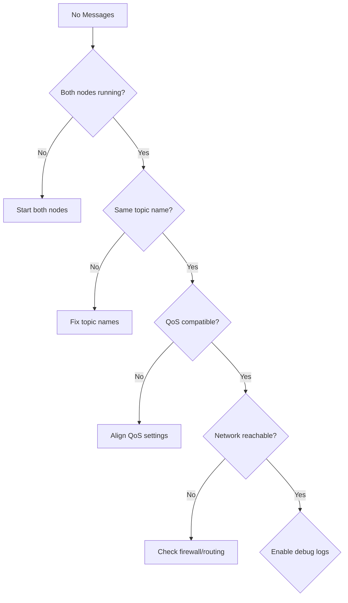
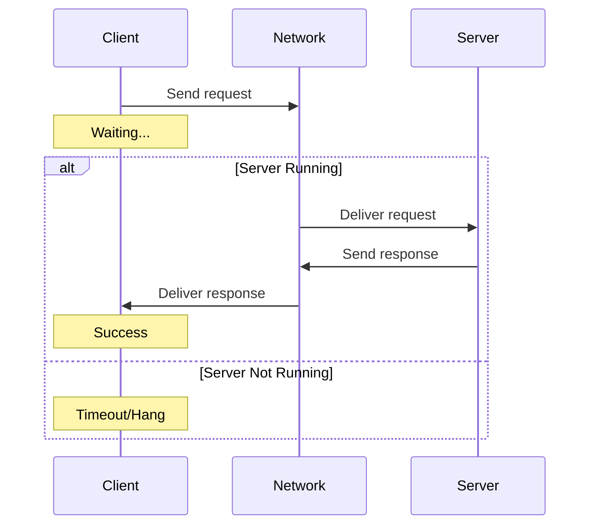
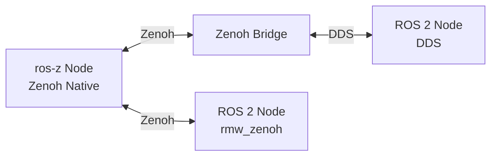
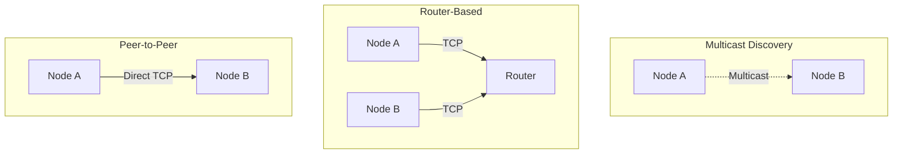

# Troubleshooting

**Comprehensive solutions to common ros-z build and runtime issues.** This guide provides diagnostic steps, root cause analysis, and proven fixes for the most frequent problems.

```admonish tip
Most issues fall into three categories: build configuration, runtime connectivity, or ROS 2 integration. Use the diagnostic flowcharts to quickly identify your issue type.
```

## Issue Categories



## Build Issues

### Cannot Find ROS Packages

**Symptom:** Build fails with "Cannot find ROS packages" or package discovery errors

**Diagnostic Steps:**



**Solutions:**

1. **Source ROS 2 environment:**

   ```bash
   source /opt/ros/jazzy/setup.bash
   # or for rolling:
   source /opt/ros/rolling/setup.bash
   ```

2. **Verify environment variables:**

   ```bash
   echo $AMENT_PREFIX_PATH
   echo $CMAKE_PREFIX_PATH
   ```

3. **Check package installation:**

   ```bash
   ros2 pkg prefix example_interfaces
   # If fails, install:
   sudo apt install ros-jazzy-example-interfaces
   ```

4. **Clean and rebuild:**

   ```bash
   cargo clean -p ros-z-msgs
   cargo build -p ros-z-msgs --features external_msgs
   ```

```admonish warning
Always source ROS 2 before building with `external_msgs`. The build system reads environment variables at build time, not runtime.
```

| Error Message | Root Cause | Solution |
|---------------|------------|----------|
| "Package X not found" | Not in search path | Source ROS 2 environment |
| "Cannot find ament_index" | ROS 2 not installed | Install ROS 2 or use bundled msgs |
| "AMENT_PREFIX_PATH not set" | Environment not sourced | Run `source /opt/ros/jazzy/setup.bash` |

### Cannot Find Crate `ros_z_msgs`

**Symptom:** Compiler error "cannot find crate `ros_z_msgs`"

**Root Cause:** `ros-z-msgs` is not part of default workspace members

**Solution:**

```bash
# Build ros-z-msgs explicitly
cargo build -p ros-z-msgs

# For external messages
cargo build -p ros-z-msgs --features external_msgs

# Then build your example
cargo build --example z_srvcli --features external_msgs
```

```admonish info
`ros-z-msgs` is excluded from default builds to avoid requiring ROS 2 for core development. Build it explicitly when needed.
```

### Linker Errors with RCL

**Symptom:** Undefined reference errors like `undefined reference to rcl_init`

**Diagnostic Flow:**



**Solutions:**

1. **Source before building:**

   ```bash
   source /opt/ros/jazzy/setup.bash
   cargo build -p rcl-z
   ```

2. **Verify RCL installation:**

   ```bash
   dpkg -l | grep ros-jazzy-rcl
   # Should show: ros-jazzy-rcl, ros-jazzy-rcutils, etc.
   ```

3. **Custom ROS installation:**

   ```bash
   export CMAKE_PREFIX_PATH=/path/to/ros/install:$CMAKE_PREFIX_PATH
   cargo clean -p rcl-z
   cargo build -p rcl-z
   ```

### Build Takes Too Long

**Symptom:** Compilation is very slow, especially message generation

**Optimization Strategies:**

| Strategy | Command | Speedup |
|----------|---------|---------|
| **Parallel builds** | `cargo build -j $(nproc)` | 2-4x |
| **Selective features** | `cargo build --features std_msgs` | 5-10x |
| **Incremental compilation** | `export CARGO_INCREMENTAL=1` | 2-3x |
| **Optimized profile** | `cargo build --profile opt` | Varies |

**Recommended approach:**

```bash
# Build only what you need
cargo build -p ros-z-msgs --features std_msgs,geometry_msgs

# Enable sccache if available
export RUSTC_WRAPPER=sccache
cargo build
```

```admonish tip
First build is always slow due to message generation. Subsequent builds are much faster with incremental compilation.
```

## Runtime Issues

### No Messages Received

**Symptom:** Subscriber doesn't receive messages from publisher

**Diagnostic Checklist:**



**Common Causes & Fixes:**

| Issue | Diagnostic | Fix |
|-------|------------|-----|
| **Different topics** | Compare topic names | Use `--topic` flag consistently |
| **QoS mismatch** | Check QoS profiles in code | Align reliability & durability |
| **Late subscription** | Check timing | Use transient_local durability |
| **Network isolation** | Try localhost first | Add explicit `--endpoint` |

**Debug process:**

```bash
# Terminal 1: Subscriber with debug logging
RUST_LOG=debug cargo run --example demo_nodes_listener

# Terminal 2: Publisher with debug logging
RUST_LOG=debug cargo run --example demo_nodes_talker

# Terminal 3: Zenoh session tracing
RUST_LOG=zenoh::api::session=trace cargo run --example demo_nodes_listener
```

**Ensure matching configuration:**

```rust,ignore
// Publisher QoS
let qos = QosProfile::default()
    .reliability(ReliabilityPolicy::Reliable)
    .durability(DurabilityPolicy::TransientLocal);

// Subscriber must match
let qos = QosProfile::default()
    .reliability(ReliabilityPolicy::Reliable)  // Must match
    .durability(DurabilityPolicy::TransientLocal);  // Must match
```

```admonish success
Start both nodes on the same machine with default settings first. Add complexity incrementally once basic communication works.
```

### Service Call Hangs

**Symptom:** Client blocks indefinitely waiting for response

**Diagnostic Sequence:**



**Checklist:**

1. **Verify server is running:**

   ```bash
   cargo run --example demo_nodes_add_two_ints_server
   # Should print: "Waiting for requests..."
   ```

2. **Check service names match:**

   ```bash
   # Enable debug logging
   RUST_LOG=debug cargo run --example demo_nodes_add_two_ints_client -- --a 5 --b 3
   ```

3. **Add timeout to prevent infinite blocking:**

   ```rust,ignore
   // Instead of:
   let response = client.take_response()?;

   // Use:
   let response = client.take_response_timeout(Duration::from_secs(5))?;
   ```

4. **Test with ROS 2 CLI if available:**

```bash
ros2 service list
ros2 service call /add_two_ints example_interfaces/srv/AddTwoInts "{a: 5, b: 3}"
```

```admonish warning
Always implement timeouts for service calls. Production systems should retry with exponential backoff on timeout.
```

### Message Serialization Errors

**Symptom:** "Failed to serialize/deserialize message" errors

**Root Causes:**

| Error | Cause | Solution |
|-------|-------|----------|
| **Version mismatch** | Different message versions | Rebuild all with same ros-z-msgs |
| **Type mismatch** | Wrong message type used | Verify type annotations |
| **Corrupted data** | Network or memory issue | Check network, update dependencies |

**Resolution steps:**

```bash
# Clean rebuild with consistent versions
cargo clean
cargo build -p ros-z-msgs
cargo build --examples

# Verify message types match
RUST_LOG=ros_z=trace cargo run --example demo_nodes_listener
```

```admonish note
CDR serialization is deterministic. If you see serialization errors, the most likely cause is type mismatches or version inconsistencies.
```

## ROS 2 Interoperability Issues

### Cannot Communicate with ROS 2 Nodes

**Symptom:** ros-z and ROS 2 nodes can't see each other

**Architecture Requirements:**



**Solution paths:**

#### Option 1: Zenoh-DDS Bridge

```bash
# Install bridge
cargo install zenoh-bridge-dds

# Run bridge
zenoh-bridge-dds

# In another terminal, run ROS 2 node
ros2 run demo_nodes_cpp talker

# In another terminal, run ros-z node
cargo run --example demo_nodes_listener
```

#### Option 2: ROS 2 with rmw_zenoh

```bash
# Install rmw_zenoh
sudo apt install ros-jazzy-rmw-zenoh-cpp

# Set RMW implementation
export RMW_IMPLEMENTATION=rmw_zenoh_cpp

# Run ROS 2 node with Zenoh
ros2 run demo_nodes_cpp talker

# Run ros-z node (no bridge needed)
cargo run --example demo_nodes_listener
```

```admonish info
ros-z uses Zenoh natively. ROS 2 needs either rmw_zenoh or a Zenoh-DDS bridge to communicate with ros-z nodes.
```

### Wrong Message Format Between Systems

**Symptom:** Messages corrupted when crossing ROS 2/ros-z boundary

**Verification:**

```bash
# Test with standard messages first
cargo run --example demo_nodes_talker  # Uses std_msgs::String
ros2 topic echo /chatter               # Should display correctly

# Compare message definitions
ros2 interface show std_msgs/msg/String
```

**Ensure CDR compatibility:**

- ros-z uses CDR serialization by default (ROS 2 compatible)
- Custom messages must follow ROS 2 conventions
- Type hashes must match for interoperability

## Zenoh Configuration Issues

### Zenoh Discovery Not Working

**Symptom:** Nodes on different machines can't discover each other

**Network Topology Options:**



**Solutions by scenario:**

1. **Same machine (should work automatically):**

   ```bash
   # No configuration needed
   cargo run --example demo_nodes_talker
   cargo run --example demo_nodes_listener
   ```

2. **Different machines with multicast:**

   ```bash
   # Check firewall allows UDP multicast
   sudo ufw allow proto udp from any to 224.0.0.0/4

   # Enable multicast explicitly
   ZENOH_SCOUTING=multicast cargo run --example demo_nodes_talker
   ```

3. **Direct peer-to-peer:**

   ```bash
   # Machine A
   cargo run --example demo_nodes_talker -- --endpoint tcp/192.168.1.100:7447

   # Machine B
   cargo run --example demo_nodes_listener -- --endpoint tcp/192.168.1.100:7447
   ```

4. **Using Zenoh router:**

   ```bash
   # Install router
   cargo install zenohd

   # Run router (on dedicated machine or one of the endpoints)
   zenohd

   # Connect nodes to router
   cargo run --example demo_nodes_talker -- --endpoint tcp/router-ip:7447
   cargo run --example demo_nodes_listener -- --endpoint tcp/router-ip:7447
   ```

```admonish tip
Start with same-machine testing, then add network complexity. Zenoh router is recommended for multi-machine deployments.
```

### High Latency Between Nodes

**Symptom:** Excessive message delivery delays

**Performance Analysis:**

```bash
# Measure baseline latency
cargo run --example z_pingpong -- --mode pong
cargo run --example z_pingpong -- --mode ping
```

**Optimization strategies:**

| Issue | Cause | Fix |
|-------|-------|-----|
| **Network latency** | Physical distance | Use direct connection, optimize routing |
| **Router overhead** | Extra hop | Connect peers directly |
| **QoS buffering** | Large history depth | Use `KeepLast(1)` for real-time data |
| **Reliability overhead** | Reliable delivery | Use `BestEffort` for sensor data |

**Optimized QoS for low latency:**

```rust,ignore
let qos = QosProfile::default()
    .reliability(ReliabilityPolicy::BestEffort)  // Skip retransmissions
    .history(HistoryPolicy::KeepLast(1))         // No buffering
    .durability(DurabilityPolicy::Volatile);     // No persistence
```

## Getting Help

### Diagnostic Information Collection

When reporting issues, include:

```bash
# System information
uname -a
rustc --version
cargo --version
ros2 --version  # if applicable

# Environment
env | grep ROS
env | grep AMENT
env | grep CMAKE

# Dependency tree
cargo tree -p ros-z-msgs

# Full debug logs
RUST_LOG=trace cargo run --example demo_nodes_talker 2>&1 | tee debug.log
```

### Issue Reporting Checklist

- [ ] ros-z version or commit hash
- [ ] Operating system and version
- [ ] ROS 2 distribution (if applicable)
- [ ] Complete error message
- [ ] Minimal reproduction steps
- [ ] Expected vs actual behavior
- [ ] What you've already tried

```admonish success
Well-documented issues get resolved faster. Include logs, versions, and reproduction steps in your GitHub issue.
```

## Quick Reference

### Essential Debug Commands

```bash
# Full trace logging
RUST_LOG=trace cargo run --example demo_nodes_talker

# Zenoh session details
RUST_LOG=zenoh::api::session=trace cargo run --example demo_nodes_listener

# Package information
cargo tree -p ros-z-msgs
ros2 pkg list | grep interfaces

# Environment check
printenv | grep -E '(ROS|AMENT|CMAKE)'
```

### Common Fix Patterns

```bash
# Pattern 1: Package not found
source /opt/ros/jazzy/setup.bash
cargo clean -p ros-z-msgs
cargo build -p ros-z-msgs --features external_msgs

# Pattern 2: Connectivity issues
cargo run --example demo_nodes_talker -- --endpoint tcp/localhost:7447
cargo run --example demo_nodes_listener -- --endpoint tcp/localhost:7447

# Pattern 3: Performance problems
cargo build --release
RUST_LOG=warn cargo run --release --example demo_nodes_talker
```

## Resources

- **[Building Guide](./building.md)** - Correct build procedures
- **[Feature Flags](./feature_flags.md)** - Available features
- **[Examples Overview](./examples_overview.md)** - Working examples
- **[GitHub Issues](https://github.com/ZettaScaleLabs/ros-z/issues)** - Report bugs

**Most issues are environmental. Verify your setup matches the build scenario requirements before diving deeper.**
