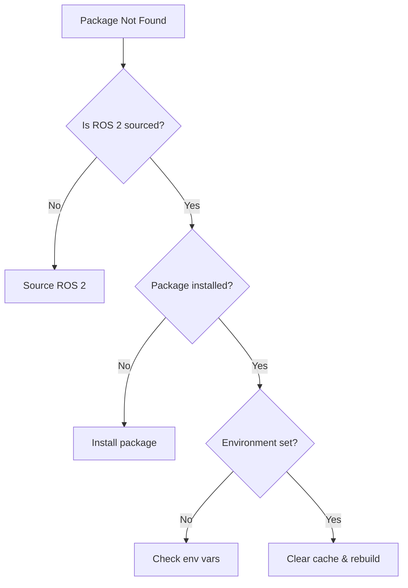

# Troubleshooting

**Comprehensive solutions to common ros-z build and runtime issues.** This guide provides diagnostic steps, root cause analysis, and proven fixes for the most frequent problems.

```admonish tip
Most issues fall into three categories: build configuration, runtime connectivity, or ROS 2 integration. Use the diagnostic flowcharts to quickly identify your issue type.
```

## Build Issues

### Cannot Find ROS Packages

**Symptom:** Build fails with "Cannot find ROS packages" or package discovery errors

**Diagnostic Steps:**



**Solutions:**

1. **Source ROS 2 environment:**

   ```bash
   source /opt/ros/jazzy/setup.bash
   # or for rolling:
   source /opt/ros/rolling/setup.bash
   ```

2. **Verify environment variables:**

   ```bash
   echo $AMENT_PREFIX_PATH
   echo $CMAKE_PREFIX_PATH
   ```

3. **Check package installation:**

   ```bash
   ros2 pkg prefix example_interfaces
   # If fails, install:
   sudo apt install ros-jazzy-example-interfaces
   ```

4. **Clean and rebuild:**

   ```bash
   cargo clean -p ros-z-msgs
   cargo build -p ros-z-msgs --features external_msgs
   ```

```admonish warning
Always source ROS 2 before building with `external_msgs`. The build system reads environment variables at build time, not runtime.
```

| Error Message | Root Cause | Solution |
|---------------|------------|----------|
| "Package X not found" | Not in search path | Source ROS 2 environment |
| "Cannot find ament_index" | ROS 2 not installed | Install ROS 2 or use bundled msgs |
| "AMENT_PREFIX_PATH not set" | Environment not sourced | Run `source /opt/ros/jazzy/setup.bash` |

### Cannot Find Crate `ros_z_msgs`

**Symptom:** Compiler error "cannot find crate `ros_z_msgs`"

**Root Cause:** `ros-z-msgs` is not part of default workspace members

**Solution:**

```bash
# Build ros-z-msgs explicitly
cargo build -p ros-z-msgs

# For external messages
cargo build -p ros-z-msgs --features external_msgs

# Then build your example
cargo build --example z_srvcli --features external_msgs
```

```admonish info
`ros-z-msgs` is excluded from default builds to avoid requiring ROS 2 for core development. Build it explicitly when needed.
```

## Resources

- **[Building Guide](./building.md)** - Correct build procedures
- **[Feature Flags](./feature_flags.md)** - Available features
- **[GitHub Issues](https://github.com/ZettaScaleLabs/ros-z/issues)** - Report bugs

**Most issues are environmental. Verify your setup matches the build scenario requirements before diving deeper.**
