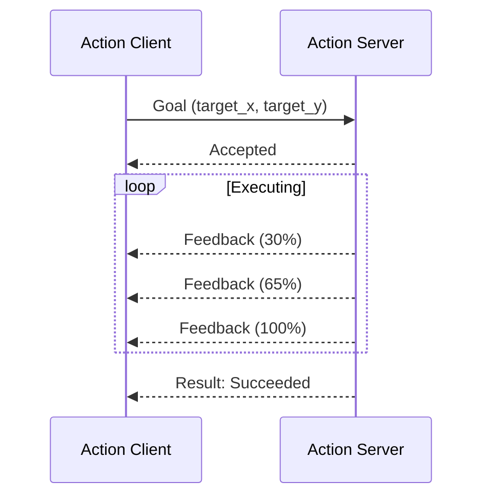
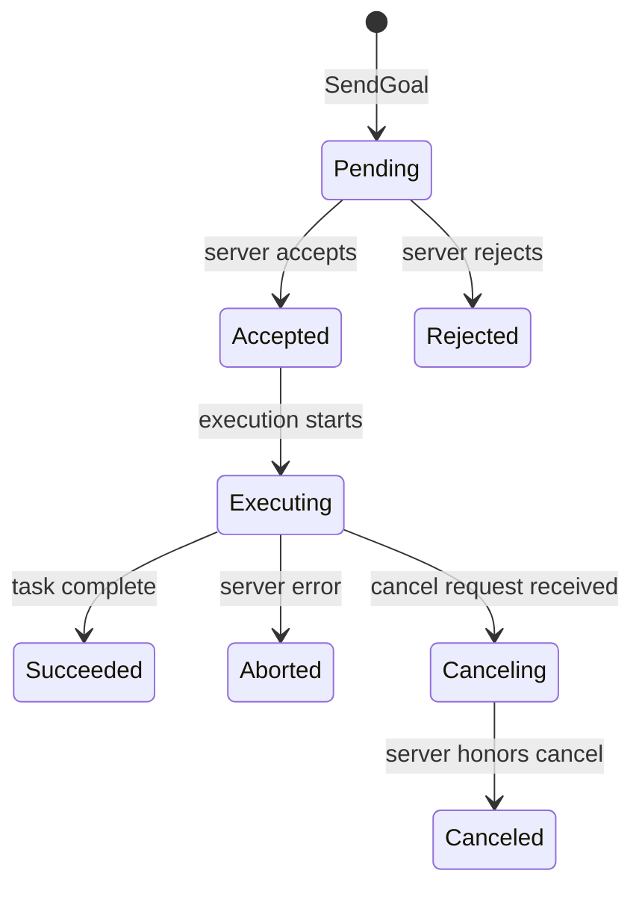
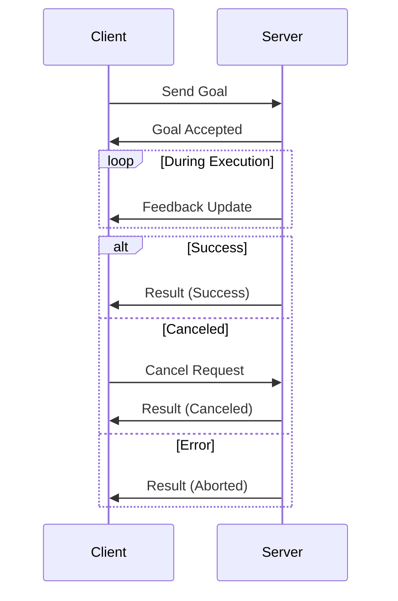
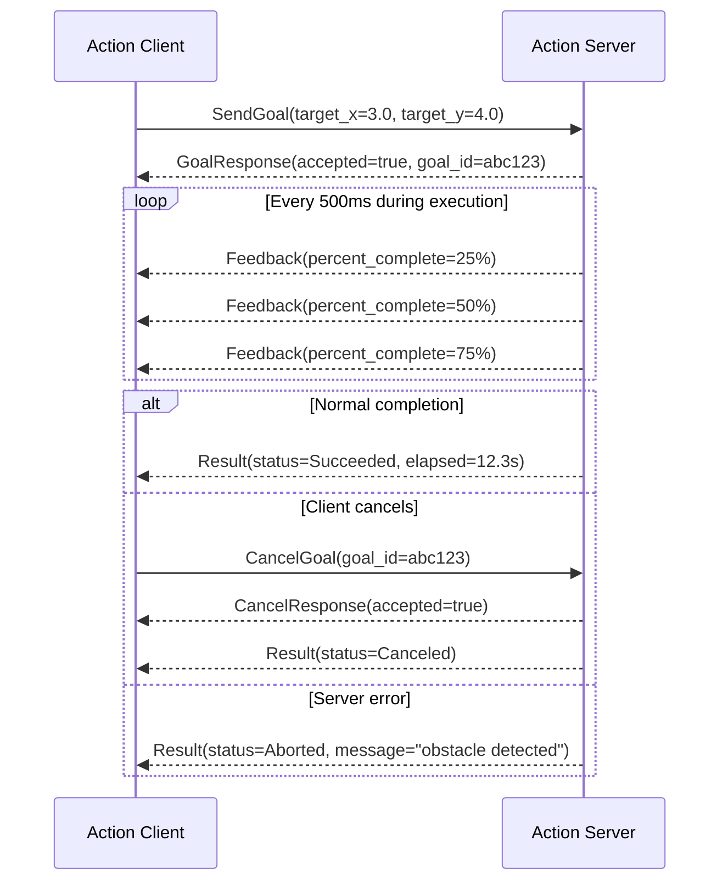

# Actions

!!! note "Go users"
    The code examples in this chapter are **Rust**. The Go action API uses separate goal-acceptance and execute callbacks instead of the `with_handler(ExecutingGoal)` pattern shown here. For Go action patterns, see the [Go Bindings](../bindings/go.md) chapter.

**Actions enable long-running tasks with progress feedback and cancellation support, perfect for operations that take seconds or minutes to complete.** Unlike services that return immediately, actions provide streaming feedback while executing complex workflows.

!!! tip
    Use actions for robot navigation, trajectory execution, or any operation where you need progress updates and the ability to cancel mid-execution. Use services for quick request-response operations.

## What is an Action?



**A long-running task with three channels: goal → feedback stream → result. Plus cancellation.**

- **Goal** — what the client wants done (`float64 target_x, target_y`)
- **Feedback** — progress while executing (`float64 percent_complete`)
- **Result** — final outcome when done (`float64 elapsed_seconds`)
- **Cancel** — client can abort at any time; server decides how to honor it

### When to use actions

| Operation | Duration | Use |
|-----------|----------|-----|
| Drive to coordinates | 5–60 s | **Action** |
| Execute trajectory | 1–30 s | **Action** |
| Compute inverse kinematics | < 100 ms | Service |
| Publish odometry | Continuous | Topic |

### The .action format

```text
# Goal
float64 target_x
float64 target_y
---
# Result
float64 elapsed_seconds
string  status_message
---
# Feedback
float64 percent_complete
float64 current_x
float64 current_y
```

Three sections separated by `---`: goal, result, feedback.

### Goal states



### Cancellation contract

Sending a cancel does **not** immediately stop the action:

1. Client sends cancel request
2. Server receives it — decides how/when to stop
3. Server sends `Result(status=Canceled)` to close the goal
4. Until then, the goal remains in `Executing` state

### ros-z type-state API

ros-z uses Rust's type system to enforce the action protocol at compile time:

```text
RequestedGoal  →  AcceptedGoal  →  ExecutingGoal
     ↓                                   ↓
  (reject)                          publish_feedback()
                                    return Result
```

The compiler prevents calling `publish_feedback` before `accept()`. Invalid state transitions are caught at compile time, not at runtime.

### Key Concepts at a Glance

<div class="flashcard-grid">
  <div class="flashcard">
    <div class="flashcard-inner">
      <div class="flashcard-front">
        <div class="flashcard-tag">Pattern</div>
        <div class="flashcard-term">What are the three action channels?</div>
        <div class="flashcard-hint">Click to flip</div>
      </div>
      <div class="flashcard-back">
        <div>• <strong>Goal</strong>: what the client wants done.</div>
        <div>• <strong>Feedback</strong>: progress updates during execution.</div>
        <div>• <strong>Result</strong>: final outcome when done (or cancelled).</div>
      </div>
    </div>
  </div>
  <div class="flashcard">
    <div class="flashcard-inner">
      <div class="flashcard-front">
        <div class="flashcard-tag">States</div>
        <div class="flashcard-term">What are the four terminal states of a goal?</div>
        <div class="flashcard-hint">Click to flip</div>
      </div>
      <div class="flashcard-back">
        <div>• <strong>Succeeded</strong>: completed normally.</div>
        <div>• <strong>Canceled</strong>: client requested cancel, server honored it.</div>
        <div>• <strong>Aborted</strong>: server encountered an error.</div>
        <div>• <strong>Rejected</strong>: server refused the goal before starting.</div>
      </div>
    </div>
  </div>
  <div class="flashcard">
    <div class="flashcard-inner">
      <div class="flashcard-front">
        <div class="flashcard-tag">Cancellation</div>
        <div class="flashcard-term">Does a cancel request immediately stop the action?</div>
        <div class="flashcard-hint">Click to flip</div>
      </div>
      <div class="flashcard-back">
        No. The server receives the cancel signal and decides how to handle it. It must still send a result to close the goal. Incomplete cancellation leaves the goal in Executing state.
      </div>
    </div>
  </div>
  <div class="flashcard">
    <div class="flashcard-inner">
      <div class="flashcard-front">
        <div class="flashcard-tag">vs Service</div>
        <div class="flashcard-term">Why not use a service for navigation?</div>
        <div class="flashcard-hint">Click to flip</div>
      </div>
      <div class="flashcard-back">
        Services block until done. A 30-second navigation blocks the client for 30 seconds with no updates and no way to cancel. Actions keep the client free and provide progress.
      </div>
    </div>
  </div>
  <div class="flashcard">
    <div class="flashcard-inner">
      <div class="flashcard-front">
        <div class="flashcard-tag">ros-z API</div>
        <div class="flashcard-term">What is the type-state pattern in ros-z actions?</div>
        <div class="flashcard-hint">Click to flip</div>
      </div>
      <div class="flashcard-back">
        <strong>RequestedGoal → AcceptedGoal → ExecutingGoal</strong>
        Each type carries only the methods valid at that stage. The compiler prevents calling <strong>publish_feedback</strong> before accepting the goal.
      </div>
    </div>
  </div>
  <div class="flashcard">
    <div class="flashcard-inner">
      <div class="flashcard-front">
        <div class="flashcard-tag">Feedback</div>
        <div class="flashcard-term">Is feedback required during action execution?</div>
        <div class="flashcard-hint">Click to flip</div>
      </div>
      <div class="flashcard-back">
        No. Feedback is optional — only send it when the client benefits from progress updates. Short actions (under a second) often skip feedback entirely.
      </div>
    </div>
  </div>
</div>

## Action Lifecycle

```mermaid
stateDiagram-v2
accTitle: Full action lifecycle including feedback and terminal states
accDescr: The action progresses from Idle through Accepted and Executing, optionally looping on feedback, before reaching Succeeded, Canceled, or Aborted.
    [*] --> Idle
    Idle --> Accepted: Send Goal
    Accepted --> Executing: Start Processing
    Executing --> Executing: Send Feedback
    Executing --> Succeeded: Complete
    Executing --> Canceled: Cancel Request
    Executing --> Aborted: Error Occurs
    Succeeded --> [*]
    Canceled --> [*]
    Aborted --> [*]
```



## Components

| Component | Type | Purpose |
|-----------|------|---------|
| **Goal** | Input | Defines the desired outcome |
| **Feedback** | Stream | Progress updates during execution |
| **Result** | Output | Final outcome when complete |
| **Status** | State | Current execution state |

## Communication Pattern



### Execution Timeline



## Use Cases

**Robot Navigation:**

- Goal: Target position and orientation
- Feedback: Current position, distance remaining, obstacles detected
- Result: Final position, success/failure reason

**Gripper Control:**

- Goal: Desired grip force and position
- Feedback: Current force, contact detection
- Result: Grip achieved, object secured

**Long Computations:**

- Goal: Computation parameters
- Feedback: Progress percentage, intermediate results
- Result: Final computed value, execution time

!!! info
    Actions excel when operations take more than a few seconds and users need visibility into progress. For sub-second operations, prefer services for simplicity.

## Minimal Pattern

Before reading the full examples, here is the skeleton every action client and server follows:

**Client:**

```rust
use ros_z::Builder;
use ros_z::context::ZContextBuilder;

let ctx = ZContextBuilder::default().build()?;
let node = ctx.create_node("my_client").build()?;

// Create the action client
let client = node
    .create_action_client::<MyAction>("my_action_name")
    .build()?;

// 1. Send a goal — returns a GoalHandle
let mut goal_handle = client.send_goal(MyAction::Goal { target: 10 }).await?;

// 2. Stream feedback while the action runs
if let Some(mut feedback_rx) = goal_handle.feedback() {
    tokio::spawn(async move {
        while let Some(fb) = feedback_rx.recv().await {
            println!("Progress: {:?}", fb);
        }
    });
}

// 3. Wait for the final result (blocks until terminal state)
let result = goal_handle.result().await?;
println!("Done: {:?}", result);
```

**Server:**

```rust
use ros_z::Builder;
use ros_z::action::server::ExecutingGoal;
use ros_z::context::ZContextBuilder;

let ctx = ZContextBuilder::default().build()?;
let node = ctx.create_node("my_server").build()?;

// Create the action server (keep _server alive for the duration)
let _server = node
    .create_action_server::<MyAction>("my_action_name")
    .build()?
    .with_handler(|executing: ExecutingGoal<MyAction>| async move {
        // Report progress (synchronous — no .await)
        executing.publish_feedback(MyAction::Feedback { progress: 50 }).expect("feedback failed");

        // Check for cancellation
        if executing.is_cancel_requested() {
            executing.canceled(MyAction::Result { value: 0 }).unwrap();
            return;
        }

        executing.succeed(MyAction::Result { value: 42 }).unwrap();
    });
```

The key constraint: **one `GoalHandle` per goal**. `feedback()` and `status_watch()` each return `Some` only on the first call — after that, the handle has moved out the receiver.

For full Fibonacci examples, the GoalHandle API reference, cancellation patterns, and how to define custom action types, see [Actions — Advanced Patterns](./actions-advanced.md).

## Resources

- **[Actions — Advanced Patterns](./actions-advanced.md)** - Full examples, GoalHandle API, custom types
- **[Services](./services.md)** - Simpler request-response pattern
- **[Custom Messages](../user-guide/custom-messages.md)** - Defining custom action types with `.action` files

