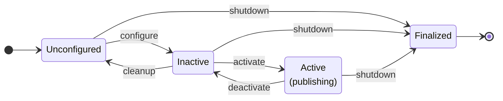

# Lifecycle Nodes

**Lifecycle nodes give you explicit control over when a node starts communicating, making bringup and shutdown of complex systems safe and predictable.**

!!! tip
    Use lifecycle nodes whenever a node needs external resources (hardware drivers, network connections, configuration files) that must be ready before it starts publishing. They are the standard ROS 2 pattern for production system orchestration.

## State Machine

A lifecycle node moves through a defined set of states. Only in the **Active** state does a node send or receive messages.



### Primary States

| State | ID | Description |
|-------|----|-------------|
| **Unconfigured** | 1 | Initial state. Node exists but has not loaded configuration. |
| **Inactive** | 2 | Configured but not communicating. Publishers drop messages. |
| **Active** | 3 | Fully operational. Publishers deliver messages. |
| **Finalized** | 4 | Terminal state. Node is destroyed. |

### Transitions

| Method | From | To (success) |
|--------|------|--------------|
| `configure()` | Unconfigured | Inactive |
| `activate()` | Inactive | Active |
| `deactivate()` | Active | Inactive |
| `cleanup()` | Inactive | Unconfigured |
| `shutdown()` | Any primary | Finalized |

## Creating a Lifecycle Node

```rust
use ros_z::lifecycle::{ZLifecycleNode, CallbackReturn, LifecycleState};
use ros_z::prelude::*;

# fn main() -> zenoh::Result<()> {
let ctx = ZContextBuilder::default().build()?;
let mut node = ctx.create_lifecycle_node("my_node").build()?;
# Ok(())
# }
```

### With a Namespace

```rust
use ros_z::prelude::*;

# fn main() -> zenoh::Result<()> {
let ctx = ZContextBuilder::default().build()?;
let mut node = ctx
    .create_lifecycle_node("my_node")
    .with_namespace("/robot")
    .build()?;
# Ok(())
# }
```

## Lifecycle Callbacks

Set callbacks on the node before triggering any transitions. Each callback receives the previous state and returns a `CallbackReturn`.

```rust
use ros_z::lifecycle::{ZLifecycleNode, CallbackReturn};
use ros_z::prelude::*;

# fn main() -> zenoh::Result<()> {
# let ctx = ZContextBuilder::default().build()?;
let mut node = ctx.create_lifecycle_node("talker").build()?;

node.on_configure = Box::new(|_prev| {
    // Load parameters, open files, connect to hardware
    println!("configuring");
    CallbackReturn::Success
});

node.on_activate = Box::new(|_prev| {
    // Start timers, enable hardware
    println!("activating");
    CallbackReturn::Success
});

node.on_deactivate = Box::new(|_prev| {
    // Pause timers, disable hardware outputs
    println!("deactivating");
    CallbackReturn::Success
});

node.on_cleanup = Box::new(|_prev| {
    // Release resources acquired in on_configure
    println!("cleaning up");
    CallbackReturn::Success
});

node.on_shutdown = Box::new(|_prev| {
    CallbackReturn::Success
});
# Ok(())
# }
```

### Callback Return Values

| Value | Effect |
|-------|--------|
| `CallbackReturn::Success` | Transition completes normally |
| `CallbackReturn::Failure` | Transition rolls back; state unchanged |
| `CallbackReturn::Error` | `on_error` callback is called |

The default `on_error` returns `Failure`, which drives the node to **Finalized**. Override it to recover to **Unconfigured** instead:

```rust
# use ros_z::lifecycle::{CallbackReturn};
# use ros_z::prelude::*;
# fn main() -> zenoh::Result<()> {
# let ctx = ZContextBuilder::default().build()?;
# let mut node = ctx.create_lifecycle_node("n").build()?;
// Recover to Unconfigured instead of crashing to Finalized
node.on_error = Box::new(|_prev| CallbackReturn::Success);
# Ok(())
# }
```

## Lifecycle Publishers

A lifecycle publisher wraps a regular publisher and **silently drops** publish calls while the node is not Active. This makes publishing code clean — no manual state checks needed.

```rust
use ros_z::lifecycle::ZLifecycleNode;
use ros_z::prelude::*;
use ros_z_msgs::ros::std_msgs::String as RosString;

# fn main() -> zenoh::Result<()> {
# let ctx = ZContextBuilder::default().build()?;
# let mut node = ctx.create_lifecycle_node("talker").build()?;
// Create the publisher — it starts deactivated
let pub_ = node.create_publisher::<RosString>("chatter")?;

node.configure()?;
node.activate()?;
// Publisher is now active — messages are delivered
pub_.publish(&RosString { data: "hello".to_string() })?;

node.deactivate()?;
// Publisher is deactivated — publish() returns Ok(()) but drops the message
pub_.publish(&RosString { data: "dropped".to_string() })?;
# Ok(())
# }
```

ros-z registers all publishers created with `create_publisher` as **managed entities**: they activate and deactivate automatically when the node transitions.

!!! note
    Publishers created **after** `activate()` are immediately activated. You can safely create publishers at any point in the node's lifetime.

## Triggering Transitions

You can trigger transitions programmatically or via the lifecycle management services.

### Programmatic

```rust
# use ros_z::prelude::*;
# fn main() -> zenoh::Result<()> {
# let ctx = ZContextBuilder::default().build()?;
# let mut node = ctx.create_lifecycle_node("n").build()?;
let state = node.configure()?;   // → Inactive
let state = node.activate()?;    // → Active
let state = node.deactivate()?;  // → Inactive
let state = node.cleanup()?;     // → Unconfigured
let state = node.shutdown()?;    // → Finalized
# Ok(())
# }
```

### Via ROS 2 CLI

Every lifecycle node automatically exposes five management services under its node name:

```bash
# Inspect current state
ros2 lifecycle get /my_node

# List available transitions
ros2 lifecycle list /my_node

# Trigger a transition
ros2 lifecycle set /my_node configure
ros2 lifecycle set /my_node activate
```

### Services Exposed

| Service | Description |
|---------|-------------|
| `~/change_state` | Trigger a transition by ID or label |
| `~/get_state` | Query the current state |
| `~/get_available_states` | List all states in the machine |
| `~/get_available_transitions` | List transitions valid from the current state |
| `~/get_transition_graph` | List all transitions in the full graph |

The `~/transition_event` topic publishes a `TransitionEvent` message on every state change, enabling external monitoring.

## Lifecycle Client

`ZLifecycleClient` lets you drive a remote lifecycle node's state machine from Rust code — the building block for bringup managers and system orchestrators.

```rust
use std::time::Duration;
use ros_z::prelude::*;
use ros_z::lifecycle::ZLifecycleClient;

# async fn run() -> zenoh::Result<()> {
let ctx = ZContextBuilder::default().build()?;
let mgr = ctx.create_node("bringup_manager").build()?;

// Connect to the lifecycle node's management services
let client = ZLifecycleClient::new(&mgr, "camera_driver")?;
let timeout = Duration::from_secs(5);

// Drive the node through its lifecycle
client.configure(timeout).await?;
client.activate(timeout).await?;

// Query the current state at any time
let state = client.get_state(timeout).await?;
println!("camera_driver is {:?}", state);

// Graceful shutdown (auto-detects the current state)
client.shutdown(timeout).await?;
# Ok(())
# }
```

!!! tip
    `shutdown()` queries the node's current state and sends the correct shutdown transition automatically. You don't need to deactivate or cleanup first.

## Full Example: Managed Talker

```rust
use ros_z::{Builder, Result, context::ZContextBuilder, lifecycle::CallbackReturn};
use ros_z_msgs::std_msgs::String as RosString;

fn main() -> Result<()> {
    // Build an Eclipse Zenoh context and create a lifecycle node.
    // The node starts in the Unconfigured state.
    let ctx = ZContextBuilder::default().build()?;
    let mut node = ctx.create_lifecycle_node("lifecycle_talker").build()?;

    // Register callbacks for each lifecycle transition.
    // Each callback receives the previous state and must return
    // CallbackReturn::Success, ::Failure, or ::Error.
    node.on_configure = Box::new(|_prev| {
        // Load parameters, open files, connect to hardware here.
        println!("[configure] loading parameters");
        CallbackReturn::Success
    });

    node.on_activate = Box::new(|_prev| {
        // Start timers, enable hardware outputs here.
        println!("[activate] publisher enabled");
        CallbackReturn::Success
    });

    node.on_deactivate = Box::new(|_prev| {
        // Pause timers, disable hardware outputs here.
        println!("[deactivate] publisher paused");
        CallbackReturn::Success
    });

    node.on_cleanup = Box::new(|_prev| {
        // Release resources acquired in on_configure here.
        println!("[cleanup] releasing resources");
        CallbackReturn::Success
    });

    // Create a lifecycle-gated publisher.
    // It is registered as a managed entity: activate()/deactivate() on the
    // node will automatically gate this publisher. While deactivated,
    // publish() returns Ok(()) but silently drops the message.
    let pub_ = node.create_publisher::<RosString>("chatter")?;

    // configure(): Unconfigured → Inactive
    // on_configure callback fires; publisher remains deactivated.
    node.configure()?;

    // This publish is silently dropped — the node is Inactive.
    pub_.publish(&RosString {
        data: "dropped (inactive)".to_string(),
    })?;

    // activate(): Inactive → Active
    // on_activate callback fires; publisher is now live.
    node.activate()?;

    // Messages are delivered while the node is Active.
    for i in 0..5 {
        let msg = RosString {
            data: format!("hello {i}"),
        };
        pub_.publish(&msg)?;
        println!("published: {}", msg.data);
    }

    // deactivate(): Active → Inactive — publisher is gated again.
    node.deactivate()?;
    // cleanup(): Inactive → Unconfigured — release resources.
    node.cleanup()?;
    // shutdown(): Unconfigured → Finalized — terminal state.
    node.shutdown()?;

    println!("node finalized");
    Ok(())
}
```

## Full Example: Bringup Orchestrator

```rust
use std::time::Duration;

use ros_z::{
    Builder, Result,
    context::ZContextBuilder,
    lifecycle::{CallbackReturn, ZLifecycleClient},
};

fn main() -> Result<()> {
    // Shared Zenoh context — both the lifecycle node and the client connect
    // through the same context (in production they'd typically be separate
    // processes connected via a Zenoh router).
    let ctx = ZContextBuilder::default().build()?;

    // --- Lifecycle node (simulates a remote node) ---
    let mut node = ctx.create_lifecycle_node("camera_driver").build()?;

    node.on_configure = Box::new(|_| {
        println!("[camera_driver] on_configure: opening device");
        CallbackReturn::Success
    });
    node.on_activate = Box::new(|_| {
        println!("[camera_driver] on_activate: streaming");
        CallbackReturn::Success
    });
    node.on_deactivate = Box::new(|_| {
        println!("[camera_driver] on_deactivate: paused");
        CallbackReturn::Success
    });
    node.on_shutdown = Box::new(|_| {
        println!("[camera_driver] on_shutdown: releasing device");
        CallbackReturn::Success
    });

    // Give services a moment to register with Zenoh
    std::thread::sleep(Duration::from_millis(200));

    // --- Bringup manager ---
    let mgr = ctx.create_node("bringup_manager").build()?;
    let client = ZLifecycleClient::new(&mgr, "camera_driver")?;

    // Allow time for service discovery
    std::thread::sleep(Duration::from_millis(300));

    let timeout = Duration::from_secs(5);
    let rt = tokio::runtime::Runtime::new().unwrap();

    rt.block_on(async {
        // Query the initial state
        let state = client.get_state(timeout).await?;
        println!("[bringup] camera_driver is {:?}", state);

        // Drive the node through its lifecycle
        println!("[bringup] configuring...");
        assert!(client.configure(timeout).await?);

        println!("[bringup] activating...");
        assert!(client.activate(timeout).await?);

        let state = client.get_state(timeout).await?;
        println!("[bringup] camera_driver is now {:?}", state);

        // Simulate some work
        println!("[bringup] node is running... (would do work here)");

        // Graceful shutdown
        println!("[bringup] deactivating...");
        assert!(client.deactivate(timeout).await?);

        println!("[bringup] shutting down...");
        assert!(client.shutdown(timeout).await?);

        let state = client.get_state(timeout).await?;
        println!("[bringup] camera_driver is now {:?}", state);

        Ok(())
    })
}
```
