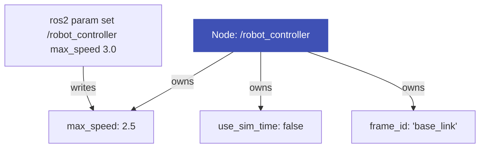
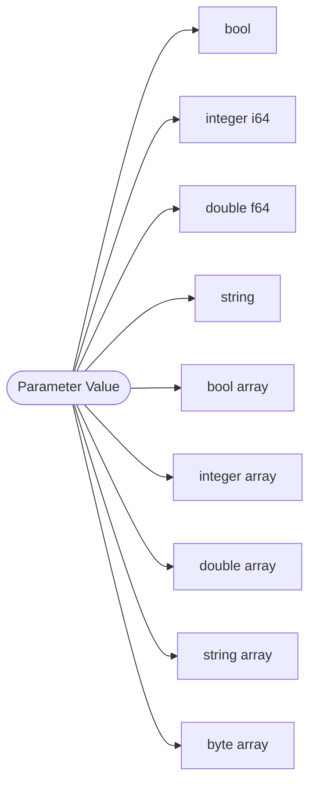
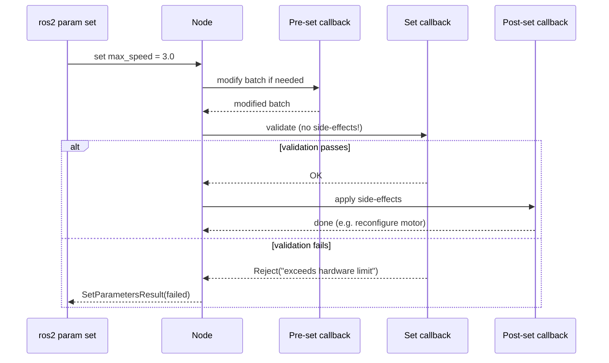

# Parameters

**ros-z implements the full ROS 2 parameter subsystem for native nodes.** Declare, get, set, and validate typed parameters at runtime — with config file loading, range constraints, and standard parameter services that interoperate with `ros2 param`.

!!! note
    Parameters let you configure node behavior at runtime without recompilation. ros-z parameters are fully compatible with the ROS 2 parameter protocol, so `ros2 param list`, `ros2 param get`, and `ros2 param set` work out of the box against ros-z nodes.

## What is a Parameter?



**Node-scoped runtime configuration. Each parameter belongs to exactly one node and changes without recompilation.**

- Typed: `bool`, `integer`, `double`, `string`, or array variants
- Declared: nodes reject unknown parameter names by default
- Introspectable: `ros2 param list/get/set` works on any ros-z node

### Parameters vs other config

| | Env var | Config file | ROS 2 Parameter |
|-|---------|------------|-----------------|
| Scope | Process | Application | Single node |
| Runtime change | No | No | **Yes** |
| Type enforcement | No | No | **Yes** |
| CLI introspection | No | No | **Yes** |
| Change callbacks | No | No | **Yes** |

### The 9 parameter types



### Change validation pipeline



!!! tip
    Only use side-effects (e.g. reconfiguring hardware) in the **post-set callback**. The set callback must be pure — a later parameter in the same batch might still fail.

### Standard parameter services

Every ros-z node auto-creates these services — no extra code needed:

| Service | What it does |
|---------|-------------|
| `get_parameters` | Read one or more values |
| `set_parameters` | Write values (each independently succeeds/fails) |
| `set_parameters_atomically` | Write all-or-nothing |
| `list_parameters` | List declared parameter names |
| `describe_parameters` | Return type, range, description |
| `get_parameter_types` | Return type IDs only |

### Key Concepts at a Glance

<div class="flashcard-grid">
  <div class="flashcard">
    <div class="flashcard-inner">
      <div class="flashcard-front">
        <div class="flashcard-tag">Scope</div>
        <div class="flashcard-term">Who owns a parameter?</div>
        <div class="flashcard-hint">Click to flip</div>
      </div>
      <div class="flashcard-back">
        One node. Parameters are not global — <strong>/robot/max_speed</strong> lives in the <strong>robot</strong> node. To share config across nodes, each node declares its own copy or uses a config file loaded at startup.
      </div>
    </div>
  </div>
  <div class="flashcard">
    <div class="flashcard-inner">
      <div class="flashcard-front">
        <div class="flashcard-tag">Types</div>
        <div class="flashcard-term">What are the 9 parameter types?</div>
        <div class="flashcard-hint">Click to flip</div>
      </div>
      <div class="flashcard-back">
        bool, integer (i64), double (f64), string — and array variants of each: bool[], integer[], double[], string[] — plus byte[].
      </div>
    </div>
  </div>
  <div class="flashcard">
    <div class="flashcard-inner">
      <div class="flashcard-front">
        <div class="flashcard-tag">Declaration</div>
        <div class="flashcard-term">What happens if you try to set an undeclared parameter?</div>
        <div class="flashcard-hint">Click to flip</div>
      </div>
      <div class="flashcard-back">
        By default, the node rejects it. Nodes must declare parameters they accept. This prevents misconfiguration from typos in parameter names.
      </div>
    </div>
  </div>
  <div class="flashcard">
    <div class="flashcard-inner">
      <div class="flashcard-front">
        <div class="flashcard-tag">Callbacks</div>
        <div class="flashcard-term">Which callback stage can safely trigger hardware changes?</div>
        <div class="flashcard-hint">Click to flip</div>
      </div>
      <div class="flashcard-back">
        Only the <strong>post-set callback</strong>. The set callback must be side-effect-free because a later parameter in the same batch might still fail. Post-set fires only after the full batch commits.
      </div>
    </div>
  </div>
  <div class="flashcard">
    <div class="flashcard-inner">
      <div class="flashcard-front">
        <div class="flashcard-tag">Atomicity</div>
        <div class="flashcard-term">What does set_parameters_atomically guarantee?</div>
        <div class="flashcard-hint">Click to flip</div>
      </div>
      <div class="flashcard-back">
        All-or-nothing: either every parameter in the batch changes, or none do. Prevents the node from landing in a half-configured state when setting related parameters together.
      </div>
    </div>
  </div>
  <div class="flashcard">
    <div class="flashcard-inner">
      <div class="flashcard-front">
        <div class="flashcard-tag">Interop</div>
        <div class="flashcard-term">How do you change a ros-z parameter from the CLI?</div>
        <div class="flashcard-hint">Click to flip</div>
      </div>
      <div class="flashcard-back">
        <strong>ros2 param set /my_node max_speed 2.5</strong>
        ros-z exposes standard parameter services so any ROS 2 tool works out of the box.
      </div>
    </div>
  </div>
</div>

## Visual Flow

```mermaid
graph TD
    A[ZNodeBuilder] -->|configure| B[ZNode]
    B -->|owns| C[ParameterStore]
    B -->|owns| D[ParameterService]
    D -->|hosts| E[6 ZServers]
    D -->|publishes| F[/parameter_events]
    E --> G[get_parameters]
    E --> H[set_parameters]
    E --> I[list_parameters]
    E --> J[describe_parameters]
    E --> K[get_parameter_types]
    E --> L[set_parameters_atomically]
```

## Key Features

| Feature | Description |
|---------|-------------|
| **Typed values** | 9 parameter types: bool, integer, double, string, byte/bool/integer/double/string arrays |
| **Range validation** | `FloatingPointRange` and `IntegerRange` constraints on descriptors |
| **Read-only** | Parameters that reject all changes after declaration |
| **YAML loading** | Load initial values from ROS 2 parameter YAML files with `/**` wildcard support |
| **Overrides** | Programmatic overrides applied at declaration time |
| **Validation callbacks** | Accept or reject changes with a reason string |
| **Standard services** | 6 parameter services compatible with `ros2 param` CLI |
| **Parameter events** | Global `/parameter_events` topic published on declare, set, and undeclare |

## Quick Start

```rust
use ros_z::{Builder, parameter::*};

let node = ctx.create_node("my_node").build()?;

// Declare a parameter with a descriptor
let desc = ParameterDescriptor::new("max_speed", ParameterType::Double);
node.declare_parameter("max_speed", ParameterValue::Double(1.0), desc)?;

// Get and set
let value = node.get_parameter("max_speed"); // Some(Double(1.0))
node.set_parameter(Parameter::new("max_speed", ParameterValue::Double(2.5)))?;
```

## Parameter Types

| Type | Rust variant | Wire type ID |
|------|-------------|--------------|
| Not set | `ParameterValue::NotSet` | 0 |
| Bool | `ParameterValue::Bool(bool)` | 1 |
| Integer | `ParameterValue::Integer(i64)` | 2 |
| Double | `ParameterValue::Double(f64)` | 3 |
| String | `ParameterValue::String(String)` | 4 |
| Byte array | `ParameterValue::ByteArray(Vec<u8>)` | 5 |
| Bool array | `ParameterValue::BoolArray(Vec<bool>)` | 6 |
| Integer array | `ParameterValue::IntegerArray(Vec<i64>)` | 7 |
| Double array | `ParameterValue::DoubleArray(Vec<f64>)` | 8 |
| String array | `ParameterValue::StringArray(Vec<String>)` | 9 |

## Declaring Parameters

Declare parameters before use. A `ParameterDescriptor` specifies the name, expected type, and optional constraints:

```rust
use ros_z::parameter::*;

// Basic declaration
let desc = ParameterDescriptor::new("timeout", ParameterType::Double);
node.declare_parameter("timeout", ParameterValue::Double(5.0), desc)?;

// With range constraint
let mut desc = ParameterDescriptor::new("speed", ParameterType::Integer);
desc.integer_range = Some(IntegerRange {
    from_value: 0,
    to_value: 100,
    step: 1,
});
node.declare_parameter("speed", ParameterValue::Integer(50), desc)?;

// Read-only parameter
let mut desc = ParameterDescriptor::new("version", ParameterType::String);
desc.read_only = true;
node.declare_parameter("version", ParameterValue::String("1.0".into()), desc)?;
```

Set `desc.dynamic_typing = true` when a parameter should accept later type changes instead of enforcing a fixed `ParameterType`.

## Getting and Setting

```rust
// Get returns Option<ParameterValue>
let value = node.get_parameter("timeout"); // Some(Double(5.0))
let missing = node.get_parameter("nonexistent"); // None

// Set returns Result<(), String>
node.set_parameter(Parameter::new("timeout", ParameterValue::Double(10.0)))?;

// Type mismatches are rejected
let err = node.set_parameter(Parameter::new("timeout", ParameterValue::Bool(true)));
assert!(err.is_err());

// Setting NotSet keeps the parameter declared
node.set_parameter(Parameter::new("timeout", ParameterValue::NotSet))?;

// Undeclare removes the parameter
node.undeclare_parameter("timeout")?;
```

## Validation Callbacks

Register a callback to accept or reject parameter changes before they take effect:

```rust
fn run(ctx: ZContext) -> Result<()> {
    println!("\n=== Validation Callback Demo ===\n");

    let node = ctx.create_node("callback_demo").build()?;

    let mut desc = ParameterDescriptor::new("temperature", ParameterType::Double);
    desc.floating_point_range = Some(FloatingPointRange {
        from_value: -40.0,
        to_value: 85.0,
        step: 0.0,
    });

    node.declare_parameter("temperature", ParameterValue::Double(20.0), desc)
        .expect("declare temperature");

    node.on_set_parameters(|params| {
        for p in params {
            if let ParameterValue::Double(v) = &p.value
                && *v > 50.0
            {
                return SetParametersResult::failure(format!(
                    "{} = {} exceeds safety limit 50.0",
                    p.name, v
                ));
            }
        }
        SetParametersResult::success()
    });

    node.set_parameter(Parameter::new("temperature", ParameterValue::Double(25.0)))
        .expect("set to 25.0");
    println!("temperature = {:?}", node.get_parameter("temperature"));

    let err = node
        .set_parameter(Parameter::new("temperature", ParameterValue::Double(60.0)))
        .unwrap_err();
    println!("Callback rejected: {}", err);

    println!(
        "temperature unchanged = {:?}",
        node.get_parameter("temperature")
    );

    Ok(())
}
```

The callback receives all parameters changing in a single batch. Return `SetParametersResult::success()` to accept or `SetParametersResult::failure("reason")` to reject the entire batch.

ros-z treats `ParameterValue::NotSet` as an unset value for a still-declared parameter. It does **not** delete the parameter; call `undeclare_parameter` for that.

## Parameter Services

Each node with parameters enabled exposes 6 standard services:

| Service | Purpose | CLI equivalent |
|---------|---------|---------------|
| `/<node>/get_parameters` | Read parameter values | `ros2 param get` |
| `/<node>/set_parameters` | Update parameter values | `ros2 param set` |
| `/<node>/list_parameters` | List declared parameter names | `ros2 param list` |
| `/<node>/describe_parameters` | Get parameter descriptors | `ros2 param describe` |
| `/<node>/get_parameter_types` | Get type IDs for parameters | — |
| `/<node>/set_parameters_atomically` | All-or-nothing batch update | — |

## Remote Parameter Client

Use `ParameterClient` when you want a typed client for another node's parameter services:

```rust
use std::sync::Arc;
use ros_z::parameter::{Parameter, ParameterClient, ParameterTarget, ParameterType, ParameterValue};

let client_node = Arc::new(ctx.create_node("param_client").build()?);
let client = ParameterClient::new(
    client_node,
    ParameterTarget::from_fqn("/my_node").expect("valid node name"),
);

let values = client.get(&["max_speed"]).await?;
let types = client.get_types(&["max_speed"]).await?;
let result = client
    .set_atomically(&[Parameter::new("max_speed", ParameterValue::Double(2.5))])
    .await?;
```

`ParameterClient` currently supports `describe`, `get`, `get_types`, `list`, `set`, and `set_atomically`.

## Loading from YAML

ros-z supports the standard ROS 2 parameter YAML format:

```yaml
/**:
  ros__parameters:
    global_timeout: 5.0
    debug: true

/my_node:
  ros__parameters:
    sensor_rate: 100
    device_name: "lidar_front"
```

- `/**` applies to all nodes (wildcard)
- `/my_node` applies only to that exact node
- Node-specific values override wildcard values

Load via the builder:

```rust
let node = ctx.create_node("my_node")
    .with_parameter_file(Path::new("params.yaml"))?
    .build()?;
```

Parameters from the file become overrides — they replace the default value when you call `declare_parameter`.

If both wildcard (`/**`) and node-specific entries match, node-specific values win. If you also call `.with_parameter_overrides(map)`, the last builder call wins.

## Node Builder Options

| Method | Effect |
|--------|--------|
| `.without_parameters()` | Disable parameter services entirely |
| `.with_parameter_overrides(map)` | Set overrides from a `HashMap<String, ParameterValue>` |
| `.with_parameter_file(path)` | Load overrides from a YAML file |

If you use both a file and programmatic overrides, the last call wins.

## /parameter_events

ros-z publishes a `ParameterEvent` message to `/parameter_events` for every successful parameter change, with QoS:

- **Topic**: `/parameter_events` (global, shared by all nodes)
- **Reliability**: Reliable
- **Durability**: Transient Local
- **History**: Keep Last (1000)

ros-z classifies events as:

- `new_parameters` on declaration
- `changed_parameters` on successful set, including `ParameterValue::NotSet`
- `deleted_parameters` on `undeclare_parameter`

This matches the ROS 2 default topic/QoS shape. Tools like `ros2 param` and `rqt_reconfigure` subscribe to this topic when the surrounding RMW/router setup supports it.

## ROS 2 Comparison

| Operation | rclcpp (C++) | ros-z (Rust) |
|-----------|-------------|--------------|
| Declare | `node->declare_parameter<T>("name", default)` | `node.declare_parameter("name", value, desc)` |
| Get | `node->get_parameter<T>("name")` | `node.get_parameter("name")` → `Option<ParameterValue>` |
| Set | `node->set_parameter(Parameter("name", v))` | `node.set_parameter(Parameter::new("name", v))` → `Result<(), String>` |
| Describe | `node->describe_parameter("name")` | `node.describe_parameter("name")` |
| Callback | `add_on_set_parameters_callback(cb)` | `node.on_set_parameters(cb)` |
| YAML load | `--ros-args --params-file file.yaml` | `.with_parameter_file(path)` |
| Overrides | `--ros-args -p name:=value` | `.with_parameter_overrides(map)` |
| Disable | not possible | `.without_parameters()` |
| Range | `FloatingPointRange` / `IntegerRange` | same types in `ParameterDescriptor` |
| Dynamic typing | `dynamic_typing` descriptor flag | same flag in `ParameterDescriptor` |
| CLI tools | `ros2 param list/get/set/dump` | same (interop via standard services) |

**Key differences:**

- **Error handling**: ros-z returns `Result<(), String>` on set failures; rclcpp throws exceptions
- **Callbacks**: ros-z callbacks receive `&[Parameter]` (slice) and return `SetParametersResult`; rclcpp receives `std::vector<rclcpp::Parameter>`
- **Opt-out**: ros-z can disable parameter services with `.without_parameters()`; rclcpp always enables them
- **Unset values**: ros-z keeps `ParameterValue::NotSet` declared; deletion is explicit via `undeclare_parameter`
- **No `declare_parameter_if_not_declared`**: check `node.get_parameter("name").is_some()` first

## ROS 2 Interoperability

ros-z parameter services use the same CDR wire format and RIHS01 type hashes as rclcpp. In an environment where ROS 2 is using `rmw_zenoh_cpp` and both sides connect to the same Eclipse Zenoh router, `ros2 param` commands work against ros-z nodes:

```bash
# List parameters on a ros-z node
ros2 param list /my_node

# Get a parameter value
ros2 param get /my_node max_speed

# Set a parameter value
ros2 param set /my_node max_speed 2.5

# Dump all parameters to YAML
ros2 param dump /my_node
```

!!! warning
    CLI interoperability depends on your local ROS 2 environment. Use `rmw_zenoh_cpp` (`export RMW_IMPLEMENTATION=rmw_zenoh_cpp`) and connect both sides to the same Zenoh router.

## Focused Examples

The parameter examples are now split into focused binaries:

```bash
# Start a Zenoh router first
cargo run --example zenoh_router

# Local declare/get/set/undeclare flow
cargo run --example z_parameter_declare

# Validation callback flow
cargo run --example z_parameter_callback

# YAML loading and overrides
cargo run --example z_parameter_yaml

# Remote ParameterClient flow
cargo run --example z_parameter_client
```

## Resources

- **[Feature Flags](../reference/feature-flags.md)** — `rcl_interfaces` feature for parameter service client types
- **[Services](./services.md)** — underlying service mechanism
- **[Quick Start](../getting-started/quick-start.md)** — getting started with ros-z
