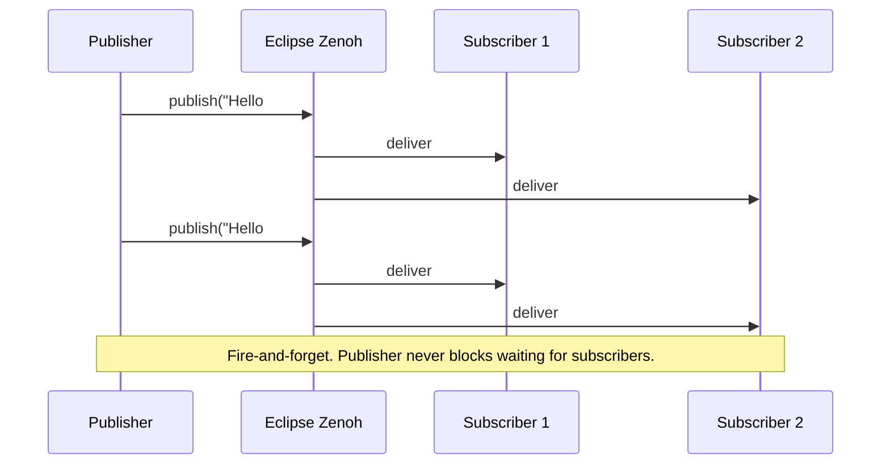

# Publishers and Subscribers

!!! note "Go users"
    The code examples in this chapter are **Rust**. For Go pub/sub patterns, QoS presets, and the typed subscriber API, see the [Go Bindings](../bindings/go.md) chapter.

**ros-z implements ROS 2's publish-subscribe pattern with type-safe, zero-copy messaging over Eclipse Zenoh.** This enables efficient, decoupled communication between nodes with minimal overhead.

!!! note
    The pub-sub pattern forms the foundation of ROS 2 communication, allowing nodes to exchange data without direct coupling. ros-z leverages Zenoh's efficient transport layer for optimal performance.

## What is Publish-Subscribe?


**One topic. Any number of senders and receivers. Neither side knows the other exists.**

- Publishers write messages to a named topic
- All current subscribers receive every message
- Adding a new subscriber (logger, visualizer) requires no code changes anywhere

### When to use topics

| Situation | Use | Why |
|-----------|-----|-----|
| Camera feed, lidar scan, IMU | **Topic** | High-frequency, many consumers |
| Robot position, joint states | **Topic** | Continuous stream, multiple observers |
| "Add these two numbers" | Service | One-shot, need a result |
| "Drive to (3, 4)" | Action | Long task, need progress + cancel |
| "Set max speed to 2.5" | Parameter | Runtime config, not data stream |

### Message flow



### Type safety

Every topic has exactly **one** message type. Mismatches are caught at connection time — not at runtime.

```text
/camera/image  →  sensor_msgs/Image       ✓ all publishers must use this type
/camera/image  →  sensor_msgs/Compressed  ✗ rejected at connection
```

### Quality of Service

QoS controls delivery guarantees. Incompatible settings = **silent** data loss.

| Preset | Reliability | Durability | Use for |
|--------|------------|------------|---------|
| Default | Reliable | Volatile | Commands, state |
| Sensor data | Best-effort | Volatile | Camera, lidar (recency > completeness) |
| Transient local | Reliable | Transient-local | Config topics late-joiners must receive |

!!! warning
    Incompatible QoS produces no error — messages silently stop flowing. Run `ros2 topic info -v /topic` to compare QoS on both ends.

### Key Concepts at a Glance

<div class="flashcard-grid">
  <div class="flashcard">
    <div class="flashcard-inner">
      <div class="flashcard-front">
        <div class="flashcard-tag">Pattern</div>
        <div class="flashcard-term">What is a Topic?</div>
        <div class="flashcard-hint">Click to flip</div>
      </div>
      <div class="flashcard-back">
        A named channel carrying a single message type. Publishers write to it; subscribers read from it. Neither knows the other exists.
      </div>
    </div>
  </div>
  <div class="flashcard">
    <div class="flashcard-inner">
      <div class="flashcard-front">
        <div class="flashcard-tag">Multiplicity</div>
        <div class="flashcard-term">How many publishers and subscribers can share a topic?</div>
        <div class="flashcard-hint">Click to flip</div>
      </div>
      <div class="flashcard-back">
        Any number of both. Zero publishers is valid (subscribers wait). Zero subscribers is valid (publishers drop into the void). All subscribers receive every message.
      </div>
    </div>
  </div>
  <div class="flashcard">
    <div class="flashcard-inner">
      <div class="flashcard-front">
        <div class="flashcard-tag">Type Safety</div>
        <div class="flashcard-term">What happens if publisher and subscriber use different message types?</div>
        <div class="flashcard-hint">Click to flip</div>
      </div>
      <div class="flashcard-back">
        No messages flow. ros-z checks type compatibility at connection time and rejects mismatches. This is a compile-time guarantee in Rust — the wrong type won't compile.
      </div>
    </div>
  </div>
  <div class="flashcard">
    <div class="flashcard-inner">
      <div class="flashcard-front">
        <div class="flashcard-tag">QoS</div>
        <div class="flashcard-term">What happens when QoS is incompatible?</div>
        <div class="flashcard-hint">Click to flip</div>
      </div>
      <div class="flashcard-back">
        No messages flow — silently. Example: a best-effort publisher and a reliable subscriber are incompatible. Check QoS events or use matching presets to avoid this.
      </div>
    </div>
  </div>
  <div class="flashcard">
    <div class="flashcard-inner">
      <div class="flashcard-front">
        <div class="flashcard-tag">vs Service</div>
        <div class="flashcard-term">Topic vs Service — when to pick which?</div>
        <div class="flashcard-hint">Click to flip</div>
      </div>
      <div class="flashcard-back">
        <div>• <strong>Topic</strong>: continuous data, many consumers, fire-and-forget.</div>
        <div>• <strong>Service</strong>: one-time computation, need a result, short duration.</div>
      </div>
    </div>
  </div>
  <div class="flashcard">
    <div class="flashcard-inner">
      <div class="flashcard-front">
        <div class="flashcard-tag">Latching</div>
        <div class="flashcard-term">How does a late subscriber get the last message?</div>
        <div class="flashcard-hint">Click to flip</div>
      </div>
      <div class="flashcard-back">
        Set durability to <strong>TransientLocal</strong> on both publisher and subscriber. The publisher retains the last N messages and replays them to late joiners.
      </div>
    </div>
  </div>
</div>

## Publisher Example

Publish "Hello World" messages to `/chatter` once per second:

```rust
use ros_z::{Builder, context::ZContextBuilder};
use ros_z_msgs::std_msgs::String as RosString;
use std::time::Duration;

let ctx = ZContextBuilder::default()
    .with_connect_endpoints(["tcp/127.0.0.1:7447"])
    .build()?;
let node = ctx.create_node("talker").build()?;
let publisher = node.create_pub::<RosString>("/chatter").build()?;

let mut count = 0;
loop {
    let msg = RosString { data: format!("Hello World: {}", count) };
    println!("Publishing: '{}'", msg.data);
    publisher.async_publish(&msg).await?;
    tokio::time::sleep(Duration::from_secs(1)).await;
    count += 1;
}
```

**Key points:**

- `async_publish()` is non-blocking — the publisher never waits for subscribers
- For a non-async context, use `publisher.publish(&msg)?` instead
- Default QoS (Reliable, KeepLast 10) is fine for most use cases; see the [QoS section](#quality-of-service-qos) below for custom profiles

## Subscriber Example

Receive and print every message on `/chatter`:

```rust
use ros_z::{Builder, context::ZContextBuilder};
use ros_z_msgs::std_msgs::String as RosString;

let ctx = ZContextBuilder::default()
    .with_connect_endpoints(["tcp/127.0.0.1:7447"])
    .build()?;
let node = ctx.create_node("listener").build()?;
let subscriber = node.create_sub::<RosString>("/chatter").build()?;

while let Ok(msg) = subscriber.async_recv().await {
    println!("I heard: [{}]", msg.data);
}
```

**Key points:**

- `async_recv()` awaits the next message; the loop exits when the subscriber is dropped
- For a non-async context, use `subscriber.recv()` (blocks the thread)
- For timeout-based polling, use `subscriber.recv_timeout(Duration::from_secs(1))`

## Complete Pub-Sub Workflow

!!! note
    These commands run the ready-made examples from the ros-z repository. Clone it first with `git clone https://github.com/ZettaScaleLabs/ros-z.git && cd ros-z`. If you're building your own project, run your binaries with `cargo run` instead.

**Terminal 1 — Start Zenoh Router:**

```bash
cargo run --example zenoh_router
```

**Terminal 2 — Start Subscriber:**

```bash
cargo run --example demo_nodes_listener
```

**Terminal 3 — Start Publisher:**

```bash
cargo run --example demo_nodes_talker
```


<script src="https://asciinema.org/a/l7L1vuoyZSYwXEGE.js" id="asciicast-l7L1vuoyZSYwXEGE" async="true"></script>

## Subscriber Patterns

ros-z provides three patterns for receiving messages, each suited for different use cases:

!!! tip
    `use ros_z::Builder;` must be in scope to call `.build()` on any ros-z builder type. Add it alongside your other ros-z imports.

### Pattern 1: Blocking Receive (Pull Model)

Best for: Simple sequential processing, scripting

```rust
use ros_z::Builder; // required to call .build()

let subscriber = node
    .create_sub::<RosString>("topic_name")
    .build()?;

while let Ok(msg) = subscriber.recv() {
    println!("Received: {}", msg.data);
}
```

### Pattern 2: Async Receive (Pull Model)

Best for: Integration with async codebases, handling multiple streams

```rust
use ros_z::Builder; // required to call .build()

let subscriber = node
    .create_sub::<RosString>("topic_name")
    .build()?;

while let Ok(msg) = subscriber.async_recv().await {
    println!("Received: {}", msg.data);
}
```

### Pattern 3: Callback (Push Model)

Best for: Event-driven architectures, low-latency response

```rust
use ros_z::Builder; // required to call .build_with_callback()

let subscriber = node
    .create_sub::<RosString>("topic_name")
    .build_with_callback(|msg| {
        println!("Received: {}", msg.data);
    })?;

// No need to call recv() - callback handles messages automatically
// Your code continues while messages are processed in the background
```

!!! tip
    Use callbacks for low-latency event-driven processing. Use blocking/async receive when you need explicit control over when you process messages.

### Pattern Comparison

| Aspect | Blocking Receive | Async Receive | Callback |
|--------|------------------|---------------|----------|
| **Control Flow** | Sequential | Sequential | Event-driven |
| **Latency** | Medium (poll-based) | Medium (poll-based) | Low (immediate) |
| **Memory** | Queue size × message | Queue size × message | No queue |
| **Backpressure** | Built-in (queue full) | Built-in (queue full) | None (drops if slow) |
| **Use Case** | Simple scripts | Async applications | Real-time response |

## Quality of Service (QoS)

QoS profiles control delivery guarantees. Apply a profile with `.with_qos(qos)` on the publisher or subscriber builder:

```rust
use std::num::NonZeroUsize;
use ros_z::Builder;
use ros_z::qos::{QosProfile, QosHistory, QosReliability};

// Sensor data: best-effort, keep only the latest value
let qos = QosProfile {
    history: QosHistory::KeepLast(NonZeroUsize::new(1).unwrap()),
    reliability: QosReliability::BestEffort,
    ..Default::default()
};

let publisher = node.create_pub::<RosString>("/scan").with_qos(qos).build()?;
```

Common presets:

| Use case | Reliability | History |
|----------|-------------|---------|
| Commands, joint states | `Reliable` | `KeepLast(10)` (default) |
| Camera, lidar | `BestEffort` | `KeepLast(1)` |
| `/tf_static`, `/robot_description` | `Reliable` + `TransientLocal` | `KeepLast(1)` |

!!! tip
    Always use the same QoS preset on both publisher and subscriber. Mismatches silently drop messages — run `ros2 topic info -v /topic` to compare QoS on both sides.

## Name Remapping

ros-z supports ROS 2-style topic remapping via `ZContextBuilder::with_remap_rule()`. Remapping rules apply to all nodes created from the same context and redirect topic/service names at the context level.

```rust
# fn main() -> zenoh::Result<()> {
use ros_z::context::ZContextBuilder;
use ros_z::Builder;

let ctx = ZContextBuilder::default()
    .with_remap_rule("/chatter:=/my_chatter")?  // redirect /chatter to /my_chatter
    .with_remap_rule("__node:=renamed_node")?   // rename the node
    .build()?;
# Ok(())
# }
```

Add multiple rules with `.with_remap_rules()`:

```rust
# fn main() -> zenoh::Result<()> {
use ros_z::context::ZContextBuilder;
use ros_z::Builder;

let ctx = ZContextBuilder::default()
    .with_remap_rules(["/input:=/sensor/data", "/output:=/processed/data"])?
    .build()?;
# Ok(())
# }
```

The rule format follows the ROS 2 convention: `from:=to`.

## ROS 2 Interoperability

ros-z publishers and subscribers interoperate with ROS 2 C++ and Python nodes via the shared Zenoh transport. See the dedicated **[ROS 2 Interoperability](../user-guide/interop.md)** chapter for setup instructions covering Rust, Python, and Go.

## Resources

- **[Custom Messages](../user-guide/custom-messages.md)** - Defining and using custom message types
- **[Message Generation](../user-guide/message-generation.md)** - Generating Rust types from ROS 2 messages
- **[Quick Start](../getting-started/quick-start.md)** - Getting started guide

**Start with the examples above to understand the basic pub-sub workflow, then explore custom messages for domain-specific communication.**
