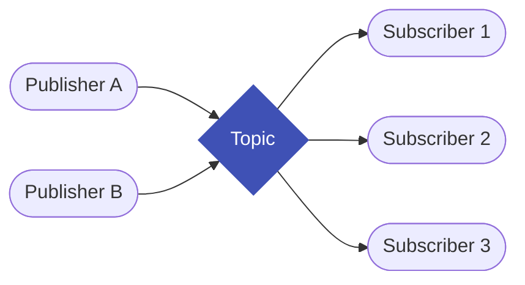
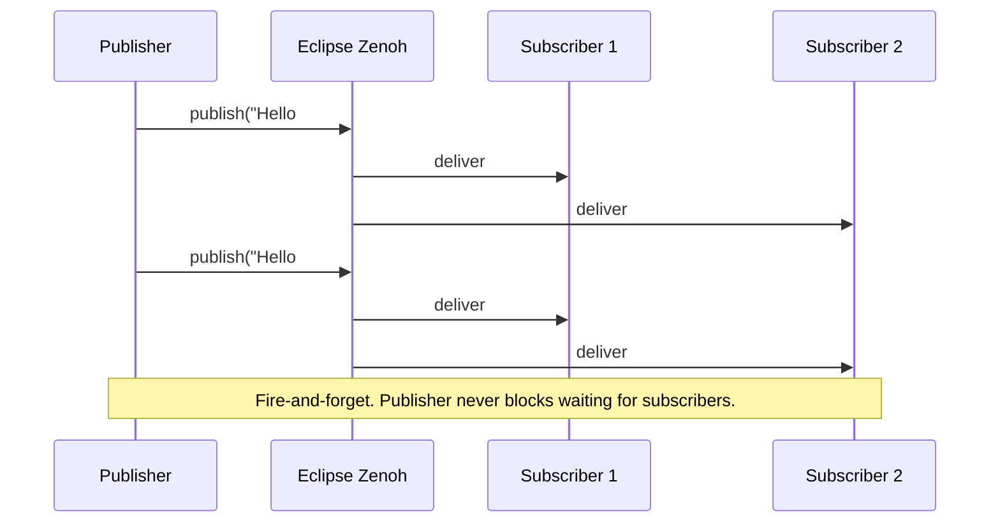

# Publishers and Subscribers

!!! note "Go users"
    The code examples in this chapter are **Rust**. For Go pub/sub patterns, QoS presets, and the typed subscriber API, see the [Go Bindings](../bindings/go.md) chapter.

**ros-z implements ROS 2's publish-subscribe pattern with type-safe, zero-copy messaging over Eclipse Zenoh.** This enables efficient, decoupled communication between nodes with minimal overhead.

!!! note
    The pub-sub pattern forms the foundation of ROS 2 communication, allowing nodes to exchange data without direct coupling. ros-z leverages Zenoh's efficient transport layer for optimal performance.

## What is Publish-Subscribe?



**One topic. Any number of senders and receivers. Neither side knows the other exists.**

- Publishers write messages to a named topic
- All current subscribers receive every message
- Adding a new subscriber (logger, visualizer) requires no code changes anywhere

### When to use topics

| Situation | Use | Why |
|-----------|-----|-----|
| Camera feed, lidar scan, IMU | **Topic** | High-frequency, many consumers |
| Robot position, joint states | **Topic** | Continuous stream, multiple observers |
| "Add these two numbers" | Service | One-shot, need a result |
| "Drive to (3, 4)" | Action | Long task, need progress + cancel |
| "Set max speed to 2.5" | Parameter | Runtime config, not data stream |

### Message flow



### Type safety

Every topic has exactly **one** message type. Mismatches are caught at connection time — not at runtime.

```text
/camera/image  →  sensor_msgs/Image       ✓ all publishers must use this type
/camera/image  →  sensor_msgs/Compressed  ✗ rejected at connection
```

### Quality of Service

QoS controls delivery guarantees. Incompatible settings = **silent** data loss.

| Preset | Reliability | Durability | Use for |
|--------|------------|------------|---------|
| Default | Reliable | Volatile | Commands, state |
| Sensor data | Best-effort | Volatile | Camera, lidar (recency > completeness) |
| Transient local | Reliable | Transient-local | Config topics late-joiners must receive |

!!! warning
    Incompatible QoS produces no error — messages silently stop flowing. Run `ros2 topic info -v /topic` to compare QoS on both ends.

### Key Concepts at a Glance

<div class="flashcard-grid">
  <div class="flashcard">
    <div class="flashcard-inner">
      <div class="flashcard-front">
        <div class="flashcard-tag">Pattern</div>
        <div class="flashcard-term">What is a Topic?</div>
        <div class="flashcard-hint">Click to flip</div>
      </div>
      <div class="flashcard-back">
        A named channel carrying a single message type. Publishers write to it; subscribers read from it. Neither knows the other exists.
      </div>
    </div>
  </div>
  <div class="flashcard">
    <div class="flashcard-inner">
      <div class="flashcard-front">
        <div class="flashcard-tag">Multiplicity</div>
        <div class="flashcard-term">How many publishers and subscribers can share a topic?</div>
        <div class="flashcard-hint">Click to flip</div>
      </div>
      <div class="flashcard-back">
        Any number of both. Zero publishers is valid (subscribers wait). Zero subscribers is valid (publishers drop into the void). All subscribers receive every message.
      </div>
    </div>
  </div>
  <div class="flashcard">
    <div class="flashcard-inner">
      <div class="flashcard-front">
        <div class="flashcard-tag">Type Safety</div>
        <div class="flashcard-term">What happens if publisher and subscriber use different message types?</div>
        <div class="flashcard-hint">Click to flip</div>
      </div>
      <div class="flashcard-back">
        No messages flow. ros-z checks type compatibility at connection time and rejects mismatches. This is a compile-time guarantee in Rust — the wrong type won't compile.
      </div>
    </div>
  </div>
  <div class="flashcard">
    <div class="flashcard-inner">
      <div class="flashcard-front">
        <div class="flashcard-tag">QoS</div>
        <div class="flashcard-term">What happens when QoS is incompatible?</div>
        <div class="flashcard-hint">Click to flip</div>
      </div>
      <div class="flashcard-back">
        No messages flow — silently. Example: a best-effort publisher and a reliable subscriber are incompatible. Check QoS events or use matching presets to avoid this.
      </div>
    </div>
  </div>
  <div class="flashcard">
    <div class="flashcard-inner">
      <div class="flashcard-front">
        <div class="flashcard-tag">vs Service</div>
        <div class="flashcard-term">Topic vs Service — when to pick which?</div>
        <div class="flashcard-hint">Click to flip</div>
      </div>
      <div class="flashcard-back">
        <div>• <strong>Topic</strong>: continuous data, many consumers, fire-and-forget.</div>
        <div>• <strong>Service</strong>: one-time computation, need a result, short duration.</div>
      </div>
    </div>
  </div>
  <div class="flashcard">
    <div class="flashcard-inner">
      <div class="flashcard-front">
        <div class="flashcard-tag">Latching</div>
        <div class="flashcard-term">How does a late subscriber get the last message?</div>
        <div class="flashcard-hint">Click to flip</div>
      </div>
      <div class="flashcard-back">
        Set durability to <strong>TransientLocal</strong> on both publisher and subscriber. The publisher retains the last N messages and replays them to late joiners.
      </div>
    </div>
  </div>
</div>

## Publisher Example

This example demonstrates publishing "Hello World" messages to a topic. The publisher sends messages periodically, showcasing the fundamental publishing pattern.

```rust
/// Talker node that publishes "Hello World" messages to a topic
///
/// # Arguments
/// * `ctx` - The ros-z context
/// * `topic` - The topic name to publish to
/// * `period` - Duration between messages
/// * `max_count` - Optional maximum number of messages to publish. If None, publishes indefinitely.
pub async fn run_talker(
    ctx: ZContext,
    topic: &str,
    period: Duration,
    max_count: Option<usize>,
) -> Result<()> {
    // Create a node named "talker"
    let node = ctx.create_node("talker").build()?;

    // Create a publisher with a custom Quality of Service profile
    let qos = QosProfile {
        history: QosHistory::KeepLast(NonZeroUsize::new(7).unwrap()),
        ..Default::default()
    };
    let publisher = node.create_pub::<RosString>(topic).with_qos(qos).build()?;

    let mut count = 1;

    loop {
        // Create the message
        let msg = RosString {
            data: format!("Hello World: {}", count),
        };

        // Log the message being published
        println!("Publishing: '{}'", msg.data);

        // Publish the message (non-blocking)
        publisher.async_publish(&msg).await?;

        // Check if we've reached the max count
        if let Some(max) = max_count
            && count >= max
        {
            break;
        }

        // Wait for the next publish cycle
        tokio::time::sleep(period).await;

        count += 1;
    }

    Ok(())
}
```

**Key points:**

- **QoS Configuration**: Uses `KeepLast(7)` to buffer the last 7 messages
- **Async Publishing**: Non-blocking `async_publish()` for efficient I/O. For blocking (non-async) contexts, use `publisher.publish(&msg)?` instead.
- **Rate Control**: Uses `tokio::time::sleep()` to control publishing frequency
- **Bounded Operation**: Optional `max_count` for testing scenarios

**Running the publisher:**

```bash
# Basic usage
cargo run --example demo_nodes_talker

# Custom topic and rate
cargo run --example demo_nodes_talker -- --topic /my_topic --period 0.5
```

## Subscriber Example

This example demonstrates subscribing to messages from a topic. The subscriber receives and displays messages, showing both timeout-based and async reception patterns.

```rust
/// Listener node that subscribes to a topic
///
/// # Arguments
/// * `ctx` - The ros-z context
/// * `topic` - The topic name to subscribe to
/// * `max_count` - Optional maximum number of messages to receive. If None, listens indefinitely.
/// * `timeout` - Optional timeout duration. If None, waits indefinitely.
///
/// # Returns
/// A vector of received messages
pub async fn run_listener(
    ctx: ZContext,
    topic: &str,
    max_count: Option<usize>,
    timeout: Option<Duration>,
) -> Result<Vec<String>> {
    // Create a node named "listener"
    let node = ctx.create_node("listener").build()?;

    // Create a subscription to the "chatter" topic
    let qos = QosProfile {
        history: QosHistory::KeepLast(NonZeroUsize::new(10).unwrap()),
        ..Default::default()
    };
    let subscriber = node.create_sub::<RosString>(topic).with_qos(qos).build()?;

    let mut received_messages = Vec::new();
    let start = std::time::Instant::now();

    // Receive messages in a loop
    loop {
        // Check timeout
        if let Some(t) = timeout
            && start.elapsed() > t
        {
            break;
        }

        // Try to receive with a small timeout to allow checking other conditions
        let recv_result = if timeout.is_some() || max_count.is_some() {
            subscriber.recv_timeout(Duration::from_millis(100))
        } else {
            // If no limits, use async_recv
            subscriber.async_recv().await
        };

        match recv_result {
            Ok(msg) => {
                // Log the received message
                println!("I heard: [{}]", msg.data);
                received_messages.push(msg.data.clone());

                // Check if we've received enough messages
                if let Some(max) = max_count
                    && received_messages.len() >= max
                {
                    break;
                }
            }
            Err(_) => {
                // Continue if timeout on recv_timeout
                if timeout.is_some() || max_count.is_some() {
                    continue;
                } else {
                    break;
                }
            }
        }
    }

    Ok(received_messages)
}
```

**Key points:**

- **Flexible Reception**: Supports timeout-based and indefinite blocking
- **Testable Design**: Returns received messages for verification
- **Bounded Operation**: Optional `max_count` and `timeout` parameters
- **QoS Configuration**: Uses `KeepLast(10)` for message buffering

**Running the subscriber:**

```bash
# Basic usage
cargo run --example demo_nodes_listener

# Custom topic
cargo run --example demo_nodes_listener -- --topic /my_topic
```

## Complete Pub-Sub Workflow

To see publishers and subscribers in action together, you'll need to start a Zenoh router first:

**Terminal 1 - Start Zenoh Router:**

```bash
cargo run --example zenoh_router
```

**Terminal 2 - Start Subscriber:**

```bash
cargo run --example demo_nodes_listener
```

**Terminal 3 - Start Publisher:**

```bash
cargo run --example demo_nodes_talker
```


<script src="https://asciinema.org/a/l7L1vuoyZSYwXEGE.js" id="asciicast-l7L1vuoyZSYwXEGE" async="true"></script>

## Subscriber Patterns

ros-z provides three patterns for receiving messages, each suited for different use cases:

!!! tip
    `use ros_z::Builder;` must be in scope to call `.build()` on any ros-z builder type. Add it alongside your other ros-z imports.

### Pattern 1: Blocking Receive (Pull Model)

Best for: Simple sequential processing, scripting

```rust
use ros_z::Builder; // required to call .build()

let subscriber = node
    .create_sub::<RosString>("topic_name")
    .build()?;

while let Ok(msg) = subscriber.recv() {
    println!("Received: {}", msg.data);
}
```

### Pattern 2: Async Receive (Pull Model)

Best for: Integration with async codebases, handling multiple streams

```rust
use ros_z::Builder; // required to call .build()

let subscriber = node
    .create_sub::<RosString>("topic_name")
    .build()?;

while let Ok(msg) = subscriber.async_recv().await {
    println!("Received: {}", msg.data);
}
```

### Pattern 3: Callback (Push Model)

Best for: Event-driven architectures, low-latency response

```rust
use ros_z::Builder; // required to call .build_with_callback()

let subscriber = node
    .create_sub::<RosString>("topic_name")
    .build_with_callback(|msg| {
        println!("Received: {}", msg.data);
    })?;

// No need to call recv() - callback handles messages automatically
// Your code continues while messages are processed in the background
```

!!! tip
    Use callbacks for low-latency event-driven processing. Use blocking/async receive when you need explicit control over when you process messages.

### Pattern Comparison

| Aspect | Blocking Receive | Async Receive | Callback |
|--------|------------------|---------------|----------|
| **Control Flow** | Sequential | Sequential | Event-driven |
| **Latency** | Medium (poll-based) | Medium (poll-based) | Low (immediate) |
| **Memory** | Queue size × message | Queue size × message | No queue |
| **Backpressure** | Built-in (queue full) | Built-in (queue full) | None (drops if slow) |
| **Use Case** | Simple scripts | Async applications | Real-time response |

## Quality of Service (QoS)

QoS profiles control message delivery behavior. Both publishers and subscribers accept a QoS profile:

**Publisher QoS:**

```rust
use std::num::NonZeroUsize;
use ros_z::Builder;
use ros_z::qos::{QosProfile, QosHistory, QosReliability};

let qos = QosProfile {
    history: QosHistory::KeepLast(NonZeroUsize::new(10).unwrap()),
    reliability: QosReliability::Reliable,
    ..Default::default()
};

let publisher = node
    .create_pub::<RosString>("topic")
    .with_qos(qos)
    .build()?;
```

**Subscriber QoS:**

```rust
use std::num::NonZeroUsize;
use ros_z::Builder;
use ros_z::qos::{QosProfile, QosHistory, QosReliability};

let qos = QosProfile {
    history: QosHistory::KeepLast(NonZeroUsize::new(10).unwrap()),
    reliability: QosReliability::Reliable,
    ..Default::default()
};

let subscriber = node
    .create_sub::<RosString>("topic")
    .with_qos(qos)
    .build()?;
```

!!! tip
    Use `QosHistory::KeepLast(NonZeroUsize::new(1).unwrap())` for sensor data and `QosReliability::Reliable` for critical commands. Match QoS profiles between publishers and subscribers for optimal message delivery.

## Name Remapping

ros-z supports ROS 2-style topic remapping via `ZContextBuilder::with_remap_rule()`. Remapping rules apply to all nodes created from the same context and redirect topic/service names at the context level.

```rust
# fn main() -> zenoh::Result<()> {
use ros_z::context::ZContextBuilder;
use ros_z::Builder;

let ctx = ZContextBuilder::default()
    .with_remap_rule("/chatter:=/my_chatter")?  // redirect /chatter to /my_chatter
    .with_remap_rule("__node:=renamed_node")?   // rename the node
    .build()?;
# Ok(())
# }
```

Add multiple rules with `.with_remap_rules()`:

```rust
# fn main() -> zenoh::Result<()> {
use ros_z::context::ZContextBuilder;
use ros_z::Builder;

let ctx = ZContextBuilder::default()
    .with_remap_rules(["/input:=/sensor/data", "/output:=/processed/data"])?
    .build()?;
# Ok(())
# }
```

The rule format follows the ROS 2 convention: `from:=to`.

## ROS 2 Interoperability

ros-z publishers and subscribers interoperate with ROS 2 C++ and Python nodes via the shared Zenoh transport. See the dedicated **[ROS 2 Interoperability](../user-guide/interop.md)** chapter for setup instructions covering Rust, Python, and Go.

## Resources

- **[Custom Messages](../user-guide/custom-messages.md)** - Defining and using custom message types
- **[Message Generation](../user-guide/message-generation.md)** - Generating Rust types from ROS 2 messages
- **[Quick Start](../getting-started/quick-start.md)** - Getting started guide

**Start with the examples above to understand the basic pub-sub workflow, then explore custom messages for domain-specific communication.**
