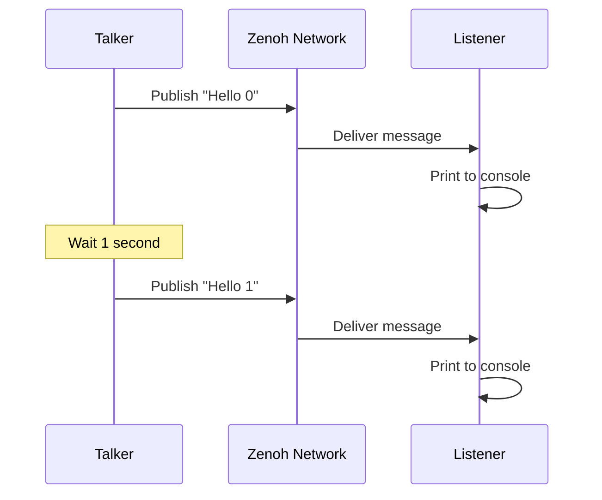

<!-- markdownlint-disable MD046 -->
# Quick Start

**Get ros-z running in under 5 minutes.** Pick your language below — no ROS 2 installation required.

## Pre-built Releases

Pre-built artifacts are available on the [Releases page](https://github.com/ZettaScaleLabs/ros-z/releases) — no Rust toolchain required:

| Artifact | Use case | Install |
|---|---|---|
| `ros-z-console` binary | Monitor any ROS 2 / ros-z system | [Console docs](../tools/console.md#installation) |
| `ros-z-bridge` binary | Bridge Humble ↔ Jazzy/Kilted | [Bridge docs](../user-guide/bridge.md#installation) |
| `ros_z_py` Python wheel | Python pub/sub & services | [Python quick start](../bindings/python-quick-start.md) |
| `libros_z` Go library | Go pub/sub & services | [Go quick start](../bindings/go-quick-start.md) |

---

## Embed ros-z in a Rust Application

The rest of this page covers using ros-z from Rust. If you're using Python or Go, follow the quick start links in the table above instead.

**Prerequisites:**

- **Rust 1.85+** (requires edition 2024) — install via [rustup](https://rustup.rs/)
- **Tokio 1.x** — ros-z requires an async runtime (added to `Cargo.toml` in Option 2 below)
- No ROS 2 installation needed

There are two ways to get started:

1. **Option 1: Try the Examples** — Clone the ros-z repository and run pre-built examples (fastest)
2. **Option 2: Create Your Own Project** — Start a new Rust project with ros-z as a dependency

---

## Option 1: Try the Examples

The quickest way to experience ros-z is to run the included examples from the repository.

### Clone the Repository

```bash
git clone https://github.com/ZettaScaleLabs/ros-z.git
cd ros-z
```

### Start the Eclipse Zenoh Router

ros-z uses a router-based architecture (matching ROS 2's [`rmw_zenoh`](https://github.com/ros2/rmw_zenoh) — the ROS 2 middleware plugin for Zenoh), so you'll need to start a Zenoh router first. The router acts as a rendezvous point for all nodes: publishers and subscribers discover each other through it instead of via multicast.

**Terminal 1 - Start the Router:**

```bash
cargo run --example zenoh_router
```

### Run the Pub/Sub Example

Open two more terminals and navigate to the same `ros-z` directory:

**Terminal 2 - Start the Listener:**

```bash
cd ros-z
cargo run --example z_pubsub -- --role listener
```

**Terminal 3 - Start the Talker:**

```bash
cd ros-z
cargo run --example z_pubsub -- --role talker
```

!!! success
    You should see the listener receiving messages published by the talker in real-time. Press Ctrl+C to stop any process.

### Understanding the Code

Here's the complete example you ran:

```rust
use std::time::Duration;

use clap::{Parser, ValueEnum};
use ros_z::{
    Builder, Result,
    context::{ZContext, ZContextBuilder},
};
use ros_z_msgs::std_msgs::String as RosString;

/// Subscriber function that continuously receives messages from a topic
async fn run_subscriber(ctx: ZContext, topic: String) -> Result<()> {
    // Create a ROS 2 node - the fundamental unit of computation
    let node = ctx.create_node("Sub").build()?;

    // Create a subscriber for the specified topic
    let zsub = node.create_sub::<RosString>(&topic).build()?;

    // Continuously receive messages asynchronously
    while let Ok(msg) = zsub.async_recv().await {
        println!("Hearing:>> {}", msg.data);
    }
    Ok(())
}

/// Publisher function that continuously publishes messages to a topic
async fn run_publisher(
    ctx: ZContext,
    topic: String,
    period: Duration,
    payload: String,
) -> Result<()> {
    let node = ctx.create_node("Pub").build()?;
    let zpub = node.create_pub::<RosString>(&topic).build()?;

    let mut count = 0;
    loop {
        let str = RosString {
            data: format!("{payload} - #{count}"),
        };
        println!("Telling:>> {}", str.data);
        zpub.async_publish(&str).await?;
        let _ = tokio::time::sleep(period).await;
        count += 1;
    }
}

#[tokio::main]
async fn main() -> Result<()> {
    let args = Args::parse();

    let format = match args.backend {
        Backend::RmwZenoh => ros_z_protocol::KeyExprFormat::RmwZenoh,
        #[cfg(feature = "ros2dds")]
        Backend::Ros2Dds => ros_z_protocol::KeyExprFormat::Ros2Dds,
    };

    // Create a ZContext - the entry point for ros-z applications
    let ctx = if let Some(e) = args.endpoint {
        ZContextBuilder::default()
            .with_mode(args.mode)
            .with_connect_endpoints([e])
            .keyexpr_format(format)
            .build()?
    } else {
        ZContextBuilder::default()
            .with_mode(args.mode)
            .keyexpr_format(format)
            .build()?
    };

    let period = std::time::Duration::from_secs_f64(args.period);
    zenoh::init_log_from_env_or("error");

    match args.role.as_str() {
        "listener" => run_subscriber(ctx, args.topic).await?,
        "talker" => run_publisher(ctx, args.topic, period, args.data).await?,
        role => println!(
            "Please use \"talker\" or \"listener\" as role, {} is not supported.",
            role
        ),
    }
    Ok(())
}

#[derive(Debug, Clone, Copy, ValueEnum)]
enum Backend {
    /// RmwZenoh backend (default) - compatible with rmw_zenoh nodes
    RmwZenoh,
    #[cfg(feature = "ros2dds")]
    Ros2Dds,
}

#[derive(Debug, Parser)]
struct Args {
    #[arg(short, long, default_value = "Hello ros-z")]
    data: String,
    #[arg(short, long, default_value = "/chatter")]
    topic: String,
    #[arg(short, long, default_value = "1.0")]
    period: f64,
    #[arg(short, long, default_value = "listener")]
    role: String,
    #[arg(short, long, default_value = "peer")]
    mode: String,
    #[arg(short, long)]
    endpoint: Option<String>,
    #[arg(short, long, value_enum, default_value = "rmw-zenoh")]
    backend: Backend,
}
```

---

## Option 2: Create Your Own Project

Ready to build your own ros-z application? Follow these steps to create a new project from scratch.

### 1. Install the Zenoh Router

Since you won't have access to the `zenoh_router` example outside the ros-z repository, you'll need to install a Zenoh router. Here are the quickest options:

**Option A: Using cargo (if you have Rust):**

```bash
cargo install zenohd
```

**Option B: Using pre-built binary (no Rust needed):**

Download the latest release for your platform from:
**<https://github.com/eclipse-zenoh/zenoh/releases>**

Then extract and run:

```bash
unzip zenoh-*.zip
chmod +x zenohd
./zenohd
```

**Option C: Using Docker:**

```bash
docker run --init --net host eclipse/zenoh:latest
```

**Start the router:**

```bash
zenohd
```

!!! tip
    For more installation options (apt, brew, Windows, etc.), see the comprehensive [Zenoh Router Installation Guide](../user-guide/networking.md#running-the-zenoh-router).

!!! note
    Keep the router running in a separate terminal. All ros-z applications will connect to it.

### 2. Create a New Rust Project

```bash
cargo new my_ros_z_project
cd my_ros_z_project
```

### 3. Add Dependencies

Add ros-z to your `Cargo.toml`:

```toml
[dependencies]
ros-z = { git = "https://github.com/ZettaScaleLabs/ros-z.git" }
ros-z-msgs = { git = "https://github.com/ZettaScaleLabs/ros-z.git" }  # Standard ROS 2 message types
tokio = { version = "1", features = ["full"] }  # Async runtime
```

!!! note
    ros-z requires an async runtime. This example uses Tokio, the most popular choice in the Rust ecosystem.

### 4. Write Your First Application

Replace the contents of `src/main.rs` with this simple publisher example:

!!! tip "Simpler imports with prelude"
    Instead of importing `Builder`, `Result`, and `ZContextBuilder` separately, use `use ros_z::prelude::*;` to bring all common ros-z types into scope at once.

```rust
use std::time::Duration;
use ros_z::{Builder, Result, context::ZContextBuilder};
use ros_z_msgs::std_msgs::String as RosString;

#[tokio::main]
async fn main() -> Result<()> {
    // Initialize ros-z context (connects to router on localhost:7447)
    let ctx = ZContextBuilder::default()
        .with_connect_endpoints(["tcp/127.0.0.1:7447"])
        .build()?;

    // Create a ROS 2 node
    let node = ctx.create_node("my_talker").build()?;

    // Create a publisher for the /chatter topic
    let pub_handle = node.create_pub::<RosString>("/chatter").build()?;

    // Publish messages every second
    let mut count = 0;
    loop {
        let msg = RosString {
            data: format!("Hello from ros-z #{}", count),
        };
        println!("Publishing: {}", msg.data);
        pub_handle.async_publish(&msg).await?;
        count += 1;
        tokio::time::sleep(Duration::from_secs(1)).await;
    }
}
```

### 5. Run Your Application

Make sure the Zenoh router (`zenohd`) is running in another terminal, then:

```bash
cargo run
```

!!! success
    You should see the application publishing messages every second. It will continue until you press Ctrl+C.

### 6. Test with Multiple Nodes

Open another terminal and create a simple listener to verify communication:

**Create `src/bin/listener.rs`:**

```rust
use ros_z::{Builder, Result, context::ZContextBuilder};
use ros_z_msgs::std_msgs::String as RosString;

#[tokio::main]
async fn main() -> Result<()> {
    let ctx = ZContextBuilder::default()
        .with_connect_endpoints(["tcp/127.0.0.1:7447"])
        .build()?;
    let node = ctx.create_node("my_listener").build()?;
    let sub = node.create_sub::<RosString>("/chatter").build()?;

    println!("Listening on /chatter...");
    while let Ok(msg) = sub.async_recv().await {
        println!("Received: {}", msg.data);
    }
    Ok(())
}
```

**Run both:**

```bash
# Terminal 1: Router
zenohd

# Terminal 2: Publisher
cargo run

# Terminal 3: Listener
cargo run --bin listener
```

---

## Key Components

| Component | Purpose | Usage |
|-----------|---------|-------|
| **ZContextBuilder** | Initialize ros-z environment | Entry point, configure settings |
| **ZContext** | Manages ROS 2 connections | Create nodes from this |
| **Node** | Logical unit of computation | Publishers/subscribers attach here |
| **Publisher** | Sends messages to topics | `node.create_pub::<Type>("topic")` |
| **Subscriber** | Receives messages from topics | `node.create_sub::<Type>("topic")` |

!!! tip "Why a Zenoh router?"
    ros-z uses router-based discovery by default, aligning with ROS 2's official Zenoh middleware ([`rmw_zenoh_cpp`](https://github.com/ros2/rmw_zenoh)). This provides:
    - **Better scalability** for large deployments with many nodes
    - **Lower network overhead** compared to multicast discovery
    - **Production-ready** architecture used in real ROS 2 systems

    See the [Networking](../user-guide/networking.md) chapter for customization options.

!!! info "Key Terms"
    **key expression** — Zenoh's topic addressing scheme. A string like `0/chatter/std_msgs::msg::dds_::String_/RIHS01_<hash>` that identifies where messages flow. ros-z maps ROS 2 topic names to key expressions automatically.
    **CDR** — Common Data Representation, the binary serialization format used by all ROS 2 middleware. ros-z serializes message structs to CDR bytes before publishing.
    **RIHS01** — ROS Interface Hash Scheme 01, a hash of the message definition that ensures publisher and subscriber agree on the exact message fields. If the hash differs, messages are silently dropped.
    **RMW** — ROS MiddleWare interface, the plugin layer that connects ROS 2 nodes to an underlying transport (DDS, Zenoh, etc.). [`rmw_zenoh_cpp`](https://github.com/ros2/rmw_zenoh) is the RMW that lets standard ROS 2 C++/Python nodes speak Zenoh.

## What's Happening?



The talker publishes messages every second to the `/chatter` topic. The listener subscribes to the same topic and prints each received message. Zenoh handles the network transport transparently.

!!! info
    Both nodes run independently. You can start/stop them in any order, and multiple listeners can receive from one talker simultaneously.

## Next Steps

Now that you understand the basics:

**Core Concepts:**

- **[Pub/Sub](../core-concepts/pubsub.md)** - Deep dive into pub-sub patterns and QoS
- **[Services](../core-concepts/services.md)** - Request-response communication
- **[Actions](../core-concepts/actions.md)** - Long-running tasks with feedback
- **[Message Generation](../user-guide/message-generation.md)** - How message types work
- **[Custom Messages](../user-guide/custom-messages.md)** - Define your own message types

**Development:**

- **[Building](./building.md)** - Build configurations and dependencies
- **[Networking](../user-guide/networking.md)** - Zenoh router setup and options
