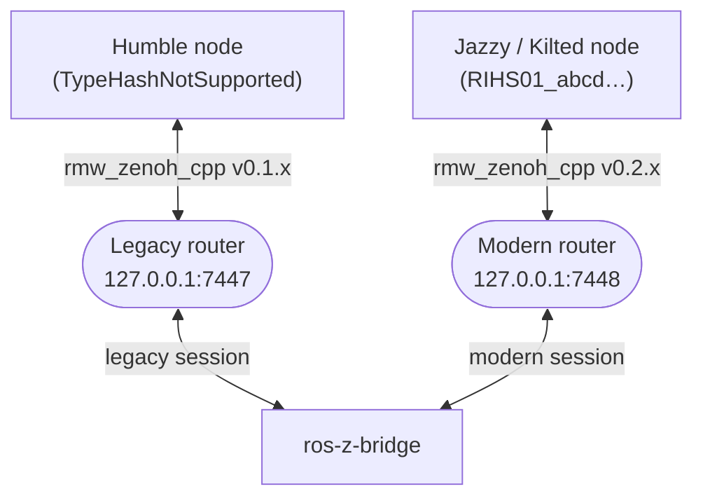

# Cross-Distro Bridge

`ros-z-bridge` is a standalone binary that transparently connects a **legacy** ROS 2 network
(Humble and earlier) and a **modern** ROS 2 network (Jazzy, Kilted, Rolling) over a shared
Eclipse Zenoh backbone.

Without the bridge, nodes from these two generations cannot talk to each other.
With it, a Jazzy or Kilted subscriber receives messages from a Humble publisher — and
vice versa — with no changes to either node.

## Why Are They Incompatible?

The only wire-level difference between legacy and modern distributions is the **type hash**
embedded in Zenoh key expressions during entity discovery:

| Distribution | Generation | Type hash format |
|---|---|---|
| **Humble** | Legacy | `TypeHashNotSupported` (constant placeholder) |
| **Jazzy, Kilted, Rolling** | Modern | `RIHS01_<64 hex chars>` (real hash of the message definition) |

Because the key expressions don't match, subscribers on one side never see publishers on the
other side. **CDR payloads are identical** — only the KE differs.

The bridge fixes this by:

1. Subscribing to liveliness tokens on both Zenoh networks.
2. Detecting which side each entity came from (legacy vs modern).
3. Rewriting the hash segment of the key expression to match the opposite side.
4. Forwarding messages (and service calls) bidirectionally using raw bytes — no
   deserialization needed.

## Architecture



The bridge opens **two independent Zenoh sessions** — one per network — so the two sides
never interfere with each other.

## Installation

Build from source (requires Rust ≥ 1.82):

```bash
cargo build --release -p ros-z-bridge
```

The binary is at `target/release/ros-z-bridge`.

## Quickstart

### 1 — Start two Zenoh routers

Open two terminals:

```bash
# Terminal A — legacy (Humble) router
ros2 run rmw_zenoh_cpp rmw_zenohd
# (or) zenohd --rest-http-port disabled
```

```bash
# Terminal B — modern (Jazzy/Kilted) router on a different port
zenohd --listen tcp/127.0.0.1:7448 --rest-http-port disabled
```

### 2 — Start the bridge

```bash
ros-z-bridge \
  --humble-endpoint tcp/127.0.0.1:7447 \
  --jazzy-endpoint  tcp/127.0.0.1:7448 \
  --domain-id 0
```

### 3 — Run nodes on each side

```bash
# Terminal C — Humble talker
export RMW_IMPLEMENTATION=rmw_zenoh_cpp
export ZENOH_CONFIG_OVERRIDE="connect/endpoints=[\"tcp/127.0.0.1:7447\"];scouting/multicast/enabled=false"
ros2 run demo_nodes_cpp talker
```

```bash
# Terminal D — Jazzy/Kilted listener (ros-z)
cargo run --example demo_nodes_listener -- --endpoint tcp/127.0.0.1:7448
```

You should see the modern listener printing messages published by the Humble talker.

### 4 — Verify graph visibility with `ros2 topic list`

The bridge re-announces synthetic liveliness tokens on each side so that `ros2 topic list`
shows cross-distro topics correctly. Use `--spin-time` (not `--timeout`) and `--no-daemon`
to avoid interference from any running ros2cli daemon:

```bash
# On the Humble side — should show the Jazzy publisher's topic
export RMW_IMPLEMENTATION=rmw_zenoh_cpp
export ZENOH_CONFIG_OVERRIDE="connect/endpoints=[\"tcp/127.0.0.1:7447\"];scouting/multicast/enabled=false"
ros2 topic list --spin-time 5 --no-daemon
```

```bash
# On the Jazzy/Kilted side — should show the Humble publisher's topic
export RMW_IMPLEMENTATION=rmw_zenoh_cpp
export ZENOH_CONFIG_OVERRIDE="connect/endpoints=[\"tcp/127.0.0.1:7448\"];scouting/multicast/enabled=false"
ros2 topic list --spin-time 5 --no-daemon
```

Both sides should list `/chatter` (or whichever topic your nodes publish on). If a topic is
missing, the bridge has not yet re-announced the entity — wait a second and retry.

!!! note
    `--spin-time N` sets how long the CLI spins waiting for discovery. `--no-daemon` bypasses
    the ros2cli daemon, which can cache stale state and return incomplete results. Always use
    both flags when diagnosing bridge connectivity.

## CLI Reference

```text
USAGE:
    ros-z-bridge [OPTIONS]

OPTIONS:
    --humble-endpoint <LOCATOR>    Zenoh locator for the legacy (Humble) network
                                   [default: tcp/127.0.0.1:7447]
    --jazzy-endpoint <LOCATOR>     Zenoh locator for the modern (Jazzy/Kilted) network
                                   [default: tcp/127.0.0.1:7448]
    --domain-id <ID>               ROS domain ID  [default: 0]
    -h, --help                     Print help
```

## What Gets Bridged

| Entity | Bridged | Notes |
|---|---|---|
| Topics (pub/sub) | ✅ | Bidirectional, raw CDR bytes forwarded |
| Services | ✅ | Proxy placed on the client side |
| Actions | ✅ | Each sub-entity (goal, result, feedback, status) bridged individually |
| Nodes (graph) | ✅ | Synthetic liveliness tokens re-announced so `ros2 topic list` works on both sides |

!!! note
    The bridge binary supports only types compiled into it. The bridge ships with all
    standard ROS 2 message packages (`std_msgs`, `geometry_msgs`, `sensor_msgs`, …).
    If you use **custom messages**, you need to rebuild the bridge with your message crate
    added as a dependency (see [Custom Messages](#custom-messages)).

## Supported Message Packages

The bridge includes the following packages out of the box:

- `std_msgs`, `builtin_interfaces`, `rcl_interfaces`
- `geometry_msgs`, `nav_msgs`, `sensor_msgs`
- `action_msgs`, `lifecycle_msgs`, `diagnostic_msgs`
- `example_interfaces`, `test_msgs`, `unique_identifier_msgs`
- `tf2_msgs`, `visualization_msgs`, `shape_msgs`, `trajectory_msgs`
- `stereo_msgs`, `rosgraph_msgs`, `statistics_msgs`
- `pendulum_msgs`, `composition_interfaces`, `type_description_interfaces`

## Custom Messages

Add your message crate to `crates/ros-z-bridge/Cargo.toml`:

```toml
[dependencies]
my_msgs = { path = "../../crates/my_msgs" }
```

Then register the types in `crates/ros-z-bridge/src/hash_registry.rs`:

```rust
// In build_registry():
reg!(map, my_msgs::ros::my_package::MyMessage);
```

Rebuild the bridge:

```bash
cargo build --release -p ros-z-bridge
```

## Troubleshooting

### `ros2 topic list` doesn't show the remote topic

The bridge re-announces liveliness tokens on the opposite side, but `ros2 topic list`
may take a few seconds to reflect them. Wait ~5 s after both nodes are running.

Enable debug logging to watch the re-announcement:

```bash
RUST_LOG=ros_z_bridge=debug ros-z-bridge ...
```

Look for lines like:

```text
Declared synthetic modern lv token: @ros2_lv/0/…/RIHS01_…
```

### `Unknown type — cannot bridge`

The message type is not in the bridge's hash registry. See [Custom Messages](#custom-messages).

### The bridge forwards messages but deserialization fails on the receiving side

Verify the message definition is identical on both sides. Humble and Jazzy/Kilted ship the
same built-in message definitions, but third-party packages may differ. Check that both
[`rmw_zenoh_cpp`](https://github.com/ros2/rmw_zenoh) versions agree on the CDR layout.

### Service calls time out

Services use a queryable-based proxy. If the server is slow to start, the first call
may time out. Retry after the server has had a chance to register on the bridge.

Enable debug logging to verify the proxy was set up:

```text
INFO  ros_z_bridge::bridge: Entity appeared: Humble Service topic=/add_two_ints type=…
```

## Limitations

- **Same domain ID only**: both networks must use the same `ROS_DOMAIN_ID`.
- **One bridge instance per domain**: running two bridge instances for the same domain
  will cause duplicate forwarding.
- **No QoS translation**: QoS policies (reliability, durability) are not translated between
  sides. Both sides must use compatible QoS settings.
