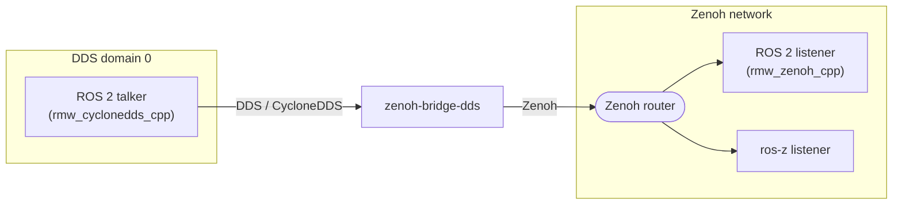
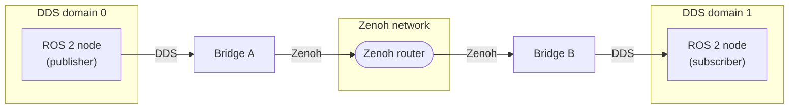

# DDS Bridge

`zenoh-bridge-dds` is a standalone binary that connects **existing DDS-based ROS 2 nodes** (using any DDS middleware: Fast DDS, CycloneDDS, Connext, …) to a Zenoh/ros-z network. Once running, every ros-z node, Python node, Go node, and `rmw_zenoh_cpp` node on the Zenoh side can communicate transparently with any node on the DDS side — no recompilation or code changes needed.

!!! tip "Wrong bridge?"
    If you need to connect a **Humble** network to a **Jazzy/Kilted** network (both already using Zenoh), see the [Cross-Distro Bridge](./bridge.md) chapter instead.

## How It Works

The bridge runs a CycloneDDS participant in a chosen DDS domain. It watches DDS discovery traffic and creates matching Zenoh routes for every publisher, subscriber, service server, and service client it sees. Messages flow as raw CDR bytes in both directions — no deserialization occurs inside the bridge.



The bridge also publishes `ros_discovery_info` so that `ros2 topic list` / `ros2 service list` on the DDS side shows the bridge's Zenoh entities, and vice versa.

## Installation

### Build from Source

Requires Rust 1.85+:

```bash
cargo build --release -p ros-z-bridge-dds
```

The binary is at `target/release/zenoh-bridge-dds`.

## Quick Start

### Prerequisites

- A Zenoh router on `localhost:7447` (see [Networking](./networking.md))
- A ROS 2 installation with any DDS middleware (Fast DDS, CycloneDDS, …)

### 1 — Start a Zenoh router

```bash
# From the ros-z repository
cargo run --example zenoh_router

# Or with zenohd
zenohd
```

### 2 — Start the bridge

```bash
./zenoh-bridge-dds
```

By default the bridge connects to `tcp/127.0.0.1:7447` and joins DDS domain 0.

### 3 — Run a DDS talker

```bash
# Uses the system DDS middleware (rmw_cyclonedds_cpp, rmw_fastrtps_cpp, …)
export RMW_IMPLEMENTATION=rmw_cyclonedds_cpp
ros2 run demo_nodes_cpp talker
```

### 4 — Receive on the Zenoh side

```bash
# ros-z listener
cargo run --example demo_nodes_listener
```

The ros-z listener prints messages published by the DDS talker — no shared router configuration needed on the DDS side.

## CLI Reference

```text
USAGE:
    zenoh-bridge-dds [OPTIONS]

OPTIONS:
    -z, --zenoh-endpoint <LOCATOR>
            Zenoh endpoint to connect to [default: tcp/127.0.0.1:7447]

    -d, --domain-id <ID>
            ROS 2 domain ID. Defaults to ROS_DOMAIN_ID env var, or 0

    -n, --namespace <NS>
            Namespace prefix applied to all bridged topics/services on the Zenoh side

        --node-name <NAME>
            Node name used for liveliness tokens [default: zenoh_bridge_dds]

        --allow <REGEX>
            Topic allow-list. Only DDS topic names matching this pattern are bridged

        --deny <REGEX>
            Topic deny-list. DDS topic names matching this pattern are not bridged

        --service-timeout-secs <SECS>
            Timeout for Zenoh get() calls on service routes [default: 10]

        --action-get-result-timeout-secs <SECS>
            Timeout for action get_result Zenoh get() calls [default: 300]

        --transient-local-cache-multiplier <N>
            TRANSIENT_LOCAL AdvancedPublisher cache depth multiplier [default: 10]

        --wire-format <FORMAT>
            Zenoh key expression wire format [default: rmw-zenoh]
            [possible values: rmw-zenoh, ros2dds]

    -h, --help
            Print help
```

## Wire Format

The bridge supports two Zenoh key expression formats, selected with `--wire-format`:

| Value | Compatible with | When to use |
|---|---|---|
| `rmw-zenoh` (default) | ros-z, rmw_zenoh_cpp v0.2+ | New deployments. All ros-z nodes and modern `rmw_zenoh_cpp` nodes. |
| `ros2dds` | zenoh-plugin-ros2dds | Existing deployments using the legacy Zenoh DDS plugin. |

When in doubt, use the default. Switch to `ros2dds` only if you have existing infrastructure built around `zenoh-plugin-ros2dds` key expressions.

## Topic Filtering

Use `--allow` and `--deny` to control which topics and services are bridged. Both accept [RE2 regular expressions](https://github.com/google/re2/wiki/Syntax) matched against the **raw DDS topic name** (e.g. `rt/chatter`, `rq/add_two_intsRequest`).

```bash
# Bridge only /chatter and /tf
zenoh-bridge-dds --allow "^rt/(chatter|tf)$"

# Bridge everything except /rosout
zenoh-bridge-dds --deny "^rt/rosout$"

# Combine: allow navigation topics but not raw odometry
zenoh-bridge-dds --allow "^rt/nav" --deny "^rt/nav/raw_odom$"
```

If both `--allow` and `--deny` are set, `--deny` is evaluated first.

## Bridge-to-Bridge Federation

When two bridge instances run on separate DDS domains and connect to the **same Zenoh network**, they automatically federate — each bridge detects the other's liveliness tokens and creates complementary local DDS routes.



**Federation rules:**

| Remote liveliness token | Local route created |
|---|---|
| Publisher on `/chatter` | `ZDdsSubBridge`: Zenoh→DDS relay so domain B subscribers receive data |
| Subscription on `/chatter` | `ZDdsPubBridge`: DDS→Zenoh relay so domain A publishers have a consumer |
| Service server on `/add_two_ints` | `ZDdsClientBridge`: local DDS clients can call the remote service |
| Service client on `/add_two_ints` | `ZDdsServiceBridge`: local DDS servers can respond to remote clients |

Federation happens automatically — no configuration required. Each bridge filters out its own liveliness tokens to avoid self-routes.

## DDS Discovery Scope

By default CycloneDDS discovers peers via multicast, which may pick up unintended DDS participants. Use the `CYCLONEDDS_URI` environment variable to scope discovery:

```bash
# Localhost only
export CYCLONEDDS_URI='<CycloneDDS><Domain><General><Interfaces>
  <NetworkInterface name="lo"/>
</Interfaces></General></Domain></CycloneDDS>'

# Single subnet (192.168.1.0/24)
export CYCLONEDDS_URI='<CycloneDDS><Domain><General><Interfaces>
  <NetworkInterface name="eth0"/>
</Interfaces></General></Domain></CycloneDDS>'

# Unicast-only (disable multicast)
export CYCLONEDDS_URI='<CycloneDDS><Domain><Discovery>
  <EnableTopicDiscoveryEndpoints>false</EnableTopicDiscoveryEndpoints>
</Discovery></Domain></CycloneDDS>'
```

!!! note
    `ROS_LOCALHOST_ONLY` and `ROS_AUTOMATIC_DISCOVERY_RANGE` are read by `rmw_cyclonedds_cpp` when ROS 2 initialises the DDS layer. The bridge bypasses `rmw` and talks to CycloneDDS directly, so those variables have no effect. Use `CYCLONEDDS_URI` instead.

## What Gets Bridged

| Entity | Direction | Notes |
|---|---|---|
| Topics (pub/sub) | DDS ↔ Zenoh | Raw CDR bytes forwarded unchanged. TRANSIENT_LOCAL durability uses `AdvancedPublisher` cache. |
| Services | DDS ↔ Zenoh | Correct CDR framing: `[4B CDR hdr] + [8B client_guid] + [8B seq_num] + [body]`. |
| Actions | DDS ↔ Zenoh | Actions are services under the hood (`/_action/send_goal`, `/_action/get_result`, `/_action/cancel_goal`, `/_action/feedback`). All sub-topics are bridged. |
| `ros_discovery_info` | Bridge → DDS | Updated at ~1 Hz so `ros2 topic list` on the DDS side shows bridge entities. |

## Programmatic API

In addition to the standalone binary, `ros-z-dds` exposes the bridge as a Rust library for embedding in your own applications.

### Auto-Discovery Bridge

The simplest approach: let the bridge discover and route everything automatically.

```rust
--8<-- "crates/ros-z-dds/examples/auto_bridge.rs"
```

Run it:

```bash
cargo run --example auto_bridge -p ros-z-dds
```

### Typed Bridge (DdsBridgeExt)

Use `DdsBridgeExt` to bridge specific typed topics at compile time, with full type-hash embedding in the liveliness token:

```rust
--8<-- "crates/ros-z-dds/examples/custom_bridge.rs"
```

Run it:

```bash
cargo run --example custom_bridge -p ros-z-dds
```

### Manual Route Construction

For full control, construct routes directly:

```rust
use std::time::Duration;
use ros_z_dds::{CyclorsParticipant, ZDdsPubBridge, ZDdsSubBridge, ZDdsServiceBridge, ZDdsClientBridge};
use ros_z_dds::participant::BridgeQos;
use ros_z_protocol::entity::TypeHash;

// DDS publisher → Zenoh publisher (no type hash — any DDS node)
let route = ZDdsPubBridge::new(
    &node,
    "/chatter",
    "std_msgs/msg/String",
    None,            // type_hash: None uses EMPTY_TOPIC_HASH in topic key expr
    &participant,
    BridgeQos::default(),
    true,            // keyless
    10,              // TRANSIENT_LOCAL cache multiplier
)
.await?;

// Zenoh subscriber → DDS writer
let route = ZDdsSubBridge::new(
    &node, "/chatter", "std_msgs/msg/String",
    None, &participant, BridgeQos::default(), true,
)
.await?;

// DDS service server → Zenoh queryable (DDS clients call a ros-z service server)
let route = ZDdsServiceBridge::new(
    &node, "/add_two_ints", "example_interfaces/srv/AddTwoInts",
    None, &participant, BridgeQos::default(),
)
.await?;

// Zenoh queryable → DDS service client (ros-z clients call a DDS service server)
let route = ZDdsClientBridge::new(
    &node, "/add_two_ints", "example_interfaces/srv/AddTwoInts",
    None, &participant, BridgeQos::default(),
    Duration::from_secs(10),   // timeout for the Zenoh get() call
)
.await?;
```

Routes are RAII handles — drop them to tear down the bridge. All bridges are `Send + Sync` and can be stored in a struct.

## Troubleshooting

### DDS nodes do not appear on the Zenoh side

Enable debug logging to watch discovery events:

```bash
RUST_LOG=ros_z_dds=debug ./zenoh-bridge-dds
```

Look for lines like:

```text
INFO  ros_z_dds::bridge: ZDdsPubBridge: DDS rt/chatter → Zenoh 0/chatter/std_msgs%msg%String/RIHS01_…
```

If no discovery lines appear, check:

1. The bridge and the DDS node are on the same DDS domain (`ROS_DOMAIN_ID` / `--domain-id`).
2. No firewall blocks DDS multicast (UDP port 7400 by default).
3. CycloneDDS can reach the DDS nodes — check `CYCLONEDDS_URI` scoping.

### `ros2 topic list` does not show bridge topics

`ros_discovery_info` is published at ~1 Hz. Wait a second after the bridge starts, then retry with `--spin-time 5 --no-daemon` to avoid stale daemon cache:

```bash
ros2 topic list --spin-time 5 --no-daemon
```

### Service calls time out

The bridge proxies Zenoh `get()` calls with a configurable timeout (default 10 s). If the ros-z service server is slow to start or the Zenoh router is under load, the first call may time out. Increase the timeout:

```bash
./zenoh-bridge-dds --service-timeout-secs 30
```

Check that a matching queryable is registered:

```bash
RUST_LOG=ros_z_dds=debug ./zenoh-bridge-dds 2>&1 | grep -i "service\|queryable"
```

### Federation routes not appearing

Federation relies on Zenoh liveliness tokens. Ensure both bridges connect to the **same Zenoh router** (or a federated Zenoh network). Check that both bridges use the **same `--wire-format`** — mixing `rmw-zenoh` on one side with `ros2dds` on the other will prevent liveliness token parsing.

```bash
RUST_LOG=ros_z_dds::bridge=debug ./zenoh-bridge-dds 2>&1 | grep -i "federation"
```

### Messages arrive corrupted

The bridge forwards raw CDR bytes without any transformation. If messages are corrupted:

1. Both sides must use the **same CDR encoding** (little-endian is standard).
2. The message definition must be **identical** on both sides. Mismatched field order or types cause silent corruption.
3. Service CDR payloads include a 20-byte header prepended by the bridge (`[4B hdr] + [8B guid] + [8B seq]`). Custom service bridge code must handle this framing.

## Migrating from zenoh-plugin-ros2dds

`zenoh-bridge-dds` is the successor to `zenoh-bridge-ros2dds` (the binary bundled with `zenoh-plugin-ros2dds`). The two bridges are wire-compatible when you pass `--wire-format ros2dds` to the new bridge.

### CLI Flag Mapping

| `zenoh-bridge-ros2dds` flag | `zenoh-bridge-dds` equivalent | Notes |
|---|---|---|
| `--namespace <NS>` | `--namespace <NS>` | Identical |
| `--nodename <NAME>` | `--node-name <NAME>` | Renamed (hyphen) |
| `--domain <ID>` | `--domain-id <ID>` | Renamed |
| `--allow <REGEX>` | `--allow <REGEX>` | Identical |
| `--deny <REGEX>` | `--deny <REGEX>` | Identical |
| `--queries_timeout_default <SECS>` | `--service-timeout-secs <SECS>` | Action get_result has its own `--action-get-result-timeout-secs` flag (default 300 s) |
| `--transient_local_cache_multiplier <N>` | `--transient-local-cache-multiplier <N>` | Renamed (hyphens) |
| `--ros_localhost_only` | — | Use `CYCLONEDDS_URI` to scope DDS discovery. See [DDS Discovery Scope](#dds-discovery-scope). |
| `--ros_automatic_discovery_range <RANGE>` | — | Use `CYCLONEDDS_URI` |
| `--ros_static_peers <IPS>` | — | Use `CYCLONEDDS_URI` |
| `--pub_max_frequency <REGEX=HZ>` | — | Not implemented. Throttle at the DDS layer via QoS instead. |
| `--rest_http_port <PORT>` | — | Not implemented |
| `--watchdog` | — | Not implemented |
| `--dds_enable_shm` | — | Not implemented |

### Feature Comparison

| Feature | zenoh-plugin-ros2dds | zenoh-bridge-dds |
|---|---|---|
| Pub/sub bridging | Yes | Yes |
| Service bridging | Yes | Yes |
| Action bridging | Yes | Yes |
| `ros_discovery_info` | Yes | Yes |
| Bridge-to-bridge federation | Yes | Yes |
| Per-entity-type allow/deny | Yes (separate regex per publisher/subscriber/service_server/…) | No — single `--allow`/`--deny` matched against the raw DDS topic name |
| Per-topic rate limiting | Yes (`--pub_max_frequency`) | No |
| Per-topic Zenoh priorities | Yes | No |
| Admin space route introspection | Yes | No |
| DDS SHM | Yes | No |
| Configurable action get_result timeout | No (shared `queries_timeout`) | Yes (`--action-get-result-timeout-secs`, default 300 s) |
| Embedded library API | No | Yes (`ros-z-dds` crate) |

### Wire Format and Gradual Migration

By default, `zenoh-bridge-dds` uses the `rmw-zenoh` key expression format, which is not compatible with `zenoh-plugin-ros2dds`. To run both bridges side-by-side during a migration:

```bash
# New bridge, compatible with zenoh-plugin-ros2dds infrastructure
./zenoh-bridge-dds --wire-format ros2dds
```

Once all `zenoh-plugin-ros2dds` instances are replaced, drop the flag to use the default `rmw-zenoh` format, which is also understood by all ros-z nodes and `rmw_zenoh_cpp` nodes.

### Allowance Model Change

The old plugin let you allow/deny each entity type independently:

```json5
// zenoh-plugin-ros2dds config (old)
allowance: {
  publishers: { allow: "^rt/chatter$" },
  subscribers: { allow: "^rt/chatter$" },
  service_servers: { deny: ".*" },
  service_clients: { deny: ".*" },
}
```

The new bridge uses a single `--allow`/`--deny` regex matched against the raw DDS topic name, which covers all entity types:

```bash
# Bridge only /chatter topics and services (all entity types)
zenoh-bridge-dds --allow "^rt/chatter$|^r[qr]/chatter"
```

If you need to suppress services entirely, use `--deny` with a service topic pattern:

```bash
# Bridge topics but not services
zenoh-bridge-dds --allow "^rt/" --deny "^r[qr]/"
```
